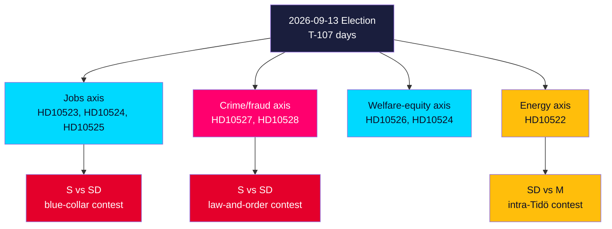

# Election 2026 Analysis — Interpellation Debates 2026-05-29

**Election date**: 2026-09-13 · **Horizon**: T+107 days · **Multiplier**: 1.5× (election ≤6 months). [A1]

## How the Interpellations Map to the Campaign

The seven interpellations are pre-election accountability instruments whose value is amplified by proximity to the vote. They distribute pressure across the issues where the electoral contest is tightest. [B2]

## Electoral Battlegrounds Activated

### 1. The blue-collar contest (S vs SD)
The labour cluster (HD10523 bruksort varsel, HD10524 a-kassa) is precision-targeted at the working-class voters S has lost to SD. By defending jobs and benefit duration, S contests SD on its own adopted turf. IMF WEO Apr-2026 unemployment ~8.5% gives the attack a factual base. [B2] `{provider: "imf", dataflow: "WEO", indicator: "LUR", vintage: "WEO Apr-2026", retrieved_at: "2026-05-29"}`

### 2. The law-and-order contest (S vs the government brand)
The bank-fraud pair (HD10527/HD10528) lets S contest the government's signature crime issue from an unexpected angle — fraud as the organised-crime funding stream the government allegedly neglects. This neutralises a government strength. [B2]

### 3. The intra-Tidö contest (SD vs M)
HD10522 exposes SD pressing M on Vattenfall — the opposition's gift: evidence the governing bloc is divided on energy 107 days out. [B2]

## Party-Level Electoral Stakes

| Party | Exposure this cycle | Stake |
|-------|---------------------|-------|
| S | Driving 6 filings | Reclaim blue-collar + own welfare/crime framing |
| M | 3 filings target M ministers | Defend crime brand + Vattenfall record |
| L | Most-targeted minister (Britz, 3) | Threshold survival; jobs exposure |
| KD | 1 filing (Slottner) | Welfare-equity credibility |
| SD | Filer of HD10522 | Base-management on nuclear delivery |

## Net Electoral Read

The day advances S's strategy of **simultaneously contesting SD (jobs, crime) and exposing Tidö disunity (energy)**. L is the most electorally exposed governing party. The decisive electoral moment is the 2026-06-12 answers — whether ministers convert defence into commitment. See coalition-mathematics.md for seat implications and scenario-analysis.md for trajectories. [B2]

## Seat-Sensitivity Note

The electoral leverage of this package is asymmetric across the bloc. Because the government holds a **1-seat working majority**, the marginal seat is worth far more than its nominal weight: a swing that costs L even a handful of mandates does not merely weaken L, it can flip control of the chamber. The labour cluster's concentration on Britz (L) is therefore the **highest seat-elasticity play** in the set — it targets the party whose losses translate most directly into a change of government. By contrast, the bank-fraud cluster targets M, a larger and more resilient party where equivalent vote movement has lower seat-flip consequence. This means the *most newsworthy* cluster (fraud) and the *most seat-decisive* cluster (a-kassa/L) diverge — a distinction the opposition's filing pattern appears to exploit deliberately. [B2]
