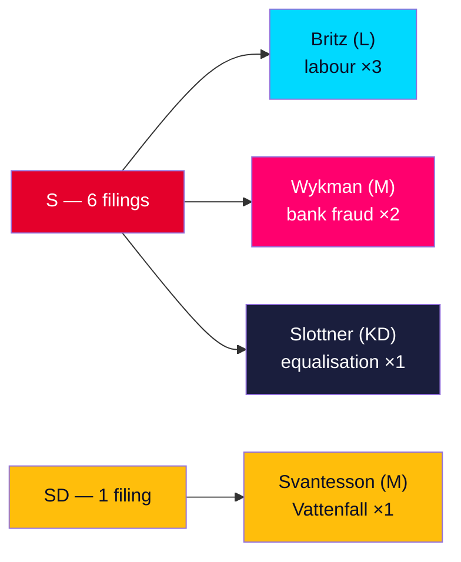

# Opposition Presses Tidö Ministers on Jobs, Bank Fraud and Vattenfall

## BLUF

Seven interpellations submitted to the Riksdag on 2026-05-29 form a coherent, pre-election opposition accountability campaign 107 days before the 2026-09-13 vote. Socialdemokraterna filed six of seven, targeting Tidö ministers across three fronts — labour market (Britz, L), bank fraud (Wykman, M) and municipal welfare equalisation (Slottner, KD) — while Sverigedemokraterna filed the seventh against its own finance minister (Svantesson, M) over Vattenfall governance. The **bank-fraud pair (HD10527/HD10528, DIW 7.8)** is the highest-significance item: it attacks the government's signature organised-crime agenda and carries a live EU regulatory hook. The **Vattenfall interpellation (HD10522)** is the strategic anomaly — an intra-coalition friction signal worth watching. All answers are due **2026-06-12**, inside the pre-recess election runway. [B2]

---

## Decisions This Brief

1. **Prioritise the bank-fraud pair for news coverage and follow-up.** HD10527+HD10528 (DIW 7.8) is the day's centre of gravity: eight operative questions, an EU PSD3/PSR hook, and a direct challenge to the government's organised-crime brand. Lead reporting here. [B2]
2. **Flag the Vattenfall interpellation as an intra-coalition early-warning indicator.** HD10522 (SD → M finance minister) is the only governing-bloc interpellation; treat any further SD-on-Tidö accountability filings as a coalition-strain trend (escalate to coalition-mathematics watch). [B2]
3. **Set a 2026-06-12 collection trigger for all seven ministerial answers.** The answer deadline falls in the pre-recess window; the quality of Britz's labour answers and Wykman's fraud answers are the highest-information forward indicators (see forward-indicators.md, PIR-INT-01/02). [A2]
4. **Re-retrieve the two metadata-only documents (HD10525 ILO, HD10526 equalisation) next cycle** before drawing firm conclusions on those themes; current readings are inference-based and low-confidence. [B3]

---

## Day at a Glance

## Why It Matters Now

- **Electoral timing (107 days).** Every interpellation lands inside the campaign runway; the 1.5× significance multiplier reflects the heightened accountability value of forcing ministers to answer on the record before recess. [A2]
- **Theme selection is electorally engineered.** Jobs (bruksort layoffs, a-kassa) and fraud (the fastest-growing crime, financing organised crime) are precisely the issues on which S can contest SD's blue-collar and law-and-order appeal simultaneously. [B2]
- **The coalition is being probed from inside.** SD's Vattenfall interpellation shows the governing bloc is not presenting a united energy-policy front into the election. [B2]

---

## Confidence & Caveats

- Structural signals (clustering, respondent targeting, timing) are **high confidence** [B2]; individual-document content for HD10525 and HD10526 is **low confidence** (metadata-only) [B3].
- IMF WEO Apr-2026 economic context is **one month old, not stale**; SDMX live fetch was unavailable this cycle (cached vintage used). [B3]
- No documented evidence of explicit S inter-MP coordination; the "campaign" reading rests on convergence of theme, timing and target, not on a retrieved strategy document. See devils-advocate.md. [B3]

*Full ranking: significance-scoring.md · Forward watch: forward-indicators.md · Assessment: intelligence-assessment.md*
