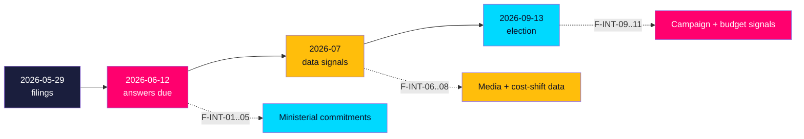

# Forward Indicators — Interpellation Debates 2026-05-29

**Horizon**: T+107d to 2026-09-13 · **Multiplier**: 1.5×. Dated, falsifiable indicators to monitor, each linked to a PIR with an Admiralty target reliability. [B2]

## Indicator Register

### Near-term band (to 2026-06-12 — answer deadline)

**F-INT-01** — *Wykman answers HD10527/HD10528*
- Expected date: by 2026-06-12
- Collection method: data.riksdagen.se interpellationssvar
- Indicator content: Does Wykman commit to SME fraud-protection parity and/or bank transparency, or defer to EU PSD3/PSR?
- Escalation threshold: Explicit refusal → fraud becomes a live campaign liability
- PIR link: PIR-INT-01 · Admiralty target: [A2]

**F-INT-02** — *Britz answers HD10523/HD10524/HD10525*
- Expected date: by 2026-06-12
- Collection method: interpellationssvar
- Indicator content: Concrete bruksort/omställning or a-kassa measures vs. unchanged reform defence
- Escalation threshold: Pure defence → labour cluster gains campaign traction
- PIR link: PIR-INT-02 · Admiralty target: [A2]

**F-INT-03** — *Slottner answers HD10526*
- Expected date: by 2026-06-12
- Collection method: interpellationssvar
- Indicator content: Commitment (or not) to an equalisation review
- Escalation threshold: Commitment → defuses rural attack; refusal → sustains it
- PIR link: PIR-INT-03 · Admiralty target: [A2]

**F-INT-04** — *Full text retrieved for HD10525 & HD10526*
- Expected date: by 2026-06-05
- Collection method: MCP get_dokument_innehall
- Indicator content: Closes the two metadata-only gaps
- Escalation threshold: n/a (collection action)
- PIR link: PIR-INT-04 · Admiralty target: [A2]

**F-INT-05** — *Svantesson answers HD10522 (Vattenfall)*
- Expected date: by 2026-06-12
- Collection method: interpellationssvar
- Indicator content: Tone toward SD — accommodative vs. dismissive
- Escalation threshold: Dismissive → visible SD–M friction
- PIR link: PIR-INT-01 · Admiralty target: [A2]

### Short-term band (2026-06 to 2026-07)

**F-INT-06** — *Media uptake of bank-fraud frame*
- Expected date: 2026-06-12 to 2026-06-30
- Collection method: Media monitoring
- Indicator content: Does "SMEs unprotected from fraud" enter mainstream coverage?
- Escalation threshold: National pickup → durable campaign theme
- PIR link: PIR-INT-01 · Admiralty target: [B2]

**F-INT-07** — *SD energy escalation after answer*
- Expected date: 2026-06 to 2026-08
- Collection method: Riksdag filings + SD comms
- Indicator content: Further SD interpellations/motions on Vattenfall/energy
- Escalation threshold: Repeat filing → genuine intra-Tidö strain (not theatre)
- PIR link: PIR-INT-01 · Admiralty target: [B2]

**F-INT-08** — *Municipal försörjningsstöd data*
- Expected date: 2026-07 (quarterly data)
- Collection method: Socialstyrelsen / SKR statistics
- Indicator content: Rising municipal welfare costs post a-kassa taper
- Escalation threshold: Measurable rise → validates cost-shift hypothesis
- PIR link: PIR-INT-04 · Admiralty target: [B2]

### Medium-term band (2026-08 to election)

**F-INT-09** — *Labour themes enter S manifesto/campaign*
- Expected date: 2026-08
- Collection method: S campaign materials
- Indicator content: a-kassa/varsel framing promoted to manifesto lines
- Escalation threshold: Inclusion → confirms campaign-instrument hypothesis
- PIR link: PIR-INT-02 · Admiralty target: [B2]

**F-INT-10** — *Government budget signals on a-kassa/labour*
- Expected date: 2026-08 (budget bill preparation)
- Collection method: Regeringen budget communications
- Indicator content: Any softening of the a-kassa taper ahead of the vote
- Escalation threshold: Softening → opposition pressure judged effective
- PIR link: PIR-INT-02 · Admiralty target: [B2]

**F-INT-11** — *Statskontoret cost-shift evaluation commissioned*
- Expected date: 2026-07 to 2026-09
- Collection method: Statskontoret assignments register
- Indicator content: Independent evaluation of a-kassa reform displacement effects
- Escalation threshold: Commissioned → claim moves toward evidenced finding
- PIR link: PIR-INT-04 · Admiralty target: [B2]

## Monitoring Schedule

| Cadence | Indicators | Owner |
|---------|-----------|-------|
| Daily (to 2026-06-12) | F-INT-01..05 | Analyst |
| Weekly (Jun–Jul) | F-INT-06, 07, 08 | Analyst |
| Monthly (Aug–Sep) | F-INT-09, 10, 11 | Analyst |

## PIR Status Summary

| PIR | Indicators | Status | Next review |
|-----|-----------|--------|-------------|
| PIR-INT-01 | F-INT-01, 05, 06, 07 | OPEN | 2026-06-12 |
| PIR-INT-02 | F-INT-02, 09, 10 | OPEN | 2026-06-12 |
| PIR-INT-03 | F-INT-03 | OPEN | 2026-06-12 |
| PIR-INT-04 | F-INT-04, 08, 11 | OPEN | 2026-06-12 |

*Machine-readable: `pir-status.json`. All indicators dated and falsifiable per ICD 203.* [B2]
