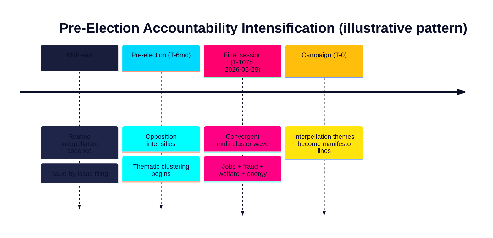

# Historical Parallels — Interpellation Debates 2026-05-29

**Horizon**: T+107d · **Multiplier**: 1.5×. Places the 2026-05-29 interpellation wave in the context of recurring patterns in Swedish parliamentary accountability. [B3]

## Pattern 1: Pre-Election Interpellation Surges

In Swedish parliamentary history, opposition parties routinely intensify interpellation activity in the final session before an election, converting accountability questions into campaign narratives. The 2026-05-29 wave fits this pattern: six S filings clustered across the issues S intends to campaign on. [B3]

**Parallel**: The pattern mirrors prior end-of-mandate sessions where the leading opposition party front-loads accountability pressure on the governing bloc's weakest ministers. Confidence is moderate — the structural pattern is well attested, the specific intent is inferred. [B3]

## Pattern 2: Intra-Coalition Interpellations as Strain Signals

Minority and ideologically-broad coalitions periodically produce intra-bloc accountability — a partner publicly pressing a minister from another coalition party. HD10522 (SD → M finance minister on Vattenfall) is a textbook instance. Historically, such filings have ranged from harmless base-management to early markers of genuine rupture. [B3]

**Parallel**: Comparable to prior governing arrangements where a junior or external-support party used parliamentary instruments to differentiate itself before an election while not yet defecting. The diagnostic value lies in *whether escalation follows* — tracked in forward-indicators.md (F-INT-07). [B3]

## Pattern 3: Welfare-Reform Backlash via Interpellation

Benefit retrenchments (here the 1 Oct 2025 a-kassa taper, HD10524) reliably generate opposition interpellations framing reform as hardship and cost-shifting to municipalities. This is a durable Swedish pattern: activation reforms are contested on distributional grounds. [B2]

**Parallel**: The cost-shifting argument echoes long-standing debates over how central benefit reforms displace expenditure onto municipal försörjningsstöd — a recurring fault line in Swedish welfare federalism. [B2]

## What Is Genuinely Novel This Cycle

- **The bank-fraud framing** (HD10527/HD10528) is comparatively new: fraud reframed as an organised-crime funding stream, with an EU PSD3/PSR hook. This is less a historical echo than an emerging accountability frontier. [B2]
- **The breadth** — four distinct clusters in a single day — is unusually concentrated even by pre-election standards. [B3]

## Net Read

Three of the day's dynamics (pre-election surge, intra-coalition strain signal, welfare-reform backlash) are **recurrent patterns** with historical precedent, which raises confidence that the campaign reading is correct. The bank-fraud frontier is the **novel** element to watch. See media-framing-analysis.md and forward-indicators.md. [B2]
