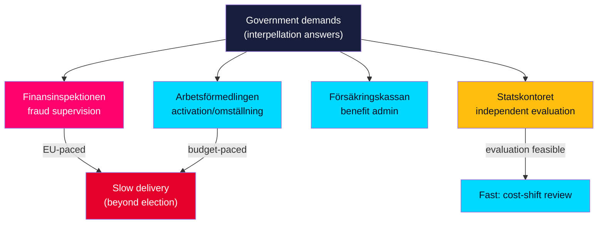

# Implementation Feasibility — Interpellation Debates 2026-05-29

**Horizon**: T+107d · **Multiplier**: 1.5×. Assesses the administrative and legislative feasibility of the policy responses the interpellations demand, by responsible agency. [B2]

## Agencies Implicated

| Agency | Implicated by | Implementation role |
|--------|---------------|---------------------|
| **Finansinspektionen (FI)** | HD10527, HD10528 | Bank-fraud supervision, transparency reporting, SME protection rules |
| **Arbetsförmedlingen** | HD10523, HD10524, HD10525 | Labour-market activation, omställning, job-matching in bruksort |
| **Försäkringskassan** | HD10524 | Benefit administration adjacent to a-kassa taper effects |
| **Statskontoret** | Cross-cutting | Independent evaluation of reform implementation & cost-shift effects |

## Feasibility by Demand

### Bank-fraud protection (HD10527/28 → FI)
- **Legislative path**: Partly contingent on EU PSD3/PSR negotiation; domestic FI rule-making can extend transparency reporting sooner. [B2]
- **Feasibility**: Medium. Transparency reporting is administratively achievable within a year; SME liability parity likely needs EU-level alignment, slowing it beyond the election. [B2]
- **Constraint**: Timing — meaningful change unlikely before 2026-09-13; this is a *campaign-horizon* issue, not a deliverable one.

### Labour-market measures (HD10523/24/25 → Arbetsförmedlingen)
- **Legislative path**: a-kassa taper reversal needs budget action (autumn proposition); omställning measures can be administrative. [B2]
- **Feasibility**: Low-Medium before the election. The reform is in force (1 Oct 2025); reversal is a political decision, not an administrative one. [B2]

### Municipal equalisation (HD10526 → government + SKR)
- **Legislative path**: Equalisation reform is a major legislative undertaking requiring inquiry (SOU) → proposition → vote. [B3] (metadata-only)
- **Feasibility**: Low within horizon. A commitment to *review* is feasible; actual reform is multi-year.

### Vattenfall governance (HD10522 → government as owner)
- **Path**: Owner steering via ägaranvisning / bolagsstämma; no legislation required. [B2]
- **Feasibility**: Medium — the government can adjust steering directives, but nuclear build timelines are structural and slow.

## Statskontoret Evaluation Row

| Field | Detail |
|-------|--------|
| **Item under review** | a-kassa taper cost-shift (HD10524 Q2 / PIR-INT-04) |
| **Statskontoret relevance** | Statskontoret ([statskontoret.se](https://www.statskontoret.se)) is the appropriate body to **independently evaluate** whether the 1 Oct 2025 reform displaces costs onto municipal försörjningsstöd. A commissioned Statskontoret review would convert the opposition's cost-shift *claim* into an *evidenced finding*. [B2] |
| **Feasibility** | Medium — commissioning is an executive prerogative, but a full evaluation runs on a multi-month horizon, landing findings after the 2026-09-13 vote. |

## Net Read

Most demands are **campaign-horizon issues, not pre-election deliverables**: bank-fraud parity is EU-paced, a-kassa reversal is budget-paced, equalisation is multi-year. The administratively fastest moves are FI transparency reporting and a Statskontoret cost-shift evaluation. This reinforces that the interpellations' near-term value is *electoral framing* rather than *policy delivery*. See coalition-mathematics.md and forward-indicators.md. [B2]
