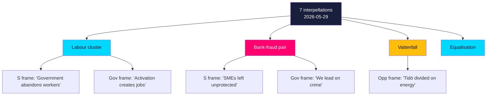

# Media Framing Analysis — Interpellation Debates 2026-05-29

**Horizon**: T+107d · **Multiplier**: 1.5×. Analyses how each cluster is likely to be framed across the media spectrum, and where framing battles will be won or lost. [B2]

## Framing Map

## Cluster-by-Cluster Framing

### Labour (HD10523/24/25)
- **Opposition frame**: "The government abandons workers during layoffs and cuts their safety net." Emotionally resonant, bruksort-specific. [B2]
- **Government counter-frame**: "Activation reforms shorten unemployment and create incentives to work." Technocratic. [B2]
- **Framing battleground**: Whether voters experience the a-kassa taper as *incentive* or *abandonment*. With unemployment ~8.5% (IMF WEO Apr-2026), the abandonment frame has the empirical edge. [B2] `{provider: "imf", dataflow: "WEO", indicator: "LUR", vintage: "WEO Apr-2026", retrieved_at: "2026-05-29"}`

### Bank fraud (HD10527/28)
- **Opposition frame**: "Banks profit while ordinary people and small businesses are defrauded — and the government does nothing." Populist, cross-ideological appeal. [B2]
- **Government counter-frame**: "We are the toughest government on crime in modern history." Risk: fraud is the crime they're *not* visibly fighting. [B2]
- **Framing battleground**: Whether fraud is admitted into the "organised crime" category the government owns. If yes, the government's strength becomes a liability. [B2]

### Vattenfall / energy (HD10522)
- **Dominant frame** (opposition-friendly): "Even SD doubts the government's energy delivery." The story writes itself: a coalition partner publicly pressing the finance minister. [B2]
- **Government counter-frame**: "Normal scrutiny; the nuclear plan is on track." Weaker, because the filing itself is the evidence of doubt. [B3]

### Equalisation (HD10526)
- **Opposition frame**: "Rural Sweden pays for urban priorities." Regionally potent. [B3] (metadata-only — confidence capped.)

## Spectrum Expectations

| Outlet lean | Likely emphasis |
|-------------|-----------------|
| Centre-left | Labour + fraud "abandonment" frames |
| Centre-right | Activation success; crime-toughness defence |
| Tabloid | Bank-fraud victims; SD-vs-M energy drama |
| Regional/local | Bruksort varsel; equalisation impact |

## Net Read

The **bank-fraud** and **Vattenfall** clusters carry the highest framing risk for the government because each turns a claimed strength (crime-toughness, energy delivery) into a visible gap. The labour cluster's framing battle hinges on lived experience of the a-kassa taper. The 2026-06-12 answers are the framing inflection point. See forward-indicators.md (F-INT-05/06). [B2]

## Government Counter-Framing Options

The government is not framing-passive; each cluster admits a defensible counter-frame whose viability differs. On **bank fraud**, the strongest counter-frame is *"we are aligning with EU PSD3/PSR ahead of schedule"* — credible only if Wykman names dated workstreams, otherwise it reads as deflection. On **Vattenfall**, M's only stable counter-frame is *"delivery on schedule, governance sound"*; it cannot rebut SD without escalating the intra-coalition story, so the optimal M response is de-dramatisation, not contestation. On the **a-kassa cluster**, the government's counter-frame (*"reform incentivises work"*) collides directly with lived cost experience, making it the **weakest counter-framing position** — which is also why it is the opposition's highest-turnout play (see voter-segmentation.md). The framing contest the government can most plausibly win is fraud; the one it can least win is a-kassa. [B2]
