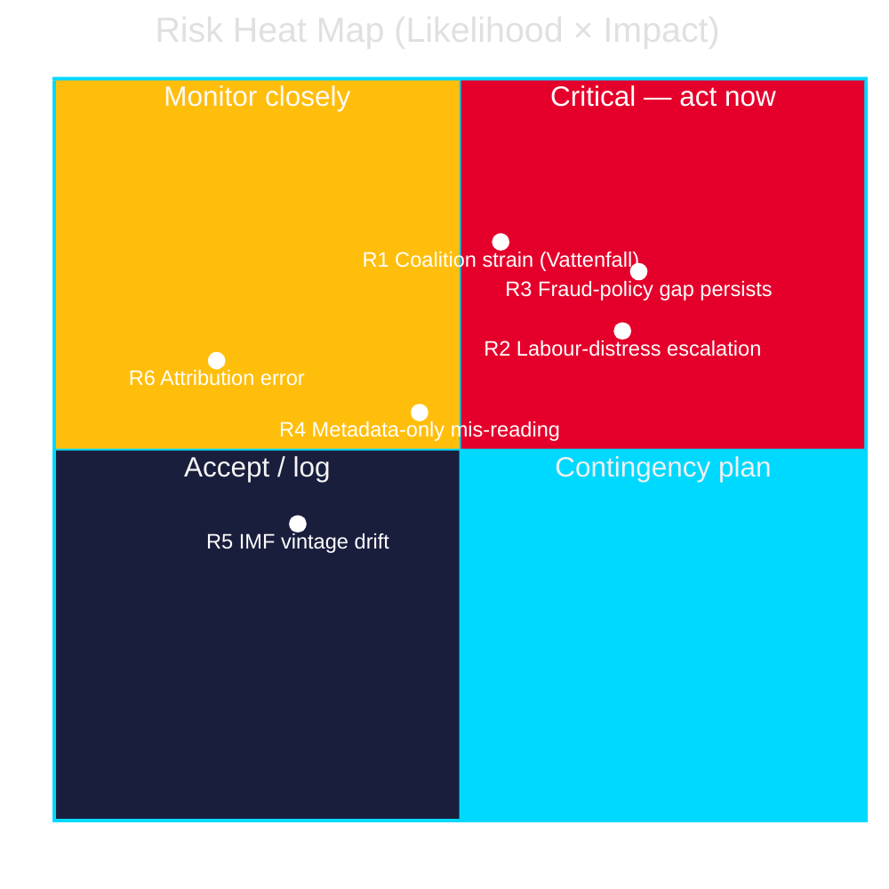

# Risk Assessment — Interpellation Debates 2026-05-29

## Scope

This assessment covers **political, governance and analytical risks** arising from the seven interpellations and from this analysis package itself. Risks are scored Likelihood × Impact (1–5 each) → rating; the 1.5× election-proximity factor elevates political-consequence impact across the board. [B2]

---

## Political & Governance Risks

### R1 — Tidö coalition strain over energy policy
**Likelihood**: Medium (3) · **Impact**: High (4) · **Rating**: 12 (Elevated)
The SD Vattenfall interpellation (HD10522) signals that the governing bloc lacks a unified energy-transition message 107 days from the election. If SD escalates intra-bloc accountability, coalition cohesion risk rises. [B2]
**Indicator**: further SD-on-Tidö filings; Svantesson's answer tone (due 2026-06-12). **Owner**: coalition-mathematics watch.

### R2 — Labour-market distress escalates into the campaign
**Likelihood**: High (4) · **Impact**: Medium-High (3.5) · **Rating**: 14 (Elevated)
With unemployment ~8.5% (IMF WEO Apr-2026) and continuing forestry varsel, the a-kassa taper's bite (HD10524) and bruksort layoffs (HD10523) could become a dominant campaign theme, pressuring the government on jobs. [A2]
**Indicator**: Arbetsförmedlingen varsel statistics; municipal försörjningsstöd trend. `{provider: "imf", dataflow: "WEO", indicator: "LUR", vintage: "WEO Apr-2026", retrieved_at: "2026-05-29"}`

### R3 — Fraud-protection gap persists
**Likelihood**: High (4) · **Impact**: High (4) · **Rating**: 16 (High)
If the government gives non-committal answers to HD10527/HD10528 and the EU PSD3/PSR timeline slips, the SME fraud-protection and bank-transparency gaps remain open — a durable accountability vulnerability and a real economic-security harm. [B2]
**Indicator**: Wykman's Council position; any FI tasking on comparable fraud statistics.

---

## Analytical Risks

### R4 — Mis-reading metadata-only documents
**Likelihood**: Medium (3) · **Impact**: Medium (3) · **Rating**: 9 (Moderate)
HD10525 (ILO) and HD10526 (equalisation) content is inferred. Drawing firm conclusions before full-text retrieval risks attribution/framing error. **Mitigation**: confidence flags [B3] applied; re-retrieval set as top collection action (forward-indicators.md F-INT-04).

### R5 — IMF vintage drift
**Likelihood**: Low (2) · **Impact**: Low-Medium (2.5) · **Rating**: 5 (Low)
Economic context uses cached WEO Apr-2026 (live SDMX fetch unavailable). Vintage is 1 month — within tolerance. **Mitigation**: vintage stamped in every provenance block; >6-month would trigger annotation (not reached). [B3]

### R6 — Attribution error in analysis package
**Likelihood**: Low (2) · **Impact**: High (4) · **Rating**: 8 (Moderate)
Mis-stating an interpellant, minister or question would damage credibility. **Mitigation**: all attributions cross-checked against source JSON and data.riksdagen.se; intressent-ids recorded where available. [A2]

---

## Risk Summary

| ID | Risk | L | I | Rating | Band |
|----|------|---|---|--------|------|
| R3 | Fraud-protection gap persists | 4 | 4 | 16 | High |
| R2 | Labour-market distress escalates | 4 | 3.5 | 14 | Elevated |
| R1 | Coalition strain (Vattenfall) | 3 | 4 | 12 | Elevated |
| R4 | Metadata-only mis-reading | 3 | 3 | 9 | Moderate |
| R6 | Attribution error | 2 | 4 | 8 | Moderate |
| R5 | IMF vintage drift | 2 | 2.5 | 5 | Low |

**Top risk**: R3 (fraud-protection gap) — aligns with the highest-DIW cluster and the most actionable forward indicator (Wykman's 2026-06-12 answer). [B2]
