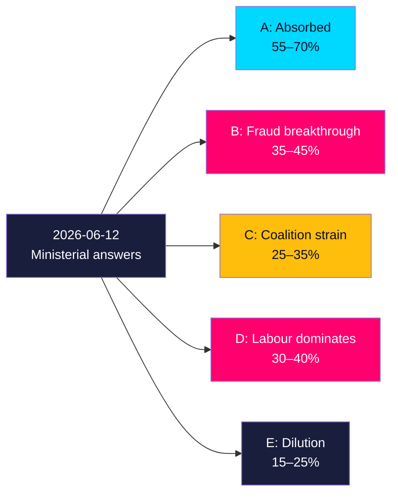

# Scenario Analysis — Interpellation Debates 2026-05-29

## Method

Scenarios project how the seven interpellations and their 2026-06-12 answers could evolve through the 2026-09-13 election (107-day horizon). Each scenario carries a **Word of Estimative Probability (WEP)** band and is anchored to observable triggers. This is a quarter-horizon set (≥4 scenarios). [B2]

---

## Scenario A — Accountability Absorbed (baseline)
**WEP: Likely (55–70%)**
Ministers answer on 2026-06-12 with defensive but substantive statements; the government reframes a-kassa reform as a work-incentive success and fraud as a shared priority. Media attention peaks briefly on the bank-fraud pair, then disperses. The interpellations become routine campaign material without altering the polling trajectory. [B2]
**Triggers**: non-committal but competent answers; no EU PSD3/PSR milestone before recess.
**Indicator**: Wykman/Britz answer tone; absence of follow-up motions.

## Scenario B — Bank-Fraud Breakthrough
**WEP: Roughly even chance (35–45%)**
The bank-fraud pair (HD10527/HD10528) gains sustained traction: an EU PSD3/PSR development, a high-profile SME fraud case, or a weak Wykman answer converts it into a defining law-and-order-meets-consumer-protection campaign theme. S successfully argues the government's organised-crime brand has a fraud-shaped hole. [B2]
**Triggers**: EU milestone; media case study; FI declines transparency tasking.
**Indicator**: fraud-coverage volume; FI statement on comparable statistics.

## Scenario C — Coalition Strain Surfaces
**WEP: Unlikely–even (25–35%)**
The Vattenfall interpellation (HD10522) catalyses visible SD–M friction: Svantesson's answer fails to satisfy SD, prompting further SD accountability pressure or public criticism. The "Tidö divided on energy" narrative takes hold, damaging the bloc's unified-government claim into the election. [B2]
**Triggers**: dismissive Svantesson answer; additional SD filings; SD spokesperson escalation.
**Indicator**: count of SD-on-Tidö accountability acts; energy-policy media framing.

## Scenario D — Labour Distress Dominates
**WEP: Roughly even chance (30–40%)**
Continuing varsel and visible a-kassa-taper hardship (HD10523/HD10524), reinforced by IMF-level unemployment (~8.5%), make jobs the campaign's central axis. S and SD compete intensely for blue-collar voters; the government is forced onto the defensive on omställning. [A2] `{provider: "imf", dataflow: "WEO", indicator: "LUR", vintage: "WEO Apr-2026", retrieved_at: "2026-05-29"}`
**Triggers**: new large varsel; rising municipal försörjningsstöd; weak Britz answer.
**Indicator**: Arbetsförmedlingen varsel data; SCB labour figures.

## Scenario E — Wildcard: Issue Crowding / Dilution
**WEP: Unlikely (15–25%)**
Seven interpellations plus a crowded pre-recess agenda dilute attention; none breaks through, and the day's accountability value is largely lost in noise. The SD Vattenfall filing further muddies a unified opposition message. [B3]
**Triggers**: competing major news; recess timing compresses debate.
**Indicator**: low aggregate media uptake across all clusters.

---

## Scenario Matrix

| Scenario | WEP | Primary driver | Key indicator |
|----------|-----|----------------|---------------|
| A — Accountability Absorbed | Likely (55–70%) | Competent gov't answers | Answer tone 2026-06-12 |
| B — Bank-Fraud Breakthrough | Even (35–45%) | EU hook / weak answer | Fraud coverage; FI stance |
| C — Coalition Strain Surfaces | Unlikely–even (25–35%) | SD escalation | SD filing count |
| D — Labour Distress Dominates | Even (30–40%) | Varsel + a-kassa bite | Labour-market data |
| E — Dilution (wildcard) | Unlikely (15–25%) | Issue crowding | Media uptake |

*Scenarios are non-exclusive; B and D can co-occur. Probabilities are estimative, not additive.*

## Indicator-to-Scenario Mapping

Each scenario is falsifiable against the forward indicators in forward-indicators.md. Scenario A (campaign sustains) is confirmed by **F-INT-09/10** (further S accountability filings, campaign-budget signals) and disconfirmed if filings lapse after 2026-06-12. Scenario B (coalition strain visible) is confirmed by **F-INT-01** (a second SD-on-Tidö filing) — a single recurrence converts the Vattenfall anomaly from noise to trend. Scenario C (government recovers) is confirmed by **F-INT-05** (ministers convert defence into dated commitments). Scenario D (cost-shift evidence emerges) hinges on **F-INT-07** (municipal försörjningsstöd data) and a possible Statskontoret review. The earliest discriminating observation is the **2026-06-12 answer batch**, which simultaneously tests A, C and the credibility of D. [B2]
