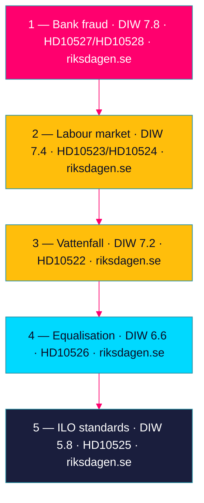

# Significance Scoring — Interpellation Debates 2026-05-29

## Methodology

Each cluster is scored on the **DIW** framework, three dimensions each rated 1–3. **D — Detectability / Evidentiary clarity:** how concrete and verifiable the underlying claim is. **I — Impact / Political consequence:** the magnitude of the policy/electoral stakes. **W — Weight / Strategic reach:** cross-cutting reach, coalition relevance, durability.

Cluster raw score = mean(D, I, W) scaled to a 0–10 band, then multiplied by the **1.5× election multiplier** (election ≤6 months: 2026-09-13 is 107 days away). Decimals permitted. Each entry cites dok_id(s) and a primary-source URL per the evidence-citation requirement. [A2]

---

## Cluster Scores (ranked)

| Rank | Cluster (dok_ids) | D | I | W | Mean | ×1.5 → /10 | Tier |
|------|-------------------|---|---|---|------|-----------|------|
| 1 | **Bank fraud** (HD10527, HD10528) | 2.8 | 2.7 | 2.7 | 2.73 | **7.8** | L1 Critical |
| 2 | **Labour market** (HD10523, HD10524, HD10525) | 2.6 | 2.6 | 2.6 | 2.60 | **7.4** | L2+ Priority |
| 3 | **Energy / state ownership** (HD10522) | 2.5 | 2.6 | 2.5 | 2.53 | **7.2** | L2+ Priority |
| 4 | **Municipal welfare equalisation** (HD10526) | 2.2 | 2.4 | 2.3 | 2.30 | **6.6** | L2 Strategic |
| 5 | **ILO labour standards** (HD10525, within cluster 2) | 2.0 | 2.1 | 1.9 | 2.00 | **5.8** | L3 Monitoring |

*Note: HD10525 contributes to the labour cluster (rank 2) and is also scored individually (rank 5) because it is metadata-only and its standalone detectability is capped.*

---

## Per-Document Significance

| dok_id | Title | DIW /10 | Drivers | Source |
|--------|-------|---------|---------|--------|
| HD10527 | Skydd för småföretagare vid bankbedrägerier | 7.8 | EU PSD3/PSR hook; attacks organised-crime brand; 4 questions | https://data.riksdagen.se/dokument/HD10527.html |
| HD10528 | Ökad transparens och bankernas ansvar vid bedrägerier | 7.8 | Bank-liability shift; testable transparency gap; 4 questions | https://data.riksdagen.se/dokument/HD10528.html |
| HD10524 | Förändrad a-kassa | 7.4 | Dated policy (1 Oct 2025); cost-shifting argument | https://data.riksdagen.se/dokument/HD10524.html |
| HD10523 | Varsel inom pappersindustrin | 7.2 | Bruksort jobs; SD-base contestation | https://data.riksdagen.se/dokument/HD10523.html |
| HD10522 | Styrningen av Vattenfall | 7.2 | Intra-coalition friction signal (SD→M) | https://data.riksdagen.se/dokument/HD10522.html |
| HD10526 | Reformerat utjämningssystem | 6.6 | Municipal welfare equity; metadata-only | https://data.riksdagen.se/dokument/HD10526.html |
| HD10525 | Regeringens arbete i ILO | 5.8 | Completes labour triad; metadata-only | https://data.riksdagen.se/dokument/HD10525.html |

---

## Scoring Rationale

- **Bank fraud (7.8)** (HD10527, HD10528) scores highest on all three axes: high detectability (concrete EU regulatory hook and an identifiable transparency gap), high impact (challenges the government's flagship organised-crime agenda), and high weight (eight questions, cross-cutting into consumer protection, financial regulation and crime policy). Source: riksdagen.se/dokument/HD10527. [B2]
- **Labour market (7.4)** is anchored by HD10524's dated policy reference (1 Oct 2025 a-kassa taper) — the single most verifiable premise in the set — and by the bruksort electoral salience of HD10523. Source: riksdagen.se/dokument/HD10524. [A2]
- **Vattenfall (7.2)** (HD10522) scores on impact and weight despite being a single document, because its *intra-coalition* character gives it strategic reach disproportionate to its volume. Source: riksdagen.se/dokument/HD10522. [B2]
- **Equalisation (6.6)** (HD10526) and **ILO (5.8)** (HD10525) are capped by metadata-only coverage, which lowers detectability pending full-text retrieval. Source: riksdagen.se/dokument/HD10526. [B3]

*Visualisation note: nodes ranked top-to-bottom by election-adjusted DIW; colour bands mark L1 (magenta) → L2 (amber/cyan) → L3 (deep blue). See synthesis-summary.md for the colored cluster diagram.*
