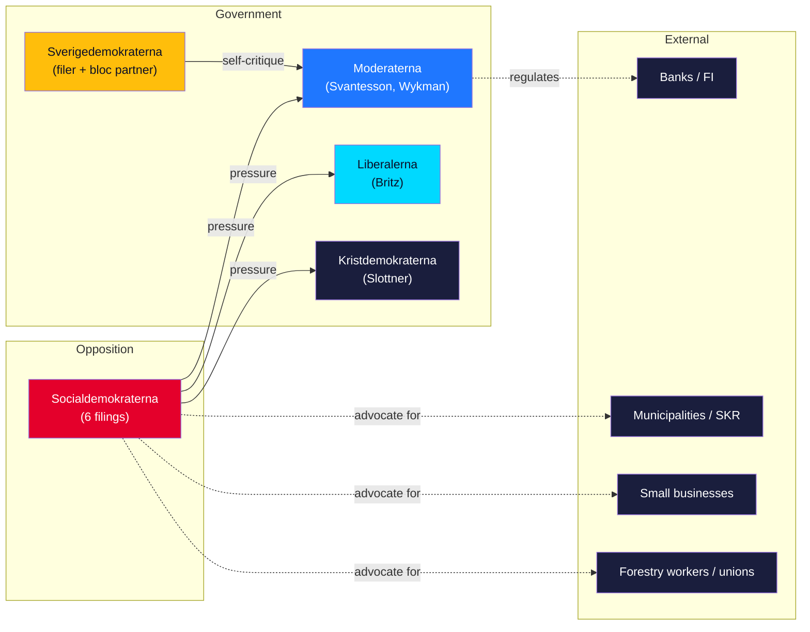

# Stakeholder Perspectives — Interpellation Debates 2026-05-29

This artifact reconstructs how each principal stakeholder is likely to read the seven interpellations. Perspectives are analytic reconstructions, evidence-graded, not direct quotations unless cited to a document. [B2]

---

## Opposition (Socialdemokraterna)

**Reading**: The interpellations are accountability instruments and campaign scaffolding. S frames itself as the defender of jobs (bruksort, a-kassa), small businesses (fraud protection), municipalities (equalisation) and bank customers. Expect S to convert the 2026-06-12 answers into election messaging. [B2]
**Interest**: Maximise on-the-record government discomfort on jobs and fraud; contest SD for blue-collar and law-and-order voters. [B2]

## Government — Moderaterna (Svantesson, Wykman)

**Reading**: M faces the most pointed asks. Wykman (HD10527/HD10528) will likely stress existing fraud initiatives, the EU PSD3/PSR process, and shared cross-party concern, avoiding firm liability commitments. Svantesson (HD10522) must defend Vattenfall governance *against her own coalition partner* — an awkward position she will likely answer narrowly (owner policy, board independence under aktiebolagslagen). [B2]
**Interest**: Defend the organised-crime brand; avoid conceding the SME/transparency gap; contain the Vattenfall story. [B2]

## Government — Liberalerna (Britz)

**Reading**: Britz is the most-targeted minister (3 filings). On a-kassa (HD10524) he will defend the reform as a work-incentive measure; on varsel (HD10523) he will point to omställning support; on ILO (HD10525) he will affirm Sweden's commitments. L's small size (16 seats) and threshold vulnerability make sustained labour-distress coverage genuinely dangerous for the party. [B2]
**Interest**: Protect the reform record while limiting electoral exposure on jobs. [B2]

## Government — Kristdemokraterna (Slottner)

**Reading**: Slottner (HD10526) will likely acknowledge equalisation as an ongoing review question while resisting a concrete reform timeline before the election. [B3]
**Interest**: Avoid committing to costly redistribution while defending welfare-equity credentials. [B3]

## Governing partner / filer — Sverigedemokraterna

**Reading (dual role)**: SD is simultaneously a coalition partner and the filer of HD10522. Its interest is to pressure M into tighter Vattenfall owner control to deliver the nuclear mandate, while signalling to its base that SD is policing the energy promise. This is base-management via intra-bloc accountability. [B2]
**Interest**: Demonstrate energy-policy delivery to voters; pressure M without breaking the coalition. [B2]

## External — Banks & Finansinspektionen

**Reading**: HD10528's transparency ask (publish comparable bank-level fraud statistics) and liability-shift ask are unwelcome; banks will cite commercial sensitivity and operational-security grounds. FI sits between transparency demands and supervisory caution. [B2]
**Interest**: Resist mandatory comparable-statistics disclosure and expanded reimbursement liability. [B3]

## External — Municipalities / SKR

**Reading**: The cost-shifting argument (HD10524) and equalisation reform (HD10526) align with municipal interests; SKR would welcome both the diagnosis and any reform commitment. [B3]
**Interest**: Relief from central-policy cost displacement; a more generous equalisation model. [B3]

## External — Small businesses & forestry workers/unions

**Reading**: Företagarna/SME bodies would back stronger fraud protection (HD10527); forestry unions (GS-facket, IF Metall) back the varsel/a-kassa framing (HD10523/HD10524). These constituencies give the opposition organised allies. [B3]

---

## Stakeholder Alignment Matrix

| Stakeholder | Bank fraud | Labour cluster | Vattenfall | Equalisation |
|-------------|-----------|----------------|------------|--------------|
| S | Drives | Drives | Neutral | Drives |
| M | Defends | — | Defends | — |
| L | — | Defends | — | — |
| KD | — | — | — | Defends |
| SD | — | Competes (base) | **Drives** | — |
| Banks/FI | Opposes ask | — | — | — |
| Municipalities | — | Supports | — | Supports |
| SMEs/unions | Supports | Supports | — | — |

The clearest coalition cleavage is the **Vattenfall column**, where SD drives and M defends — the only intra-government contest in the set. [B2]

## Winners, Losers, and the Exposed Middle

If the 2026-06-12 answers are weak, the clearest **loser** is L (Britz), absorbing three labour-cluster interpellations while holding the bloc's most fragile mandate; the clearest **winner** is S, which extracts campaign material at near-zero legislative cost. The **exposed middle** is M (Wykman on fraud, Svantesson on Vattenfall): M must simultaneously defend the government's crime brand *and* field an attack from its own coalition partner — a two-front posture no other actor faces. SD occupies a deliberately ambiguous position, claiming both governing credit and oppositional energy critique; that ambiguity is an asset now but a liability if forced to vote consistently. [B2]
