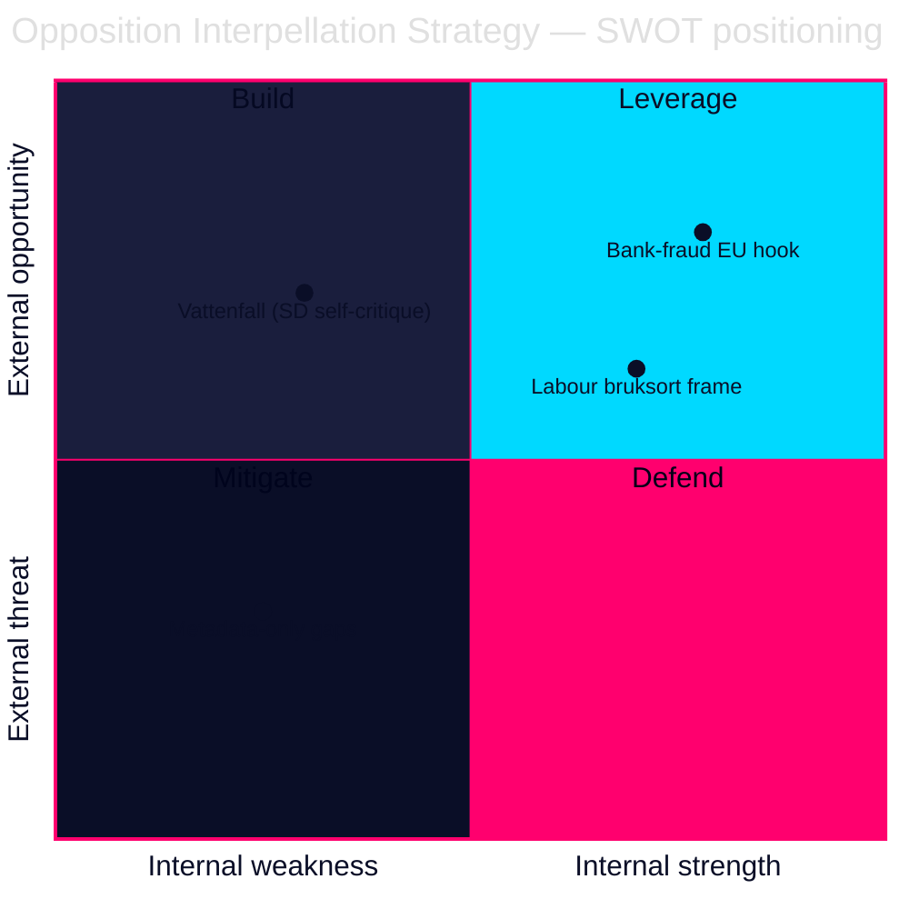

# SWOT Analysis — Opposition Interpellation Campaign 2026-05-29

This SWOT assesses the **opposition's interpellation strategy** of 2026-05-29 as a pre-election accountability instrument. Evidence is cited to dok_id and primary sources. [A2]

---

## Strengths

- **S1 — Concrete, dated premises.** HD10524 cites the 1 Oct 2025 a-kassa taper by date; HD10527/HD10528 attach to the pending EU PSD3/PSR package. Verifiable anchors make the interpellations hard to dismiss as rhetorical. [A2] (sources: data.riksdagen.se/dokument/HD10524.html, /HD10527.html)
- **S2 — Brand-jamming the government.** The bank-fraud pair turns the Tidö organised-crime brand against itself ("fraud finances organised crime; the effort is insufficient"). [B2] (HD10528)
- **S3 — Disciplined respondent targeting.** Pressure is concentrated on the two most exposed ministers (Britz/L, Wykman/M), maximising on-the-record accountability before recess. [B2]
- **S4 — Geographic precision.** The bruksort framing (HD10523) targets exactly the blue-collar districts contested with SD. [B2]

## Weaknesses

- **W1 — Limited direct levers.** Interpellations compel answers, not action; ministers can answer without committing. The instrument's ceiling is reputational, not legislative. [A2]
- **W2 — Two metadata-only filings.** HD10525 (ILO) and HD10526 (equalisation) lack retrieved full text, weakening the campaign's evidentiary completeness this cycle. [B3]
- **W3 — Coordination is inferred, not proven.** No retrieved strategy document; the "campaign" reading rests on convergence, exposing it to the devil's-advocate counter that this is routine end-of-session housekeeping. [B3] (see devils-advocate.md)
- **W4 — Late in the cycle.** Answers due 2026-06-12 leave little time for follow-up debate before recess and the campaign. [B2]

## Opportunities

- **O1 — EU regulatory timing.** The live PSD3/PSR negotiation gives HD10527/HD10528 a real external decision point the opposition can keep returning to. [B2]
- **O2 — Coalition fracture exposure.** SD's Vattenfall interpellation (HD10522) hands the opposition evidence that the governing bloc is internally divided on energy policy — an exploitable narrative. [B2]
- **O3 — Macro tailwind.** IMF WEO Apr-2026 unemployment ~8.5% validates the labour-distress framing and the cost-shifting critique. [A2] `{provider: "imf", dataflow: "WEO", indicator: "LUR", vintage: "WEO Apr-2026", retrieved_at: "2026-05-29"}`

## Threats

- **T1 — Government counter-framing.** Ministers can reframe a-kassa reform as work-incentive policy and fraud as a shared cross-party priority, neutralising the attack. [B2]
- **T2 — Answer-quality risk.** If Britz and Wykman give substantive, commitment-bearing answers on 2026-06-12, the accountability moment rebounds in the government's favour. [B2]
- **T3 — Issue crowding.** Seven interpellations in one day risk diluting media attention; only the bank-fraud apex is likely to break through. [B3]
- **T4 — Intra-opposition incoherence.** The SD Vattenfall filing is *not* part of the S campaign and could muddy a unified opposition message. [B3]

---

## Strategic Implication

The campaign's strength is concentrated in the bank-fraud apex and the dated a-kassa critique; its principal vulnerabilities are the inability to force action and the unproven-coordination charge. The highest-leverage move for the opposition is to convert the 2026-06-12 answers into sustained election messaging — and to exploit, rather than ignore, the SD–M Vattenfall split. [B2]
