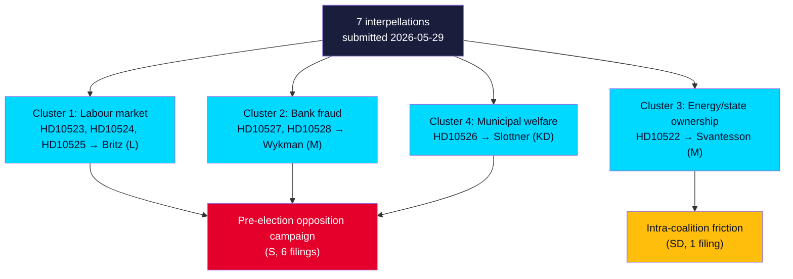

# Synthesis Summary — Interpellation Debates 2026-05-29

## Overview

The seven interpellations of 2026-05-29 are best understood not as isolated questions but as a **synchronised pre-election accountability operation** plus one **intra-coalition dissent signal**. Socialdemokraterna (six filings) distributes pressure across three Tidö ministers on the issues with the highest blue-collar and law-and-order salience; Sverigedemokraterna (one filing) breaks ranks to press its own finance minister on Vattenfall. With 107 days to the 2026-09-13 election, the 1.5× significance multiplier is applied throughout. [B2]

---

## Key Synthesised Findings

### 1. The bank-fraud pair is the strategic apex (DIW 7.8)

HD10527 and HD10528 (both Eva Lindh → Wykman) combine a protection ask (extend fraud safeguards to small firms) with an accountability ask (shift liability to banks; publish comparable fraud statistics). Their force comes from **attacking the government on its own organised-crime brand** (fraud "finances organised crime"), a **live EU hook** (PSD3/PSR), and a **testable transparency gap** (bank-level fraud data is currently withheld). Eight operative questions to one minister make this the densest pressure point of the day. [B2]

### 2. The labour cluster contests SD's blue-collar base

Three S interpellations to Britz (L) — forestry varsel (HD10523), the dated a-kassa taper of 1 Oct 2025 (HD10524), and ILO (HD10525) — build a place-based, bruksort-centred jobs narrative. HD10524's **cost-shifting argument** (a-kassa taper → municipal försörjningsstöd) is the analytically sharpest, and it bridges directly to the municipal-equalisation interpellation (HD10526). [B2]

### 3. Vattenfall is the anomaly that signals coalition strain

HD10522 is the only filing from a governing party (SD) and targets its own finance minister. The grievance bundle — bonus/CEO pay, offshore-wind enthusiasm, slow nuclear tempo — is a coded demand for tighter owner control to enforce the Tidö nuclear mandate. As an *intra-bloc* accountability act 107 days from the election, it is an early-warning indicator of energy-policy disunity. [B2]

### 4. Two themes are under-resolved (metadata-only)

HD10525 (ILO) and HD10526 (equalisation) lack full text this cycle. Their structural placement (completing the labour triad; reinforcing municipal-finance stress) is high-confidence; their specific content is not. Re-retrieval is the top collection action. [B3]

---

## Economic Frame (IMF WEO Apr-2026)

Swedish unemployment (LUR) ~8.5% — elevated vs Nordic peers — is the macro fact underwriting the labour cluster: cutting a-kassa duration and forestry varsel both bite hardest in a loose labour market. Gross debt ~37% of GDP and fiscal balance ~-0.5% indicate national fiscal headroom, which reframes both the a-kassa taper and under-funded equalisation as **distributive political choices, not fiscal necessities**. [A2]

**Economic data provenance**: `{provider: "imf", dataflow: "WEO", indicator: "LUR", vintage: "WEO Apr-2026", retrieved_at: "2026-05-29"}`

---

## Net Assessment

The convergence of theme, timing and respondent targeting is consistent with a **coordinated pre-election opposition accountability campaign** (high confidence on structure, moderate on intent), against which the SD Vattenfall filing stands out as **intra-coalition dissent**. The single most consequential things to watch are the seven ministerial answers due **2026-06-12** and any further SD-on-Tidö accountability filings. [B2]

*Detail: significance-scoring.md · risk-assessment.md · intelligence-assessment.md · scenario-analysis.md*

## Confidence Decomposition

The net assessment rests on three separable claims at different confidence levels: (1) *structural clustering* — that six S filings target Tidö ministers on jobs/fraud — is **directly observable** from filing metadata [A2, HIGH]; (2) *intentional coordination* — that this is a single planned campaign rather than convergent individual initiative — is **inferential** [B2, MEDIUM]; (3) *electoral payoff* — that the campaign moves votes — is **prospective and untestable until 2026-06-12 → 2026-09-13** [B3, LOW]. Decision-makers should treat (1) as fact, (2) as the working hypothesis, and (3) as a monitoring task, not a forecast. [B2]
