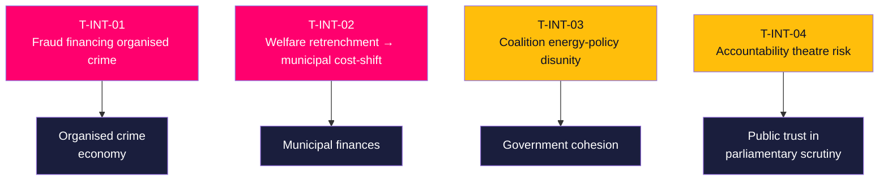

# Threat Analysis — Interpellation Debates 2026-05-29

## Purpose & Framing

"Threat" here denotes **threats to democratic accountability, governance integrity and the information environment** surfaced by or implicated in the seven interpellations — not cyber threats. Each entry uses a T-ID, an analytic description, evidence grade, and a monitoring hook. This is a structured analytic product, not an allegation of wrongdoing. [B2]

---

## T-INT-01 — Fraud as an organised-crime financing channel
**Evidence**: [B2] (HD10528 explicitly claims fraud is the fastest-growing crime and finances organised crime; HD10527 asks to fold business fraud into the organised-crime effort.)
**Analysis**: The interpellations assert a strategic gap — that the government's organised-crime agenda under-weights fraud as a funding stream, and that SMEs are an unprotected attack surface. If accurate, this is a genuine national-security-adjacent governance threat, not merely a consumer-protection matter. [B2]
**Monitoring hook**: Wykman's answer (2026-06-12); Polismyndigheten/Ekobrottsmyndigheten fraud-trend reporting; EU PSD3/PSR progress.

## T-INT-02 — Welfare retrenchment displacing cost onto municipalities
**Evidence**: [A2] (HD10524 dates the a-kassa taper to 1 Oct 2025 and argues it raises other agencies' costs; HD10526 presses equalisation reform.)
**Analysis**: The cost-shifting hypothesis describes a threat to municipal fiscal integrity — central retrenchment that re-emerges as local försörjningsstöd pressure, unevenly across municipalities. With IMF WEO Apr-2026 showing national fiscal headroom (debt ~37% GDP), the threat is distributive rather than aggregate. [A2] `{provider: "imf", dataflow: "WEO", indicator: "GGXWDG_NGDP", vintage: "WEO Apr-2026", retrieved_at: "2026-05-29"}`
**Monitoring hook**: Socialstyrelsen ekonomiskt bistånd data; SKR municipal-finance reports; Britz/Slottner answers.

## T-INT-03 — Coalition energy-policy disunity
**Evidence**: [B2] (HD10522: SD interpellates its own M finance minister over Vattenfall governance.)
**Analysis**: Public intra-bloc accountability is an early-warning indicator of governance instability. A governing party signalling that the state energy champion "lives its own life" against the electoral mandate threatens the coherence of the Tidö energy programme and, by extension, coalition cohesion into the election. [B2]
**Monitoring hook**: further SD accountability filings; Svantesson's answer; any revised ägaranvisning for Vattenfall.

## T-INT-04 — Accountability-theatre risk (information-environment threat)
**Evidence**: [B3] (inference from timing: 7 filings, answers due 2026-06-12, pre-recess.)
**Analysis**: If interpellations are deployed primarily for campaign optics with no intent to pursue resulting answers, the instrument's accountability value erodes and public trust in parliamentary scrutiny can degrade. The counter-view (devils-advocate.md) is that on-the-record answers have intrinsic value regardless of motive. [B3]
**Monitoring hook**: whether interpellants pursue follow-up debate/motions after answers; media uptake.

---

## Threat Prioritisation

| T-ID | Threat | Grade | Priority |
|------|--------|-------|----------|
| T-INT-01 | Fraud financing organised crime | [B2] | High |
| T-INT-02 | Welfare cost-shift to municipalities | [A2] | High |
| T-INT-03 | Coalition energy-policy disunity | [B2] | Elevated |
| T-INT-04 | Accountability-theatre risk | [B3] | Monitor |

**Lead threat**: T-INT-01 — it coincides with the highest-DIW cluster (bank fraud) and the most actionable forward indicator. T-INT-03 is the most strategically novel because it originates *inside* the governing coalition. [B2]

## Residual Risk After Mitigation

None of these threats is fully retired by a strong ministerial answer on 2026-06-12, but their *political* charge can be dampened: T-INT-01 falls if Wykman enumerates concrete PSD3/PSR-aligned workstreams with dates; T-INT-02 falls if the government commissions an independent cost-shift evaluation (see implementation-feasibility.md, Statskontoret row); T-INT-03 is the least mitigable because it is structural (an SD–M policy divergence, not a messaging gap) and will persist into the campaign regardless of the Vattenfall answer. The highest residual-risk item is therefore **T-INT-03**, not the highest-DIW item. [B2]
