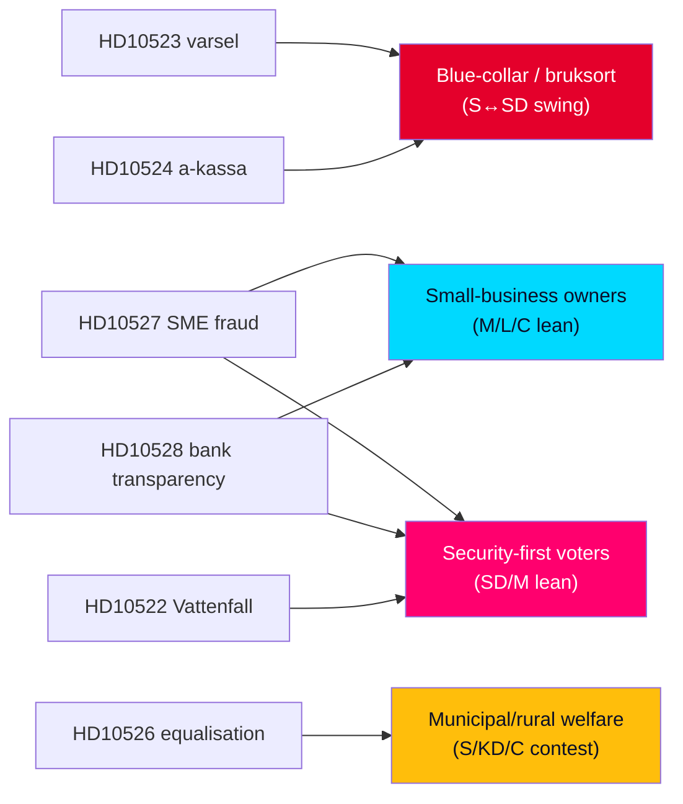

# Voter Segmentation — Interpellation Debates 2026-05-29

**Horizon**: T+107d to 2026-09-13 · **Multiplier**: 1.5×. Maps each interpellation cluster to the voter segments it is engineered to move. [B2]

## Segment Map

## Segment-by-Segment Analysis

### Blue-collar / bruksort voters (the S↔SD battleground)
**Targeted by**: HD10523 (varsel), HD10524 (a-kassa), HD10525 (ILO).
The core swing bloc of the 2026 election. S uses job security and benefit duration to argue SD's coalition harms workers. Resonates in forestry/industrial towns where varsel is concrete. Risk: SD counters that activation reforms create jobs. [B2] Unemployment ~8.5% (IMF WEO Apr-2026) sharpens salience. `{provider: "imf", dataflow: "WEO", indicator: "LUR", vintage: "WEO Apr-2026", retrieved_at: "2026-05-29"}`

### Small-business owners (M/L/C-leaning, fraud-exposed)
**Targeted by**: HD10527 (SME bank-fraud protection), HD10528 (transparency).
S makes an unusual cross-pressure play for a normally centre-right segment, arguing the government leaves SMEs unprotected against bank fraud. Even small defection or depressed turnout among this group has outsized value. [B2]

### Municipal & rural welfare voters
**Targeted by**: HD10526 (equalisation), HD10524 (cost-shift to municipalities).
Targets rural/northern municipalities dependent on fiscal equalisation — contested between S, C and KD. Frames the government as shifting costs onto local budgets. [B3] (HD10526 metadata-only — confidence capped.)

### Security-first voters (the SD/M crossover)
**Targeted by**: HD10527/HD10528 (fraud-as-crime), HD10522 (energy security).
By reframing bank fraud as organised crime, S contests the security segment that normally favours SD/M. HD10522 adds energy-security doubt about Tidö delivery. [B2]

## Turnout & Persuasion Logic

| Segment | S objective | Mechanism |
|---------|-------------|-----------|
| Blue-collar | Win back from SD | Jobs + benefit defence |
| Small-business | Depress/peel from M-L | "Unprotected from fraud" |
| Municipal/rural | Mobilise | "Costs shifted to your town" |
| Security-first | Cross-pressure SD/M | "Fraud = neglected crime" |

## Net Read

The package is a **multi-segment persuasion portfolio**: it defends S's blue-collar base while making opportunistic plays for small-business and security-first voters and mobilising rural welfare voters. Breadth is the strategy. See election-2026-analysis.md and coalition-mathematics.md. [B2]

## Turnout-Elasticity Note

The segments differ sharply in *mobilisation* versus *persuasion* potential. The rural/municipal welfare segment is **high-elasticity for turnout**: the cost-shift message ("your town pays for the a-kassa cut") attaches an abstract reform to a local, felt consequence, which is the classic precondition for converting latent grievance into turnout. The security-first segment is **persuasion-hard, mobilisation-easy**: the bank-fraud framing is unlikely to move committed SD/M voters to S, but can depress their certainty or turnout by muddying the government's crime-toughness claim. The SME segment is the **lowest-yield** play — small in number and weakly partisan — making HD10527/HD10528's real audience the *media-amplified general electorate* rather than SME owners themselves. The single most turnout-efficient message in the package is therefore the municipal cost-shift line, not the higher-profile fraud line. [B2]
