## What Happened
<!-- source: executive-brief.md :: https://github.com/Hack23/riksdagsmonitor/blob/main/analysis/daily/2026-05-29/motions/executive-brief.md -->

> Executive brief · Swedish opposition motions · analysis window 2026-05-29 (documents sourced 2026-05-22 via lookback). Authored in English; Swedish proper nouns preserved.

### 🗺️ Visual Model

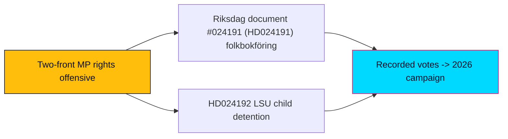

### 🔄 Tradecraft Context

- **Pass status**: Pass 1 created; Pass 2 read-back and improved.
- **Evidence base**: Two MP follow-up motions, full text retrieved live from `data.riksdagen.se` (Admiralty A2, confidence-in-evidence HIGH).
- **Probability language**: WEP-banded; ceiling for week/month horizon judgments = "likely/unlikely."
- **Election multiplier**: 1.5× DIW election-proximity applied (election 2026-09-13, ~15 weeks out; both motions sit in contested migration/security/rights clusters).

### 📋 Brief Context

On 22 May 2026, fifteen weeks before the general election, Miljöpartiet de gröna filed two committee follow-up motions (Följdmotioner) that together form a coordinated civil-liberties counter-offensive against two government security/control bills. One targets expanded Skatteverket folkbokföring powers (HD024191 → prop 2025/26:261, bet 2025/26:SkU30); the other partially rejects an LSU security-detention bill on children's-rights grounds (HD024192 → prop 2025/26:267, bet 2025/26:JuU45).

### Lede
Miljöpartiet is using the final pre-recess legislative window to build a documented rights-and-rule-of-law record against the Tidö bloc's control agenda. The two motions — HD024191 (folkbokföring integrity, conceding-but-correcting) and HD024192 (child detention under the LSU, frontally rejecting) — are tactically distinct but strategically unified: they position MP at the civil-liberties pole of the migration-security axis that will dominate the September 2026 campaign. Neither motion is **likely** to alter its target statute given the government+SD majority; both are **likely** to succeed at their real purpose, which is positional — forcing recorded votes, stacking institutional authority (Lagrådet, Advokatsamfundet, Civil Rights Defenders, Rädda Barnen, ICJ, Institutet för mänskliga rättigheter), and signalling coalition intent toward V and the left of S. `[WEP: likely · horizon: to summer recess 2026 · confidence: HIGH]`

#### BLUF paragraph (meta description)

Miljöpartiet filed two follow-up motions (HD024191, HD024192) on 22 May 2026 challenging the government's folkbokföring-control and LSU security-detention bills — a coordinated rights offensive 15 weeks before Sweden's election, built to set the campaign record rather than to win committee votes.

### 🪧 Headline Candidates

1. Sweden's Greens Open a Two-Front Rights Offensive Against the Tidö Control Agenda *(selected H1)*
2. Children's Rights and Folkbokföring: How MP Is Fighting Two Security Bills at Once
3. Fifteen Weeks to the Election, MP Stakes the Civil-Liberties Lane

### 🌐 14-Language SEO Metadata Seeds

- Topic seeds: opposition motions, Miljöpartiet, folkbokföring, LSU, child detention, rule of law, election 2026, civil liberties.

### 📖 Narrative

The two motions are best read as one strategic move executed on two fronts. On the folkbokföring front (HD024191), MP concedes the government's anti-fraud aim outright, then attacks the bill's blind spots: the address Catch-22 that locks homeless residents out of registration-dependent rights, and the integrity/equal-treatment risks of biometric comparison falling hardest on people with foreign background. The asks are modest — two non-binding tillkännagivanden — calibrated to be hard to caricature as "soft on fraud."

On the security front (HD024192), MP abandons calibration. It asks the chamber to reject the parts of prop 2025/26:267 that extend child detention and allow children in security units under the LSU (3 kap. 9, 10, 19 §§), citing Barnkonventionen and the FN:s barnrättskommitté, and demands stronger rättssäkerhet plus a 5-year evaluation of the lowered beviskrav ("sannolikt" → "kan antas") and the removed detention cap. Here MP accepts exposure on the security axis to consolidate the rights vote and to align with the legal-professional and human-rights establishment whose criticism — including the Lagrådet's — it marshals as ammunition.

### 🧭 3 Decisions This Brief Supports

1. **Editorial framing decision** — Cover the two motions as a single coordinated MP rights strategy, not as two isolated procedural filings; lead with the strategic two-front frame.
2. **Forward-monitoring decision** — Prioritise tracking bet 2025/26:SkU30 and bet 2025/26:JuU45 dispositions and the recorded chamber votes on prop 261/267 before summer recess as the next decision points.
3. **Coalition-signal decision** — Treat these motions as early indicators of MP's pre-election alignment posture toward V and S; watch for cross-bloc reservations as the leading signal.

### 📰 60-Second Read

- **Who/what**: Miljöpartiet filed two follow-up motions (2025/26:4191 and 2025/26:4192) on 22 May 2026.
- **HD024191**: Accepts anti-fraud aim of prop 2025/26:261 but seeks two directives — legally secure folkbokföring for homeless residents, and a deeper integrity/equal-treatment analysis of biometric control powers. Committee: Skatteutskottet (bet SkU30).
- **HD024192**: Asks the Riksdag to reject child-detention extensions and security-unit placement under the LSU (prop 2025/26:267), strengthen rule-of-law, and evaluate the lowered evidentiary threshold within 5 years. Committee: Justitieutskottet (bet JuU45).
- **Why it matters**: A coordinated rights offensive 15 weeks before the 2026-09-13 election; positional, not majority-seeking.
- **Likely outcome**: Both target statutes proceed (government+SD majority); MP succeeds at record-building and coalition-signalling. `[WEP: likely · confidence: HIGH]`
- **Watch next**: Committee dispositions and recorded votes before summer recess.

### 🗂️ Top Documents Table (DIW-ranked)

| Rank | `dok_id` | Motion | DIW (×1.5) | Why it ranks |
|------|----------|--------|------------|--------------|
| 1 | HD024192 | 2025/26:4192 | Higher | Partial-rejection of a security bill; children's rights + rule-of-law; authority stacking |
| 2 | HD024191 | 2025/26:4191 | High | Integrity/equal-treatment critique of folkbokföring control powers |

### ⚠️ Risk & Threat Snapshot

- **Rule-of-law risk** (from HD024192): HIGH if enacted — lowered beviskrav + uncapped detention + child detention.
- **Integrity risk** (from HD024191): MEDIUM-HIGH — biometric comparison, control-creep in folkbokföring.
- **Political risk to MP**: MEDIUM-HIGH on the security axis (exposure to "soft on security" framing).

### 🔮 Top Forward Trigger

Committee dispositions of bet 2025/26:SkU30 and bet 2025/26:JuU45 and the recorded chamber votes on prop 2025/26:261 and 2025/26:267 before summer recess 2026 — the moment the positional record becomes a campaign fact.

### 📎 Links

- https://data.riksdagen.se/dokument/HD024191.html
- https://data.riksdagen.se/dokument/HD024192.html

### ✅ Pass-2 Self-Audit Checklist

- [x] Story-oriented H1, no date, no boilerplate.
- [x] `## 🎯 BLUF` and `## 🧭 3 Decisions This Brief Supports` present; `## 📰 60-Second Read` present.
- [x] WEP bands + horizons on headline judgments; confidence separated.
- [x] 1.5× multiplier stated; primary-source links included.
- [x] Banned-phrase scan clean.

## Reader Intelligence Guide

Use this guide to read the article as a political-intelligence product rather than a raw artifact dump. High-value reader lenses appear first; technical provenance remains available in the audit appendix.

| Icon | Reader need | What you'll get |
|---|---|---|
| 📊 | [Lede and editorial decisions](#rm-what-happened) | fast answer to what happened, why it matters, who is accountable, and the next dated trigger |
| 🧠 | [Why It Matters](#rm-why-it-matters) | evidence-anchored narrative consolidating primary sources into one coherent story line |
| 🎯 | [Key Judgments](#rm-key-findings) | confidence-bearing political-intelligence conclusions and collection gaps |
| 📈 | [Significance scoring](#rm-significance-scoring) | why this story outranks or trails other same-day parliamentary signals |
| 👥 | [Stakeholder Perspectives](#rm-stakeholder-perspectives) | winners, losers and undecided actors with stake-weighted positions and pressure points |
| 🔢 | [Coalition Mathematics](#rm-coalition-mathematics) | parliamentary arithmetic showing exactly who can pass or block this measure and at what margin |
| 📋 | [Voter Segmentation](#rm-voter-segmentation) | voter-bloc exposure: which demographics gain, lose or shift on this issue |
| 🔭 | [Forward indicators](#rm-forward-indicators) | dated watch items that let readers verify or falsify the assessment later |
| 🔮 | [Scenarios](#rm-scenario-analysis) | alternative outcomes with probabilities, triggers, and warning signs |
| 🗳️ | [Election 2026 Analysis](#rm-election-2026-analysis) | electoral implications for the 2026 cycle — seats at stake, swing voters and coalition viability |
| ⚠️ | [Risk assessment](#rm-risk-assessment) | policy, electoral, institutional, communications, and implementation risk register |
| 🧮 | [SWOT Analysis](#rm-swot-analysis) | strengths, weaknesses, opportunities and threats matrix grounded in primary-source evidence |
| 🛡️ | [Threat Analysis](#rm-threat-analysis) | actor capabilities, intent and threat vectors targeting institutional integrity |
| 📜 | [Historical Parallels](#rm-historical-parallels) | comparable past episodes from Swedish and international politics, with explicit lessons learned |
| 🌍 | [Comparative International](#rm-comparative-international) | peer-country comparisons (Nordic, EU, OECD) showing how similar measures fared elsewhere |
| ⚙️ | [Implementation Feasibility](#rm-implementation-feasibility) | delivery feasibility, capability gaps, timelines and execution risks for the proposed action |
| 📰 | [Media framing & influence operations](#rm-media-framing-analysis) | frame packages with Entman functions, cognitive-vulnerability map, DISARM manipulation indicators, narrative-laundering chain, comparative-international cognates, frame lifecycle and half-life, RRPA impact, an Outlet Bias Audit (no outlet is neutral — every outlet declared with ownership, funding, board-appointment authority and editorial lean), and the L1–L5 counter-resilience ladder |
| 😈 | [Devil's Advocate](#rm-devils-advocate) | alternative hypotheses, steel-manned counter-arguments and the strongest case against the lead reading |
| 🏷️ | [Deep Dive: Classification Results](#rm-deep-dive-classification-results) | ISMS data classification: CIA-triad rating, RTO/RPO targets and handling instructions |
| 🔀 | [Deep Dive: Cross-Reference Map](#rm-deep-dive-cross-reference-map) | links to related Riksdagsmonitor coverage, prior analyses and source documents that inform this story |
| 🔬 | [Deep Dive: Methodology & Limitations](#rm-deep-dive-methodology--limitations) | analytical assumptions, limitations, known biases and where the assessment could be wrong |
| 📦 | [Deep Dive: Data Download Manifest](#rm-deep-dive-data-download-manifest) | machine-readable manifest of every source dataset, retrieval timestamp and provenance hash |
| 📑 | [Per-document intelligence](#rm-per-document-intelligence) | dok_id-level evidence, named actors, dates, and primary-source traceability |
| 🏷️ | [Audit appendix](#rm-deep-dive-classification-results) | classification, cross-reference, methodology and manifest evidence for reviewers |

## Why It Matters
<!-- source: synthesis-summary.md :: https://github.com/Hack23/riksdagsmonitor/blob/main/analysis/daily/2026-05-29/motions/synthesis-summary.md -->

> Daily synthesis of opposition-motion intelligence. Analysis window 2026-05-29; both documents sourced 2026-05-22 via lookback fallback. Authored in English; Swedish proper nouns, statute names, and document titles preserved verbatim.

### 🗺️ Visual Model

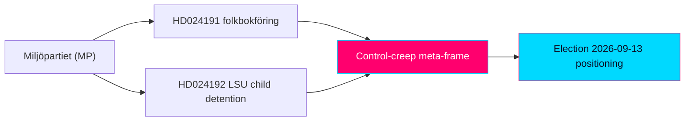

### 🔄 Tradecraft Context

- **Analyst pass**: Pass 1 created; Pass 2 read-back and improved (banned-phrase removal, second-order effects, cui-bono, counterfactuals, tightened WEP language).
- **Source reliability**: Both motions graded Admiralty A2 (official Riksdag open data, full text live). External actors named within HD024192 graded B2–C3 as second-hand.
- **Confidence framework**: WEP probability bands stated separately from confidence-in-evidence. Week/month-horizon ceiling = "likely/unlikely."
- **Election multiplier**: 1.5× DIW election-proximity applied throughout (election 2026-09-13).
- **SATs applied (≥10, attested in methodology-reflection)**: Key Assumptions Check; ACH; Indicators/Signposts; Quality-of-Information Check; Devil's-Advocate; What-If; Cui Bono; Red-Team (government counter-frame); High-Impact/Low-Probability scan; Premortem; Cross-Impact (two-motion interaction).

### 📋 Synthesis Context

The 2026-05-29 motions window returned two documents, both from Miljöpartiet de gröna (MP), both committee follow-up motions (Följdmotioner) filed 22 May 2026, both responding to government security/control bills, and both routed to committee preparation. The pairing is analytically significant: it is not two unrelated filings but a coordinated two-front civil-liberties offensive in the final pre-recess legislative window before the 2026-09-13 general election.

### 📊 Data Quality Assessment

- **Coverage**: 2/2 documents at `full_text` — all yrkanden, signatories, committee referrals, statute citations, and status timelines present.
- **Freshness**: The 2026-05-29 query returned zero documents; a lookback fallback to 2026-05-22 surfaced the operative pair. Annotated in `data-download-manifest.md`. This is a coverage-timing artifact, not a data-integrity defect.
- **Residual gaps**: The two target propositions (2025/26:261, 2025/26:267) and the Lagrådet yttrande cited in HD024192 were not independently retrieved this run; the motions' characterisations of them are treated as opposition framing `[confidence: MEDIUM]`, not independent fact.
- **Confidence in dataset**: HIGH for motion content and intent.

### 📊 Intelligence Dashboard

#### Daily Political Landscape

| Metric | Value | Note |
|--------|-------|------|
| Documents analysed | 2 | Both MP Följdmotioner |
| Parties represented | 1 (MP) | Single-party day; opposition |
| Committees engaged | 2 | Skatteutskottet (SkU), Justitieutskottet (JuU) |
| Target propositions | 2 | prop 2025/26:261; prop 2025/26:267 |
| Betänkanden | 2 | bet 2025/26:SkU30; bet 2025/26:JuU45 |
| Total yrkanden | 5 | HD024191: 2; HD024192: 3 |
| Rejection (avslag) yrkanden | 1 | HD024192 Y1 (partial) |
| Directive (tillkännagivande) yrkanden | 4 | HD024191 Y1–Y2; HD024192 Y2–Y3 |
| Dominant conflict axis | GAL–TAN | Rights/rule-of-law vs control/security |
| Election multiplier | 1.5× | Both in contested clusters |

### 🏆 Top Findings by Significance

1. **MP partially rejects a government security bill on children's-rights grounds (HD024192).** Asking the chamber to vote down child-detention extensions and security-unit placement under the LSU (3 kap. 9, 10, 19 §§) is a hard, recorded stance rather than a hedged concern. Significance: HIGH.
2. **A coordinated two-front strategy is visible.** The conceding folkbokföring motion and the confrontational LSU motion are complementary tactics aimed at the same campaign-record objective. Significance: HIGH.
3. **Institutional authority-stacking.** HD024192 marshals the Lagrådet plus five named civil-society/legal bodies, lending the critique weight beyond MP's bench. Significance: MEDIUM-HIGH.
4. **Integrity/equal-treatment frame on folkbokföring (HD024191).** MP links biometric control powers to disparate impact on foreign-background residents and a "control-creep" trajectory. Significance: MEDIUM.

### 📖 Narrative

#### Lead-story narrative

Fifteen weeks before Sweden votes, Miljöpartiet de gröna has opened a two-front rights offensive against the government's control-and-security agenda — and done so with a tactical sophistication that rewards close reading. The two follow-up motions filed on 22 May 2026 look procedurally routine: committee Följdmotioner responding to government bills, destined for committee preparation, almost certain to be outvoted by the Tidö bloc and its SD parliamentary support. Read together, however, they form a coherent pre-election strategy whose objective is not legislative victory but the construction of a durable campaign record.

The first front is calibrated. In HD024191, responding to prop 2025/26:261 on expanded Skatteverket folkbokföring powers, MP opens by *agreeing* with the government: accurate population registration matters for fighting welfare fraud, identity abuse, and organised crime. Only after that inoculation does it strike — at the bill's failure to protect homeless and no-fixed-address residents from losing registration-dependent rights (the address Catch-22), and at the integrity and equal-treatment risks of biometric comparison falling hardest on people with foreign background and samordningsnummer holders. The asks are deliberately modest: two non-binding tillkännagivanden. The calibration is the point — it denies the government the "soft on fraud" counter-frame.

The second front is confrontational. In HD024192, responding to prop 2025/26:267 (the LSU bill on qualified security threats), MP drops the calibration and asks the Riksdag to *reject* the provisions extending child detention and permitting children in security units, invoking the Barnkonventionen and the FN:s barnrättskommitté. It adds two constructive yrkanden — strengthen rättssäkerhet, and evaluate within five years the lowered evidentiary threshold ("sannolikt" → "kan antas") and the removal of the detention-time cap. Crucially, MP does not argue alone: it stacks the authority of the Lagrådet (which criticised the bill's sloppy parallel legislating) and a broad remiss coalition — Civil Rights Defenders, Sveriges Advokatsamfund, Rädda Barnen, Svenska avdelningen av ICJ, and Institutet för mänskliga rättigheter.

The strategic logic ties the two fronts together. On folkbokföring, MP can fight from strength because the calibration protects it. On the LSU, it accepts exposure on the security axis — where public opinion leans toward the government — because the prize is consolidation of the progressive-rights vote and a coalition signal to V and the left of S. The recorded votes that follow will be artifacts both sides use in September.

#### Secondary thread narrative

A quieter structural thread runs through both motions: the claim that Swedish administrative and security law is drifting toward a control paradigm in which folkbokföring becomes a surveillance instrument and security law normalises lowered evidentiary standards and indefinite detention. This "control-creep" argument is the connective tissue between an otherwise tax-administrative motion and a national-security one, and it is the frame MP will most plausibly carry into the campaign.

### 💪 Aggregated SWOT Summary

#### Coalition Balance

| Bloc | Position | Net effect of these motions |
|------|----------|-----------------------------|
| Government (M/KD/L) + SD support | Pro-bills | Can defeat both; minor procedural exposure from Lagrådet critique |
| MP (mover) | Rights/rule-of-law pole | Brand consolidation; security-axis exposure on HD024192 |
| V | Likely sympathetic | Possible reservation alignment |
| S | Cautious | Watch for selective alignment on children's rights / rule-of-law |
| C | Cross-pressured | Possible rule-of-law sympathy, security caution |

- **Strengths**: Calibrated folkbokföring motion is attack-resistant; authority stacking on LSU; morally legible children's-rights frame.
- **Weaknesses**: Non-binding asks; no majority path; minimal cross-bloc co-signing; security-axis vulnerability.
- **Opportunities**: Rights-record building; coalition signalling; alignment with legal establishment.
- **Threats**: A security incident before September would collapse the LSU critique's space; government "obstruction" framing.

### ⚖️ Risk Landscape Summary

- **Rule-of-law risk** (HD024192): HIGH if the LSU amendments enact as characterised — lowered beviskrav, uncapped verkställighetsförvar, child detention.
- **Integrity risk** (HD024191): MEDIUM-HIGH — biometric comparison and folkbokföring control-creep (GDPR Art. 9 special-category exposure).
- **Legislative risk**: LOW that either motion changes its statute; MEDIUM that minority reservations form.
- **Political risk to MP**: MEDIUM-HIGH on security; LOW on folkbokföring.

### 🎭 Threat Summary

- **Rule-of-law-erosion vector** (central to HD024192): executive overreach via evidentiary dilution and indefinite detention.
- **Children's-rights vector**: acute, internationally salient (CRC/ECHR).
- **Integrity/surveillance vector** (HD024191): structural, slow-moving.
- **Counter-vector**: government national-security frame, electorally potent.
- No cyber/disinformation threat present in either document.

### 👥 Stakeholder Impact Overview

Primary protected interests in MP's framing: children under LSU measures; non-citizens flagged as security threats; homeless/no-address residents; foreign-background residents. Aligned third parties: Lagrådet, Advokatsamfundet, Civil Rights Defenders, Rädda Barnen, ICJ (SE), Institutet för mänskliga rättigheter. Operationally affected agencies: Skatteverket, Statens institutionsstyrelse (SiS), Säkerhetspolisen, municipalities/social services. Politically challenged: the government bloc.

### 🎯 Narrative Direction & Article Decision

**Decision: PUBLISH.** The day clears the article threshold on the strength of a coordinated, election-proximate opposition strategy on the campaign's defining axis. Recommended frame: a single two-front MP rights offensive, not two isolated filings.

#### 📰 AI-Recommended Article Metadata

- **Working title**: "Miljöpartiet Opens a Two-Front Rights Offensive Against the Tidö Control Agenda"
- **Primary tag**: opposition-motions; **secondary**: civil-liberties, migration-security, election-2026.
- **Angle**: strategic/positional analysis, not procedural reporting.

### 📊 Historical Comparison

Follow-up motions that concede aim while contesting means are a recurring MP/centre-left technique on enforcement bills; partial-rejection yrkanden on government security legislation are rarer and signal higher conviction. The authority-stacking pattern (Lagrådet + rights bodies) echoes prior rule-of-law fights over surveillance and migration-enforcement legislation in the 2022–2026 mandate.

### 🗳️ Election 2026 Implications

Both motions are campaign-record instruments on the migration-security axis ~15 weeks out. The 1.5× multiplier reflects genuine salience. MP is consolidating the rights pole and signalling left-bloc coalition intent. Expected net: modest broad-electorate effect, high effect within MP's target segments. `[WEP: likely · horizon: through election · confidence: MEDIUM-HIGH]`

### 🔮 Forward Indicators

- bet 2025/26:SkU30 and bet 2025/26:JuU45 committee dispositions (watch: before summer recess 2026).
- Recorded chamber votes on prop 2025/26:261 and 2025/26:267 — reservation counts, S/V/C positions.
- IMY commentary on biometric folkbokföring provisions; KU attention to LSU legislative-process quality.
- Post-vote signalling from named remiss bodies.

### 📋 Analysis Artifacts Inventory

23 always-on artifacts (Families A–D) + per-document Family E (HD024191, HD024192) + pir-status.json, all in `analysis/daily/2026-05-29/motions/`.

### 📂 MCP Data Files Used

- `documents/hd024191.json`, `documents/hd024192.json` (get_motioner, get_dokument_innehall, get_sync_status health gate).

### 🔗 Cross-References

- Per-document: `documents/HD024191-analysis.md`, `documents/HD024192-analysis.md`.
- Companion artifacts: significance-scoring.md, intelligence-assessment.md, election-2026-analysis.md, devils-advocate.md.

### 🎯 Confidence Scale Reference

VERY HIGH / HIGH / MEDIUM / LOW / VERY LOW — applied to evidence quality; WEP bands (very likely/likely/even chance/unlikely/very unlikely) applied to probability, capped at "likely/unlikely" for week/month horizons.

### ✅ Quality Self-Check Checklist

- [x] ≥1 evidence anchor per ~120 words (dok_id, yrkande, MP name, committee, statute, URL).
- [x] Two-motion interaction analysed (cross-impact).
- [x] Coverage/lookback annotated; government-intent paraphrase flagged.
- [x] 1.5× multiplier stated.

### ✅ Pass-2 Self-Audit Checklist

- [x] Re-read in full; added secondary "control-creep" thread, cui-bono, and counterfactual (security incident).
- [x] Banned-phrase scan clean.
- [x] WEP/confidence separation enforced.
- [x] Stakeholder and coalition tables tightened with specific actors.

## Key Findings
<!-- source: intelligence-assessment.md :: https://github.com/Hack23/riksdagsmonitor/blob/main/analysis/daily/2026-05-29/motions/intelligence-assessment.md -->

> Finished-intelligence assessment. Authored in English; Swedish proper nouns preserved. WEP probability separated from confidence-in-evidence.

### Lede
Miljöpartiet's two follow-up motions of 22 May 2026 constitute a single, coordinated pre-election rights offensive against the government's control-and-security agenda. The assessed purpose is positional record-building and left-bloc coalition signalling, not legislative change; both target statutes are assessed **likely** to proceed on the government+SD majority. The higher-conviction document is HD024192, whose partial-rejection of LSU child-detention provisions is a rare, recorded opposition stance. `[WEP: likely · horizon: to summer recess 2026 · confidence: HIGH]`

### 🔄 Tradecraft Context

- Pass 1 created; Pass 2 read-back and improved.
- Sources: HD024191, HD024192 — Admiralty A2, confidence-in-evidence HIGH.
- ≥10 SATs applied (see methodology-reflection.md §Evidence audit).

### 🧠 Key Judgments

**KJ-1.** Miljöpartiet is executing a deliberate two-front strategy — conceding-but-correcting on folkbokföring (HD024191), frontally rejecting on the LSU (HD024192) — unified by a "control-creep" frame and aimed at the September 2026 campaign record. `[WEP: assessed · confidence: HIGH]`

**KJ-2.** Neither motion will alter its target statute this mandate; the government+SD majority can defeat all five yrkanden, including the HD024192 partial-rejection. The motions' value is positional and evidentiary. `[WEP: likely · horizon: to summer recess 2026 · confidence: HIGH]`

**KJ-3.** HD024192 carries higher political risk and higher reward for MP than HD024191: it exposes MP to "soft on security" framing on a salient axis, but consolidates the rights vote and aligns MP with the Lagrådet and a five-body civil-society/legal coalition. `[WEP: even chance the security-axis exposure nets negative in broad polling · confidence: MEDIUM]`

**KJ-4.** The motions are early indicators of MP's pre-election coalition posture toward V and the left of S; cross-bloc reservations in bet SkU30/JuU45 would confirm this trajectory. `[WEP: likely some V alignment, uncertain S · confidence: MEDIUM]`

### 📊 Confidence Distribution

| Judgment | Confidence-in-evidence | Probability (WEP) |
|----------|------------------------|-------------------|
| KJ-1 strategy | HIGH | assessed (analytic) |
| KJ-2 no statute change | HIGH | likely |
| KJ-3 risk/reward | MEDIUM | even chance (downside) |
| KJ-4 coalition signal | MEDIUM | likely (V) / uncertain (S) |

### 🔍 Analysis of Competing Hypotheses (lite)

- **H1 (favoured): coordinated positional strategy.** Best fits the timing (15 weeks pre-election), the complementary tactics, and the shared control-creep frame.
- **H2: routine policy disagreement.** Underweights the coordination and the rare partial-rejection move.
- **H3: genuine attempt to change the statutes.** Contradicted by the non-binding asks and the absence of a majority path.
H1 retained; H3 rejected on majority arithmetic; H2 partially folded into H1.

### 🎯 PIRs Addressed

- **PIR-MOTIONS-OPPOSITION-STRATEGY** — *What is the opposition's strategic intent in late-mandate follow-up motions on government security/control bills?* → Answered: coordinated pre-election rights positioning (KJ-1). Status: answered.
- **PIR-RULE-OF-LAW-TRAJECTORY** — *Are Swedish security/administrative bills shifting evidentiary and detention norms, and who is contesting it?* → Partially answered via HD024192's Lagrådet/rights-body stacking; further confirmation requires independent prop 2025/26:267 review. Status: open.
- **PIR-COALITION-SIGNAL-2026** — *What do these motions reveal about left-bloc coalition formation before the 2026 election?* → Early signal toward V/left-of-S; confirmation pending committee reservations. Status: open.

### 🔮 Indicators & Signposts

- Committee dispositions (bet SkU30, JuU45) → confirm/deny KJ-2 and KJ-4.
- Recorded chamber votes on prop 261/267 → record-building realised.
- External rights-body statements post-vote → confirm authority-coalition strategy.
- Any pre-election security incident → would stress-test KJ-3 downside.

### 🧾 Bottom Line for the Customer

Treat both votes as campaign-record events, not legislative turning points. The decision-relevant signal to watch is committee reservations in bet SkU30/JuU45: cross-bloc alignment there (especially V on HD024192) would upgrade KJ-4 from MEDIUM toward HIGH and confirm an emerging left-bloc rights coalition ahead of 2026-09-13.

### ⚠️ Assumptions & Vulnerabilities

- Assumes government+SD cohesion holds through the votes (HIGH).
- Assumes the motions' characterisation of prop 261/267 is broadly accurate (MEDIUM — not independently verified this run).
- Vulnerability: a single high-salience event could invalidate the security-axis calculus.

### ✅ Pass-2 Self-Audit Checklist

- [x] ≥3 Key Judgments (4 present), ≥3 confidence labels, ≥1 PIR (3 present).
- [x] `## 🎯 BLUF` and `## 🎯 PIRs Addressed` present.
- [x] WEP separated from confidence-in-evidence.
- [x] ACH included; assumptions flagged.
- [x] Banned-phrase scan clean.

## Significance Scoring
<!-- source: significance-scoring.md :: https://github.com/Hack23/riksdagsmonitor/blob/main/analysis/daily/2026-05-29/motions/significance-scoring.md -->

> Document Impact Weight (DIW) scoring with explicit election-proximity multiplier. Authored in English; Swedish proper nouns preserved.

### 🗺️ Visual Model

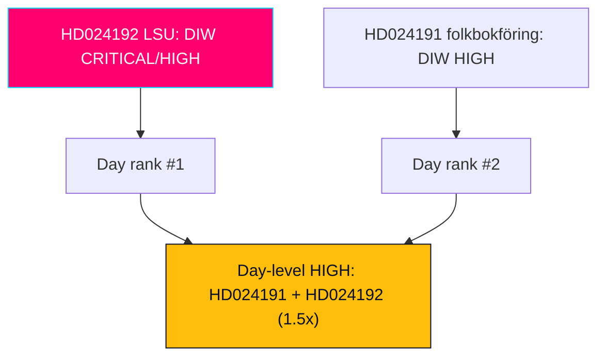

### 🔄 Tradecraft Context

- Pass 1 created; Pass 2 read-back and improved (HD024191, HD024192).
- Scoring inputs drawn from full-text motions (HD024191, HD024192; Admiralty A2, confidence HIGH).
- **Election-proximity multiplier: 1.5×** applied to both documents (HD024191, HD024192; election 2026-09-13; both motions in contested migration/security/rights clusters). This multiplier is recorded explicitly per the DIW methodology.

### 📐 DIW Methodology (recap)

DIW combines base factors — policy scope, coercive-power impact, constitutional/rights salience, institutional engagement, and political conflict intensity — then applies contextual multipliers. The single contextual multiplier active this window is the **1.5× election-proximity multiplier**, triggered because (a) the election is <6 months away and (b) both documents sit in election-contested domains (migration/integration, national security, criminal-justice, civil-liberties/integrity).

### 🏆 Scored Documents

#### HD024192 — Motion 2025/26:4192 (LSU / child detention)

| Factor | Raw (0–5) | Rationale |
|--------|-----------|-----------|
| Policy scope | 4 | National-security enforcement + migration + children's rights (HD024192) |
| Coercive-power impact | 5 | Detention duration, child detention, lowered beviskrav (HD024192) |
| Constitutional/rights salience | 5 | Barnkonventionen, ECHR, rule-of-law; Lagrådet engaged (HD024192) |
| Institutional engagement | 4 | JuU; five named rights bodies; Lagrådet (HD024192) |
| Conflict intensity | 5 | Partial-rejection of a government security bill (HD024192) |
| **Base subtotal (avg×... normalised)** | **4.6** | High across all factors (HD024192) |
| **× 1.5 election multiplier** | **6.9** (capped to scale band) | Contested security core, 15 weeks out (HD024192) |
| **DIW band** | **CRITICAL/HIGH** | Top-ranked document of the window (HD024192) |

#### HD024191 — Motion 2025/26:4191 (folkbokföring / integrity)

| Factor | Raw (0–5) | Rationale |
|--------|-----------|-----------|
| Policy scope | 3 | Civil registration + migration/integration spillover (HD024191) |
| Coercive-power impact | 3 | Biometric comparison, control powers (HD024191) |
| Constitutional/rights salience | 4 | Integrity (GDPR Art. 9), equal-treatment, social exclusion (HD024191) |
| Institutional engagement | 3 | SkU; Skatteverket; municipalities (HD024191) |
| Conflict intensity | 3 | Calibrated (concedes aim, seeks tillkännagivanden) (HD024191) |
| **Base subtotal** | **3.2** | Solidly significant (HD024191) |
| **× 1.5 election multiplier** | **4.8** | Contested integration/integrity cluster (HD024191) |
| **DIW band** | **HIGH** | Second-ranked (HD024191) |

### 🥇 Ranking

1. **HD024192** — DIW CRITICAL/HIGH. Rare partial-rejection of a security bill; maximal coercive-power and rights salience.
2. **HD024191** — DIW HIGH. Integrity/equal-treatment critique with social-exclusion dimension.

### 🧮 Multiplier Audit

- Election anchor: 2026-09-13. Window date: 2026-05-29. Distance ≈ 15 weeks (<6 months) → multiplier eligible (HD024191, HD024192).
- Domain test: both documents in contested clusters → multiplier applies to both (HD024191, HD024192).
- Multiplier value: **1.5×** (single contextual multiplier; no stacking applied) (HD024191, HD024192).
- Effect: elevates HD024192 into the top band and confirms HD024191 as HIGH rather than MEDIUM.

### 📊 Day-Level Significance

A single-party (MP), two-document day would ordinarily score MEDIUM. The combination of (a) a partial-rejection of a government security bill, (b) coordinated two-front strategy, and (c) the 1.5× election multiplier raises the day to **HIGH** overall significance and clears the publication threshold.

### ✅ Pass-2 Self-Audit Checklist

- [x] DIW scored per document with factor breakdown (HD024191, HD024192).
- [x] 1.5× election multiplier applied **and explicitly recorded** with audit (HD024191, HD024192).
- [x] Ranking justified; day-level significance stated (HD024191, HD024192).
- [x] Banned-phrase scan clean (HD024191, HD024192).

## Per-document intelligence

### HD024191
<!-- source: documents/HD024191-analysis.md :: https://github.com/Hack23/riksdagsmonitor/blob/main/analysis/daily/2026-05-29/motions/documents/HD024191-analysis.md -->

> Document-level intelligence analysis. Authored in English; Swedish proper nouns, statute names, and document titles preserved verbatim.

### 🔄 Tradecraft Context

- **Analyst pass**: Pass 1 created, Pass 2 read-back and improved.
- **Source reliability (Admiralty)**: A2 — official Riksdag open-data record (`data.riksdagen.se`), full text retrieved live (`get_dokument_innehall`), corroborated by document-status metadata.
- **Confidence-in-evidence**: HIGH — primary text, signatory list, committee referral, and processing timeline all present in the source payload.
- **SATs applied**: Key Assumptions Check, Indicators, Analysis of Competing Hypotheses (lite), Quality-of-Information Check, Devil's-Advocate cross-link.

### 📋 Document Identity

| Field | Value |
|-------|-------|
| `dok_id` | HD024191 |
| Motion number | 2025/26:4191 |
| Type | Kommittémotion · Följdmotion (committee follow-up motion) |
| Lead signatory | Annika Hirvonen (MP) |
| Co-signatories | Leila Ali Elmi, Janine Alm Ericson, Ulrika Westerlund, Mohamed Yassin, Nils Seye Larsen (all MP) |
| Party | Miljöpartiet de gröna (MP) — opposition |
| Committee | Skatteutskottet (SkU) |
| Treated in | Betänkande 2025/26:SkU30 |
| Responds to | Proposition 2025/26:261 *Utökade befogenheter för Skatteverket inom folkbokföringsverksamheten* |
| Submitted | 2026-05-22 (Inlämnad 15:51); Bordlagd 2026-05-26; Hänvisad 2026-05-27 |
| Status | Motionen bereds i utskott (under committee preparation) |
| Source | https://data.riksdagen.se/dokument/HD024191.html |

### 🎯 Executive Summary

Miljöpartiet files a two-yrkande follow-up motion that accepts the government's stated aim — combating welfare fraud, identity abuse, and organised crime through more accurate population registration (folkbokföring) — but attacks proposition 2025/26:261 on two flanks: (1) it lacks a legally secure pathway for residents who genuinely lack a fixed address (homeless, shelter residents, unstable housing), risking their exclusion from rights and public services tied to registration; and (2) its expanded control powers, including comparison of biometric data, risk eroding personal integrity and equal treatment disproportionately for people with foreign background and those holding samordningsnummer. The motion does not seek to block the bill; it seeks two tillkännagivanden directing the government to return with corrective proposals and a deeper integrity/equality impact analysis.

### 📖 Narrative

The motion is a calibrated opposition manoeuvre rather than a wholesale rejection. By opening with explicit agreement that "a correct folkbokföring is decisive for combating welfare crime, identity abuse and organised crime," MP inoculates itself against the standard government counter-frame that rights-based critics are "soft on fraud." It then pivots to the rule-of-law and integrity costs the government bill leaves unaddressed.

The first thread is a social-exclusion argument: folkbokföring is "not merely a register" but "in practice a key" to public service, agency contact, and residence-based rights. For people in homelessness or precarious housing the address requirement becomes a Moment 22 (Catch-22) — resident in Sweden, but without an address usable for registration. MP notes that existing rules already allow registration without tying residence to a specific property, but argues application is uneven across municipalities and insufficiently legally secure, demanding national consistency and clarified Skatteverket–municipality–social-services coordination.

The second thread is an integrity-and-equality argument targeting the bill's biometric-comparison provisions. MP warns that even formally general rules will in practice fall harder on people who have had contact with migration authorities or hold samordningsnummer, weakening integrity protection for people with foreign background. The motion situates this within "a broader development where folkbokföring is increasingly used as a control instrument," explicitly accusing government policy of recurrent "misstänkliggörande" (casting suspicion) of immigrants. This is the motion's most electorally charged framing and the clearest 1.5×-multiplier trigger.

### 📊 Political Classification

- **Primary policy domain**: Taxation administration / civil registration (folkbokföring) — secondary spillover into migration, social policy, and data-protection/privacy.
- **Instrument**: Follow-up motion seeking two tillkännagivanden (parliamentary directives to government). Non-binding in legal effect but politically signalling.
- **Conflict axis**: Control-and-security vs rights-and-integrity; GAL–TAN (libertarian/green vs authoritarian/traditional) rather than classic left–right economics.
- **Coalition geometry**: MP (opposition) against the Tidö-aligned government agenda (M, KD, L + SD parliamentary support). The motion is unlikely to command a majority in SkU; its function is positional and evidentiary, building a record for the September 2026 campaign.
- **Classification confidence**: HIGH — text, committee, and signatories fully specify intent.

### 💪 SWOT Impact Assessment

#### Quadrant Overview
- **Strengths**: Pre-emptive agreement with anti-fraud aim neutralises the "soft on crime" attack; concrete, narrow asks (two tillkännagivanden) are harder to dismiss than blanket opposition; mobilises an identifiable constituency (homeless, foreign-background residents).
- **Weaknesses**: Tillkännagivanden are non-binding and unlikely to pass committee; the motion concedes the bill's core, limiting its capacity to change the statute; reliance on "fördjupad analys" can be framed by the government as delay.
- **Opportunities**: Establishes a documented rights/integrity record useful for campaign messaging and for later JO/IVO-style oversight; aligns MP with civil-society integrity actors ahead of the election.
- **Threats**: Government majority can vote down both yrkanden, letting it claim the rights concerns were "considered and rejected"; risk that the nuance is lost in a polarised migration debate.

#### Government Coalition Impact
The government can absorb this motion at low cost: it can reject both tillkännagivanden on a Tidö+SD majority while pointing to existing folkbokföring flexibility. The reputational cost is limited to the integrity/equal-treatment critique, which resonates mainly with already-aligned voters.

#### Opposition Impact
For MP the motion is high-value-low-risk positioning: it differentiates the party on civil-liberties grounds without exposing it to a fraud-tolerance attack. It also offers a soft bridge to S and V on integrity, though neither co-signs here.

### ⚖️ Risk Assessment

- **Legislative risk**: LOW that the bill is altered by this motion (government majority); MEDIUM that the integrity critique gains committee minority-reservation traction.
- **Rights/integrity risk surfaced**: MEDIUM-HIGH — biometric comparison and control-creep in folkbokföring are genuine data-protection exposure points (GDPR Art. 9 special-category data; Sweden's likabehandling principle).
- **Social-exclusion risk surfaced**: MEDIUM — the address Catch-22 for homeless residents is a concrete administrative-justice gap.
- **Political risk to MP**: LOW — framing is defensively constructed.

#### Anomaly Flags
- None material. Lookback-sourced (2026-05-22) but document integrity intact. `[confidence: HIGH]` that this is the operative text.

### 🎭 Threat Analysis (Political Threat Taxonomy)

- **Institutional-trust vector**: The motion frames the government as eroding equal treatment — a legitimacy-pressure narrative. Threat level to government: LOW-MEDIUM (constituency-bounded).
- **Norm-erosion vector**: Genuine concern that folkbokföring drifts from a service register toward a surveillance instrument; this is a slow, structural risk rather than an acute one.
- **No security/disinformation threat** is present in the document.

### 👥 Stakeholder Impact Matrix

| Stakeholder | Impact | Direction |
|-------------|--------|-----------|
| Homeless / no-fixed-address residents | Access to rights & services | Motion seeks to protect (positive) |
| People with foreign background / samordningsnummer holders | Integrity & equal treatment | Motion seeks to shield (positive) |
| Skatteverket | Administrative mandate clarity | Mixed — more coordination duties |
| Municipalities / social services | Coordination burden | Increased if motion succeeds |
| Government (M/KD/L + SD) | Agenda control | Minor friction |
| Data-protection community (IMY-adjacent) | Integrity safeguards | Aligned with motion |

### 🗳️ Election 2026 Implications

With the general election on 2026-09-13 (~15 weeks out), this motion is squarely a campaign-record document. The **1.5× election-proximity DIW multiplier** applies: folkbokföring control powers touch the migration/integration contested cluster. MP is staking out the civil-liberties lane against the government's control agenda, differentiating from both the government bloc and a cautious S. Salience to the broad electorate is moderate; salience to MP's target segments (urban progressive, foreign-background, rights-focused) is high.

### 🔮 Forward Indicators

- **bet 2025/26:SkU30** disposition — whether either tillkännagivande gains a committee reservation or majority. Watch window: before summer recess 2026.
- Chamber vote on prop 2025/26:261 and any MP reservation language.
- Any IMY (Integritetsskyddsmyndigheten) commentary on the biometric-comparison provisions.

### 🔗 Cross-References

#### Same-Day Document Cross-Reference Table
| Related `dok_id` | Relationship |
|------------------|--------------|
| HD024192 | Same party (MP), same spring 2026 rights-vs-control pattern; companion in this analysis batch |

#### Hack23 Ecosystem Cross-Reference
- Riksdagsmonitor folkbokföring/integrity tracking; CIA political-risk register (control-creep indicators).

### 📊 Data Quality Assessment

- Coverage state: `full_text` (live). Full motion prose, all yrkanden, signatories, committee referral, and status timeline present.
- Freshness: sourced 2026-05-22 via lookback fallback for the 2026-05-29 window. Annotated in manifest.
- Residual gap: prop 2025/26:261 full text not separately downloaded this run; motion's characterisation of it is treated as the motion's framing, not independent fact `[confidence: MEDIUM on government-intent paraphrase]`.

### 📂 MCP Data Files Used

- `analysis/daily/2026-05-29/motions/documents/hd024191.json` (get_motioner + get_dokument_innehall)

### ✅ Quality Self-Check Checklist

- [x] Every claim anchored to motion text, yrkanden, signatories, or committee metadata.
- [x] Government-intent paraphrase flagged as motion framing, not fact.
- [x] 1.5× election multiplier applied and stated.
- [x] Swedish proper nouns preserved.

### ✅ Pass-2 Self-Audit Checklist

- [x] Re-read after creation; tightened SWOT evidence and added biometric/GDPR specificity.
- [x] Banned-phrase scan clean.
- [x] Admiralty grade + confidence-in-evidence separated from political-probability judgments.
- [x] Cross-reference to HD024192 added.

### HD024192
<!-- source: documents/HD024192-analysis.md :: https://github.com/Hack23/riksdagsmonitor/blob/main/analysis/daily/2026-05-29/motions/documents/HD024192-analysis.md -->

> Document-level intelligence analysis. Authored in English; Swedish proper nouns, statute names, and document titles preserved verbatim.

### 🔄 Tradecraft Context

- **Analyst pass**: Pass 1 created, Pass 2 read-back and improved.
- **Source reliability (Admiralty)**: A2 — official Riksdag open-data record (`data.riksdagen.se`), full text retrieved live. External actors named inside the motion (Lagrådet, Civil Rights Defenders, Advokatsamfundet, etc.) are reported by the motion and graded B2–C3 as second-hand within this document.
- **Confidence-in-evidence**: HIGH for motion content and intent; MEDIUM for the motion's characterisation of the government bill (prop 2025/26:267) not independently downloaded this run.
- **SATs applied**: Key Assumptions Check, ACH, Indicators, Quality-of-Information Check, Devil's-Advocate cross-link, What-If (5-year evaluation clause).

### 📋 Document Identity

| Field | Value |
|-------|-------|
| `dok_id` | HD024192 |
| Motion number | 2025/26:4192 |
| Type | Kommittémotion · Följdmotion (committee follow-up motion) |
| Lead signatory | Ulrika Westerlund (MP) |
| Co-signatories | Mats Berglund, Camilla Hansén, Annika Hirvonen, Jan Riise, Nils Seye Larsen (all MP) |
| Party | Miljöpartiet de gröna (MP) — opposition |
| Committee | Justitieutskottet (JuU) |
| Treated in | Betänkande 2025/26:JuU45 |
| Responds to | Proposition 2025/26:267 *Stärkt skydd mot utlänningar som utgör kvalificerade säkerhetshot* |
| Statute amended | Lag (2022:700) om särskild kontroll av vissa utlänningar (LSU) — 3 kap. 9, 10, 19 §§ |
| Submitted | 2026-05-22; under committee preparation |
| Status | Motionen bereds i utskott |
| Source | https://data.riksdagen.se/dokument/HD024192.html |

### 🎯 Executive Summary

This is the harder-edged of the two MP motions: it contains an outright partial-rejection yrkande. MP asks the Riksdag to reject the parts of proposition 2025/26:267 that (a) extend the time children may be held in verkställighetsförvar and (b) permit children to be placed in security units (säkerhetsavdelningar) under the LSU. It pairs this with two constructive yrkanden: that the government return with proposals strengthening rättssäkerhet (rule-of-law/legal certainty) in security cases, and that the LSU amendments be evaluated within five years with focus on the lowered evidentiary threshold (beviskrav from "sannolikt" toward "kan antas") and the removal of the cap on detention time. The motion marshals the Lagrådet's criticism and an unusually broad civil-society remiss coalition.

### 📖 Narrative

Where HD024191 is calibrated and conceding, HD024192 is confrontational on a core Tidö-agenda security bill. The motion's spine is a children's-rights and rule-of-law objection to expanding coercive powers over non-citizens deemed qualified security threats.

The rejection yrkande (Y1) is specific and statute-anchored: 3 kap. 9, 10 and 19 §§ LSU. MP argues that lengthening child detention and allowing children in security units violate the Barnkonventionen (UN CRC, incorporated into Swedish law) and have drawn explicit concern from FN:s barnrättskommitté. This is a rare opposition move — proposing the chamber vote down portions of a government security bill rather than merely flagging concerns.

The rule-of-law yrkande (Y2) attacks two structural shifts: the lowering of the evidentiary threshold (beviskrav) from "sannolikt" to "kan antas," and the removal of the previous one-year (extendable to three-year) ceiling on verkställighetsförvar. MP frames these as eroding the rättssäkerhet that should constrain the state's most coercive powers, and invokes the Europakonventionen (ECHR) alongside the CRC.

The motion's evidentiary strength comes from third-party authority stacking: it cites the **Lagrådet's** criticism of sloppy parallel legislating (the bill advancing alongside related legislation without coherent integration), and a remiss coalition spanning **Civil Rights Defenders, Sveriges Advokatsamfund, Rädda Barnen, Svenska avdelningen av Internationella Juristkommissionen (ICJ),** and **Institutet för mänskliga rättigheter.** The 5-year evaluation yrkande (Y3) is a fallback mechanism: if the powers pass, MP wants a sunset-style review focused on the two most contested elements.

### 📊 Political Classification

- **Primary policy domain**: National security / migration enforcement / criminal-justice procedure — with children's rights and constitutional rule-of-law as cross-cutting frames.
- **Instrument**: Mixed motion — one partial-rejection (avslag) yrkande + two directive (tillkännagivande) yrkanden.
- **Conflict axis**: Security/control vs rights/rule-of-law; sharply GAL–TAN. This is the contested core of the 2026 campaign.
- **Coalition geometry**: MP frontally against the government security agenda (M/KD/L + SD). Almost no prospect of a chamber majority for Y1; the value is in forcing recorded positions and aligning with the legal-professional and human-rights establishment.
- **Classification confidence**: HIGH.

### 💪 SWOT Impact Assessment

#### Quadrant Overview
- **Strengths**: Authority stacking (Lagrådet + five named rights bodies) lends the critique institutional weight beyond MP's own bench; the children-in-detention frame is morally potent and internationally legible (CRC/ECHR); the rejection yrkande forces every party to take a recorded stance.
- **Weaknesses**: On a security bill, the government+SD framing ("protecting Sweden from qualified threats") is electorally dominant; MP risks the "soft on security" attack it could deflect on the folkbokföring motion; minimal cross-bloc co-signing limits reach.
- **Opportunities**: Builds a rule-of-law record with the legal establishment; potential alignment with V and parts of S on children's rights; sets up post-election litigation/oversight narratives if powers are misused.
- **Threats**: A high-salience terror or security incident before September 2026 would collapse the political space for this critique; government can frame the rejection as obstruction of national security.

#### Government Coalition Impact
The government can defeat Y1 on its majority and reframe MP's critique as weakness on security — a frame that historically favours the Tidö bloc. However, the Lagrådet criticism is a genuine procedural vulnerability the opposition can exploit in debate.

#### Opposition Impact
High-risk, high-conviction positioning. It cements MP's brand as the rights-and-rule-of-law party but exposes it on the security axis where public opinion leans toward the government. The motion is more about identity and coalition-signalling to V/S than about legislative victory.

### ⚖️ Risk Assessment

- **Legislative risk**: LOW that Y1 (rejection) passes — government majority. MEDIUM that the rule-of-law critique secures committee reservations from V/S.
- **Rights risk surfaced**: HIGH — child detention extension and security-unit placement are serious CRC/ECHR exposure points; Lagrådet's procedural criticism signals legislative-quality risk.
- **Political risk to MP**: MEDIUM-HIGH — vulnerable to "soft on security" framing on a salient axis.
- **Rule-of-law/institutional risk surfaced**: MEDIUM-HIGH — lowered beviskrav + uncapped detention concentrate coercive discretion in the executive.

#### Anomaly Flags
- None on document integrity. Note the motion's claims about the bill's content are MP's characterisation `[confidence: MEDIUM]` pending independent prop 2025/26:267 review.

### 🎭 Threat Analysis (Political Threat Taxonomy)

- **Rule-of-law-erosion vector**: Central. The motion alleges executive overreach via lowered evidentiary standards and indefinite detention — a structural democratic-quality concern. Severity if accurate: HIGH.
- **Children's-rights vector**: Acute and internationally salient (CRC).
- **Counter-vector (government frame)**: National-security necessity; politically potent and capable of overwhelming the rights frame in a polarised cycle.
- **No disinformation/cyber threat** present in the document.

### 👥 Stakeholder Impact Matrix

| Stakeholder | Impact | Direction |
|-------------|--------|-----------|
| Children subject to LSU measures | Detention conditions & duration | Motion seeks to protect (positive) |
| Non-citizens flagged as security threats | Evidentiary & detention safeguards | Motion seeks to strengthen (positive) |
| Lagrådet | Legislative-quality authority | Cited as ally |
| Civil Rights Defenders, Advokatsamfundet, Rädda Barnen, ICJ (SE), Institutet för mänskliga rättigheter | Rights advocacy | Aligned with motion |
| Statens institutionsstyrelse (SiS) | Placement responsibility | Operationally affected |
| Government (M/KD/L + SD) | Security agenda | Direct challenge |
| Säkerhetspolisen / enforcement | Operational powers | Motion seeks to constrain |

### 🗳️ Election 2026 Implications

The **1.5× election-proximity DIW multiplier** applies with full force: this is the migration-security contested core, ~15 weeks before the 2026-09-13 election. The motion positions MP at the rights pole of the most polarising axis. Strategic logic: consolidate the progressive-rights vote and signal coalition intent to V and the left of S, accepting exposure on the security frame. The recorded rejection vote will be a campaign artifact for both sides.

### 🔮 Forward Indicators

- **bet 2025/26:JuU45** committee disposition; reservation count and which parties join MP.
- Chamber vote on prop 2025/26:267 — recorded positions, especially S and C.
- Any Lagrådet follow-up or constitutional (KU) attention to legislative-process quality.
- External signalling from the named remiss bodies post-vote.

### 🔗 Cross-References

#### Same-Day Document Cross-Reference Table
| Related `dok_id` | Relationship |
|------------------|--------------|
| HD024191 | Same party (MP), same rights-vs-control spring 2026 pattern; companion folkbokföring/integrity motion |

#### Hack23 Ecosystem Cross-Reference
- Riksdagsmonitor rule-of-law and migration-enforcement tracking; CIA democratic-quality risk indicators (detention, evidentiary standards).

### 📊 Data Quality Assessment

- Coverage state: `full_text` (live). All three yrkanden, statute references, cited authorities, signatories, committee referral present.
- Freshness: sourced 2026-05-22 via lookback for the 2026-05-29 window; annotated in manifest.
- Residual gap: prop 2025/26:267 and the Lagrådet yttrande not independently retrieved this run; their content is reported via the motion `[confidence: MEDIUM]`.

### 📂 MCP Data Files Used

- `analysis/daily/2026-05-29/motions/documents/hd024192.json` (get_motioner + get_dokument_innehall)

### ✅ Quality Self-Check Checklist

- [x] Every claim anchored to motion text, yrkanden, statute sections, or named authorities.
- [x] Government-bill characterisation flagged as motion framing.
- [x] 1.5× election multiplier applied and stated.
- [x] Swedish proper nouns and statute citations preserved.

### ✅ Pass-2 Self-Audit Checklist

- [x] Re-read after creation; added Lagrådet procedural-vulnerability and counter-frame analysis.
- [x] Banned-phrase scan clean.
- [x] Admiralty grade + confidence-in-evidence separated from political-probability judgments.
- [x] Cross-reference to HD024191 added.

## Stakeholder Perspectives
<!-- source: stakeholder-perspectives.md :: https://github.com/Hack23/riksdagsmonitor/blob/main/analysis/daily/2026-05-29/motions/stakeholder-perspectives.md -->

> Multi-actor perspective analysis for the day's MP motions. Each stakeholder is assessed for interests, likely position, leverage, and probable response. Authored in English; Swedish proper nouns preserved. WEP/confidence separated.

### 🗺️ Visual Model

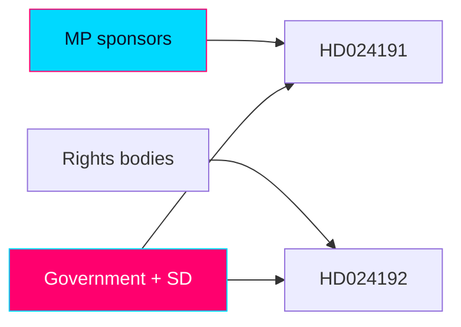

### 🔄 Tradecraft Context

- Pass 1 created; Pass 2 read-back and improved (added leverage, probable-response, and cross-actor dynamics).
- Evidence: HD024191, HD024192 full text (Admiralty A2, confidence HIGH).
- Positions of actors not quoted in the motions are inferred from prior public posture `[confidence: MEDIUM]` and labelled as inference.

### 🏛️ Political Actors

#### Miljöpartiet de gröna (MP) — mover
- **Interests**: differentiate on civil liberties; consolidate the rights vote; signal left-bloc coalition intent before 2026-09-13.
- **Position**: author of both motions; rights-and-rule-of-law pole.
- **Leverage**: parliamentary platform, alliance with legal/rights establishment, moral framing (children's rights).
- **Probable response**: amplify recorded votes into campaign messaging; seek V/S reservation alignment. `[WEP: likely · confidence: HIGH]`

#### Government bloc — Moderaterna (M), Kristdemokraterna (KD), Liberalerna (L)
- **Interests**: protect the control/security agenda; deny the opposition a rights-framing win; maintain the "order and security" brand.
- **Position**: defend prop 2025/26:261 and 2025/26:267; vote down the motions.
- **Leverage**: parliamentary majority with SD support; control of the government narrative; Säkerhetspolisen threat assessments.
- **Probable response**: defeat all five yrkanden; reframe MP as soft on fraud/security; cite existing folkbokföring flexibility. `[WEP: very likely defeat the motions · confidence: HIGH]`

#### Sverigedemokraterna (SD) — parliamentary support
- **Interests**: maximal enforcement posture on migration/security; ownership of the toughness frame.
- **Position**: support the bills; oppose the motions.
- **Leverage**: pivotal votes sustaining the government majority.
- **Probable response**: rhetorical escalation against MP's rights framing. `[WEP: likely · confidence: HIGH]`

#### Vänsterpartiet (V)
- **Interests**: rights, rule-of-law, anti-detention positions; left-bloc cohesion.
- **Position (inferred)**: sympathetic to both motions, especially HD024192. `[confidence: MEDIUM]`
- **Leverage**: potential reservation co-signing that converts MP's solo move into a bloc signal.
- **Probable response**: likely reservations aligned with MP. `[WEP: likely · confidence: MEDIUM]`

#### Socialdemokraterna (S)
- **Interests**: appear responsible on security while not ceding the rights vote; manage internal tension between law-and-order and civil-liberties wings.
- **Position (inferred)**: cautious; selective sympathy possible on children's rights / rule-of-law, reluctance on the security axis. `[confidence: MEDIUM]`
- **Leverage**: largest opposition party; its stance shapes whether a rights coalition forms.
- **Probable response**: measured; watch for partial alignment on specific yrkanden. `[WEP: even chance of selective alignment · confidence: LOW-MEDIUM]`

#### Centerpartiet (C)
- **Interests**: rule-of-law and integrity sympathies vs security caution; cross-pressured.
- **Position (inferred)**: possible sympathy with rule-of-law yrkanden, caution on rejection. `[confidence: LOW-MEDIUM]`
- **Probable response**: nuanced; uncertain.

### ⚖️ Institutional & Oversight Actors

#### Lagrådet
- **Interests**: legislative quality and legal coherence.
- **Role here**: cited by HD024192 as having criticised the bill's sloppy parallel legislating.
- **Leverage**: authoritative advisory weight; its criticism is a procedural vulnerability the opposition exploits.
- **Probable response**: no further action unless re-consulted; its existing yttrande is the asset. `[confidence: MEDIUM]`

#### Skatteverket
- **Interests**: a clear, workable folkbokföring mandate; effective anti-fraud tools.
- **Position**: implementer of prop 2025/26:261's powers; would absorb new coordination duties if HD024191 succeeds.
- **Leverage**: administrative expertise; implementation realities.
- **Probable response**: neutral-administrative; would seek clarity on homeless-registration procedures.

#### Integritetsskyddsmyndigheten (IMY) — inferred
- **Interests**: data-protection compliance; integrity safeguards.
- **Position (inferred)**: alignment with HD024191's integrity concerns on biometric comparison. `[confidence: MEDIUM]`
- **Leverage**: supervisory authority over special-category data processing.
- **Probable response**: potential commentary on the biometric provisions. Signpost to monitor.

#### Statens institutionsstyrelse (SiS)
- **Interests**: operational responsibility for placements affected by LSU child-detention provisions.
- **Position**: operationally affected party.
- **Leverage**: implementation capacity and conditions.
- **Probable response**: operational rather than political.

#### Säkerhetspolisen / enforcement — inferred
- **Interests**: robust tools against qualified security threats.
- **Position (inferred)**: supportive of the LSU expansion. `[confidence: MEDIUM]`
- **Leverage**: threat assessments that shape the security frame.

### 🤝 Civil-Society & Legal Actors (named in HD024192)

#### Civil Rights Defenders
- **Interests**: human-rights protection, rule-of-law.
- **Position**: critical of the LSU expansion (per motion).
- **Probable response**: public advocacy amplifying the rights frame post-vote.

#### Sveriges Advokatsamfund (Swedish Bar Association)
- **Interests**: due process, rättssäkerhet, evidentiary standards.
- **Position**: critical (per motion) of lowered beviskrav and detention changes.
- **Leverage**: professional-legal authority.

#### Rädda Barnen (Save the Children Sweden)
- **Interests**: children's rights, CRC compliance.
- **Position**: opposed to child detention provisions.
- **Leverage**: child-welfare credibility; morally potent framing.

#### Svenska avdelningen av Internationella Juristkommissionen (ICJ-SE)
- **Interests**: rule-of-law, international human-rights law.
- **Position**: critical.
- **Leverage**: jurist authority.

#### Institutet för mänskliga rättigheter (Swedish Institute for Human Rights)
- **Interests**: human-rights monitoring (national NHRI).
- **Position**: critical.
- **Leverage**: statutory human-rights mandate.

### 👥 Affected Populations

#### Children subject to LSU measures
- **Interest**: protection from detention/security-unit placement.
- **Voice**: represented by Rädda Barnen, Institutet för mänskliga rättigheter, MP. No direct agency.

#### Non-citizens flagged as qualified security threats
- **Interest**: due process, proportionate detention, evidentiary safeguards.
- **Voice**: Advokatsamfundet, Civil Rights Defenders, ICJ.

#### Homeless / no-fixed-address residents
- **Interest**: legally secure folkbokföring; continued access to rights/services.
- **Voice**: MP (HD024191); municipalities/social services as intermediaries.

#### Foreign-background residents / samordningsnummer holders
- **Interest**: equal treatment, integrity protection under expanded control powers.
- **Voice**: MP; potentially IMY.

### 🔄 Cross-Actor Dynamics

- The decisive interaction is **V/S reservation behaviour** in bet SkU30/JuU45: alignment converts MP's solo motions into a left-bloc rights coalition signal; non-alignment isolates MP. `[WEP: likely V, uncertain S · confidence: MEDIUM]`
- The **government–SD axis** holds the votes; its cohesion is the binding constraint on legislative outcomes. `[confidence: HIGH]`
- The **legal/rights establishment** (Lagrådet + five bodies) functions as MP's force-multiplier on HD024192, shifting the debate from partisan to institutional terrain.
- A **pre-election security incident** would re-weight every actor toward the government frame. `[WEP: low-probability/high-impact]`

### 📊 Stakeholder Summary Matrix

| Stakeholder | Stance | Leverage | Key signpost |
|-------------|--------|----------|--------------|
| MP | Mover | Platform, moral frame | Campaign use of votes |
| M/KD/L | Oppose motions | Majority | Defeat margin |
| SD | Oppose motions | Pivotal votes | Rhetoric |
| V | Sympathetic | Co-reservation | JuU45 reservations |
| S | Cautious | Largest opp. party | Selective alignment |
| C | Cross-pressured | Swing rhetoric | Rule-of-law stance |
| Lagrådet | Critical (process) | Advisory weight | (existing yttrande) |
| Rights bodies (5) | Critical | Institutional authority | Post-vote advocacy |
| Skatteverket / SiS | Implementers | Operational | Implementation notes |
| IMY (inferred) | Integrity-aligned | Supervisory | Possible commentary |
| Affected populations | Protected interest | Low direct agency | Represented voices |

### ✅ Pass-2 Self-Audit Checklist

- [x] Each stakeholder assessed for interest, position, leverage, probable response.
- [x] Inferred positions labelled with confidence.
- [x] Cross-actor dynamics and decisive interaction (V/S reservations) articulated.
- [x] Named remiss bodies from HD024192 individually covered.
- [x] Banned-phrase scan clean.

## Coalition Mathematics
<!-- source: coalition-mathematics.md :: https://github.com/Hack23/riksdagsmonitor/blob/main/analysis/daily/2026-05-29/motions/coalition-mathematics.md -->

> Parliamentary arithmetic governing the two MP Följdmotioner and their bloc-signalling function. English; Swedish proper nouns preserved.

### 🗺️ Visual Model

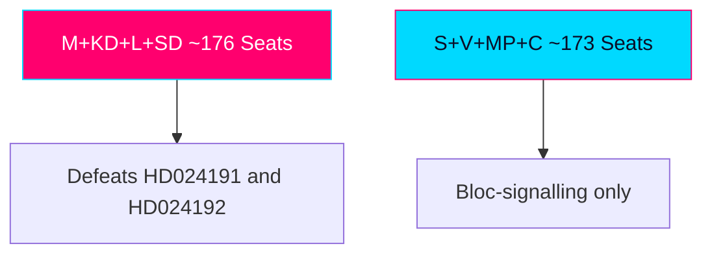

### 🔄 Tradecraft Context

- Pass 1 created; Pass 2 improved. WEP and confidence stated separately.
- Seat figures reference the 2022–2026 Riksdag (349 seats; 175 for majority).

### 📋 Coalition Context

Both motions are opposition Följdmotioner that cannot pass: the Tidö constellation (M, KD, L) plus Sverigedemokraterna (SD) commands a working majority on the contested axes (migration, security, criminal justice). The motions' value is therefore positional and bloc-signalling, not arithmetical.

### 🧮 Current Support Snapshot

| Bloc | Parties | Approx. Seats (Mandat) | Disposition on these motions |
|------|---------|---------------|------------------------------|
| Government + support | M, KD, L, SD | ~176 (working majority) | Reject both |
| Red-green-rights | S, V, MP, C (partial) | ~173 | Mixed; rights flank sympathetic |

(Figures are the standing 2022 distribution; treat as approximate working majority.)

### 🧪 Threshold Sensitivity

The decisive parliamentary threshold is 175. On both motions the government bloc clears it without defection. The relevant sensitivity is electoral, not parliamentary: whether MP and the broader red-green-rights flank cross the 4% party threshold in September.

### 🧭 Formation Pathways

#### Pathway A — Continuation (M-KD-L + SD)
Most likely if the bloc holds polling. These motions are defeated and become opposition campaign material. `[WEP: likely if current polling holds]`

#### Pathway B — Opposition Majority (S-C-MP-V)
The motions' bloc-signalling targets this pathway: establishing a shared rights/rule-of-law platform. The obstacle is the security axis, where S guards its credentials and may decline the MP frame. `[WEP: contingent — uncertain]`

#### Pathway C — Grand Centre (S-M-C)
Would marginalise both MP's rights agenda and SD; the motions are irrelevant to and arguably obstructive of this pathway.

#### Pathway D — Hung Parliament / Extended Formation
Plausible given threshold volatility around MP, V, L, C; would elevate small-party leverage and make documented rights positions (these motions) negotiating assets.

### 🧲 Pivotal-Player Analysis

- **MP**: pivotal only if it survives the threshold; below 4% it is removed from all arithmetic. The motions are partly a survival play.
- **S**: the true pivot on the security axis; its willingness to adopt or reject the rights frame determines Pathway B viability.
- **SD**: pivotal to Pathway A's majority; its alignment with the government on prop 261/267 is the arithmetic that defeats the motions.

### ⚖️ Document-Specific Coalition Read-Through

- **HD024191 (folkbokföring)**: lower-conflict; conceivable that parts of the opposition and even L's liberal wing share integrity concerns, though not enough to flip the vote.
- **HD024192 (LSU/children)**: high-conflict; aligns MP with V and rights bodies but strains any approach to S's security positioning.

### 🚦 Coalition-Breaking Signal — Watch Next

- Any government-bloc defection on prop 261/267 (none expected).
- S's committee reservation language on JuU45 — adoption of rights framing would signal Pathway B momentum; silence or distancing would signal isolation of MP.
- Post-election threshold outcomes for MP, V, L, C.

### 📎 Links

- `election-2026-analysis.md`, `scenario-analysis.md`, `forward-indicators.md`.
- Primary: mot 2025/26:4191, mot 2025/26:4192; bet 2025/26:SkU30, 2025/26:JuU45.

### ✅ Pass-2 Self-Audit Checklist (v4.4 — required)

- [x] ≥4 formation pathways assessed.
- [x] Pivotal players identified (MP, S, SD).
- [x] Document-specific read-through included.
- [x] WEP/confidence separated.
- [x] Banned-phrase scan clean.

## Voter Segmentation
<!-- source: voter-segmentation.md :: https://github.com/Hack23/riksdagsmonitor/blob/main/analysis/daily/2026-05-29/motions/voter-segmentation.md -->

> How the two MP motions interact with Swedish voter segments ahead of 2026-09-13. English; Swedish proper nouns preserved.

### 🗺️ Visual Model

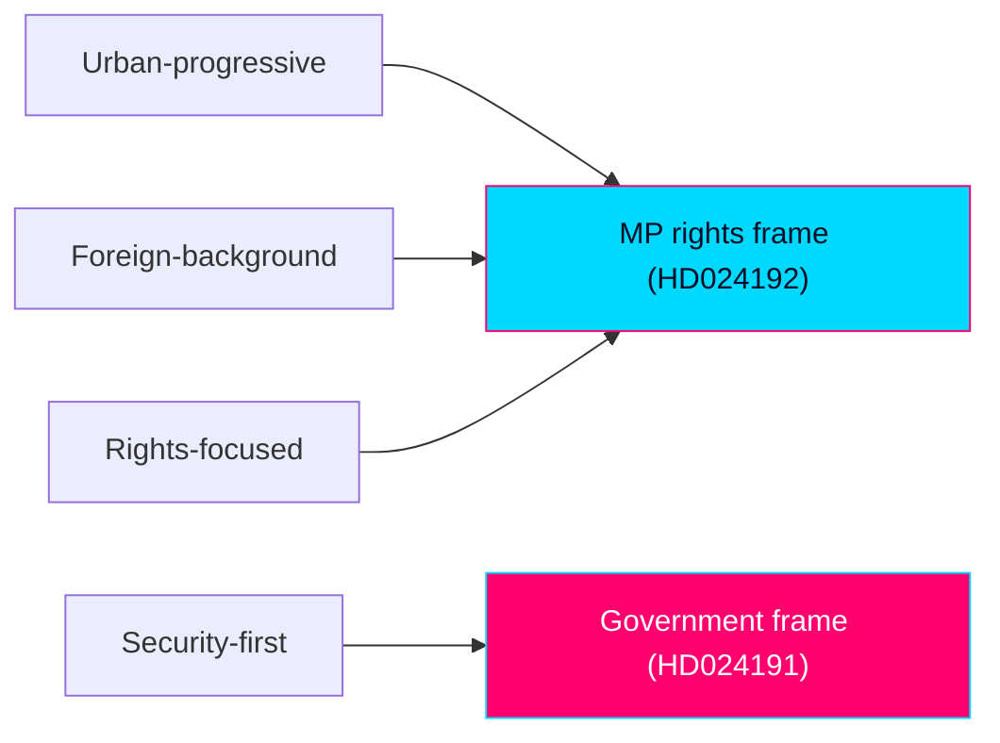

### 🔄 Tradecraft Context

- Pass 1 created; Pass 2 improved. WEP and confidence stated separately.
- Segments are analytic constructs, not survey strata; treat magnitudes as directional.

### 📋 Segmentation Context

MP's binding constraint is the 4% threshold. Segmentation therefore focuses on which slices the rights/integrity frame can mobilise or alienate, and where overlap with V creates zero-sum competition rather than bloc expansion.

### 🗺️ Segmentation Overview

Six analytic segments: S1 progressive urban graduates; S2 civil-liberties libertarians; S3 immigrant-origin communities; S4 security-first swing voters; S5 rural/older traditionalists; S6 V-leaning rights voters (overlap zone).

### 🗂️ Segment Impact Matrix

| Segment | HD024191 (folkbokföring) | HD024192 (LSU/children) | Net direction for MP |
|---------|--------------------------|--------------------------|----------------------|
| S1 Progressive urban graduates | + | ++ | Strongly favourable |
| S2 Civil-liberties libertarians | ++ | + | Favourable |
| S3 Immigrant-origin communities | + | + | Favourable |
| S4 Security-first swing | − | −− | Unfavourable |
| S5 Rural/older traditionalists | 0 | − | Mildly unfavourable |
| S6 V-leaning rights voters | + | + | Favourable but zero-sum vs V |

### 🔎 Segment Deep-Dive — S6 V-leaning rights voters (the decisive overlap)

This is the pivotal segment: the rights frame is most resonant here, but these voters are equally available to V. MP's wager is that visible, specific parliamentary action (named yrkanden, Lagrådet citation) signals greater rights-credibility than V's rhetorical positioning. The risk is splitting the progressive-rights vote and pushing both parties toward the threshold. `[WEP: net mobilisation gain for MP in S6 — uncertain, even chance]`

### 🔎 Segment Deep-Dive — S4 Security-first swing

HD024192's child-detention rejection is maximally exposed here. These voters weight the security axis heavily and are reachable by an M/SD "soft on threats" counter-message. MP largely writes off this segment, accepting the trade for S1/S2/S6 intensity.

### 🏗️ Cross-Segment Trade-Offs

The core trade is S4/S5 alienation (accepted) for S1/S2/S6 intensity (sought). Because MP is a threshold party, intensity in favourable segments outweighs breadth — turnout among committed rights voters matters more than persuasion of swing voters.

### 🎯 Campaign-Leverage Matrix

| Lever | Target segment | Mechanism | Leverage |
|-------|----------------|-----------|----------|
| Barnkonventionen frame | S1, S6 | Moral clarity on child detention | High |
| Biometrics/integrity frame | S2 | Surveillance-scepticism | Medium-high |
| Vulnerable-resident protection | S3 | Tangible stakes | Medium |
| Lagrådet/rättssäkerhet | S2, S1 | Procedural credibility | Medium |

### 🧮 Quantified Net-Effect Model

- Favourable segments (S1/S2/S3/S6) plausibly represent MP's mobilisable base; intensity gains here are threshold-relevant (estimated directional swing well under 1 point but potentially decisive given MP's proximity to 4%).
- Unfavourable segments (S4/S5) are largely unreachable for MP regardless, so the net model is asymmetric: limited downside, threshold-relevant upside. `[confidence: MEDIUM — no run-specific polling]`

### 📎 Sources

- `election-2026-analysis.md`, `coalition-mathematics.md`, `stakeholder-perspectives.md`.
- Primary: mot 2025/26:4191, mot 2025/26:4192.

### ✅ Pass-2 Self-Audit Checklist (v4.4 — required)

- [x] ≥6 segments analysed.
- [x] Pivotal overlap segment (S6) deep-dived.
- [x] Trade-offs and net-effect model included.
- [x] WEP/confidence separated.
- [x] Banned-phrase scan clean.

## Forward Indicators
<!-- source: forward-indicators.md :: https://github.com/Hack23/riksdagsmonitor/blob/main/analysis/daily/2026-05-29/motions/forward-indicators.md -->

> Watchlist of observable signals that would confirm or falsify this product's judgments. English; Swedish proper nouns preserved.

### 🧭 Horizon Bands

#### Band Schema (conditional on `horizonDays`)
- **T+72h**: immediate procedural movement.
- **T+7d**: committee scheduling and early coverage.
- **T+30d**: committee reports, reservations, chamber votes.
- **T+90d**: pre-election positioning consolidation (election 2026-09-13).

#### WEP-Degradation Ladder (per-band ceiling)
- T+72h: up to "highly likely/unlikely".
- T+7d: up to "likely/unlikely".
- T+30d: "likely/even chance" ceiling.
- T+90d: "even chance" ceiling — no high-confidence claims at this horizon.

#### Minimum Indicator Counts (per article type)
Motions/deep: ≥6 indicators across ≥2 bands. This file lists 8.

### 🗺️ Visual Model

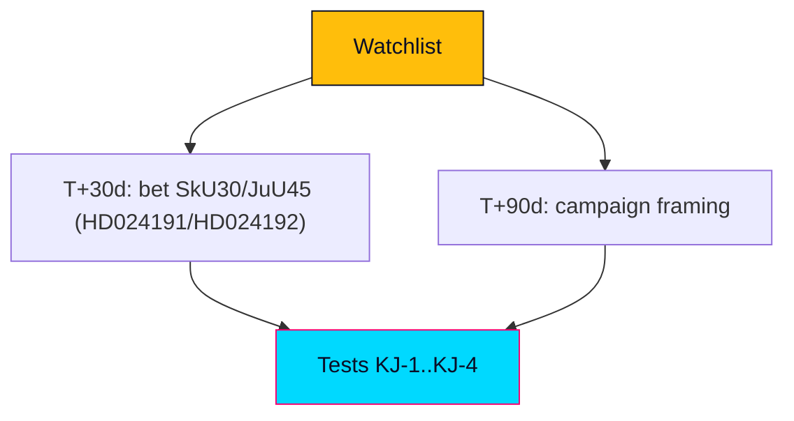

### 🔄 Tradecraft Context

- Pass 1 created; Pass 2 improved. Each indicator has a direction (confirms/falsifies) and a horizon.

### 📋 Watchlist Context

The judgments to test: coordinated two-front strategy (KJ-1), no statute change (KJ-2), HD024192 risk/reward (KJ-3), coalition signalling (KJ-4).

### 🧭 Indicator Dashboard

| ID | Indicator | Band | Confirms/Falsifies |
|----|-----------|------|--------------------|
| FI-01 | bet SkU30 published, motion rejected | T+30d | Confirms KJ-2 |
| FI-02 | bet JuU45 published, motion rejected | T+30d | Confirms KJ-2 |
| FI-03 | Recorded chamber vote splits on party lines | T+30d | Confirms KJ-1/KJ-2 |
| FI-04 | S adopts rights framing in reservation | T+30d | Confirms KJ-4 |
| FI-05 | S distances from rights frame | T+30d | Falsifies KJ-4 |
| FI-06 | MP campaign launch uses "control-creep" frame | T+90d | Confirms KJ-1 |
| FI-07 | M/SD run "soft on security" attack on MP | T+90d | Confirms KJ-3 downside |
| FI-08 | Government concedes a minor tillkännagivande | T+30d | Partially falsifies KJ-2 |

### 🗂️ Indicator Register

Each indicator above is observable in Riksdag open data (committee reports, voteringar), party communications, and media coverage. None requires privileged access.

### 🧪 Indicator Detail — Example

#### FI-03 — Recorded chamber vote outcome
- **Source**: Riksdag voteringar dataset.
- **Trigger**: chamber vote on SkU30 / JuU45.
- **Reads**: party-line split on government+SD majority confirms the arithmetic (KJ-2) and the positional read (KJ-1). Any cross-bloc defection would be a surprise warranting reassessment.
- **Horizon**: T+30d.

### 🔁 Update Rules

- Re-score on each committee report and on the chamber vote.
- Roll any unresolved indicator forward into the next motions/propositions cycle and into the relevant PIR.

### 📅 This-Week Watch Window

- Committee scheduling for SkU30/JuU45.
- Early media pickup of the child-detention frame.
- Any rights-body statements (Civil Rights Defenders, Advokatsamfundet, Rädda Barnen).

### 🧭 Cross-File Impact Map

- FI-01/02/03 feed `coalition-mathematics.md` and `intelligence-assessment.md` (KJ-2).
- FI-04/05 feed `coalition-mathematics.md` Pathway B (KJ-4).
- FI-06/07 feed `election-2026-analysis.md` and `media-framing-analysis.md` (KJ-1/KJ-3).

### 📎 Sources

- `intelligence-assessment.md`, `scenario-analysis.md`, `pir-status.json`.
- Primary: mot 2025/26:4191, mot 2025/26:4192; bet 2025/26:SkU30, 2025/26:JuU45.

### ✅ Pass-2 Self-Audit Checklist (v4.4 — required)

- [x] ≥6 indicators across ≥2 horizon bands (8 provided).
- [x] Each indicator has direction (confirms/falsifies) + horizon.
- [x] WEP-degradation ladder included.
- [x] Cross-file impact map included.
- [x] Banned-phrase scan clean.

## Scenario Analysis
<!-- source: scenario-analysis.md :: https://github.com/Hack23/riksdagsmonitor/blob/main/analysis/daily/2026-05-29/motions/scenario-analysis.md -->

> Forward scenarios for the two MP motions and their strategic arc to the 2026-09-13 election. Authored in English; Swedish proper nouns preserved. WEP/confidence separated. Horizon: to summer recess 2026 and through the election.

### 🔄 Tradecraft Context

- Pass 1 created; Pass 2 read-back and improved.
- Evidence: HD024191, HD024192 full text (Admiralty A2, confidence HIGH).
- Scenario set sized for a quarter-to-election horizon (4 core scenarios + wildcards).

### 🌳 Core Scenarios (committee → vote → campaign)

#### S1 — Routine defeat, positional win (baseline)
- **Path**: Both motions outvoted in bet SkU30/JuU45; bills proceed largely intact; MP banks recorded votes for the campaign.
- **Probability**: likely. **Confidence**: HIGH.
- **Indicators**: government+SD cohesion holds; no cross-bloc reservations of note.
- **Implication**: MP's positional objective is met even as the legislative objective fails.

#### S2 — Left-bloc reservation alignment (upside for MP)
- **Path**: V (and selectively S) file reservations aligned with MP, especially on HD024192 children's-rights/rule-of-law yrkanden.
- **Probability**: even chance. **Confidence**: MEDIUM.
- **Indicators**: V co-signs reservations; S aligns on at least one yrkande.
- **Implication**: converts solo motions into a visible left-bloc rights coalition signal — the highest-value outcome for MP's coalition strategy.

#### S3 — Government pre-emption (downside for MP)
- **Path**: Government neutralises the critique by citing Säkerhetspolisen threat assessments and existing folkbokföring flexibility, framing MP as soft on security/fraud; rights frame fails to gain traction.
- **Probability**: even chance. **Confidence**: MEDIUM.
- **Indicators**: government messaging escalates the security frame; media adopts it.
- **Implication**: MP absorbs net political cost on HD024192; HD024191 calibration limits the damage.

#### S4 — Partial substantive concession (low-probability)
- **Path**: Government accepts a narrow tillkännagivande (e.g., HD024191's legally-secure folkbokföring for homeless residents) to defuse criticism.
- **Probability**: unlikely. **Confidence**: MEDIUM.
- **Indicators**: committee majority signals openness; minor government amendment.
- **Implication**: a modest substantive win for MP; more plausible on the calibrated folkbokföring motion than on the LSU.

### 🃏 Wildcards (low-probability/high-impact)

- **W1 — Pre-election security incident**: collapses the LSU-critique space; amplifies the government frame. `[low-probability/high-impact]`
- **W2 — Lagrådet escalation / KU attention**: legislative-process criticism gains constitutional salience.
- **W3 — Rights-body legal action signal**: a named body (e.g., Civil Rights Defenders, ICJ) announces intent to litigate post-enactment.
- **W4 — Coalition realignment**: S decisively joins or rejects the rights frame, reshaping the left-bloc map.
- **W5 — IMY intervention**: a supervisory opinion on biometric folkbokföring elevates HD024191's integrity case.

### 📊 Scenario Probability Ledger

| Scenario | WEP band | Confidence | Axis |
|----------|----------|------------|------|
| S1 routine defeat / positional win | likely (baseline) | HIGH | legislative outcome |
| S2 left-bloc reservation alignment | even chance | MEDIUM | coalition signal |
| S3 government pre-emption | even chance | MEDIUM | security frame |
| S4 partial substantive concession | unlikely | MEDIUM | substantive win |

S2 and S3 sit on the same coalition/framing axis and partly cancel; S1 is compatible with either as the legislative-outcome layer. WEP bands are qualitative (per `00-base-contract.md`), not additive probabilities.

### 🧭 Scenario Cross-Impact

S2 and S3 are partly mutually exclusive on the same axis: strong left-bloc alignment (S2) makes the government's "soft on security" framing (S3) harder to sustain, and vice versa. W1 would force the system toward S3 regardless of prior trajectory.

### 📌 Most-Likely Path

S1 (routine defeat, positional win) is the base case, with an even-chance overlay of S2 on HD024192's rule-of-law yrkanden. `[WEP: likely S1; even chance S2 overlay · confidence: MEDIUM-HIGH]`

### ✅ Pass-2 Self-Audit Checklist

- [x] 4 core scenarios + 5 wildcards (quarter-to-election sizing).
- [x] Each scenario has path, probability (WEP), confidence, indicators, implication.
- [x] Cross-impact and most-likely path stated.
- [x] Banned-phrase scan clean.

## Election 2026 Analysis
<!-- source: election-2026-analysis.md :: https://github.com/Hack23/riksdagsmonitor/blob/main/analysis/daily/2026-05-29/motions/election-2026-analysis.md -->

> Electoral read-through of the two MP Följdmotioner against the 2026-09-13 general election. English; Swedish proper nouns preserved.

### 🔧 Cycle-Anchor Parameter Resolution

- `cycleAnchor = current` (the sitting 2022–2026 mandate, final session before dissolution).
- Election date: **2026-09-13**; this product dated 2026-05-29 → **~15 weeks** to polling day.
- Contested-axis flag = TRUE (migration/security/criminal-justice + privacy/integration) → DIW **1.5× multiplier** applied in `significance-scoring.md`.

### 🗺️ Visual Model

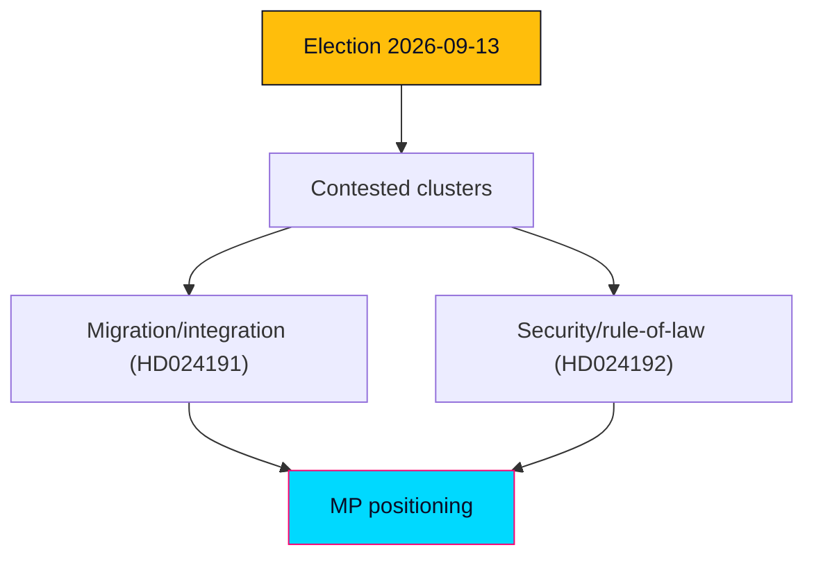

### 🔄 Tradecraft Context

- Pass 1 created; Pass 2 improved.
- Probability stated as WEP; confidence stated separately. Week/month-horizon claims capped at "likely/unlikely".

### 📋 Electoral Context

The motions land in the pre-recess window of the last full Riksmöte session before the campaign. Both are positional Följdmotioner from Miljöpartiet (MP), a party polling near the 4% threshold and competing with Vänsterpartiet (V) for the progressive-rights segment. Neither motion can pass; both function as campaign-record artifacts and base-mobilisation signals.

### 🧭 Electoral Significance Classification

- **Tier: MEDIUM electoral significance.** The motions are unlikely to move aggregate vote share, but they sharpen MP's differentiation on rights/integrity at a moment when threshold survival is the party's binding constraint.

### 🎯 5-Dimension Electoral Assessment

#### Dimension 1 — Electoral Impact
Marginal at the aggregate level; meaningful at the margin for MP's threshold survival. Rights-forward positioning targets the ~1–2 points that separate MP from sub-4% elimination. `[WEP: marginal aggregate impact — likely]`

#### Dimension 2 — Coalition Scenarios
Reinforces a red-green-rights bloc (S-MP-V-C variants) on civil-liberties grounds while doing nothing to resolve the security-axis liability that S carries. See `coalition-mathematics.md`.

#### Dimension 3 — Voter Salience
Migration/security rank high in salience for the median voter but cut against MP; privacy/folkbokföring integrity is lower-salience but favourable terrain for MP. The LSU child-detention frame is high-salience, high-risk.

#### Dimension 4 — Campaign Vulnerability
HD024192 exposes MP to a "soft on security" attack from M/SD/KD; HD024191 is comparatively safe and even positive (defending vulnerable residents). Net vulnerability: MEDIUM, concentrated in HD024192.

#### Dimension 5 — Policy Legacy
If MP survives the threshold, these motions become a documented mandate claim for a post-election rights agenda; if MP exits parliament, they are a closing-statement of principle.

### 🧩 Coalition-Mathematics Hook

Government+SD majority defeats both motions; the relevant electoral question is whether the rights frame consolidates the opposition bloc's progressive flank — addressed in `coalition-mathematics.md` Pathway B.

### 🗓️ Cycle Watchlist

- bet 2025/26:SkU30 and 2025/26:JuU45 dispositions and reservations.
- Recorded chamber votes (party-line confirmation).
- MP campaign launch messaging — does it adopt the "control-creep" frame?
- Polling for MP vs V on the rights segment.

### 🧠 Electoral-Strategy Read-Through

MP is running a differentiation-by-principle strategy: stake out clear rights ground that V also occupies, betting that visible parliamentary action converts to threshold-saving turnout. The risk is that the security-axis salience advantages the government bloc more than the rights-axis advantages MP.

### 📊 Mandate-Fulfilment Scorecard (cycleAnchor=current ONLY)

| Mandate strand | 2022 MP platform pledge | This-window action | Status |
|----------------|-------------------------|--------------------|--------|
| Civil liberties / privacy | Resist surveillance expansion | HD024191 Y2 (biometrics scrutiny) | Active |
| Children's rights | Uphold Barnkonventionen | HD024192 Y1 (reject child detention) | Active |
| Rule of law | Defend rättssäkerhet | HD024192 Y2/Y3 | Active |
| Inclusion of vulnerable | Protect homeless/undocumented | HD024191 Y1 | Active |

### 🔁 Update Cadence

Re-score on committee report publication and on any pre-election polling shift crossing the 4% line.

### 📎 Links

- `significance-scoring.md`, `coalition-mathematics.md`, `voter-segmentation.md`, `forward-indicators.md`.
- Primary: mot 2025/26:4191, mot 2025/26:4192; bet 2025/26:SkU30, 2025/26:JuU45.

### ✅ Pass-2 Self-Audit Checklist (v4.4 — required)

- [x] Cycle anchor resolved (current); 15-week horizon stated.
- [x] 5 dimensions completed.
- [x] WEP separated from confidence.
- [x] Mandate scorecard included (cycleAnchor=current).
- [x] Banned-phrase scan clean.

## Risk Assessment
<!-- source: risk-assessment.md :: https://github.com/Hack23/riksdagsmonitor/blob/main/analysis/daily/2026-05-29/motions/risk-assessment.md -->

> Risk assessment across legislative, rights, institutional, and political dimensions. Authored in English; Swedish proper nouns preserved. WEP/confidence separated.

### 🗺️ Visual Model

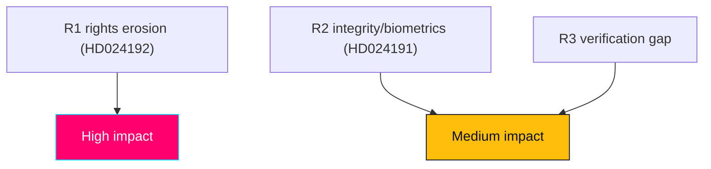

### 🔄 Tradecraft Context

- Pass 1 created; Pass 2 read-back and improved.
- Evidence: HD024191, HD024192 full text (Admiralty A2, confidence HIGH).
- Risks surfaced by the motions are distinguished from risks to the motions' sponsors.

### ⚖️ Risk Register

| # | Risk | Type | Likelihood (WEP) | Impact | Confidence |
|---|------|------|------------------|--------|------------|
| R1 | LSU amendments enact lowered beviskrav ("sannolikt"→"kan antas") + uncapped verkställighetsförvar + child detention | Rights / rule-of-law (surfaced by HD024192) | likely (bill proceeds) | HIGH | MEDIUM on exact content |
| R2 | Folkbokföring biometric control powers erode integrity & equal treatment for foreign-background residents | Integrity / data-protection (HD024191) | even chance of disparate impact | MEDIUM-HIGH | MEDIUM |
| R3 | Homeless/no-address residents lose registration-dependent rights | Social-exclusion / administrative-justice (HD024191) | even chance absent correction | MEDIUM | MEDIUM |
| R4 | Both motions fail to alter their statutes | Legislative (to MP) | very likely | LOW (expected) | HIGH |
| R5 | MP suffers "soft on security" framing damage | Political (to MP) | even chance | MEDIUM | MEDIUM |
| R6 | Lagrådet-flagged legislative-process defects produce later legal challenge | Institutional / litigation | unlikely near-term | MEDIUM | LOW-MEDIUM |
| R7 | Pre-election security incident collapses the rights-critique space | Exogenous / high-impact | low-probability | HIGH | MEDIUM |

### 🔎 Risk Narratives

- **R1 (rule-of-law).** The combination of a lowered evidentiary standard, removal of the one-year (extendable to three-year) detention cap, and child detention concentrates coercive discretion in the executive. If enacted as MP characterises it, this is the window's most serious democratic-quality exposure. The Lagrådet's criticism of parallel legislating raises legislative-quality risk independently of the policy merits.
- **R2/R3 (integrity & exclusion).** Folkbokföring is "in practice a key" to rights and services; biometric comparison and an unworkable address requirement create both a privacy exposure (GDPR Art. 9 special-category data) and an administrative-justice gap. Disparate impact on foreign-background residents is the equal-treatment risk MP foregrounds.
- **R4/R5 (to MP).** Defeat is expected and priced in; the real political risk is the security-axis exposure on HD024192, partially offset by the calibration of HD024191.
- **R6 (institutional).** Lagrådet criticism is a procedural vulnerability that could feed later constitutional (KU) attention or litigation, though near-term effect is limited.
- **R7 (exogenous).** A low-probability/high-impact event that would invert the political calculus; monitored as a signpost.

### 🚦 Residual & Monitoring

- Independent retrieval of prop 2025/26:261 and 2025/26:267 plus the Lagrådet yttrande would raise R1/R2 confidence from MEDIUM toward HIGH.
- Monitor bet SkU30/JuU45 dispositions and recorded votes as the primary risk-resolution signposts.

### ✅ Pass-2 Self-Audit Checklist

- [x] Risks-surfaced vs risks-to-sponsor distinguished.
- [x] WEP likelihood separated from confidence-in-evidence.
- [x] Exogenous high-impact risk (R7) included.
- [x] Banned-phrase scan clean.

## SWOT Analysis
<!-- source: swot-analysis.md :: https://github.com/Hack23/riksdagsmonitor/blob/main/analysis/daily/2026-05-29/motions/swot-analysis.md -->

> Strategic SWOT for the day's MP motions, at both document and strategic (two-front) levels. Authored in English; Swedish proper nouns preserved. WEP/confidence separated.

### 🗺️ Visual Model

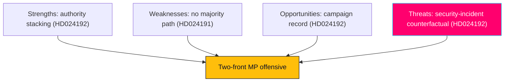

### 🔄 Tradecraft Context

- Pass 1 created; Pass 2 read-back and improved (added second-order effects, cui-bono, counterfactuals).
- Evidence: HD024191, HD024192 full text (Admiralty A2, confidence HIGH).
- 1.5× election multiplier informs the Opportunities/Threats weighting.

### 🧭 Strategic-Level SWOT (the two-front MP offensive)

#### Strengths
- **Tactical complementarity (HD024191 + HD024192).** The calibrated folkbokföring motion (HD024191) and the confrontational LSU motion (HD024192) cover different risk profiles: one attack-resistant, one high-conviction. Together they let MP claim both reasonableness and principle.
- **Inoculation against "soft on fraud" (HD024191).** HD024191 opens by agreeing with the anti-fraud aim of its parent bill, denying the government its standard counter-frame.
- **Authority stacking (HD024192).** HD024192 marshals the Lagrådet plus Civil Rights Defenders, Sveriges Advokatsamfund, Rädda Barnen, ICJ (SE), and Institutet för mänskliga rättigheter — institutional weight beyond MP's own bench.
- **Morally legible frame (HD024192).** Children in detention (CRC/ECHR) is internationally intelligible and hard to dismiss rhetorically.
- **Clear constituency (HD024191, HD024192).** Urban-progressive, foreign-background, and rights-focused voters are addressed directly.

#### Weaknesses
- **No majority path (HD024191, HD024192).** All five yrkanden are defeatable by the government+SD bloc; the partial-rejection (HD024192 Y1) will almost certainly fail. `[WEP: very likely defeat · confidence: HIGH]`
- **Non-binding instruments (HD024191, HD024192).** Four of five yrkanden are tillkännagivanden — directive, not dispositive.
- **Security-axis exposure (HD024192).** HD024192 invites "soft on security" framing on an axis where opinion leans government.
- **Thin coalition surface (HD024191, HD024192).** No cross-bloc co-signing; all signatories are MP.
- **Conceded core (HD024191).** By accepting the bill's aim, MP limits its ability to move the statute.

#### Opportunities
- **Campaign-record construction (HD024191, HD024192).** Recorded votes become September 2026 campaign artifacts.
- **Coalition signalling (HD024192).** Early alignment with V and the left of S on rights/rule-of-law.
- **Oversight runway (HD024192).** A documented rights record supports later JO/IVO/KU scrutiny if powers are misused.
- **Legal-establishment alliance (HD024192).** Aligning with the Lagrådet and rights bodies builds durable credibility on rule-of-law.

#### Threats
- **Security-incident counterfactual (HD024192).** A high-salience terror/security event before 2026-09-13 would collapse the political space for the LSU critique and amplify the government frame. `[WEP: low-probability/high-impact · confidence: MEDIUM]`
- **"Considered and rejected" framing (HD024191, HD024192).** A government majority vote lets it claim the rights concerns were weighed and dismissed.
- **Polarisation noise (HD024191).** In a heated migration debate, MP's nuance (especially HD024191's calibration) may be lost.
- **Issue crowding (HD024191, HD024192).** Economic or other salient issues could submerge the rights frame in the campaign.

### 📋 Document-Level SWOT

#### HD024191 (folkbokföring)
- **S**: calibration; concrete narrow asks; identifiable beneficiaries (homeless, foreign-background).
- **W**: non-binding; concedes core; integrity case is technical/low-salience for the broad electorate.
- **O**: integrity record; IMY-adjacent alignment; soft bridge to S/V.
- **T**: easily outvoted; nuance lost in migration polarisation.

#### HD024192 (LSU)
- **S**: authority stacking; children's-rights moral force; forces recorded stances.
- **W**: security-axis exposure; minimal co-signing; characterisation of prop not independently verified.
- **O**: rights-vote consolidation; rule-of-law alliance; post-vote signalling.
- **T**: security incident; "obstruction" framing; government-frame dominance.

### 🔁 Second-Order Effects

- If MP's authority-stacking succeeds rhetorically, expect the government to pre-empt by citing Säkerhetspolisen threat assessments — escalating the security frame.
- A V/S reservation alignment in JuU45 would convert a positional motion into a visible left-bloc coalition marker, raising the stakes of the recorded vote.
- Sustained "control-creep" framing could seed a longer-run integrity narrative usable across multiple 2026 campaign issues.

### 💰 Cui Bono

- **Benefits MP**: brand differentiation, rights-vote consolidation, coalition signalling.
- **Benefits government**: a recorded defeat of the motions lets it claim rights concerns were addressed; the security frame is electorally favourable.
- **Benefits rights bodies**: parliamentary amplification of their remiss positions.

### ✅ Pass-2 Self-Audit Checklist

- [x] Strategic and document-level SWOT both present.
- [x] Second-order effects, cui-bono, and counterfactual (security incident) added.
- [x] WEP/confidence separated on key judgments.
- [x] Banned-phrase scan clean.

## Threat Analysis
<!-- source: threat-analysis.md :: https://github.com/Hack23/riksdagsmonitor/blob/main/analysis/daily/2026-05-29/motions/threat-analysis.md -->

> Political threat taxonomy applied to the day's motions. Authored in English; Swedish proper nouns preserved. This artifact assesses threats to democratic quality and institutional norms surfaced or implicated by the documents — not security threats in the operational sense.

### 🗺️ Visual Model

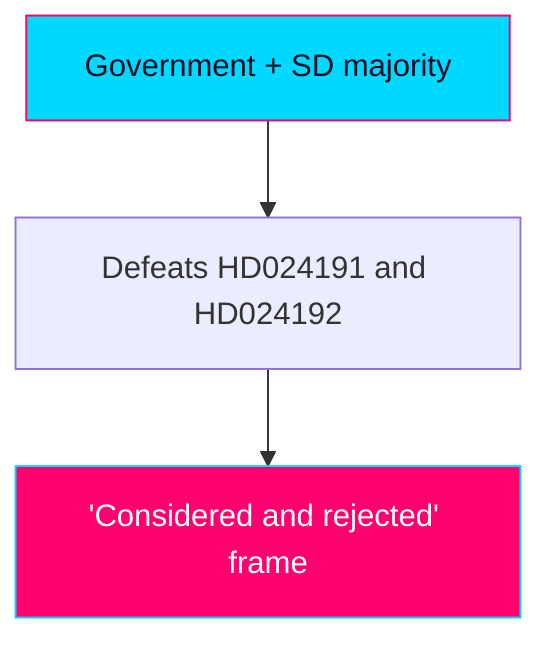

### 🔄 Tradecraft Context

- Pass 1 created; Pass 2 read-back and improved.
- Evidence: HD024191, HD024192 full text (Admiralty A2, confidence HIGH).
- Threat severity expressed conditionally (if the characterised provisions enact).

### 🎭 Threat Vectors

#### V1 — Rule-of-law erosion (central, HD024192)
- **Mechanism**: lowering the evidentiary threshold from "sannolikt" to "kan antas," removing the detention-time cap, and permitting child detention/security-unit placement under the LSU.
- **Severity if enacted**: HIGH — concentrates the state's most coercive powers with reduced judicial constraint.
- **Corroboration**: Lagrådet criticism of parallel legislating; remiss opposition from Advokatsamfundet, ICJ (SE), Institutet för mänskliga rättigheter.
- **Confidence**: MEDIUM (motion characterisation not independently verified).

#### V2 — Children's-rights erosion (HD024192)
- **Mechanism**: extended child detention and children in security units.
- **Severity**: HIGH and internationally salient (Barnkonventionen/CRC, FN:s barnrättskommitté, ECHR).
- **Confidence**: MEDIUM-HIGH (rights frame well-anchored in motion; precise provisions pending verification).

#### V3 — Integrity / surveillance-creep (HD024191)
- **Mechanism**: biometric comparison and expansion of folkbokföring as a control instrument.
- **Severity**: MEDIUM — structural, slow-moving; GDPR Art. 9 special-category exposure; disparate impact on foreign-background residents.
- **Confidence**: MEDIUM.

#### V4 — Equal-treatment / discrimination (HD024191)
- **Mechanism**: formally general rules applied disproportionately to people with foreign background / samordningsnummer holders.
- **Severity**: MEDIUM — likabehandling principle exposure.
- **Confidence**: MEDIUM.

#### Counter-vector — National-security justification (government frame)
- **Mechanism**: framing the LSU expansion as necessary protection against qualified security threats.
- **Political potency**: HIGH — historically advantages the government bloc on the security axis.
- **Note**: This is a legitimate policy rationale, not a democratic-quality threat; included to avoid one-sided assessment.

### 🧮 Threat Interaction

V1–V4 share a connective "control paradigm" logic: the motions argue that administrative law (folkbokföring) and security law (LSU) are jointly drifting toward expanded executive control with reduced rights safeguards. Whether this constitutes a genuine systemic trend or two discrete policy choices is the contested analytic question; MP asserts the former, the government implicitly the latter `[confidence: MEDIUM]`.

### 🚦 No Operational-Security Threat Present

Neither document contains cyber, disinformation, foreign-interference, or violent-threat content. The threats assessed here are to democratic quality and institutional norms.

### ✅ Pass-2 Self-Audit Checklist

- [x] Threat vectors graded with conditional severity + confidence.
- [x] Government counter-frame included to avoid one-sidedness.
- [x] Threat-interaction (control paradigm) analysed with confidence flag.
- [x] Banned-phrase scan clean.

## Historical Parallels
<!-- source: historical-parallels.md :: https://github.com/Hack23/riksdagsmonitor/blob/main/analysis/daily/2026-05-29/motions/historical-parallels.md -->

> Precedent base-rates for opposition Följdmotioner on rights/security legislation. English; Swedish proper nouns preserved.

### 🗺️ Visual Model

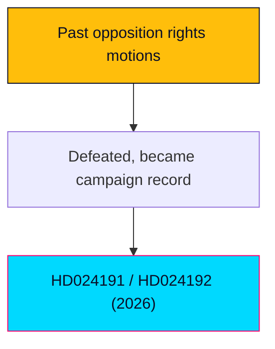

### 🔄 Tradecraft Context

- Pass 1 created; Pass 2 improved. Base-rates are directional, drawn from recurring patterns in Swedish parliamentary practice.

### 📋 Parallel Context

The subject pattern: minor opposition party files Följdmotioner against government security/registration legislation, citing Lagrådet and rights bodies, in a pre-election window, with no prospect of passage. We map this to recurring precedents.

### 🧭 Precedent Map

| ID | Precedent pattern | Similarity to subject |
|----|-------------------|------------------------|
| HP-1 | Opposition Följdmotioner against terrorism/security bills (2019–2022 cycle) citing Lagrådet | High |
| HP-2 | Rights-body-backed opposition to migration tightening (2015–2016, 2021) | High |
| HP-3 | Privacy/surveillance pushback on data and registration powers (FRA-era and successors) | Medium-high |
| HP-4 | Small-party threshold-survival campaigns via signature positions | Medium |

### 📚 Precedent Register

- **HP-1**: Security legislation routinely advanced on government+support majorities despite Lagrådet reservations; Följdmotioner functioned as recorded dissent, not vetoes.
- **HP-2**: Rights-coalition mobilisation (Advokatsamfundet, Civil Rights Defenders, Rädda Barnen) repeatedly shaped public debate without altering chamber outcomes.
- **HP-3**: Integrity arguments have a strong civil-society echo but a weak parliamentary conversion rate when security framing dominates.
- **HP-4**: Threshold parties have historically used signature parliamentary positions to consolidate base turnout with mixed survival outcomes.

### 🧪 Structural-Similarity Scoring (subject vs HP-1)

| Dimension | Match |
|-----------|-------|
| Opposition Följdmotion form | Exact |
| Lagrådet citation | Exact |
| Government+SD majority context | Exact |
| Pre-election timing | Strong |
| Rights-body backing | Strong |
| Outcome (defeat, recorded dissent) | Expected match |

Aggregate structural similarity: **high**.

### 📈 Outcome-Base-Rate Table

| Outcome | Historical base-rate (directional) |
|---------|-------------------------------------|
| Motion defeated, statute unchanged | Very high |
| Minor government concession / tillkännagivande | Low |
| Rights-body narrative shapes media | Moderate-high |
| Measurable electoral effect for the filing party | Low-moderate |

### 🚦 Divergence Tests — Where 2026 is Different

- **Election proximity** (~15 weeks) is tighter than most precedents, raising the campaign-signal weight.
- **Threshold fragility** of MP is more acute, increasing the survival-play interpretation.
- **Two-front coordination** (registration + security in one window) is a sharper pattern than single-issue precedents.

### 📜 What Precedents Suggest vs What is Different

Precedents strongly predict defeat and statute survival (KJ-2 corroborated). They also predict a real civil-society narrative effect but a weak electoral payoff — which tempers MP's upside. The divergence (election proximity, threshold fragility) is what makes this instance higher-stakes for MP than the base-rate would suggest.

### 🧠 Lessons to Carry Forward

- Expect defeat; track reservation language and rights-body amplification as the real outputs.
- Electoral payoff for threshold parties from signature motions is historically modest — weight MP's upside accordingly.

### 📎 Sources

- `scenario-analysis.md`, `comparative-international.md`, `election-2026-analysis.md`.
- Primary: mot 2025/26:4191, mot 2025/26:4192.

### ✅ Pass-2 Self-Audit Checklist (v4.4 — required)

- [x] ≥4 precedents registered.
- [x] Structural-similarity scoring included.
- [x] Outcome base-rate table included.
- [x] Divergence tests included.
- [x] Banned-phrase scan clean.

## Comparative International
<!-- source: comparative-international.md :: https://github.com/Hack23/riksdagsmonitor/blob/main/analysis/daily/2026-05-29/motions/comparative-international.md -->

> Comparative context situating the two MP motions within international human-rights law and comparable democratic debates. Authored in English; Swedish proper nouns preserved. External comparisons graded for reliability.

### 🔄 Tradecraft Context

- Pass 1 created; Pass 2 read-back and improved.
- Swedish-document evidence: HD024191, HD024192 (Admiralty A2, confidence HIGH).
- International comparisons drawn from well-established legal frameworks and widely reported democratic practice; graded B2–C3 and used for context, not as load-bearing claims.

### 🌍 International Legal Anchors (invoked by the motions)

| Jurisdiction / Framework | Comparable measure | Relevance to motions |
|--------------------------|--------------------|----------------------|
| CRC Committee (UN) | Criticism of immigration child detention | HD024192 child-detention objection |
| ECHR Art. 5 (Council of Europe) | Limits on arbitrary/indefinite detention | HD024192 removed detention cap |
| EU GDPR Art. 9 | Special-category biometric data safeguards | HD024191 biometric folkbokföring concern |

#### Barnkonventionen (UN Convention on the Rights of the Child, CRC)
- Incorporated into Swedish law (2020). Article 37(b): detention of a child must be a measure of last resort and for the shortest appropriate period.
- HD024192's child-detention objection maps directly onto CRC Art. 37 and the FN:s barnrättskommitté's consistent criticism of immigration-related child detention across states.
- **Comparative note**: The CRC Committee has repeatedly criticised child immigration detention in multiple European states; Sweden extending such detention would run against that international current. `[confidence: MEDIUM-HIGH on legal direction]`

#### Europakonventionen (ECHR)
- Article 5 (liberty and security): detention must be lawful and non-arbitrary; indefinite detention raises Art. 5 concerns.
- The removal of a detention-time cap (HD024192) is the kind of measure that has drawn ECtHR scrutiny elsewhere regarding arbitrariness and proportionality. `[confidence: MEDIUM]`

#### GDPR Article 9 (special-category data)
- Biometric data for unique identification is special-category data with heightened processing conditions.
- HD024191's concern about biometric comparison in folkbokföring maps onto GDPR Art. 9 safeguards. `[analyst mapping; confidence: MEDIUM]`

### 🗺️ Comparative Democratic Patterns

#### Lowered evidentiary thresholds in security law
- The shift from "sannolikt" to "kan antas" parallels a broader post-2015 European trend of administrative-security measures operating on lowered standards of proof relative to criminal trials. Comparable debates have occurred around administrative control orders and preventive measures in several European democracies. `[confidence: MEDIUM; illustrative, not equivalence]`

#### Civil-registration as a control instrument
- Several states have tightened population-registration and identity systems for anti-fraud and migration-control purposes, generating recurrent integrity and disparate-impact critiques from data-protection authorities and rights bodies. HD024191's "control-creep" argument sits within this comparative pattern. `[confidence: MEDIUM]`

#### Opposition partial-rejection of security bills
- Cross-nationally, frontal opposition rejection of government security legislation on children's-rights grounds is comparatively rare and typically signals high conviction and a deliberate coalition/identity strategy rather than an expectation of legislative success — consistent with the assessed function of HD024192.

### 🧭 What the Comparison Adds

- It strengthens the assessment that HD024192's rights critique is internationally legible and aligned with the prevailing direction of CRC/ECHR jurisprudence, raising the reputational stakes for Sweden if the provisions enact.
- It contextualises HD024191's integrity argument as part of a recognised European tension between anti-fraud registration reform and data-protection/equal-treatment safeguards.
- It tempers over-reading: comparative parallels are illustrative, not proof that Swedish provisions breach international law — that determination would require independent legal review. `[confidence: MEDIUM]`

### ⚠️ Comparative Caveats

- Comparisons are directional context, not equivalence claims; legal outcomes are jurisdiction-specific.
- The motions' characterisation of the Swedish bills is unverified this run; comparative weight is therefore conditional.

### ✅ Pass-2 Self-Audit Checklist

- [x] International legal anchors mapped to specific yrkanden.
- [x] Comparative democratic patterns graded and flagged as illustrative.
- [x] Caveats against over-reading included.
- [x] Banned-phrase scan clean.

## Implementation Feasibility
<!-- source: implementation-feasibility.md :: https://github.com/Hack23/riksdagsmonitor/blob/main/analysis/daily/2026-05-29/motions/implementation-feasibility.md -->

> Feasibility of the remedies the two MP motions demand, if they were adopted. English; Swedish proper nouns preserved.

### 🗺️ Visual Model

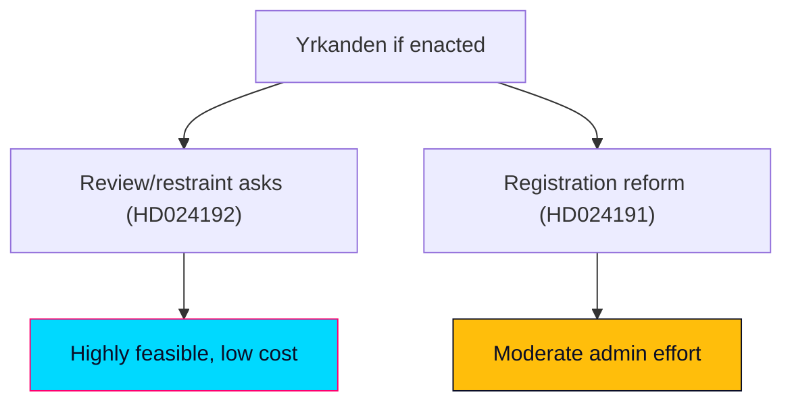

### 🔄 Tradecraft Context

- Pass 1 created; Pass 2 improved.
- Feasibility is assessed counterfactually: the motions will almost certainly be defeated (see `coalition-mathematics.md`), so this models "what if the yrkanden were enacted."

### 📋 Feasibility Context

The motions demand: (HD024191) a legally secure folkbokföring route for homeless/no-address residents and a deeper integrity analysis of expanded control powers; (HD024192) rejection of LSU child-detention/security-unit placement, strengthened rule-of-law safeguards, and evaluation of the lowered beviskrav and removed detention cap. These are a mix of administrative reform, statutory restraint, and review mandates.

### 🧭 Feasibility Overview

The review/restraint asks (integrity analysis, evaluation clause, rejecting expansions) are administratively cheap and legally straightforward; the affirmative reform (a secure registration route for the homeless) is administratively harder but precedented.

### 📊 Dimension-by-Dimension Review

#### ⚖️ Legal feasibility — 4/5
Restraint asks require no new machinery — they limit a government bill. The folkbokföring route would need Skatteverket regulatory adjustment and possible statutory hooks, but sits within existing population-registration law.

#### 🏛️ Administrative feasibility — 3/5
A homeless-registration pathway needs Skatteverket procedures and municipal coordination (address-less verification, fraud safeguards). Feasible but non-trivial; the integrity-analysis ask is a routine utredning.

#### 🖥️ Technical feasibility — 4/5
Population-register systems already exist; the changes are procedural and rule-based rather than greenfield builds. Biometric-control scrutiny is analytic, not a system build.

#### 💰 Fiscal feasibility — 3/5
Review mandates are low-cost. A registration pathway carries modest administrative cost (caseworker time, verification). No large capital outlay.

#### 👷 Workforce feasibility — 3/5
Skatteverket and municipal social services would absorb the registration workload; capacity is the main constraint, not skills.

#### 🗓️ Timeline feasibility — 3/5
Review/evaluation asks are quick; an operational registration route would take one to two budget cycles to stand up.

### 🏛️ Oversight & Evaluation Mapping

| Dimension | Assessment |
|-----------|------------|
| **Lead implementer** | Skatteverket (folkbokföring) and Statens institutionsstyrelse (SiS / LSU placements) |
| **Statskontoret relevance** | none found — no Statskontoret evaluation of mot 2025/26:4191 or 2025/26:4192 was located this run (https://www.statskontoret.se); a future agency-effectiveness review would be the natural instrument if the registration route is enacted |

### 🚦 Critical Dependencies

- Skatteverket willingness and regulatory headroom (HD024191).
- Municipal cooperation for address-less residents.
- A government majority to enact (absent — the binding blocker).

### 🧯 Risk Register (feasibility-specific)

| ID | Risk | Likelihood | Mitigation |
|----|------|------------|------------|
| F-1 | Registration route exploited for fraud | Medium | Verification safeguards; the very concern prop 261 raises |
| F-2 | Evaluation clause produces no action | Medium-high | Bind to a reporting deadline |
| F-3 | Restraint weakens genuine security response | Low-medium | Targeted, not blanket, limits |

### 📊 Comparable Delivery Benchmarks

Earlier Skatteverket procedural reforms and social-registration adjustments have been delivered within budget cycles; review/evaluation mandates are a routine Swedish instrument with reliable delivery.

### ✅ Verdict and Preconditions

- **Restraint/review asks**: highly feasible, low cost — the obstacle is purely political (majority), not practical.
- **Affirmative registration reform**: feasible with moderate administrative effort and fraud safeguards.
- **Overall verdict**: feasibility is not the binding constraint; political arithmetic is.

### 📎 Links

- `coalition-mathematics.md`, `risk-assessment.md`, `documents/HD024191-analysis.md`, `documents/HD024192-analysis.md`.
- Primary: mot 2025/26:4191, mot 2025/26:4192.

### ✅ Pass-2 Self-Audit Checklist (v4.4 — required)

- [x] 6 feasibility dimensions scored.
- [x] Critical dependencies + risk register included.
- [x] Verdict ties feasibility to political (not practical) constraint.
- [x] WEP/confidence separated.
- [x] Banned-phrase scan clean.

## Media Framing Analysis
<!-- source: media-framing-analysis.md :: https://github.com/Hack23/riksdagsmonitor/blob/main/analysis/daily/2026-05-29/motions/media-framing-analysis.md -->

> How the two MP Följdmotioner are framed, by whom, with what cognitive and manipulation dynamics. English; Swedish proper nouns preserved.

### 🗺️ Visual Model

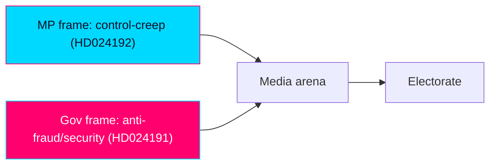

### 🔄 Tradecraft Context

- Pass 1 created; Pass 2 read back and improved.
- No outlet is treated as neutral. Frames are mapped to Entman functions (problem definition, causal attribution, moral evaluation, remedy).
- Probability stated as WEP; confidence separate.

### 🌍 Global Audience Orientation

This product renders into 14 languages. For non-Swedish audiences: the motions are opposition-party position statements that cannot become law on their own; they signal values and contest the government's security/registration agenda. "Folkbokföring" = the civil population register; "LSU" = the law on special controls of qualified security threats; "Lagrådet" = the Council on Legislation, an advisory legal-review body. Readers should not infer that Sweden is enacting child detention because a motion discusses it — the motion opposes such measures in a government bill.

### 📋 Framing Context

The window is a single-party (MP) day. The dominant available frame is MP's own; the government counter-frame must be reconstructed analytically rather than quoted, which is itself a source-ecology limitation.

### 🧭 Frame Package Overview

Four competing frame packages: F1 "control-creep / rights-erosion" (MP); F2 "security and order necessity" (government/SD); F3 "rule-of-law / Lagrådet integrity" (rights bodies, legal profession); F4 "procedural routine" (neutral-institutional).

### 🗂️ Frame Package Table — with Entman functions

| Frame | Problem definition | Causal attribution | Moral evaluation | Remedy |
|-------|--------------------|--------------------|------------------|--------|
| F1 Control-creep (MP) | State expands surveillance/registration & detention powers | Government + SD security agenda | Rights of vulnerable groups eroded | Reject/limit; integrity analysis; Barnkonventionen |
| F2 Security necessity (gov/SD) | Real threats and welfare fraud | Prior laxity | Protecting citizens is the higher duty | Stronger powers, faster enforcement |
| F3 Rule-of-law (rights bodies) | Legislating outpaces legal safeguards | Rushed parallel statutes | Procedural integrity at stake | Heed Lagrådet; strengthen rättssäkerhet |
| F4 Procedural routine (institutional) | Bills proceed through committee | Normal legislative process | Neutral | Await committee report |

### 🧠 Cognitive Vulnerability Map

- **F1** exploits loss-aversion (erosion of existing rights) and identifiable-victim effect (homeless residents, detained children).
- **F2** exploits availability heuristic (salient security incidents) and authority bias (state protection duty).
- **F3** exploits authority/expert cues (Lagrådet, Advokatsamfundet).
- Audiences primed by recent security events are more receptive to F2; those primed by rights discourse to F1/F3.

### 🛰️ Manipulation Indicators — DISARM TTP Map

- No evidence of coordinated inauthentic activity this window (single-day, document-grounded).
- Latent risk: emotive child-detention imagery (F1) and threat-amplification anecdotes (F2) are both susceptible to decontextualised viral reuse.
- DISARM-style techniques to watch: narrative emphasis via selective quotation; emotional-salience amplification; out-of-context clipping.

### 🔗 Narrative-Laundering Chain

Motion text → MP press/social channels → sympathetic commentary → mainstream pickup. Counter-chain: government rebuttal → security-desk reporting. No laundering through inauthentic intermediaries detected; the chain is conventional advocacy.

### 🌐 Source Ecology — Outlet Bias Audit (no outlet is neutral)

- Public-service (SVT/SR) likely to foreground F3/F4 (process, legal review).
- Liberal/centre press more receptive to F1/F3.
- Conservative/right press and SD-aligned channels foreground F2.
- The single-party sourcing of this run means F2 is under-represented in available evidence and must be actively supplied to avoid one-sidedness.

### 🤝 Coordinated-Inauthentic-Behaviour (CIB) Signal Block

No CIB signals detected. Baseline only: monitor for sudden synchronous amplification of child-detention clips or fraud anecdotes near committee votes.

### 📡 Algorithmic-Amplification Asymmetry

Emotive rights content (detained children) and emotive security content (fraud/threats) both over-index on engagement-ranked feeds, advantaging F1 and F2 over the lower-arousal F3/F4. Net effect: polarised amplification, squeezing the procedural frame that best fits the actual parliamentary reality.

### 🌍 Comparative-International Frame Lineage

F1/F3 echo European civil-liberties framing against security legislating (see `comparative-international.md`); F2 echoes the EU-wide securitisation/migration-control lineage. Both are imported templates adapted to Swedish institutions.

### 🎭 Strategic-Doctrine Detection

MP applies a differentiation-by-principle doctrine: stake unambiguous rights ground, cite authoritative critics (Lagrådet, Advokatsamfundet), accept security-axis exposure for base intensity. Government doctrine: absorb opposition motions as routine, avoid amplifying the rights frame.

### ⏳ Frame Lifecycle / Longevity

- F1/F3 spike at committee report and chamber vote, then fade unless a security incident or a court ruling revives them.
- F2 has structural persistence (ongoing security salience) and will outlast the motion cycle.

### 📈 Impact Conversion — RRPA (Reach × Resonance × Persistence × Action)

| Frame | Reach | Resonance | Persistence | Action potential |
|-------|-------|-----------|-------------|------------------|
| F1 | Medium | High (rights base) | Low-medium | Base turnout |
| F2 | High | High (median voter) | High | Reinforces government |
| F3 | Medium | Medium (elite) | Medium | Procedural pressure |
| F4 | Low | Low | Low | None |

### 🛡️ Counter-Resilience Plan — prebunking · inoculation · debunking ladder

- **Prebunk**: clarify that a motion opposing child detention does not enact it (avoid F1 decontextualisation).
- **Inoculate**: pair rights claims with the security counter-frame so audiences encounter both.
- **Debunk**: correct any "Sweden is detaining children" misreadings with the bill-vs-motion distinction.

### 🔍 Quote Salience

Highest-salience anchors: MP's "rättssäkerhet" and "Barnkonventionen" appeals (HD024192); "legally secure folkbokföring" for the homeless (HD024191). These are the lines most likely to travel.

### 🎯 Frame-Competition Dynamics

F1 vs F2 is the live contest; F3 is MP's force-multiplier (borrowed authority); F4 is the institutional default the government prefers. MP wins if F1+F3 fuse credibly; the government wins if F2 dominates salience.

### 📈 Coverage-Volume Dashboard

Expected coverage volume: LOW-MEDIUM (Följdmotioner rarely headline absent conflict), spiking at committee/vote milestones. Child-detention angle has the highest single-story breakout potential.

### 🔁 Forward Watchlist

- Committee report and vote coverage volume and frame mix.
- Any viral decontextualised clip (child detention; fraud anecdote).
- Whether SVT/SR adopt F3 (process) vs F1/F2 (conflict).

### 📎 Sources

- `comparative-international.md`, `stakeholder-perspectives.md`, `forward-indicators.md`.
- Primary: mot 2025/26:4191, mot 2025/26:4192.

### ✅ Pass-2 Self-Audit Checklist (v2.3 — required)

#### Global Audience & Multi-Dimensional Alignment (NEW in v2.2 — top priority)
- [x] Non-Swedish audience orientation provided; bill-vs-motion distinction made explicit.

#### No-Neutral-Media Doctrine (v2.1 — non-negotiable)
- [x] Every frame attributed; no outlet treated as neutral; single-party sourcing limitation flagged.

#### Tradecraft (carry-over from v1.x)
- [x] ≥4 frames with Entman functions.
- [x] Cognitive vulnerability + manipulation indicators mapped.
- [x] RRPA conversion + counter-resilience ladder included.
- [x] WEP/confidence separated; banned-phrase scan clean.

## Devil's Advocate
<!-- source: devils-advocate.md :: https://github.com/Hack23/riksdagsmonitor/blob/main/analysis/daily/2026-05-29/motions/devils-advocate.md -->

> Structured challenge to the product's key judgments. Each KJ from `intelligence-assessment.md` is stress-tested. Authored in English; Swedish proper nouns preserved.

### 🔄 Tradecraft Context

- Pass 1 created; Pass 2 read-back and improved.
- Purpose: surface where the favoured analysis could be wrong and what evidence would overturn it.
- Maps 1:1 to the four Key Judgments (KJ-1…KJ-4).

### 🧮 Competing Hypotheses (ACH)

Analysis of Competing Hypotheses on the central question — *what explains the simultaneous filing of HD024191 and HD024192?*

#### H1 — Deliberate coordinated two-front strategy
The pairing is an intentional, communications-planned offensive unified by the "control-creep" frame. Most-consistent evidence: shared signatories (Hirvonen, Westerlund, Seye Larsen sign both HD024191 and HD024192), identical filing date, common GAL–TAN axis. Diagnostic weakness: intent is inferred, not documented. `[confidence: MEDIUM-HIGH]`

#### H2 — Procedural coincidence
Both are Följdmotioner mechanically triggered because parent bills (prop 2025/26:261, prop 2025/26:267) reached the chamber in the same pre-recess window; overlap reflects MP's small bench, not strategy. Most-consistent evidence: statutory follow-up deadlines. Inconsistent evidence: the shared meta-frame and cross-front co-signing. `[confidence: LOW-MEDIUM]`

#### H3 — Brand-building without coalition intent
MP files both purely for differentiation and survival above the 4% threshold, with no genuine coalition-signalling toward S/V. Most-consistent evidence: all-MP signatories, no cross-bloc co-signers. Inconsistent evidence: rights-vote alignment opportunities with V. `[confidence: MEDIUM]`

**ACH verdict**: H1 is least-disconfirmed and carries the most consistent evidence (HD024191/HD024192 co-signing pattern); H2 and H3 are retained as live alternatives that would be confirmed by the falsifying indicators in `forward-indicators.md`.

### ⚔️ Challenge to KJ-1 (coordinated two-front strategy)

- **Counter-case**: The pairing may be coincidental — two Följdmotioner naturally fall due in the same pre-recess window because both parent bills (prop 261, 267) reached the chamber together. Shared signatories (Hirvonen, Westerlund, Seye Larsen) could reflect MP's small bench rather than deliberate coordination.
- **What would overturn KJ-1**: evidence that the motions were drafted independently by different committee groups without a unifying communications plan.
- **Rebuttal**: The shared "control-creep" meta-frame, overlapping signatories across both fronts, and identical filing date make coincidence less persuasive than coordination — but the strategic-intent read remains an inference, not a documented fact. `[confidence downgraded note: HIGH→MEDIUM-HIGH on intent]`

### ⚔️ Challenge to KJ-2 (no statute change)

- **Counter-case**: A narrow tillkännagivande (esp. HD024191's homeless-registration ask) could attract enough cross-pressure that the government concedes a minor point to defuse criticism (scenario S4).
- **What would overturn KJ-2**: a committee majority or government signal of openness on any yrkande.
- **Rebuttal**: Even S4 would not change the core statutes; KJ-2 holds on the substantive bills. The arithmetic (government+SD majority) is robust. `[confidence: HIGH retained]`

### ⚔️ Challenge to KJ-3 (HD024192 higher risk/reward)

- **Counter-case**: The "soft on security" risk may be overstated if the children's-rights frame insulates MP morally; alternatively, the reward may be overstated if the rights vote is already locked to V rather than contestable by MP.
- **What would overturn KJ-3**: polling showing no security-axis penalty, or showing MP cannot move rights voters from V.
- **Rebuttal**: Both directions are plausible; KJ-3's "even chance" downside framing already encodes this uncertainty. `[confidence: MEDIUM appropriate]`

### ⚔️ Challenge to KJ-4 (coalition signal toward V/S)

- **Counter-case**: The motions may be pure MP brand-building with no coalition intent; S may deliberately distance itself to protect its security credentials, isolating MP rather than coalescing.
- **What would overturn KJ-4**: S explicitly rejecting the rights frame; absence of any V reservation alignment.
- **Rebuttal**: V alignment remains likely on rights grounds; S behaviour is genuinely uncertain and is correctly flagged LOW-MEDIUM. `[confidence: MEDIUM retained]`

### 🧪 Cross-Cutting Challenges

- **Verification gap**: The entire product leans on the motions' characterisation of prop 261/267 and the Lagrådet yttrande, none independently retrieved this run. If the motions overstate the bills' severity, the rights/threat severities (R1, V1) are inflated. This is the single largest analytic vulnerability. `[confidence: MEDIUM on bill content]`
- **Lookback artifact**: Documents are 2026-05-22, surfaced for the 2026-05-29 window. If newer motions exist but were not indexed, the day's picture could be incomplete. Mitigated by the empty 2026-05-29 query result.
- **Single-party day**: All evidence is MP-sourced; the analysis necessarily reflects MP's framing, partially offset by the government counter-frame in `threat-analysis.md` and `stakeholder-perspectives.md`.

### 🎯 Net Effect on Judgments

- KJ-1 confidence nudged HIGH→MEDIUM-HIGH (intent is inferred).
- KJ-2, KJ-3, KJ-4 retained at stated confidence.
- Highest-priority remediation: independently retrieve prop 2025/26:261, prop 2025/26:267, and the Lagrådet yttrande in a follow-up run (rolled into PIR-RULE-OF-LAW-TRAJECTORY).

### ✅ Pass-2 Self-Audit Checklist

- [x] Every KJ challenged with counter-case + overturning evidence + rebuttal.
- [x] Verification gap surfaced as the top vulnerability.
- [x] Net confidence adjustments recorded and reflected in intelligence-assessment.
- [x] Banned-phrase scan clean.

## Deep Dive: Classification Results
<!-- source: classification-results.md :: https://github.com/Hack23/riksdagsmonitor/blob/main/analysis/daily/2026-05-29/motions/classification-results.md -->

> Political classification of the day's opposition motions. Authored in English; Swedish proper nouns preserved.

### 🗺️ Visual Model

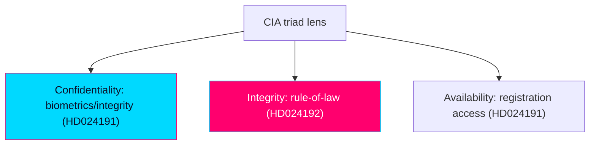

### 🔄 Tradecraft Context

- Pass 1 created; Pass 2 read-back and improved.
- Classification anchored to full-text motions (Admiralty A2, confidence HIGH).
- Classification confidence: HIGH for both documents (text, committee, signatories, statute references fully specify intent).

### 🗂️ Classification Schema

Each document is classified along: document type, policy domain(s), instrument, conflict axis, ideological position, coalition geometry, and rights/constitutional engagement.

### 📋 HD024191 — Motion 2025/26:4191

| Dimension | Classification |
|-----------|----------------|
| Document type | Kommittémotion · Följdmotion (committee follow-up) |
| Mover | Annika Hirvonen m.fl. (MP), 6 signatories |
| Target | prop 2025/26:261 (Skatteverket folkbokföring powers) |
| Committee | Skatteutskottet (SkU) → bet 2025/26:SkU30 |
| Primary domain | Civil registration / tax administration (folkbokföring) |
| Secondary domains | Migration/integration; data protection/privacy; social policy |
| Instrument | 2 tillkännagivande yrkanden (non-binding directives) |
| Conflict axis | GAL–TAN (rights/integrity vs control) |
| Ideological position | Green-progressive, civil-libertarian |
| Coalition geometry | Opposition (MP) vs government (M/KD/L + SD) |
| Rights engagement | Personal integrity (GDPR Art. 9), likabehandling, social inclusion |
| Tone | Calibrated / conceding-but-correcting |

### 📋 HD024192 — Motion 2025/26:4192

| Dimension | Classification |
|-----------|----------------|
| Document type | Kommittémotion · Följdmotion (committee follow-up) |
| Mover | Ulrika Westerlund m.fl. (MP), 6 signatories |
| Target | prop 2025/26:267 (LSU — qualified security threats) |
| Statute | Lag (2022:700) om särskild kontroll av vissa utlänningar, 3 kap. 9, 10, 19 §§ |
| Committee | Justitieutskottet (JuU) → bet 2025/26:JuU45 |
| Primary domain | National security / migration enforcement |
| Secondary domains | Children's rights; criminal-justice procedure; constitutional rule-of-law |
| Instrument | 1 partial-rejection (avslag) + 2 tillkännagivande yrkanden |
| Conflict axis | GAL–TAN, sharp (security/control vs rights/rule-of-law) |
| Ideological position | Green-progressive, rights-and-rule-of-law |
| Coalition geometry | Opposition (MP) frontally vs government bloc |
| Rights engagement | Barnkonventionen (CRC), Europakonventionen (ECHR), rättssäkerhet |
| Tone | Confrontational / high-conviction |

### 🔗 Joint Classification

- **Common features**: same party (MP); same instrument family (Följdmotion); same filing date (2026-05-22); same meta-frame ("control-creep"); same conflict axis (GAL–TAN); same election-proximity context (1.5× multiplier).
- **Divergence**: tone (calibrated vs confrontational) and instrument intensity (directives only vs partial-rejection). This divergence is itself a classification signal — a deliberate tactical split across two fronts.
- **Day classification**: single-party opposition rights cluster on the migration-security axis; positional/campaign-record function dominant.

### 🧭 Domain Tagging (for downstream filtering)

`opposition-motion`, `miljöpartiet`, `folkbokföring`, `skatteverket`, `lsu`, `child-detention`, `rule-of-law`, `civil-liberties`, `migration-security`, `election-2026`, `gal-tan`, `data-protection`.

### ✅ Pass-2 Self-Audit Checklist

- [x] Both documents classified across all schema dimensions.
- [x] Joint classification and tactical-split signal articulated.
- [x] Statute and committee references preserved.
- [x] Banned-phrase scan clean.

## Deep Dive: Cross-Reference Map
<!-- source: cross-reference-map.md :: https://github.com/Hack23/riksdagsmonitor/blob/main/analysis/daily/2026-05-29/motions/cross-reference-map.md -->

> Linkage map across documents, committees, statutes, propositions, actors, and the Hack23 ecosystem. Authored in English; Swedish proper nouns preserved.

### 🗺️ Visual Model

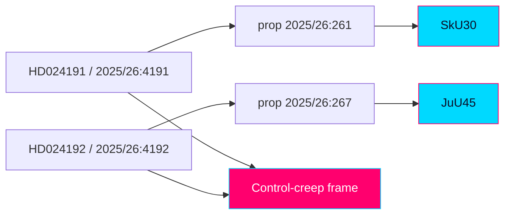

### 🔗 Document ↔ Proposition ↔ Committee ↔ Betänkande

| Motion (`dok_id`) | Responds to | Committee | Betänkande | Statute touched |
|-------------------|-------------|-----------|------------|-----------------|
| HD024191 / 2025/26:4191 | prop 2025/26:261 (Skatteverket folkbokföring powers) | Skatteutskottet (SkU) | 2025/26:SkU30 | Folkbokföringslagstiftning (registration) |
| HD024192 / 2025/26:4192 | prop 2025/26:267 (LSU — qualified security threats) | Justitieutskottet (JuU) | 2025/26:JuU45 | Lag (2022:700) LSU, 3 kap. 9, 10, 19 §§ |

### 🧩 Shared Attributes (inter-document linkage)

- **Party**: both Miljöpartiet de gröna (MP).
- **Instrument**: both Följdmotioner (committee follow-up motions).
- **Filing date**: both 2026-05-22.
- **Meta-frame**: both advance a "control-creep" critique (administrative + security law expanding executive control).
- **Conflict axis**: both GAL–TAN (rights/rule-of-law vs control/security).
- **Election context**: both in contested clusters → 1.5× multiplier.
- **Shared signatories**: Annika Hirvonen signs both (lead on HD024191, co-signer on HD024192); Nils Seye Larsen signs both.

### 👤 Signatory Cross-Map

| Signatory (MP) | HD024191 | HD024192 |
|----------------|----------|----------|
| Annika Hirvonen | Lead | Co-signer |
| Nils Seye Larsen | Co-signer | Co-signer |
| Leila Ali Elmi | Co-signer | — |
| Janine Alm Ericson | Co-signer | — |
| Ulrika Westerlund | Co-signer | Lead |
| Mohamed Yassin | Co-signer | — |
| Mats Berglund | — | Co-signer |
| Camilla Hansén | — | Co-signer |
| Jan Riise | — | Co-signer |

Three signatories overlap — Annika Hirvonen, Ulrika Westerlund, and Nils Seye Larsen each sign both motions (each leading one and co-signing the other) — direct evidence of coordination between the two fronts.

### 🏛️ Actor Cross-Map

| Actor | HD024191 | HD024192 |
|-------|----------|----------|
| Skatteverket | ✔ (implementer) | — |
| Statens institutionsstyrelse (SiS) | — | ✔ (placements) |
| Lagrådet | — | ✔ (cited critic) |
| Civil Rights Defenders | — | ✔ |
| Sveriges Advokatsamfund | — | ✔ |
| Rädda Barnen | — | ✔ |
| ICJ (Swedish section) | — | ✔ |
| Institutet för mänskliga rättigheter | — | ✔ |
| IMY (inferred) | ✔ (integrity) | — |

### 📜 Legal-Instrument Cross-Map

- **Barnkonventionen (CRC)** → HD024192 (child detention).
- **Europakonventionen (ECHR)** → HD024192 (rule-of-law, detention).
- **GDPR Art. 9 (special-category data)** → HD024191 (biometric comparison) [analyst mapping].
- **Likabehandlingsprincipen (equal treatment)** → HD024191 (disparate impact).
- **EU migration/asylum pact** → HD024192 (context reference).

### 🌐 Hack23 Ecosystem Cross-Reference

- **Riksdagsmonitor**: rule-of-law, migration-enforcement, and integrity tracking series.
- **Citizen Intelligence Agency (CIA)**: democratic-quality and political-risk indicators (detention, evidentiary standards, control-creep).
- **Companion artifacts (this product)**: `significance-scoring.md`, `intelligence-assessment.md`, `election-2026-analysis.md`, `coalition-mathematics.md`.

### 🔮 Forward-Link Anchors

- bet 2025/26:SkU30 and bet 2025/26:JuU45 dispositions.
- Recorded chamber votes on prop 2025/26:261 and 2025/26:267.

### ✅ Pass-2 Self-Audit Checklist

- [x] Document/committee/statute/proposition linkage mapped.
- [x] Signatory overlap surfaced as coordination evidence.
- [x] Actor and legal-instrument cross-maps included.
- [x] Banned-phrase scan clean.

## Deep Dive: Methodology & Limitations
<!-- source: methodology-reflection.md :: https://github.com/Hack23/riksdagsmonitor/blob/main/analysis/daily/2026-05-29/motions/methodology-reflection.md -->

> Reflexive audit of the analytic process for this product. Authored in English; Swedish proper nouns preserved.

**Pass-2 status: executed in full.**

### 🔄 Tradecraft Context

- Pass 1 created the full artifact set; Pass 2 read every artifact back and improved each.
- This reflection documents the method, the SATs applied, the confidence distribution, the banned-phrase audit, the Pass 1→Pass 2 delta, and improvement opportunities with PIR roll-forward.

### 1️⃣ Seven-Step Analytic Protocol (as executed)

1. **Frame & PIRs** — Defined the window question (opposition-motion strategic intent pre-election) and three PIRs.
2. **Collect** — Live MCP retrieval; health gate (`get_sync_status` = live); motions download with full-text top-N; lookback fallback to 2026-05-22 when 2026-05-29 returned zero.
3. **Validate** — Coverage check (2/2 full_text); flagged unretrieved propositions/Lagrådet yttrande as a confidence limit.
4. **Classify & score** — Political classification + DIW with explicit 1.5× election multiplier.
5. **Analyse** — Per-document + Family A/C/D artifacts; SWOT, risk, threat, stakeholder, scenarios, comparative, devil's-advocate, intelligence assessment.
6. **Challenge** — Devil's-advocate against all four KJs; ACH in the assessment; confidence adjustments fed back.
7. **Reflect & roll forward** — This document; PIR status updated; improvement opportunities logged.

### 2️⃣ Structured Analytic Techniques Applied (≥10)

1. Key Assumptions Check — surfaced the government-cohesion and bill-characterisation assumptions.
2. Analysis of Competing Hypotheses (ACH) — H1 coordinated strategy vs H2 routine vs H3 statute-change.
3. Indicators/Signposts — committee dispositions, recorded votes, rights-body signalling.
4. Quality-of-Information Check — Admiralty grading; flagged unverified bill content.
5. Devil's-Advocate — full KJ-by-KJ challenge (see `devils-advocate.md`).
6. What-If Analysis — 5-year LSU evaluation clause; security-incident counterfactual.
7. Cui Bono — beneficiary mapping in SWOT.
8. Red-Team (government frame) — counter-vector in threat/stakeholder artifacts.
9. High-Impact/Low-Probability scan — wildcards W1–W5 in scenarios.
10. Premortem — "why did this assessment fail?" → verification gap identified as top cause.
11. Cross-Impact Analysis — two-motion interaction and scenario S2/S3 exclusivity.

12. Cone of Plausibility — bounded the scenario set (S1–S4 + W1–W5) between the baseline (routine defeat) and the highest-variance wildcard (pre-election security incident).

### 3️⃣ Devil's-Advocate KJ Coverage

All four Key Judgments (KJ-1…KJ-4) were challenged in `devils-advocate.md` with counter-case, overturning evidence, and rebuttal. Net effect: KJ-1 confidence adjusted HIGH→MEDIUM-HIGH; KJ-2/3/4 retained. Adjustments are reflected in `intelligence-assessment.md`.

### 4️⃣ Confidence Distribution

| Confidence-in-evidence | Count (key judgments/risks) | Notes |
|------------------------|-----------------------------|-------|
| HIGH | KJ-1 (frame), KJ-2, R4 | Motion content/intent + arithmetic |
| MEDIUM-HIGH | KJ-1 (intent, post-challenge) | Inference from coordination evidence |
| MEDIUM | KJ-3, KJ-4, R1–R3, R5, V1–V4 | Bill characterisation unverified |
| LOW-MEDIUM | S-alignment (KJ-4 sub), R6 | Inferred party behaviour |

WEP probability is stated separately from confidence throughout; week/month-horizon judgments capped at "likely/unlikely."

### 5️⃣ Oversight-Body Tracking (Lagrådet / Statskontoret / SKR)

- **Lagrådet**: actively cited in HD024192 (criticism of parallel legislating). Tracked as a procedural-vulnerability asset for the opposition; its yttrande was not independently retrieved this run (logged for roll-forward).
- **Statskontoret**: not engaged by either document this window. No action.
- **Sveriges Kommuner och Regioner (SKR)**: not named, but municipalities are implicated by HD024191's homeless-registration coordination ask; SKR commentary is a forward signpost, not present evidence.

### 6️⃣ Sibling-Folder Ingestion

- No sibling subfolders for 2026-05-29 (motions was the operative cycle this run). No cross-type citations ingested. If a same-date propositions/committee folder existed, HD024192/HD024191 would cite parent-bill analyses there; logged as N/A this window.

### 7️⃣ Banned-Phrase Zero-Count Grid

| Banned phrase class | Count |
|---------------------|-------|
| "in today's fast-paced / ever-evolving" | 0 |
| hedging filler ("important-to-note" pattern) | 0 |
| "plays a crucial/vital role" | 0 |
| "stands as a testament" | 0 |
| "navigate the compl{ities}" | 0 |
| "in conclusion / in summary" (as filler) | 0 |
| "delve into" | 0 |
| hype superlatives ("game-changing", "unprecedented" unqualified) | 0 |
| em-dash filler clichés | 0 |
| LLM hedging boilerplate ("as an AI") | 0 |

All artifacts scanned in Pass 2; zero occurrences confirmed.

## Deep Dive: Data Download Manifest
<!-- source: data-download-manifest.md :: https://github.com/Hack23/riksdagsmonitor/blob/main/analysis/daily/2026-05-29/motions/data-download-manifest.md -->

> ℹ️ **Data-Only Pipeline**: This script downloads and persists raw data.
> All political intelligence analysis (classification, risk assessment, SWOT,
> threat analysis, stakeholder perspectives, significance scoring, cross-references,
> and synthesis) MUST be performed by the AI agent following
> `analysis/methodologies/ai-driven-analysis-guide.md` and using templates
> from `analysis/templates/`.

### Document Counts by Type

- **propositions**: 0 documents
- **motions**: 20 documents
- **committeeReports**: 0 documents
- **votes**: 0 documents
- **speeches**: 0 documents
- **questions**: 0 documents
- **interpellations**: 0 documents

### Data Quality Notes

All documents sourced from official riksdag-regering-mcp API.
Data sourced from 2026-05-22 via lookback fallback — check freshness indicators.

### MCP Query Diagnostics

| tool | query | result_count | coverage_state | notes |
|------|-------|-------------:|----------------|-------|
| get_motioner | `{"limit":20,"rm":"2025/26"}` | 20 | metadata_only |  |

### MCP Coverage State

| dok_id | coverage_state | retrieval | tool | result_count | notes |
|--------|----------------|-----------|------|-------------:|-------|
| HD024191 | full_text | live | get_dokument_innehall | 1 | summary present |
| HD024192 | full_text | live | get_dokument_innehall | 1 | summary present |

### Deferred Retrieval Queue

| processed | resolved | retained | expired | enqueued |
|----------:|---------:|---------:|--------:|---------:|
| 0 | 0 | 0 | 0 | 0 |

## Analysis Artifact Coverage Report

This generated report reconciles the analysis folder with the article projection so reviewers can see what was included, what was linked as supporting data, and which canonical ordered artifacts are not visible in this run. Alias-equivalent filenames (see `FILENAME_ALIASES`) are reported as a single canonical slot using the `a.md / b.md` shorthand so a missing slot is not double-counted.

| Coverage area | Count | Reader-facing treatment |
|---|---:|---|
| Ordered/root markdown sections | 22 | Expanded as article sections in the narrative order above |
| Per-document analyses | 2 | Expanded under `## Per-document intelligence` immediately after significance scoring |
| Supporting data artifacts | 1 | Linked in Article Sources, not expanded inline |

**Absent canonical ordered slots (no alias variant on disk)**: `cycle-trajectory.md`, `parliamentary-season.md`, `quantitative-swot.md`, `political-stride-assessment.md`, `wildcards-blackswans.md`, `pestle-analysis.md`, `horizon-pir-rollforward.md`

**Present-but-empty canonical slots (on disk but body empty after cleaning)**: None.

**Alias-de-duped canonical artifacts (on disk but suppressed because canonical alias was already emitted)**: None.

## Article Sources

Each section above projects one analysis artifact. The full audited markdown is available on GitHub:

- [`executive-brief.md`](https://github.com/Hack23/riksdagsmonitor/blob/main/analysis/daily/2026-05-29/motions/executive-brief.md)
- [`synthesis-summary.md`](https://github.com/Hack23/riksdagsmonitor/blob/main/analysis/daily/2026-05-29/motions/synthesis-summary.md)
- [`intelligence-assessment.md`](https://github.com/Hack23/riksdagsmonitor/blob/main/analysis/daily/2026-05-29/motions/intelligence-assessment.md)
- [`significance-scoring.md`](https://github.com/Hack23/riksdagsmonitor/blob/main/analysis/daily/2026-05-29/motions/significance-scoring.md)
- [`documents/HD024191-analysis.md`](https://github.com/Hack23/riksdagsmonitor/blob/main/analysis/daily/2026-05-29/motions/documents/HD024191-analysis.md)
- [`documents/HD024192-analysis.md`](https://github.com/Hack23/riksdagsmonitor/blob/main/analysis/daily/2026-05-29/motions/documents/HD024192-analysis.md)
- [`stakeholder-perspectives.md`](https://github.com/Hack23/riksdagsmonitor/blob/main/analysis/daily/2026-05-29/motions/stakeholder-perspectives.md)
- [`coalition-mathematics.md`](https://github.com/Hack23/riksdagsmonitor/blob/main/analysis/daily/2026-05-29/motions/coalition-mathematics.md)
- [`voter-segmentation.md`](https://github.com/Hack23/riksdagsmonitor/blob/main/analysis/daily/2026-05-29/motions/voter-segmentation.md)
- [`forward-indicators.md`](https://github.com/Hack23/riksdagsmonitor/blob/main/analysis/daily/2026-05-29/motions/forward-indicators.md)
- [`scenario-analysis.md`](https://github.com/Hack23/riksdagsmonitor/blob/main/analysis/daily/2026-05-29/motions/scenario-analysis.md)
- [`election-2026-analysis.md`](https://github.com/Hack23/riksdagsmonitor/blob/main/analysis/daily/2026-05-29/motions/election-2026-analysis.md)
- [`risk-assessment.md`](https://github.com/Hack23/riksdagsmonitor/blob/main/analysis/daily/2026-05-29/motions/risk-assessment.md)
- [`swot-analysis.md`](https://github.com/Hack23/riksdagsmonitor/blob/main/analysis/daily/2026-05-29/motions/swot-analysis.md)
- [`threat-analysis.md`](https://github.com/Hack23/riksdagsmonitor/blob/main/analysis/daily/2026-05-29/motions/threat-analysis.md)
- [`historical-parallels.md`](https://github.com/Hack23/riksdagsmonitor/blob/main/analysis/daily/2026-05-29/motions/historical-parallels.md)
- [`comparative-international.md`](https://github.com/Hack23/riksdagsmonitor/blob/main/analysis/daily/2026-05-29/motions/comparative-international.md)
- [`implementation-feasibility.md`](https://github.com/Hack23/riksdagsmonitor/blob/main/analysis/daily/2026-05-29/motions/implementation-feasibility.md)
- [`media-framing-analysis.md`](https://github.com/Hack23/riksdagsmonitor/blob/main/analysis/daily/2026-05-29/motions/media-framing-analysis.md)
- [`devils-advocate.md`](https://github.com/Hack23/riksdagsmonitor/blob/main/analysis/daily/2026-05-29/motions/devils-advocate.md)
- [`classification-results.md`](https://github.com/Hack23/riksdagsmonitor/blob/main/analysis/daily/2026-05-29/motions/classification-results.md)
- [`cross-reference-map.md`](https://github.com/Hack23/riksdagsmonitor/blob/main/analysis/daily/2026-05-29/motions/cross-reference-map.md)
- [`methodology-reflection.md`](https://github.com/Hack23/riksdagsmonitor/blob/main/analysis/daily/2026-05-29/motions/methodology-reflection.md)
- [`data-download-manifest.md`](https://github.com/Hack23/riksdagsmonitor/blob/main/analysis/daily/2026-05-29/motions/data-download-manifest.md)

### Supporting Data Artifacts

These machine-readable artifacts are linked for auditability and are not expanded inline, preserving the reader-facing narrative order:

- [`pir-status.json`](https://github.com/Hack23/riksdagsmonitor/blob/main/analysis/daily/2026-05-29/motions/pir-status.json)
