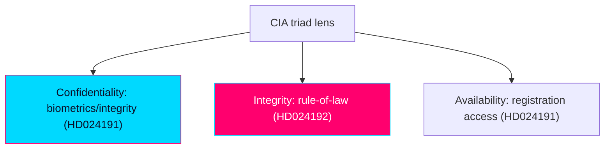

# Classification Results — Swedish Opposition Motions, 2026-05-29

> Political classification of the day's opposition motions. Authored in English; Swedish proper nouns preserved.

## 🗺️ Visual Model

## 🔄 Tradecraft Context

- Pass 1 created; Pass 2 read-back and improved.
- Classification anchored to full-text motions (Admiralty A2, confidence HIGH).
- Classification confidence: HIGH for both documents (text, committee, signatories, statute references fully specify intent).

## 🗂️ Classification Schema

Each document is classified along: document type, policy domain(s), instrument, conflict axis, ideological position, coalition geometry, and rights/constitutional engagement.

## 📋 HD024191 — Motion 2025/26:4191

| Dimension | Classification |
|-----------|----------------|
| Document type | Kommittémotion · Följdmotion (committee follow-up) |
| Mover | Annika Hirvonen m.fl. (MP), 6 signatories |
| Target | prop 2025/26:261 (Skatteverket folkbokföring powers) |
| Committee | Skatteutskottet (SkU) → bet 2025/26:SkU30 |
| Primary domain | Civil registration / tax administration (folkbokföring) |
| Secondary domains | Migration/integration; data protection/privacy; social policy |
| Instrument | 2 tillkännagivande yrkanden (non-binding directives) |
| Conflict axis | GAL–TAN (rights/integrity vs control) |
| Ideological position | Green-progressive, civil-libertarian |
| Coalition geometry | Opposition (MP) vs government (M/KD/L + SD) |
| Rights engagement | Personal integrity (GDPR Art. 9), likabehandling, social inclusion |
| Tone | Calibrated / conceding-but-correcting |

## 📋 HD024192 — Motion 2025/26:4192

| Dimension | Classification |
|-----------|----------------|
| Document type | Kommittémotion · Följdmotion (committee follow-up) |
| Mover | Ulrika Westerlund m.fl. (MP), 6 signatories |
| Target | prop 2025/26:267 (LSU — qualified security threats) |
| Statute | Lag (2022:700) om särskild kontroll av vissa utlänningar, 3 kap. 9, 10, 19 §§ |
| Committee | Justitieutskottet (JuU) → bet 2025/26:JuU45 |
| Primary domain | National security / migration enforcement |
| Secondary domains | Children's rights; criminal-justice procedure; constitutional rule-of-law |
| Instrument | 1 partial-rejection (avslag) + 2 tillkännagivande yrkanden |
| Conflict axis | GAL–TAN, sharp (security/control vs rights/rule-of-law) |
| Ideological position | Green-progressive, rights-and-rule-of-law |
| Coalition geometry | Opposition (MP) frontally vs government bloc |
| Rights engagement | Barnkonventionen (CRC), Europakonventionen (ECHR), rättssäkerhet |
| Tone | Confrontational / high-conviction |

## 🔗 Joint Classification

- **Common features**: same party (MP); same instrument family (Följdmotion); same filing date (2026-05-22); same meta-frame ("control-creep"); same conflict axis (GAL–TAN); same election-proximity context (1.5× multiplier).
- **Divergence**: tone (calibrated vs confrontational) and instrument intensity (directives only vs partial-rejection). This divergence is itself a classification signal — a deliberate tactical split across two fronts.
- **Day classification**: single-party opposition rights cluster on the migration-security axis; positional/campaign-record function dominant.

## 🧭 Domain Tagging (for downstream filtering)

`opposition-motion`, `miljöpartiet`, `folkbokföring`, `skatteverket`, `lsu`, `child-detention`, `rule-of-law`, `civil-liberties`, `migration-security`, `election-2026`, `gal-tan`, `data-protection`.

## ✅ Pass-2 Self-Audit Checklist

- [x] Both documents classified across all schema dimensions.
- [x] Joint classification and tactical-split signal articulated.
- [x] Statute and committee references preserved.
- [x] Banned-phrase scan clean.
