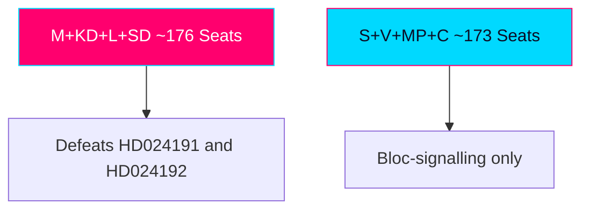

# Coalition Mathematics — Swedish Opposition Motions, 2026-05-29

> Parliamentary arithmetic governing the two MP Följdmotioner and their bloc-signalling function. English; Swedish proper nouns preserved.

## 🗺️ Visual Model

## 🔄 Tradecraft Context

- Pass 1 created; Pass 2 improved. WEP and confidence stated separately.
- Seat figures reference the 2022–2026 Riksdag (349 seats; 175 for majority).

## 📋 Coalition Context

Both motions are opposition Följdmotioner that cannot pass: the Tidö constellation (M, KD, L) plus Sverigedemokraterna (SD) commands a working majority on the contested axes (migration, security, criminal justice). The motions' value is therefore positional and bloc-signalling, not arithmetical.

## 🧮 Current Support Snapshot

| Bloc | Parties | Approx. Seats (Mandat) | Disposition on these motions |
|------|---------|---------------|------------------------------|
| Government + support | M, KD, L, SD | ~176 (working majority) | Reject both |
| Red-green-rights | S, V, MP, C (partial) | ~173 | Mixed; rights flank sympathetic |

(Figures are the standing 2022 distribution; treat as approximate working majority.)

## 🧪 Threshold Sensitivity

The decisive parliamentary threshold is 175. On both motions the government bloc clears it without defection. The relevant sensitivity is electoral, not parliamentary: whether MP and the broader red-green-rights flank cross the 4% party threshold in September.

## 🧭 Formation Pathways

### Pathway A — Continuation (M-KD-L + SD)
Most likely if the bloc holds polling. These motions are defeated and become opposition campaign material. `[WEP: likely if current polling holds]`

### Pathway B — Opposition Majority (S-C-MP-V)
The motions' bloc-signalling targets this pathway: establishing a shared rights/rule-of-law platform. The obstacle is the security axis, where S guards its credentials and may decline the MP frame. `[WEP: contingent — uncertain]`

### Pathway C — Grand Centre (S-M-C)
Would marginalise both MP's rights agenda and SD; the motions are irrelevant to and arguably obstructive of this pathway.

### Pathway D — Hung Parliament / Extended Formation
Plausible given threshold volatility around MP, V, L, C; would elevate small-party leverage and make documented rights positions (these motions) negotiating assets.

## 🧲 Pivotal-Player Analysis

- **MP**: pivotal only if it survives the threshold; below 4% it is removed from all arithmetic. The motions are partly a survival play.
- **S**: the true pivot on the security axis; its willingness to adopt or reject the rights frame determines Pathway B viability.
- **SD**: pivotal to Pathway A's majority; its alignment with the government on prop 261/267 is the arithmetic that defeats the motions.

## ⚖️ Document-Specific Coalition Read-Through

- **HD024191 (folkbokföring)**: lower-conflict; conceivable that parts of the opposition and even L's liberal wing share integrity concerns, though not enough to flip the vote.
- **HD024192 (LSU/children)**: high-conflict; aligns MP with V and rights bodies but strains any approach to S's security positioning.

## 🚦 Coalition-Breaking Signal — Watch Next

- Any government-bloc defection on prop 261/267 (none expected).
- S's committee reservation language on JuU45 — adoption of rights framing would signal Pathway B momentum; silence or distancing would signal isolation of MP.
- Post-election threshold outcomes for MP, V, L, C.

## 📎 Links

- `election-2026-analysis.md`, `scenario-analysis.md`, `forward-indicators.md`.
- Primary: mot 2025/26:4191, mot 2025/26:4192; bet 2025/26:SkU30, 2025/26:JuU45.

## ✅ Pass-2 Self-Audit Checklist (v4.4 — required)

- [x] ≥4 formation pathways assessed.
- [x] Pivotal players identified (MP, S, SD).
- [x] Document-specific read-through included.
- [x] WEP/confidence separated.
- [x] Banned-phrase scan clean.
