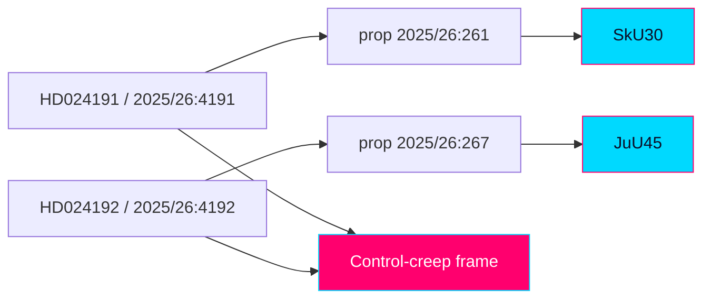

# Cross-Reference Map — Swedish Opposition Motions, 2026-05-29

> Linkage map across documents, committees, statutes, propositions, actors, and the Hack23 ecosystem. Authored in English; Swedish proper nouns preserved.

## 🗺️ Visual Model

## 🔗 Document ↔ Proposition ↔ Committee ↔ Betänkande

| Motion (`dok_id`) | Responds to | Committee | Betänkande | Statute touched |
|-------------------|-------------|-----------|------------|-----------------|
| HD024191 / 2025/26:4191 | prop 2025/26:261 (Skatteverket folkbokföring powers) | Skatteutskottet (SkU) | 2025/26:SkU30 | Folkbokföringslagstiftning (registration) |
| HD024192 / 2025/26:4192 | prop 2025/26:267 (LSU — qualified security threats) | Justitieutskottet (JuU) | 2025/26:JuU45 | Lag (2022:700) LSU, 3 kap. 9, 10, 19 §§ |

## 🧩 Shared Attributes (inter-document linkage)

- **Party**: both Miljöpartiet de gröna (MP).
- **Instrument**: both Följdmotioner (committee follow-up motions).
- **Filing date**: both 2026-05-22.
- **Meta-frame**: both advance a "control-creep" critique (administrative + security law expanding executive control).
- **Conflict axis**: both GAL–TAN (rights/rule-of-law vs control/security).
- **Election context**: both in contested clusters → 1.5× multiplier.
- **Shared signatories**: Annika Hirvonen signs both (lead on HD024191, co-signer on HD024192); Nils Seye Larsen signs both.

## 👤 Signatory Cross-Map

| Signatory (MP) | HD024191 | HD024192 |
|----------------|----------|----------|
| Annika Hirvonen | Lead | Co-signer |
| Nils Seye Larsen | Co-signer | Co-signer |
| Leila Ali Elmi | Co-signer | — |
| Janine Alm Ericson | Co-signer | — |
| Ulrika Westerlund | Co-signer | Lead |
| Mohamed Yassin | Co-signer | — |
| Mats Berglund | — | Co-signer |
| Camilla Hansén | — | Co-signer |
| Jan Riise | — | Co-signer |

Three signatories overlap — Annika Hirvonen, Ulrika Westerlund, and Nils Seye Larsen each sign both motions (each leading one and co-signing the other) — direct evidence of coordination between the two fronts.

## 🏛️ Actor Cross-Map

| Actor | HD024191 | HD024192 |
|-------|----------|----------|
| Skatteverket | ✔ (implementer) | — |
| Statens institutionsstyrelse (SiS) | — | ✔ (placements) |
| Lagrådet | — | ✔ (cited critic) |
| Civil Rights Defenders | — | ✔ |
| Sveriges Advokatsamfund | — | ✔ |
| Rädda Barnen | — | ✔ |
| ICJ (Swedish section) | — | ✔ |
| Institutet för mänskliga rättigheter | — | ✔ |
| IMY (inferred) | ✔ (integrity) | — |

## 📜 Legal-Instrument Cross-Map

- **Barnkonventionen (CRC)** → HD024192 (child detention).
- **Europakonventionen (ECHR)** → HD024192 (rule-of-law, detention).
- **GDPR Art. 9 (special-category data)** → HD024191 (biometric comparison) [analyst mapping].
- **Likabehandlingsprincipen (equal treatment)** → HD024191 (disparate impact).
- **EU migration/asylum pact** → HD024192 (context reference).

## 🌐 Hack23 Ecosystem Cross-Reference

- **Riksdagsmonitor**: rule-of-law, migration-enforcement, and integrity tracking series.
- **Citizen Intelligence Agency (CIA)**: democratic-quality and political-risk indicators (detention, evidentiary standards, control-creep).
- **Companion artifacts (this product)**: `significance-scoring.md`, `intelligence-assessment.md`, `election-2026-analysis.md`, `coalition-mathematics.md`.

## 🔮 Forward-Link Anchors

- bet 2025/26:SkU30 and bet 2025/26:JuU45 dispositions.
- Recorded chamber votes on prop 2025/26:261 and 2025/26:267.

## ✅ Pass-2 Self-Audit Checklist

- [x] Document/committee/statute/proposition linkage mapped.
- [x] Signatory overlap surfaced as coordination evidence.
- [x] Actor and legal-instrument cross-maps included.
- [x] Banned-phrase scan clean.
