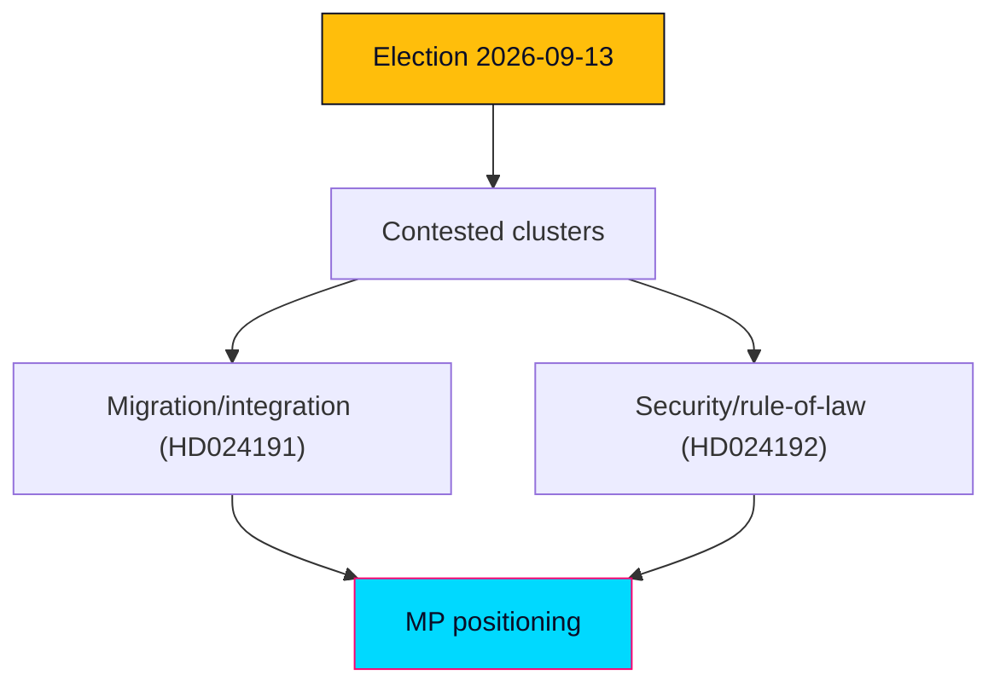

# Electoral Analysis 2026 — Swedish Opposition Motions, 2026-05-29

> Electoral read-through of the two MP Följdmotioner against the 2026-09-13 general election. English; Swedish proper nouns preserved.

## 🔧 Cycle-Anchor Parameter Resolution

- `cycleAnchor = current` (the sitting 2022–2026 mandate, final session before dissolution).
- Election date: **2026-09-13**; this product dated 2026-05-29 → **~15 weeks** to polling day.
- Contested-axis flag = TRUE (migration/security/criminal-justice + privacy/integration) → DIW **1.5× multiplier** applied in `significance-scoring.md`.

## 🗺️ Visual Model

## 🔄 Tradecraft Context

- Pass 1 created; Pass 2 improved.
- Probability stated as WEP; confidence stated separately. Week/month-horizon claims capped at "likely/unlikely".

## 📋 Electoral Context

The motions land in the pre-recess window of the last full Riksmöte session before the campaign. Both are positional Följdmotioner from Miljöpartiet (MP), a party polling near the 4% threshold and competing with Vänsterpartiet (V) for the progressive-rights segment. Neither motion can pass; both function as campaign-record artifacts and base-mobilisation signals.

## 🧭 Electoral Significance Classification

- **Tier: MEDIUM electoral significance.** The motions are unlikely to move aggregate vote share, but they sharpen MP's differentiation on rights/integrity at a moment when threshold survival is the party's binding constraint.

## 🎯 5-Dimension Electoral Assessment

### Dimension 1 — Electoral Impact
Marginal at the aggregate level; meaningful at the margin for MP's threshold survival. Rights-forward positioning targets the ~1–2 points that separate MP from sub-4% elimination. `[WEP: marginal aggregate impact — likely]`

### Dimension 2 — Coalition Scenarios
Reinforces a red-green-rights bloc (S-MP-V-C variants) on civil-liberties grounds while doing nothing to resolve the security-axis liability that S carries. See `coalition-mathematics.md`.

### Dimension 3 — Voter Salience
Migration/security rank high in salience for the median voter but cut against MP; privacy/folkbokföring integrity is lower-salience but favourable terrain for MP. The LSU child-detention frame is high-salience, high-risk.

### Dimension 4 — Campaign Vulnerability
HD024192 exposes MP to a "soft on security" attack from M/SD/KD; HD024191 is comparatively safe and even positive (defending vulnerable residents). Net vulnerability: MEDIUM, concentrated in HD024192.

### Dimension 5 — Policy Legacy
If MP survives the threshold, these motions become a documented mandate claim for a post-election rights agenda; if MP exits parliament, they are a closing-statement of principle.

## 🧩 Coalition-Mathematics Hook

Government+SD majority defeats both motions; the relevant electoral question is whether the rights frame consolidates the opposition bloc's progressive flank — addressed in `coalition-mathematics.md` Pathway B.

## 🗓️ Cycle Watchlist

- bet 2025/26:SkU30 and 2025/26:JuU45 dispositions and reservations.
- Recorded chamber votes (party-line confirmation).
- MP campaign launch messaging — does it adopt the "control-creep" frame?
- Polling for MP vs V on the rights segment.

## 🧠 Electoral-Strategy Read-Through

MP is running a differentiation-by-principle strategy: stake out clear rights ground that V also occupies, betting that visible parliamentary action converts to threshold-saving turnout. The risk is that the security-axis salience advantages the government bloc more than the rights-axis advantages MP.

## 📊 Mandate-Fulfilment Scorecard (cycleAnchor=current ONLY)

| Mandate strand | 2022 MP platform pledge | This-window action | Status |
|----------------|-------------------------|--------------------|--------|
| Civil liberties / privacy | Resist surveillance expansion | HD024191 Y2 (biometrics scrutiny) | Active |
| Children's rights | Uphold Barnkonventionen | HD024192 Y1 (reject child detention) | Active |
| Rule of law | Defend rättssäkerhet | HD024192 Y2/Y3 | Active |
| Inclusion of vulnerable | Protect homeless/undocumented | HD024191 Y1 | Active |

## 🔁 Update Cadence

Re-score on committee report publication and on any pre-election polling shift crossing the 4% line.

## 📎 Links

- `significance-scoring.md`, `coalition-mathematics.md`, `voter-segmentation.md`, `forward-indicators.md`.
- Primary: mot 2025/26:4191, mot 2025/26:4192; bet 2025/26:SkU30, 2025/26:JuU45.

## ✅ Pass-2 Self-Audit Checklist (v4.4 — required)

- [x] Cycle anchor resolved (current); 15-week horizon stated.
- [x] 5 dimensions completed.
- [x] WEP separated from confidence.
- [x] Mandate scorecard included (cycleAnchor=current).
- [x] Banned-phrase scan clean.
