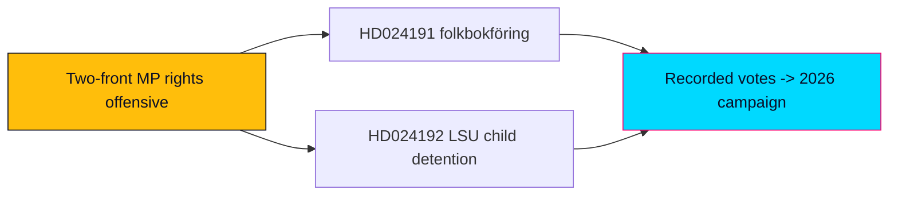

# Sweden's Greens Open a Two-Front Rights Offensive Against the Tidö Control Agenda

> Executive brief · Swedish opposition motions · analysis window 2026-05-29 (documents sourced 2026-05-22 via lookback). Authored in English; Swedish proper nouns preserved.

## 🗺️ Visual Model

## 🔄 Tradecraft Context

- **Pass status**: Pass 1 created; Pass 2 read-back and improved.
- **Evidence base**: Two MP follow-up motions, full text retrieved live from `data.riksdagen.se` (Admiralty A2, confidence-in-evidence HIGH).
- **Probability language**: WEP-banded; ceiling for week/month horizon judgments = "likely/unlikely."
- **Election multiplier**: 1.5× DIW election-proximity applied (election 2026-09-13, ~15 weeks out; both motions sit in contested migration/security/rights clusters).

## 📋 Brief Context

On 22 May 2026, fifteen weeks before the general election, Miljöpartiet de gröna filed two committee follow-up motions (Följdmotioner) that together form a coordinated civil-liberties counter-offensive against two government security/control bills. One targets expanded Skatteverket folkbokföring powers (HD024191 → prop 2025/26:261, bet 2025/26:SkU30); the other partially rejects an LSU security-detention bill on children's-rights grounds (HD024192 → prop 2025/26:267, bet 2025/26:JuU45).

## 🎯 BLUF (Bottom Line Up Front)

Miljöpartiet is using the final pre-recess legislative window to build a documented rights-and-rule-of-law record against the Tidö bloc's control agenda. The two motions — HD024191 (folkbokföring integrity, conceding-but-correcting) and HD024192 (child detention under the LSU, frontally rejecting) — are tactically distinct but strategically unified: they position MP at the civil-liberties pole of the migration-security axis that will dominate the September 2026 campaign. Neither motion is **likely** to alter its target statute given the government+SD majority; both are **likely** to succeed at their real purpose, which is positional — forcing recorded votes, stacking institutional authority (Lagrådet, Advokatsamfundet, Civil Rights Defenders, Rädda Barnen, ICJ, Institutet för mänskliga rättigheter), and signalling coalition intent toward V and the left of S. `[WEP: likely · horizon: to summer recess 2026 · confidence: HIGH]`

### BLUF paragraph (meta description)

Miljöpartiet filed two follow-up motions (HD024191, HD024192) on 22 May 2026 challenging the government's folkbokföring-control and LSU security-detention bills — a coordinated rights offensive 15 weeks before Sweden's election, built to set the campaign record rather than to win committee votes.

## 🪧 Headline Candidates

1. Sweden's Greens Open a Two-Front Rights Offensive Against the Tidö Control Agenda *(selected H1)*
2. Children's Rights and Folkbokföring: How MP Is Fighting Two Security Bills at Once
3. Fifteen Weeks to the Election, MP Stakes the Civil-Liberties Lane

## 🌐 14-Language SEO Metadata Seeds

- Topic seeds: opposition motions, Miljöpartiet, folkbokföring, LSU, child detention, rule of law, election 2026, civil liberties.

## 📖 Narrative

The two motions are best read as one strategic move executed on two fronts. On the folkbokföring front (HD024191), MP concedes the government's anti-fraud aim outright, then attacks the bill's blind spots: the address Catch-22 that locks homeless residents out of registration-dependent rights, and the integrity/equal-treatment risks of biometric comparison falling hardest on people with foreign background. The asks are modest — two non-binding tillkännagivanden — calibrated to be hard to caricature as "soft on fraud."

On the security front (HD024192), MP abandons calibration. It asks the chamber to reject the parts of prop 2025/26:267 that extend child detention and allow children in security units under the LSU (3 kap. 9, 10, 19 §§), citing Barnkonventionen and the FN:s barnrättskommitté, and demands stronger rättssäkerhet plus a 5-year evaluation of the lowered beviskrav ("sannolikt" → "kan antas") and the removed detention cap. Here MP accepts exposure on the security axis to consolidate the rights vote and to align with the legal-professional and human-rights establishment whose criticism — including the Lagrådet's — it marshals as ammunition.

## 🧭 3 Decisions This Brief Supports

1. **Editorial framing decision** — Cover the two motions as a single coordinated MP rights strategy, not as two isolated procedural filings; lead with the strategic two-front frame.
2. **Forward-monitoring decision** — Prioritise tracking bet 2025/26:SkU30 and bet 2025/26:JuU45 dispositions and the recorded chamber votes on prop 261/267 before summer recess as the next decision points.
3. **Coalition-signal decision** — Treat these motions as early indicators of MP's pre-election alignment posture toward V and S; watch for cross-bloc reservations as the leading signal.

## 📰 60-Second Read

- **Who/what**: Miljöpartiet filed two follow-up motions (2025/26:4191 and 2025/26:4192) on 22 May 2026.
- **HD024191**: Accepts anti-fraud aim of prop 2025/26:261 but seeks two directives — legally secure folkbokföring for homeless residents, and a deeper integrity/equal-treatment analysis of biometric control powers. Committee: Skatteutskottet (bet SkU30).
- **HD024192**: Asks the Riksdag to reject child-detention extensions and security-unit placement under the LSU (prop 2025/26:267), strengthen rule-of-law, and evaluate the lowered evidentiary threshold within 5 years. Committee: Justitieutskottet (bet JuU45).
- **Why it matters**: A coordinated rights offensive 15 weeks before the 2026-09-13 election; positional, not majority-seeking.
- **Likely outcome**: Both target statutes proceed (government+SD majority); MP succeeds at record-building and coalition-signalling. `[WEP: likely · confidence: HIGH]`
- **Watch next**: Committee dispositions and recorded votes before summer recess.

## 🗂️ Top Documents Table (DIW-ranked)

| Rank | `dok_id` | Motion | DIW (×1.5) | Why it ranks |
|------|----------|--------|------------|--------------|
| 1 | HD024192 | 2025/26:4192 | Higher | Partial-rejection of a security bill; children's rights + rule-of-law; authority stacking |
| 2 | HD024191 | 2025/26:4191 | High | Integrity/equal-treatment critique of folkbokföring control powers |

## ⚠️ Risk & Threat Snapshot

- **Rule-of-law risk** (from HD024192): HIGH if enacted — lowered beviskrav + uncapped detention + child detention.
- **Integrity risk** (from HD024191): MEDIUM-HIGH — biometric comparison, control-creep in folkbokföring.
- **Political risk to MP**: MEDIUM-HIGH on the security axis (exposure to "soft on security" framing).

## 🔮 Top Forward Trigger

Committee dispositions of bet 2025/26:SkU30 and bet 2025/26:JuU45 and the recorded chamber votes on prop 2025/26:261 and 2025/26:267 before summer recess 2026 — the moment the positional record becomes a campaign fact.

## 📎 Links

- https://data.riksdagen.se/dokument/HD024191.html
- https://data.riksdagen.se/dokument/HD024192.html

## ✅ Pass-2 Self-Audit Checklist

- [x] Story-oriented H1, no date, no boilerplate.
- [x] `## 🎯 BLUF` and `## 🧭 3 Decisions This Brief Supports` present; `## 📰 60-Second Read` present.
- [x] WEP bands + horizons on headline judgments; confidence separated.
- [x] 1.5× multiplier stated; primary-source links included.
- [x] Banned-phrase scan clean.
