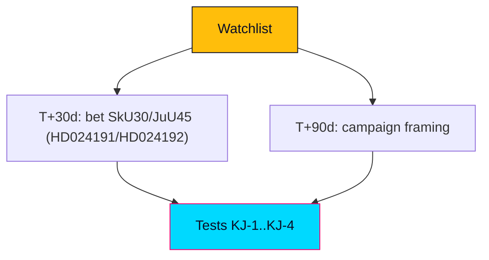

# Forward Indicators — Swedish Opposition Motions, 2026-05-29

> Watchlist of observable signals that would confirm or falsify this product's judgments. English; Swedish proper nouns preserved.

## 🧭 Horizon Bands

### Band Schema (conditional on `horizonDays`)
- **T+72h**: immediate procedural movement.
- **T+7d**: committee scheduling and early coverage.
- **T+30d**: committee reports, reservations, chamber votes.
- **T+90d**: pre-election positioning consolidation (election 2026-09-13).

### WEP-Degradation Ladder (per-band ceiling)
- T+72h: up to "highly likely/unlikely".
- T+7d: up to "likely/unlikely".
- T+30d: "likely/even chance" ceiling.
- T+90d: "even chance" ceiling — no high-confidence claims at this horizon.

### Minimum Indicator Counts (per article type)
Motions/deep: ≥6 indicators across ≥2 bands. This file lists 8.

## 🗺️ Visual Model

## 🔄 Tradecraft Context

- Pass 1 created; Pass 2 improved. Each indicator has a direction (confirms/falsifies) and a horizon.

## 📋 Watchlist Context

The judgments to test: coordinated two-front strategy (KJ-1), no statute change (KJ-2), HD024192 risk/reward (KJ-3), coalition signalling (KJ-4).

## 🧭 Indicator Dashboard

| ID | Indicator | Band | Confirms/Falsifies |
|----|-----------|------|--------------------|
| FI-01 | bet SkU30 published, motion rejected | T+30d | Confirms KJ-2 |
| FI-02 | bet JuU45 published, motion rejected | T+30d | Confirms KJ-2 |
| FI-03 | Recorded chamber vote splits on party lines | T+30d | Confirms KJ-1/KJ-2 |
| FI-04 | S adopts rights framing in reservation | T+30d | Confirms KJ-4 |
| FI-05 | S distances from rights frame | T+30d | Falsifies KJ-4 |
| FI-06 | MP campaign launch uses "control-creep" frame | T+90d | Confirms KJ-1 |
| FI-07 | M/SD run "soft on security" attack on MP | T+90d | Confirms KJ-3 downside |
| FI-08 | Government concedes a minor tillkännagivande | T+30d | Partially falsifies KJ-2 |

## 🗂️ Indicator Register

Each indicator above is observable in Riksdag open data (committee reports, voteringar), party communications, and media coverage. None requires privileged access.

## 🧪 Indicator Detail — Example

### FI-03 — Recorded chamber vote outcome
- **Source**: Riksdag voteringar dataset.
- **Trigger**: chamber vote on SkU30 / JuU45.
- **Reads**: party-line split on government+SD majority confirms the arithmetic (KJ-2) and the positional read (KJ-1). Any cross-bloc defection would be a surprise warranting reassessment.
- **Horizon**: T+30d.

## 🔁 Update Rules

- Re-score on each committee report and on the chamber vote.
- Roll any unresolved indicator forward into the next motions/propositions cycle and into the relevant PIR.

## 📅 This-Week Watch Window

- Committee scheduling for SkU30/JuU45.
- Early media pickup of the child-detention frame.
- Any rights-body statements (Civil Rights Defenders, Advokatsamfundet, Rädda Barnen).

## 🧭 Cross-File Impact Map

- FI-01/02/03 feed `coalition-mathematics.md` and `intelligence-assessment.md` (KJ-2).
- FI-04/05 feed `coalition-mathematics.md` Pathway B (KJ-4).
- FI-06/07 feed `election-2026-analysis.md` and `media-framing-analysis.md` (KJ-1/KJ-3).

## 📎 Sources

- `intelligence-assessment.md`, `scenario-analysis.md`, `pir-status.json`.
- Primary: mot 2025/26:4191, mot 2025/26:4192; bet 2025/26:SkU30, 2025/26:JuU45.

## ✅ Pass-2 Self-Audit Checklist (v4.4 — required)

- [x] ≥6 indicators across ≥2 horizon bands (8 provided).
- [x] Each indicator has direction (confirms/falsifies) + horizon.
- [x] WEP-degradation ladder included.
- [x] Cross-file impact map included.
- [x] Banned-phrase scan clean.
