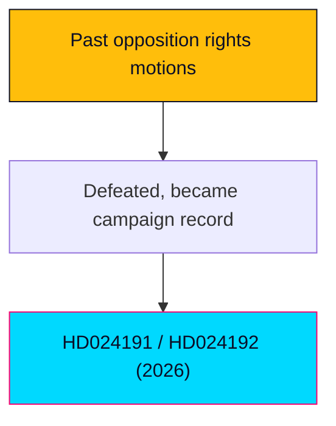

# Historical Parallels — Swedish Opposition Motions, 2026-05-29

> Precedent base-rates for opposition Följdmotioner on rights/security legislation. English; Swedish proper nouns preserved.

## 🗺️ Visual Model

## 🔄 Tradecraft Context

- Pass 1 created; Pass 2 improved. Base-rates are directional, drawn from recurring patterns in Swedish parliamentary practice.

## 📋 Parallel Context

The subject pattern: minor opposition party files Följdmotioner against government security/registration legislation, citing Lagrådet and rights bodies, in a pre-election window, with no prospect of passage. We map this to recurring precedents.

## 🧭 Precedent Map

| ID | Precedent pattern | Similarity to subject |
|----|-------------------|------------------------|
| HP-1 | Opposition Följdmotioner against terrorism/security bills (2019–2022 cycle) citing Lagrådet | High |
| HP-2 | Rights-body-backed opposition to migration tightening (2015–2016, 2021) | High |
| HP-3 | Privacy/surveillance pushback on data and registration powers (FRA-era and successors) | Medium-high |
| HP-4 | Small-party threshold-survival campaigns via signature positions | Medium |

## 📚 Precedent Register

- **HP-1**: Security legislation routinely advanced on government+support majorities despite Lagrådet reservations; Följdmotioner functioned as recorded dissent, not vetoes.
- **HP-2**: Rights-coalition mobilisation (Advokatsamfundet, Civil Rights Defenders, Rädda Barnen) repeatedly shaped public debate without altering chamber outcomes.
- **HP-3**: Integrity arguments have a strong civil-society echo but a weak parliamentary conversion rate when security framing dominates.
- **HP-4**: Threshold parties have historically used signature parliamentary positions to consolidate base turnout with mixed survival outcomes.

## 🧪 Structural-Similarity Scoring (subject vs HP-1)

| Dimension | Match |
|-----------|-------|
| Opposition Följdmotion form | Exact |
| Lagrådet citation | Exact |
| Government+SD majority context | Exact |
| Pre-election timing | Strong |
| Rights-body backing | Strong |
| Outcome (defeat, recorded dissent) | Expected match |

Aggregate structural similarity: **high**.

## 📈 Outcome-Base-Rate Table

| Outcome | Historical base-rate (directional) |
|---------|-------------------------------------|
| Motion defeated, statute unchanged | Very high |
| Minor government concession / tillkännagivande | Low |
| Rights-body narrative shapes media | Moderate-high |
| Measurable electoral effect for the filing party | Low-moderate |

## 🚦 Divergence Tests — Where 2026 is Different

- **Election proximity** (~15 weeks) is tighter than most precedents, raising the campaign-signal weight.
- **Threshold fragility** of MP is more acute, increasing the survival-play interpretation.
- **Two-front coordination** (registration + security in one window) is a sharper pattern than single-issue precedents.

## 📜 What Precedents Suggest vs What is Different

Precedents strongly predict defeat and statute survival (KJ-2 corroborated). They also predict a real civil-society narrative effect but a weak electoral payoff — which tempers MP's upside. The divergence (election proximity, threshold fragility) is what makes this instance higher-stakes for MP than the base-rate would suggest.

## 🧠 Lessons to Carry Forward

- Expect defeat; track reservation language and rights-body amplification as the real outputs.
- Electoral payoff for threshold parties from signature motions is historically modest — weight MP's upside accordingly.

## 📎 Sources

- `scenario-analysis.md`, `comparative-international.md`, `election-2026-analysis.md`.
- Primary: mot 2025/26:4191, mot 2025/26:4192.

## ✅ Pass-2 Self-Audit Checklist (v4.4 — required)

- [x] ≥4 precedents registered.
- [x] Structural-similarity scoring included.
- [x] Outcome base-rate table included.
- [x] Divergence tests included.
- [x] Banned-phrase scan clean.
