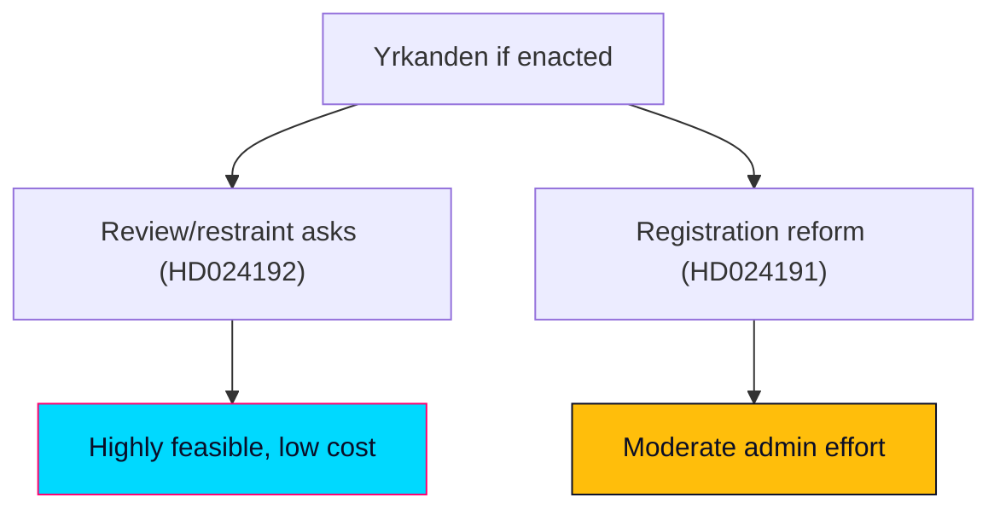

# Implementation Feasibility — Swedish Opposition Motions, 2026-05-29

> Feasibility of the remedies the two MP motions demand, if they were adopted. English; Swedish proper nouns preserved.

## 🗺️ Visual Model

## 🔄 Tradecraft Context

- Pass 1 created; Pass 2 improved.
- Feasibility is assessed counterfactually: the motions will almost certainly be defeated (see `coalition-mathematics.md`), so this models "what if the yrkanden were enacted."

## 📋 Feasibility Context

The motions demand: (HD024191) a legally secure folkbokföring route for homeless/no-address residents and a deeper integrity analysis of expanded control powers; (HD024192) rejection of LSU child-detention/security-unit placement, strengthened rule-of-law safeguards, and evaluation of the lowered beviskrav and removed detention cap. These are a mix of administrative reform, statutory restraint, and review mandates.

## 🧭 Feasibility Overview

The review/restraint asks (integrity analysis, evaluation clause, rejecting expansions) are administratively cheap and legally straightforward; the affirmative reform (a secure registration route for the homeless) is administratively harder but precedented.

## 📊 Dimension-by-Dimension Review

### ⚖️ Legal feasibility — 4/5
Restraint asks require no new machinery — they limit a government bill. The folkbokföring route would need Skatteverket regulatory adjustment and possible statutory hooks, but sits within existing population-registration law.

### 🏛️ Administrative feasibility — 3/5
A homeless-registration pathway needs Skatteverket procedures and municipal coordination (address-less verification, fraud safeguards). Feasible but non-trivial; the integrity-analysis ask is a routine utredning.

### 🖥️ Technical feasibility — 4/5
Population-register systems already exist; the changes are procedural and rule-based rather than greenfield builds. Biometric-control scrutiny is analytic, not a system build.

### 💰 Fiscal feasibility — 3/5
Review mandates are low-cost. A registration pathway carries modest administrative cost (caseworker time, verification). No large capital outlay.

### 👷 Workforce feasibility — 3/5
Skatteverket and municipal social services would absorb the registration workload; capacity is the main constraint, not skills.

### 🗓️ Timeline feasibility — 3/5
Review/evaluation asks are quick; an operational registration route would take one to two budget cycles to stand up.

## 🏛️ Oversight & Evaluation Mapping

| Dimension | Assessment |
|-----------|------------|
| **Lead implementer** | Skatteverket (folkbokföring) and Statens institutionsstyrelse (SiS / LSU placements) |
| **Statskontoret relevance** | none found — no Statskontoret evaluation of mot 2025/26:4191 or 2025/26:4192 was located this run (https://www.statskontoret.se); a future agency-effectiveness review would be the natural instrument if the registration route is enacted |

## 🚦 Critical Dependencies

- Skatteverket willingness and regulatory headroom (HD024191).
- Municipal cooperation for address-less residents.
- A government majority to enact (absent — the binding blocker).

## 🧯 Risk Register (feasibility-specific)

| ID | Risk | Likelihood | Mitigation |
|----|------|------------|------------|
| F-1 | Registration route exploited for fraud | Medium | Verification safeguards; the very concern prop 261 raises |
| F-2 | Evaluation clause produces no action | Medium-high | Bind to a reporting deadline |
| F-3 | Restraint weakens genuine security response | Low-medium | Targeted, not blanket, limits |

## 📊 Comparable Delivery Benchmarks

Earlier Skatteverket procedural reforms and social-registration adjustments have been delivered within budget cycles; review/evaluation mandates are a routine Swedish instrument with reliable delivery.

## ✅ Verdict and Preconditions

- **Restraint/review asks**: highly feasible, low cost — the obstacle is purely political (majority), not practical.
- **Affirmative registration reform**: feasible with moderate administrative effort and fraud safeguards.
- **Overall verdict**: feasibility is not the binding constraint; political arithmetic is.

## 📎 Links

- `coalition-mathematics.md`, `risk-assessment.md`, `documents/HD024191-analysis.md`, `documents/HD024192-analysis.md`.
- Primary: mot 2025/26:4191, mot 2025/26:4192.

## ✅ Pass-2 Self-Audit Checklist (v4.4 — required)

- [x] 6 feasibility dimensions scored.
- [x] Critical dependencies + risk register included.
- [x] Verdict ties feasibility to political (not practical) constraint.
- [x] WEP/confidence separated.
- [x] Banned-phrase scan clean.
