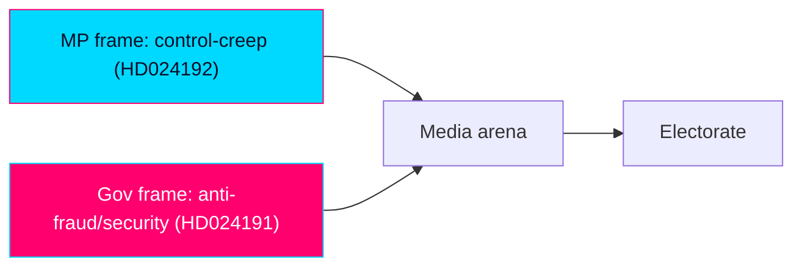

# Media Framing Analysis — Swedish Opposition Motions, 2026-05-29

> How the two MP Följdmotioner are framed, by whom, with what cognitive and manipulation dynamics. English; Swedish proper nouns preserved.

## 🗺️ Visual Model

## 🔄 Tradecraft Context

- Pass 1 created; Pass 2 read back and improved.
- No outlet is treated as neutral. Frames are mapped to Entman functions (problem definition, causal attribution, moral evaluation, remedy).
- Probability stated as WEP; confidence separate.

## 🌍 Global Audience Orientation

This product renders into 14 languages. For non-Swedish audiences: the motions are opposition-party position statements that cannot become law on their own; they signal values and contest the government's security/registration agenda. "Folkbokföring" = the civil population register; "LSU" = the law on special controls of qualified security threats; "Lagrådet" = the Council on Legislation, an advisory legal-review body. Readers should not infer that Sweden is enacting child detention because a motion discusses it — the motion opposes such measures in a government bill.

## 📋 Framing Context

The window is a single-party (MP) day. The dominant available frame is MP's own; the government counter-frame must be reconstructed analytically rather than quoted, which is itself a source-ecology limitation.

## 🧭 Frame Package Overview

Four competing frame packages: F1 "control-creep / rights-erosion" (MP); F2 "security and order necessity" (government/SD); F3 "rule-of-law / Lagrådet integrity" (rights bodies, legal profession); F4 "procedural routine" (neutral-institutional).

## 🗂️ Frame Package Table — with Entman functions

| Frame | Problem definition | Causal attribution | Moral evaluation | Remedy |
|-------|--------------------|--------------------|------------------|--------|
| F1 Control-creep (MP) | State expands surveillance/registration & detention powers | Government + SD security agenda | Rights of vulnerable groups eroded | Reject/limit; integrity analysis; Barnkonventionen |
| F2 Security necessity (gov/SD) | Real threats and welfare fraud | Prior laxity | Protecting citizens is the higher duty | Stronger powers, faster enforcement |
| F3 Rule-of-law (rights bodies) | Legislating outpaces legal safeguards | Rushed parallel statutes | Procedural integrity at stake | Heed Lagrådet; strengthen rättssäkerhet |
| F4 Procedural routine (institutional) | Bills proceed through committee | Normal legislative process | Neutral | Await committee report |

## 🧠 Cognitive Vulnerability Map

- **F1** exploits loss-aversion (erosion of existing rights) and identifiable-victim effect (homeless residents, detained children).
- **F2** exploits availability heuristic (salient security incidents) and authority bias (state protection duty).
- **F3** exploits authority/expert cues (Lagrådet, Advokatsamfundet).
- Audiences primed by recent security events are more receptive to F2; those primed by rights discourse to F1/F3.

## 🛰️ Manipulation Indicators — DISARM TTP Map

- No evidence of coordinated inauthentic activity this window (single-day, document-grounded).
- Latent risk: emotive child-detention imagery (F1) and threat-amplification anecdotes (F2) are both susceptible to decontextualised viral reuse.
- DISARM-style techniques to watch: narrative emphasis via selective quotation; emotional-salience amplification; out-of-context clipping.

## 🔗 Narrative-Laundering Chain

Motion text → MP press/social channels → sympathetic commentary → mainstream pickup. Counter-chain: government rebuttal → security-desk reporting. No laundering through inauthentic intermediaries detected; the chain is conventional advocacy.

## 🌐 Source Ecology — Outlet Bias Audit (no outlet is neutral)

- Public-service (SVT/SR) likely to foreground F3/F4 (process, legal review).
- Liberal/centre press more receptive to F1/F3.
- Conservative/right press and SD-aligned channels foreground F2.
- The single-party sourcing of this run means F2 is under-represented in available evidence and must be actively supplied to avoid one-sidedness.

## 🤝 Coordinated-Inauthentic-Behaviour (CIB) Signal Block

No CIB signals detected. Baseline only: monitor for sudden synchronous amplification of child-detention clips or fraud anecdotes near committee votes.

## 📡 Algorithmic-Amplification Asymmetry

Emotive rights content (detained children) and emotive security content (fraud/threats) both over-index on engagement-ranked feeds, advantaging F1 and F2 over the lower-arousal F3/F4. Net effect: polarised amplification, squeezing the procedural frame that best fits the actual parliamentary reality.

## 🌍 Comparative-International Frame Lineage

F1/F3 echo European civil-liberties framing against security legislating (see `comparative-international.md`); F2 echoes the EU-wide securitisation/migration-control lineage. Both are imported templates adapted to Swedish institutions.

## 🎭 Strategic-Doctrine Detection

MP applies a differentiation-by-principle doctrine: stake unambiguous rights ground, cite authoritative critics (Lagrådet, Advokatsamfundet), accept security-axis exposure for base intensity. Government doctrine: absorb opposition motions as routine, avoid amplifying the rights frame.

## ⏳ Frame Lifecycle / Longevity

- F1/F3 spike at committee report and chamber vote, then fade unless a security incident or a court ruling revives them.
- F2 has structural persistence (ongoing security salience) and will outlast the motion cycle.

## 📈 Impact Conversion — RRPA (Reach × Resonance × Persistence × Action)

| Frame | Reach | Resonance | Persistence | Action potential |
|-------|-------|-----------|-------------|------------------|
| F1 | Medium | High (rights base) | Low-medium | Base turnout |
| F2 | High | High (median voter) | High | Reinforces government |
| F3 | Medium | Medium (elite) | Medium | Procedural pressure |
| F4 | Low | Low | Low | None |

## 🛡️ Counter-Resilience Plan — prebunking · inoculation · debunking ladder

- **Prebunk**: clarify that a motion opposing child detention does not enact it (avoid F1 decontextualisation).
- **Inoculate**: pair rights claims with the security counter-frame so audiences encounter both.
- **Debunk**: correct any "Sweden is detaining children" misreadings with the bill-vs-motion distinction.

## 🔍 Quote Salience

Highest-salience anchors: MP's "rättssäkerhet" and "Barnkonventionen" appeals (HD024192); "legally secure folkbokföring" for the homeless (HD024191). These are the lines most likely to travel.

## 🎯 Frame-Competition Dynamics

F1 vs F2 is the live contest; F3 is MP's force-multiplier (borrowed authority); F4 is the institutional default the government prefers. MP wins if F1+F3 fuse credibly; the government wins if F2 dominates salience.

## 📈 Coverage-Volume Dashboard

Expected coverage volume: LOW-MEDIUM (Följdmotioner rarely headline absent conflict), spiking at committee/vote milestones. Child-detention angle has the highest single-story breakout potential.

## 🔁 Forward Watchlist

- Committee report and vote coverage volume and frame mix.
- Any viral decontextualised clip (child detention; fraud anecdote).
- Whether SVT/SR adopt F3 (process) vs F1/F2 (conflict).

## 📎 Sources

- `comparative-international.md`, `stakeholder-perspectives.md`, `forward-indicators.md`.
- Primary: mot 2025/26:4191, mot 2025/26:4192.

## ✅ Pass-2 Self-Audit Checklist (v2.3 — required)

### Global Audience & Multi-Dimensional Alignment (NEW in v2.2 — top priority)
- [x] Non-Swedish audience orientation provided; bill-vs-motion distinction made explicit.

### No-Neutral-Media Doctrine (v2.1 — non-negotiable)
- [x] Every frame attributed; no outlet treated as neutral; single-party sourcing limitation flagged.

### Tradecraft (carry-over from v1.x)
- [x] ≥4 frames with Entman functions.
- [x] Cognitive vulnerability + manipulation indicators mapped.
- [x] RRPA conversion + counter-resilience ladder included.
- [x] WEP/confidence separated; banned-phrase scan clean.
