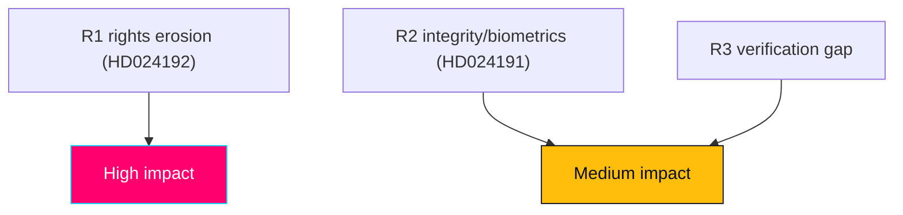

# Risk Assessment — Swedish Opposition Motions, 2026-05-29

> Risk assessment across legislative, rights, institutional, and political dimensions. Authored in English; Swedish proper nouns preserved. WEP/confidence separated.

## 🗺️ Visual Model

## 🔄 Tradecraft Context

- Pass 1 created; Pass 2 read-back and improved.
- Evidence: HD024191, HD024192 full text (Admiralty A2, confidence HIGH).
- Risks surfaced by the motions are distinguished from risks to the motions' sponsors.

## ⚖️ Risk Register

| # | Risk | Type | Likelihood (WEP) | Impact | Confidence |
|---|------|------|------------------|--------|------------|
| R1 | LSU amendments enact lowered beviskrav ("sannolikt"→"kan antas") + uncapped verkställighetsförvar + child detention | Rights / rule-of-law (surfaced by HD024192) | likely (bill proceeds) | HIGH | MEDIUM on exact content |
| R2 | Folkbokföring biometric control powers erode integrity & equal treatment for foreign-background residents | Integrity / data-protection (HD024191) | even chance of disparate impact | MEDIUM-HIGH | MEDIUM |
| R3 | Homeless/no-address residents lose registration-dependent rights | Social-exclusion / administrative-justice (HD024191) | even chance absent correction | MEDIUM | MEDIUM |
| R4 | Both motions fail to alter their statutes | Legislative (to MP) | very likely | LOW (expected) | HIGH |
| R5 | MP suffers "soft on security" framing damage | Political (to MP) | even chance | MEDIUM | MEDIUM |
| R6 | Lagrådet-flagged legislative-process defects produce later legal challenge | Institutional / litigation | unlikely near-term | MEDIUM | LOW-MEDIUM |
| R7 | Pre-election security incident collapses the rights-critique space | Exogenous / high-impact | low-probability | HIGH | MEDIUM |

## 🔎 Risk Narratives

- **R1 (rule-of-law).** The combination of a lowered evidentiary standard, removal of the one-year (extendable to three-year) detention cap, and child detention concentrates coercive discretion in the executive. If enacted as MP characterises it, this is the window's most serious democratic-quality exposure. The Lagrådet's criticism of parallel legislating raises legislative-quality risk independently of the policy merits.
- **R2/R3 (integrity & exclusion).** Folkbokföring is "in practice a key" to rights and services; biometric comparison and an unworkable address requirement create both a privacy exposure (GDPR Art. 9 special-category data) and an administrative-justice gap. Disparate impact on foreign-background residents is the equal-treatment risk MP foregrounds.
- **R4/R5 (to MP).** Defeat is expected and priced in; the real political risk is the security-axis exposure on HD024192, partially offset by the calibration of HD024191.
- **R6 (institutional).** Lagrådet criticism is a procedural vulnerability that could feed later constitutional (KU) attention or litigation, though near-term effect is limited.
- **R7 (exogenous).** A low-probability/high-impact event that would invert the political calculus; monitored as a signpost.

## 🚦 Residual & Monitoring

- Independent retrieval of prop 2025/26:261 and 2025/26:267 plus the Lagrådet yttrande would raise R1/R2 confidence from MEDIUM toward HIGH.
- Monitor bet SkU30/JuU45 dispositions and recorded votes as the primary risk-resolution signposts.

## ✅ Pass-2 Self-Audit Checklist

- [x] Risks-surfaced vs risks-to-sponsor distinguished.
- [x] WEP likelihood separated from confidence-in-evidence.
- [x] Exogenous high-impact risk (R7) included.
- [x] Banned-phrase scan clean.
