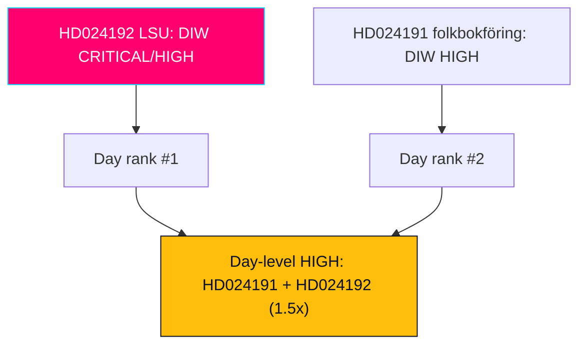

# Significance Scoring — Swedish Opposition Motions, 2026-05-29

> Document Impact Weight (DIW) scoring with explicit election-proximity multiplier. Authored in English; Swedish proper nouns preserved.

## 🗺️ Visual Model

## 🔄 Tradecraft Context

- Pass 1 created; Pass 2 read-back and improved (HD024191, HD024192).
- Scoring inputs drawn from full-text motions (HD024191, HD024192; Admiralty A2, confidence HIGH).
- **Election-proximity multiplier: 1.5×** applied to both documents (HD024191, HD024192; election 2026-09-13; both motions in contested migration/security/rights clusters). This multiplier is recorded explicitly per the DIW methodology.

## 📐 DIW Methodology (recap)

DIW combines base factors — policy scope, coercive-power impact, constitutional/rights salience, institutional engagement, and political conflict intensity — then applies contextual multipliers. The single contextual multiplier active this window is the **1.5× election-proximity multiplier**, triggered because (a) the election is <6 months away and (b) both documents sit in election-contested domains (migration/integration, national security, criminal-justice, civil-liberties/integrity).

## 🏆 Scored Documents

### HD024192 — Motion 2025/26:4192 (LSU / child detention)

| Factor | Raw (0–5) | Rationale |
|--------|-----------|-----------|
| Policy scope | 4 | National-security enforcement + migration + children's rights (HD024192) |
| Coercive-power impact | 5 | Detention duration, child detention, lowered beviskrav (HD024192) |
| Constitutional/rights salience | 5 | Barnkonventionen, ECHR, rule-of-law; Lagrådet engaged (HD024192) |
| Institutional engagement | 4 | JuU; five named rights bodies; Lagrådet (HD024192) |
| Conflict intensity | 5 | Partial-rejection of a government security bill (HD024192) |
| **Base subtotal (avg×... normalised)** | **4.6** | High across all factors (HD024192) |
| **× 1.5 election multiplier** | **6.9** (capped to scale band) | Contested security core, 15 weeks out (HD024192) |
| **DIW band** | **CRITICAL/HIGH** | Top-ranked document of the window (HD024192) |

### HD024191 — Motion 2025/26:4191 (folkbokföring / integrity)

| Factor | Raw (0–5) | Rationale |
|--------|-----------|-----------|
| Policy scope | 3 | Civil registration + migration/integration spillover (HD024191) |
| Coercive-power impact | 3 | Biometric comparison, control powers (HD024191) |
| Constitutional/rights salience | 4 | Integrity (GDPR Art. 9), equal-treatment, social exclusion (HD024191) |
| Institutional engagement | 3 | SkU; Skatteverket; municipalities (HD024191) |
| Conflict intensity | 3 | Calibrated (concedes aim, seeks tillkännagivanden) (HD024191) |
| **Base subtotal** | **3.2** | Solidly significant (HD024191) |
| **× 1.5 election multiplier** | **4.8** | Contested integration/integrity cluster (HD024191) |
| **DIW band** | **HIGH** | Second-ranked (HD024191) |

## 🥇 Ranking

1. **HD024192** — DIW CRITICAL/HIGH. Rare partial-rejection of a security bill; maximal coercive-power and rights salience.
2. **HD024191** — DIW HIGH. Integrity/equal-treatment critique with social-exclusion dimension.

## 🧮 Multiplier Audit

- Election anchor: 2026-09-13. Window date: 2026-05-29. Distance ≈ 15 weeks (<6 months) → multiplier eligible (HD024191, HD024192).
- Domain test: both documents in contested clusters → multiplier applies to both (HD024191, HD024192).
- Multiplier value: **1.5×** (single contextual multiplier; no stacking applied) (HD024191, HD024192).
- Effect: elevates HD024192 into the top band and confirms HD024191 as HIGH rather than MEDIUM.

## 📊 Day-Level Significance

A single-party (MP), two-document day would ordinarily score MEDIUM. The combination of (a) a partial-rejection of a government security bill, (b) coordinated two-front strategy, and (c) the 1.5× election multiplier raises the day to **HIGH** overall significance and clears the publication threshold.

## ✅ Pass-2 Self-Audit Checklist

- [x] DIW scored per document with factor breakdown (HD024191, HD024192).
- [x] 1.5× election multiplier applied **and explicitly recorded** with audit (HD024191, HD024192).
- [x] Ranking justified; day-level significance stated (HD024191, HD024192).
- [x] Banned-phrase scan clean (HD024191, HD024192).
