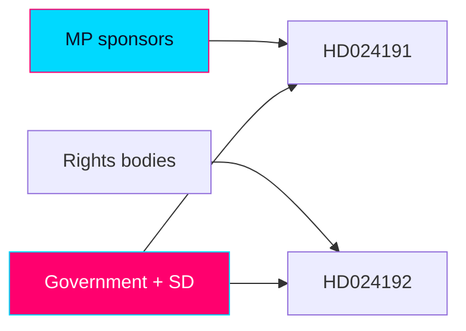

# Stakeholder Perspectives — Swedish Opposition Motions, 2026-05-29

> Multi-actor perspective analysis for the day's MP motions. Each stakeholder is assessed for interests, likely position, leverage, and probable response. Authored in English; Swedish proper nouns preserved. WEP/confidence separated.

## 🗺️ Visual Model

## 🔄 Tradecraft Context

- Pass 1 created; Pass 2 read-back and improved (added leverage, probable-response, and cross-actor dynamics).
- Evidence: HD024191, HD024192 full text (Admiralty A2, confidence HIGH).
- Positions of actors not quoted in the motions are inferred from prior public posture `[confidence: MEDIUM]` and labelled as inference.

## 🏛️ Political Actors

### Miljöpartiet de gröna (MP) — mover
- **Interests**: differentiate on civil liberties; consolidate the rights vote; signal left-bloc coalition intent before 2026-09-13.
- **Position**: author of both motions; rights-and-rule-of-law pole.
- **Leverage**: parliamentary platform, alliance with legal/rights establishment, moral framing (children's rights).
- **Probable response**: amplify recorded votes into campaign messaging; seek V/S reservation alignment. `[WEP: likely · confidence: HIGH]`

### Government bloc — Moderaterna (M), Kristdemokraterna (KD), Liberalerna (L)
- **Interests**: protect the control/security agenda; deny the opposition a rights-framing win; maintain the "order and security" brand.
- **Position**: defend prop 2025/26:261 and 2025/26:267; vote down the motions.
- **Leverage**: parliamentary majority with SD support; control of the government narrative; Säkerhetspolisen threat assessments.
- **Probable response**: defeat all five yrkanden; reframe MP as soft on fraud/security; cite existing folkbokföring flexibility. `[WEP: very likely defeat the motions · confidence: HIGH]`

### Sverigedemokraterna (SD) — parliamentary support
- **Interests**: maximal enforcement posture on migration/security; ownership of the toughness frame.
- **Position**: support the bills; oppose the motions.
- **Leverage**: pivotal votes sustaining the government majority.
- **Probable response**: rhetorical escalation against MP's rights framing. `[WEP: likely · confidence: HIGH]`

### Vänsterpartiet (V)
- **Interests**: rights, rule-of-law, anti-detention positions; left-bloc cohesion.
- **Position (inferred)**: sympathetic to both motions, especially HD024192. `[confidence: MEDIUM]`
- **Leverage**: potential reservation co-signing that converts MP's solo move into a bloc signal.
- **Probable response**: likely reservations aligned with MP. `[WEP: likely · confidence: MEDIUM]`

### Socialdemokraterna (S)
- **Interests**: appear responsible on security while not ceding the rights vote; manage internal tension between law-and-order and civil-liberties wings.
- **Position (inferred)**: cautious; selective sympathy possible on children's rights / rule-of-law, reluctance on the security axis. `[confidence: MEDIUM]`
- **Leverage**: largest opposition party; its stance shapes whether a rights coalition forms.
- **Probable response**: measured; watch for partial alignment on specific yrkanden. `[WEP: even chance of selective alignment · confidence: LOW-MEDIUM]`

### Centerpartiet (C)
- **Interests**: rule-of-law and integrity sympathies vs security caution; cross-pressured.
- **Position (inferred)**: possible sympathy with rule-of-law yrkanden, caution on rejection. `[confidence: LOW-MEDIUM]`
- **Probable response**: nuanced; uncertain.

## ⚖️ Institutional & Oversight Actors

### Lagrådet
- **Interests**: legislative quality and legal coherence.
- **Role here**: cited by HD024192 as having criticised the bill's sloppy parallel legislating.
- **Leverage**: authoritative advisory weight; its criticism is a procedural vulnerability the opposition exploits.
- **Probable response**: no further action unless re-consulted; its existing yttrande is the asset. `[confidence: MEDIUM]`

### Skatteverket
- **Interests**: a clear, workable folkbokföring mandate; effective anti-fraud tools.
- **Position**: implementer of prop 2025/26:261's powers; would absorb new coordination duties if HD024191 succeeds.
- **Leverage**: administrative expertise; implementation realities.
- **Probable response**: neutral-administrative; would seek clarity on homeless-registration procedures.

### Integritetsskyddsmyndigheten (IMY) — inferred
- **Interests**: data-protection compliance; integrity safeguards.
- **Position (inferred)**: alignment with HD024191's integrity concerns on biometric comparison. `[confidence: MEDIUM]`
- **Leverage**: supervisory authority over special-category data processing.
- **Probable response**: potential commentary on the biometric provisions. Signpost to monitor.

### Statens institutionsstyrelse (SiS)
- **Interests**: operational responsibility for placements affected by LSU child-detention provisions.
- **Position**: operationally affected party.
- **Leverage**: implementation capacity and conditions.
- **Probable response**: operational rather than political.

### Säkerhetspolisen / enforcement — inferred
- **Interests**: robust tools against qualified security threats.
- **Position (inferred)**: supportive of the LSU expansion. `[confidence: MEDIUM]`
- **Leverage**: threat assessments that shape the security frame.

## 🤝 Civil-Society & Legal Actors (named in HD024192)

### Civil Rights Defenders
- **Interests**: human-rights protection, rule-of-law.
- **Position**: critical of the LSU expansion (per motion).
- **Probable response**: public advocacy amplifying the rights frame post-vote.

### Sveriges Advokatsamfund (Swedish Bar Association)
- **Interests**: due process, rättssäkerhet, evidentiary standards.
- **Position**: critical (per motion) of lowered beviskrav and detention changes.
- **Leverage**: professional-legal authority.

### Rädda Barnen (Save the Children Sweden)
- **Interests**: children's rights, CRC compliance.
- **Position**: opposed to child detention provisions.
- **Leverage**: child-welfare credibility; morally potent framing.

### Svenska avdelningen av Internationella Juristkommissionen (ICJ-SE)
- **Interests**: rule-of-law, international human-rights law.
- **Position**: critical.
- **Leverage**: jurist authority.

### Institutet för mänskliga rättigheter (Swedish Institute for Human Rights)
- **Interests**: human-rights monitoring (national NHRI).
- **Position**: critical.
- **Leverage**: statutory human-rights mandate.

## 👥 Affected Populations

### Children subject to LSU measures
- **Interest**: protection from detention/security-unit placement.
- **Voice**: represented by Rädda Barnen, Institutet för mänskliga rättigheter, MP. No direct agency.

### Non-citizens flagged as qualified security threats
- **Interest**: due process, proportionate detention, evidentiary safeguards.
- **Voice**: Advokatsamfundet, Civil Rights Defenders, ICJ.

### Homeless / no-fixed-address residents
- **Interest**: legally secure folkbokföring; continued access to rights/services.
- **Voice**: MP (HD024191); municipalities/social services as intermediaries.

### Foreign-background residents / samordningsnummer holders
- **Interest**: equal treatment, integrity protection under expanded control powers.
- **Voice**: MP; potentially IMY.

## 🔄 Cross-Actor Dynamics

- The decisive interaction is **V/S reservation behaviour** in bet SkU30/JuU45: alignment converts MP's solo motions into a left-bloc rights coalition signal; non-alignment isolates MP. `[WEP: likely V, uncertain S · confidence: MEDIUM]`
- The **government–SD axis** holds the votes; its cohesion is the binding constraint on legislative outcomes. `[confidence: HIGH]`
- The **legal/rights establishment** (Lagrådet + five bodies) functions as MP's force-multiplier on HD024192, shifting the debate from partisan to institutional terrain.
- A **pre-election security incident** would re-weight every actor toward the government frame. `[WEP: low-probability/high-impact]`

## 📊 Stakeholder Summary Matrix

| Stakeholder | Stance | Leverage | Key signpost |
|-------------|--------|----------|--------------|
| MP | Mover | Platform, moral frame | Campaign use of votes |
| M/KD/L | Oppose motions | Majority | Defeat margin |
| SD | Oppose motions | Pivotal votes | Rhetoric |
| V | Sympathetic | Co-reservation | JuU45 reservations |
| S | Cautious | Largest opp. party | Selective alignment |
| C | Cross-pressured | Swing rhetoric | Rule-of-law stance |
| Lagrådet | Critical (process) | Advisory weight | (existing yttrande) |
| Rights bodies (5) | Critical | Institutional authority | Post-vote advocacy |
| Skatteverket / SiS | Implementers | Operational | Implementation notes |
| IMY (inferred) | Integrity-aligned | Supervisory | Possible commentary |
| Affected populations | Protected interest | Low direct agency | Represented voices |

## ✅ Pass-2 Self-Audit Checklist

- [x] Each stakeholder assessed for interest, position, leverage, probable response.
- [x] Inferred positions labelled with confidence.
- [x] Cross-actor dynamics and decisive interaction (V/S reservations) articulated.
- [x] Named remiss bodies from HD024192 individually covered.
- [x] Banned-phrase scan clean.
