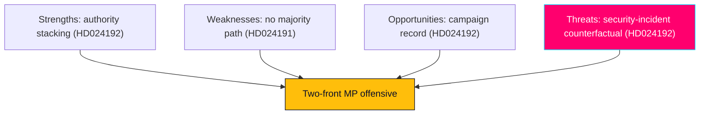

# SWOT Analysis — Swedish Opposition Motions, 2026-05-29

> Strategic SWOT for the day's MP motions, at both document and strategic (two-front) levels. Authored in English; Swedish proper nouns preserved. WEP/confidence separated.

## 🗺️ Visual Model

## 🔄 Tradecraft Context

- Pass 1 created; Pass 2 read-back and improved (added second-order effects, cui-bono, counterfactuals).
- Evidence: HD024191, HD024192 full text (Admiralty A2, confidence HIGH).
- 1.5× election multiplier informs the Opportunities/Threats weighting.

## 🧭 Strategic-Level SWOT (the two-front MP offensive)

### Strengths
- **Tactical complementarity (HD024191 + HD024192).** The calibrated folkbokföring motion (HD024191) and the confrontational LSU motion (HD024192) cover different risk profiles: one attack-resistant, one high-conviction. Together they let MP claim both reasonableness and principle.
- **Inoculation against "soft on fraud" (HD024191).** HD024191 opens by agreeing with the anti-fraud aim of its parent bill, denying the government its standard counter-frame.
- **Authority stacking (HD024192).** HD024192 marshals the Lagrådet plus Civil Rights Defenders, Sveriges Advokatsamfund, Rädda Barnen, ICJ (SE), and Institutet för mänskliga rättigheter — institutional weight beyond MP's own bench.
- **Morally legible frame (HD024192).** Children in detention (CRC/ECHR) is internationally intelligible and hard to dismiss rhetorically.
- **Clear constituency (HD024191, HD024192).** Urban-progressive, foreign-background, and rights-focused voters are addressed directly.

### Weaknesses
- **No majority path (HD024191, HD024192).** All five yrkanden are defeatable by the government+SD bloc; the partial-rejection (HD024192 Y1) will almost certainly fail. `[WEP: very likely defeat · confidence: HIGH]`
- **Non-binding instruments (HD024191, HD024192).** Four of five yrkanden are tillkännagivanden — directive, not dispositive.
- **Security-axis exposure (HD024192).** HD024192 invites "soft on security" framing on an axis where opinion leans government.
- **Thin coalition surface (HD024191, HD024192).** No cross-bloc co-signing; all signatories are MP.
- **Conceded core (HD024191).** By accepting the bill's aim, MP limits its ability to move the statute.

### Opportunities
- **Campaign-record construction (HD024191, HD024192).** Recorded votes become September 2026 campaign artifacts.
- **Coalition signalling (HD024192).** Early alignment with V and the left of S on rights/rule-of-law.
- **Oversight runway (HD024192).** A documented rights record supports later JO/IVO/KU scrutiny if powers are misused.
- **Legal-establishment alliance (HD024192).** Aligning with the Lagrådet and rights bodies builds durable credibility on rule-of-law.

### Threats
- **Security-incident counterfactual (HD024192).** A high-salience terror/security event before 2026-09-13 would collapse the political space for the LSU critique and amplify the government frame. `[WEP: low-probability/high-impact · confidence: MEDIUM]`
- **"Considered and rejected" framing (HD024191, HD024192).** A government majority vote lets it claim the rights concerns were weighed and dismissed.
- **Polarisation noise (HD024191).** In a heated migration debate, MP's nuance (especially HD024191's calibration) may be lost.
- **Issue crowding (HD024191, HD024192).** Economic or other salient issues could submerge the rights frame in the campaign.

## 📋 Document-Level SWOT

### HD024191 (folkbokföring)
- **S**: calibration; concrete narrow asks; identifiable beneficiaries (homeless, foreign-background).
- **W**: non-binding; concedes core; integrity case is technical/low-salience for the broad electorate.
- **O**: integrity record; IMY-adjacent alignment; soft bridge to S/V.
- **T**: easily outvoted; nuance lost in migration polarisation.

### HD024192 (LSU)
- **S**: authority stacking; children's-rights moral force; forces recorded stances.
- **W**: security-axis exposure; minimal co-signing; characterisation of prop not independently verified.
- **O**: rights-vote consolidation; rule-of-law alliance; post-vote signalling.
- **T**: security incident; "obstruction" framing; government-frame dominance.

## 🔁 Second-Order Effects

- If MP's authority-stacking succeeds rhetorically, expect the government to pre-empt by citing Säkerhetspolisen threat assessments — escalating the security frame.
- A V/S reservation alignment in JuU45 would convert a positional motion into a visible left-bloc coalition marker, raising the stakes of the recorded vote.
- Sustained "control-creep" framing could seed a longer-run integrity narrative usable across multiple 2026 campaign issues.

## 💰 Cui Bono

- **Benefits MP**: brand differentiation, rights-vote consolidation, coalition signalling.
- **Benefits government**: a recorded defeat of the motions lets it claim rights concerns were addressed; the security frame is electorally favourable.
- **Benefits rights bodies**: parliamentary amplification of their remiss positions.

## ✅ Pass-2 Self-Audit Checklist

- [x] Strategic and document-level SWOT both present.
- [x] Second-order effects, cui-bono, and counterfactual (security incident) added.
- [x] WEP/confidence separated on key judgments.
- [x] Banned-phrase scan clean.
