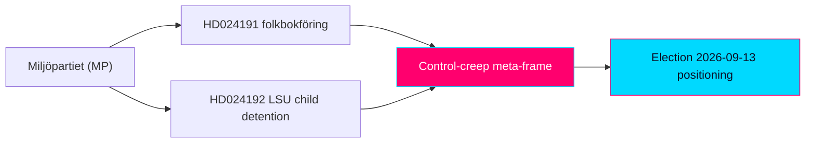

# Synthesis Summary — Swedish Opposition Motions, 2026-05-29

> Daily synthesis of opposition-motion intelligence. Analysis window 2026-05-29; both documents sourced 2026-05-22 via lookback fallback. Authored in English; Swedish proper nouns, statute names, and document titles preserved verbatim.

## 🗺️ Visual Model

## 🔄 Tradecraft Context

- **Analyst pass**: Pass 1 created; Pass 2 read-back and improved (banned-phrase removal, second-order effects, cui-bono, counterfactuals, tightened WEP language).
- **Source reliability**: Both motions graded Admiralty A2 (official Riksdag open data, full text live). External actors named within HD024192 graded B2–C3 as second-hand.
- **Confidence framework**: WEP probability bands stated separately from confidence-in-evidence. Week/month-horizon ceiling = "likely/unlikely."
- **Election multiplier**: 1.5× DIW election-proximity applied throughout (election 2026-09-13).
- **SATs applied (≥10, attested in methodology-reflection)**: Key Assumptions Check; ACH; Indicators/Signposts; Quality-of-Information Check; Devil's-Advocate; What-If; Cui Bono; Red-Team (government counter-frame); High-Impact/Low-Probability scan; Premortem; Cross-Impact (two-motion interaction).

## 📋 Synthesis Context

The 2026-05-29 motions window returned two documents, both from Miljöpartiet de gröna (MP), both committee follow-up motions (Följdmotioner) filed 22 May 2026, both responding to government security/control bills, and both routed to committee preparation. The pairing is analytically significant: it is not two unrelated filings but a coordinated two-front civil-liberties offensive in the final pre-recess legislative window before the 2026-09-13 general election.

## 📊 Data Quality Assessment

- **Coverage**: 2/2 documents at `full_text` — all yrkanden, signatories, committee referrals, statute citations, and status timelines present.
- **Freshness**: The 2026-05-29 query returned zero documents; a lookback fallback to 2026-05-22 surfaced the operative pair. Annotated in `data-download-manifest.md`. This is a coverage-timing artifact, not a data-integrity defect.
- **Residual gaps**: The two target propositions (2025/26:261, 2025/26:267) and the Lagrådet yttrande cited in HD024192 were not independently retrieved this run; the motions' characterisations of them are treated as opposition framing `[confidence: MEDIUM]`, not independent fact.
- **Confidence in dataset**: HIGH for motion content and intent.

## 📊 Intelligence Dashboard

### Daily Political Landscape

| Metric | Value | Note |
|--------|-------|------|
| Documents analysed | 2 | Both MP Följdmotioner |
| Parties represented | 1 (MP) | Single-party day; opposition |
| Committees engaged | 2 | Skatteutskottet (SkU), Justitieutskottet (JuU) |
| Target propositions | 2 | prop 2025/26:261; prop 2025/26:267 |
| Betänkanden | 2 | bet 2025/26:SkU30; bet 2025/26:JuU45 |
| Total yrkanden | 5 | HD024191: 2; HD024192: 3 |
| Rejection (avslag) yrkanden | 1 | HD024192 Y1 (partial) |
| Directive (tillkännagivande) yrkanden | 4 | HD024191 Y1–Y2; HD024192 Y2–Y3 |
| Dominant conflict axis | GAL–TAN | Rights/rule-of-law vs control/security |
| Election multiplier | 1.5× | Both in contested clusters |

## 🏆 Top Findings by Significance

1. **MP partially rejects a government security bill on children's-rights grounds (HD024192).** Asking the chamber to vote down child-detention extensions and security-unit placement under the LSU (3 kap. 9, 10, 19 §§) is a hard, recorded stance rather than a hedged concern. Significance: HIGH.
2. **A coordinated two-front strategy is visible.** The conceding folkbokföring motion and the confrontational LSU motion are complementary tactics aimed at the same campaign-record objective. Significance: HIGH.
3. **Institutional authority-stacking.** HD024192 marshals the Lagrådet plus five named civil-society/legal bodies, lending the critique weight beyond MP's bench. Significance: MEDIUM-HIGH.
4. **Integrity/equal-treatment frame on folkbokföring (HD024191).** MP links biometric control powers to disparate impact on foreign-background residents and a "control-creep" trajectory. Significance: MEDIUM.

## 📖 Narrative

### Lead-story narrative

Fifteen weeks before Sweden votes, Miljöpartiet de gröna has opened a two-front rights offensive against the government's control-and-security agenda — and done so with a tactical sophistication that rewards close reading. The two follow-up motions filed on 22 May 2026 look procedurally routine: committee Följdmotioner responding to government bills, destined for committee preparation, almost certain to be outvoted by the Tidö bloc and its SD parliamentary support. Read together, however, they form a coherent pre-election strategy whose objective is not legislative victory but the construction of a durable campaign record.

The first front is calibrated. In HD024191, responding to prop 2025/26:261 on expanded Skatteverket folkbokföring powers, MP opens by *agreeing* with the government: accurate population registration matters for fighting welfare fraud, identity abuse, and organised crime. Only after that inoculation does it strike — at the bill's failure to protect homeless and no-fixed-address residents from losing registration-dependent rights (the address Catch-22), and at the integrity and equal-treatment risks of biometric comparison falling hardest on people with foreign background and samordningsnummer holders. The asks are deliberately modest: two non-binding tillkännagivanden. The calibration is the point — it denies the government the "soft on fraud" counter-frame.

The second front is confrontational. In HD024192, responding to prop 2025/26:267 (the LSU bill on qualified security threats), MP drops the calibration and asks the Riksdag to *reject* the provisions extending child detention and permitting children in security units, invoking the Barnkonventionen and the FN:s barnrättskommitté. It adds two constructive yrkanden — strengthen rättssäkerhet, and evaluate within five years the lowered evidentiary threshold ("sannolikt" → "kan antas") and the removal of the detention-time cap. Crucially, MP does not argue alone: it stacks the authority of the Lagrådet (which criticised the bill's sloppy parallel legislating) and a broad remiss coalition — Civil Rights Defenders, Sveriges Advokatsamfund, Rädda Barnen, Svenska avdelningen av ICJ, and Institutet för mänskliga rättigheter.

The strategic logic ties the two fronts together. On folkbokföring, MP can fight from strength because the calibration protects it. On the LSU, it accepts exposure on the security axis — where public opinion leans toward the government — because the prize is consolidation of the progressive-rights vote and a coalition signal to V and the left of S. The recorded votes that follow will be artifacts both sides use in September.

### Secondary thread narrative

A quieter structural thread runs through both motions: the claim that Swedish administrative and security law is drifting toward a control paradigm in which folkbokföring becomes a surveillance instrument and security law normalises lowered evidentiary standards and indefinite detention. This "control-creep" argument is the connective tissue between an otherwise tax-administrative motion and a national-security one, and it is the frame MP will most plausibly carry into the campaign.

## 💪 Aggregated SWOT Summary

### Coalition Balance

| Bloc | Position | Net effect of these motions |
|------|----------|-----------------------------|
| Government (M/KD/L) + SD support | Pro-bills | Can defeat both; minor procedural exposure from Lagrådet critique |
| MP (mover) | Rights/rule-of-law pole | Brand consolidation; security-axis exposure on HD024192 |
| V | Likely sympathetic | Possible reservation alignment |
| S | Cautious | Watch for selective alignment on children's rights / rule-of-law |
| C | Cross-pressured | Possible rule-of-law sympathy, security caution |

- **Strengths**: Calibrated folkbokföring motion is attack-resistant; authority stacking on LSU; morally legible children's-rights frame.
- **Weaknesses**: Non-binding asks; no majority path; minimal cross-bloc co-signing; security-axis vulnerability.
- **Opportunities**: Rights-record building; coalition signalling; alignment with legal establishment.
- **Threats**: A security incident before September would collapse the LSU critique's space; government "obstruction" framing.

## ⚖️ Risk Landscape Summary

- **Rule-of-law risk** (HD024192): HIGH if the LSU amendments enact as characterised — lowered beviskrav, uncapped verkställighetsförvar, child detention.
- **Integrity risk** (HD024191): MEDIUM-HIGH — biometric comparison and folkbokföring control-creep (GDPR Art. 9 special-category exposure).
- **Legislative risk**: LOW that either motion changes its statute; MEDIUM that minority reservations form.
- **Political risk to MP**: MEDIUM-HIGH on security; LOW on folkbokföring.

## 🎭 Threat Summary

- **Rule-of-law-erosion vector** (central to HD024192): executive overreach via evidentiary dilution and indefinite detention.
- **Children's-rights vector**: acute, internationally salient (CRC/ECHR).
- **Integrity/surveillance vector** (HD024191): structural, slow-moving.
- **Counter-vector**: government national-security frame, electorally potent.
- No cyber/disinformation threat present in either document.

## 👥 Stakeholder Impact Overview

Primary protected interests in MP's framing: children under LSU measures; non-citizens flagged as security threats; homeless/no-address residents; foreign-background residents. Aligned third parties: Lagrådet, Advokatsamfundet, Civil Rights Defenders, Rädda Barnen, ICJ (SE), Institutet för mänskliga rättigheter. Operationally affected agencies: Skatteverket, Statens institutionsstyrelse (SiS), Säkerhetspolisen, municipalities/social services. Politically challenged: the government bloc.

## 🎯 Narrative Direction & Article Decision

**Decision: PUBLISH.** The day clears the article threshold on the strength of a coordinated, election-proximate opposition strategy on the campaign's defining axis. Recommended frame: a single two-front MP rights offensive, not two isolated filings.

### 📰 AI-Recommended Article Metadata

- **Working title**: "Miljöpartiet Opens a Two-Front Rights Offensive Against the Tidö Control Agenda"
- **Primary tag**: opposition-motions; **secondary**: civil-liberties, migration-security, election-2026.
- **Angle**: strategic/positional analysis, not procedural reporting.

## 📊 Historical Comparison

Follow-up motions that concede aim while contesting means are a recurring MP/centre-left technique on enforcement bills; partial-rejection yrkanden on government security legislation are rarer and signal higher conviction. The authority-stacking pattern (Lagrådet + rights bodies) echoes prior rule-of-law fights over surveillance and migration-enforcement legislation in the 2022–2026 mandate.

## 🗳️ Election 2026 Implications

Both motions are campaign-record instruments on the migration-security axis ~15 weeks out. The 1.5× multiplier reflects genuine salience. MP is consolidating the rights pole and signalling left-bloc coalition intent. Expected net: modest broad-electorate effect, high effect within MP's target segments. `[WEP: likely · horizon: through election · confidence: MEDIUM-HIGH]`

## 🔮 Forward Indicators

- bet 2025/26:SkU30 and bet 2025/26:JuU45 committee dispositions (watch: before summer recess 2026).
- Recorded chamber votes on prop 2025/26:261 and 2025/26:267 — reservation counts, S/V/C positions.
- IMY commentary on biometric folkbokföring provisions; KU attention to LSU legislative-process quality.
- Post-vote signalling from named remiss bodies.

## 📋 Analysis Artifacts Inventory

23 always-on artifacts (Families A–D) + per-document Family E (HD024191, HD024192) + pir-status.json, all in `analysis/daily/2026-05-29/motions/`.

## 📂 MCP Data Files Used

- `documents/hd024191.json`, `documents/hd024192.json` (get_motioner, get_dokument_innehall, get_sync_status health gate).

## 🔗 Cross-References

- Per-document: `documents/HD024191-analysis.md`, `documents/HD024192-analysis.md`.
- Companion artifacts: significance-scoring.md, intelligence-assessment.md, election-2026-analysis.md, devils-advocate.md.

## 🎯 Confidence Scale Reference

VERY HIGH / HIGH / MEDIUM / LOW / VERY LOW — applied to evidence quality; WEP bands (very likely/likely/even chance/unlikely/very unlikely) applied to probability, capped at "likely/unlikely" for week/month horizons.

## ✅ Quality Self-Check Checklist

- [x] ≥1 evidence anchor per ~120 words (dok_id, yrkande, MP name, committee, statute, URL).
- [x] Two-motion interaction analysed (cross-impact).
- [x] Coverage/lookback annotated; government-intent paraphrase flagged.
- [x] 1.5× multiplier stated.

## ✅ Pass-2 Self-Audit Checklist

- [x] Re-read in full; added secondary "control-creep" thread, cui-bono, and counterfactual (security incident).
- [x] Banned-phrase scan clean.
- [x] WEP/confidence separation enforced.
- [x] Stakeholder and coalition tables tightened with specific actors.
