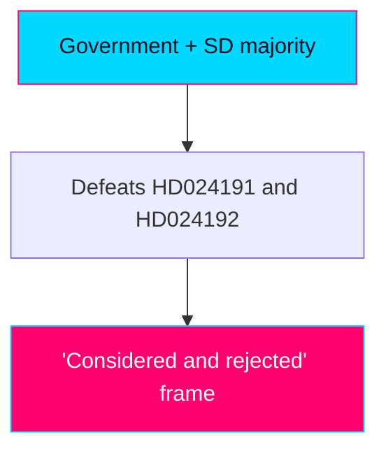

# Threat Analysis — Swedish Opposition Motions, 2026-05-29

> Political threat taxonomy applied to the day's motions. Authored in English; Swedish proper nouns preserved. This artifact assesses threats to democratic quality and institutional norms surfaced or implicated by the documents — not security threats in the operational sense.

## 🗺️ Visual Model

## 🔄 Tradecraft Context

- Pass 1 created; Pass 2 read-back and improved.
- Evidence: HD024191, HD024192 full text (Admiralty A2, confidence HIGH).
- Threat severity expressed conditionally (if the characterised provisions enact).

## 🎭 Threat Vectors

### V1 — Rule-of-law erosion (central, HD024192)
- **Mechanism**: lowering the evidentiary threshold from "sannolikt" to "kan antas," removing the detention-time cap, and permitting child detention/security-unit placement under the LSU.
- **Severity if enacted**: HIGH — concentrates the state's most coercive powers with reduced judicial constraint.
- **Corroboration**: Lagrådet criticism of parallel legislating; remiss opposition from Advokatsamfundet, ICJ (SE), Institutet för mänskliga rättigheter.
- **Confidence**: MEDIUM (motion characterisation not independently verified).

### V2 — Children's-rights erosion (HD024192)
- **Mechanism**: extended child detention and children in security units.
- **Severity**: HIGH and internationally salient (Barnkonventionen/CRC, FN:s barnrättskommitté, ECHR).
- **Confidence**: MEDIUM-HIGH (rights frame well-anchored in motion; precise provisions pending verification).

### V3 — Integrity / surveillance-creep (HD024191)
- **Mechanism**: biometric comparison and expansion of folkbokföring as a control instrument.
- **Severity**: MEDIUM — structural, slow-moving; GDPR Art. 9 special-category exposure; disparate impact on foreign-background residents.
- **Confidence**: MEDIUM.

### V4 — Equal-treatment / discrimination (HD024191)
- **Mechanism**: formally general rules applied disproportionately to people with foreign background / samordningsnummer holders.
- **Severity**: MEDIUM — likabehandling principle exposure.
- **Confidence**: MEDIUM.

### Counter-vector — National-security justification (government frame)
- **Mechanism**: framing the LSU expansion as necessary protection against qualified security threats.
- **Political potency**: HIGH — historically advantages the government bloc on the security axis.
- **Note**: This is a legitimate policy rationale, not a democratic-quality threat; included to avoid one-sided assessment.

## 🧮 Threat Interaction

V1–V4 share a connective "control paradigm" logic: the motions argue that administrative law (folkbokföring) and security law (LSU) are jointly drifting toward expanded executive control with reduced rights safeguards. Whether this constitutes a genuine systemic trend or two discrete policy choices is the contested analytic question; MP asserts the former, the government implicitly the latter `[confidence: MEDIUM]`.

## 🚦 No Operational-Security Threat Present

Neither document contains cyber, disinformation, foreign-interference, or violent-threat content. The threats assessed here are to democratic quality and institutional norms.

## ✅ Pass-2 Self-Audit Checklist

- [x] Threat vectors graded with conditional severity + confidence.
- [x] Government counter-frame included to avoid one-sidedness.
- [x] Threat-interaction (control paradigm) analysed with confidence flag.
- [x] Banned-phrase scan clean.
