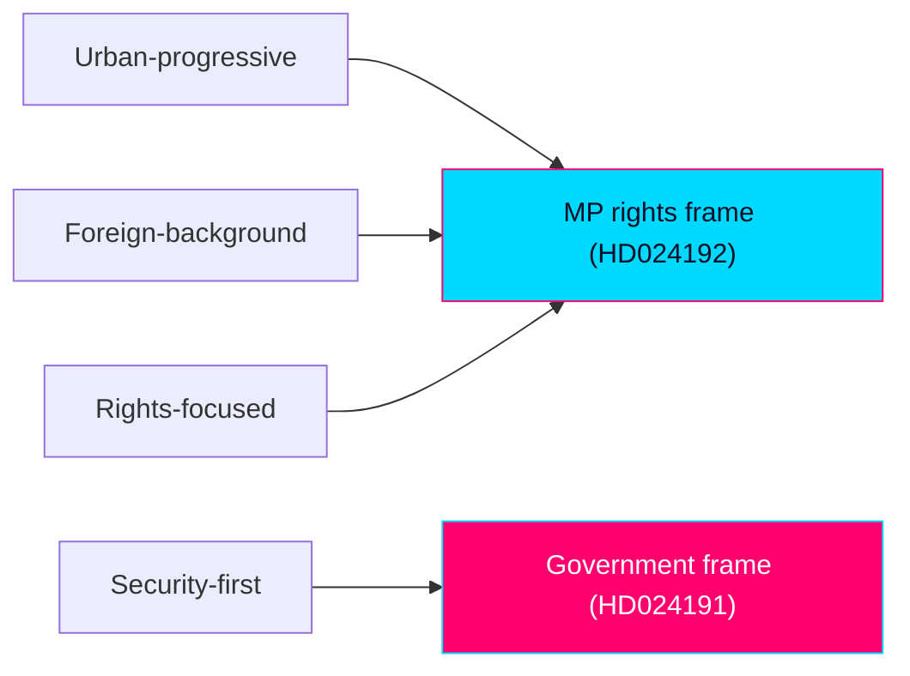

# Voter Segmentation — Swedish Opposition Motions, 2026-05-29

> How the two MP motions interact with Swedish voter segments ahead of 2026-09-13. English; Swedish proper nouns preserved.

## 🗺️ Visual Model

## 🔄 Tradecraft Context

- Pass 1 created; Pass 2 improved. WEP and confidence stated separately.
- Segments are analytic constructs, not survey strata; treat magnitudes as directional.

## 📋 Segmentation Context

MP's binding constraint is the 4% threshold. Segmentation therefore focuses on which slices the rights/integrity frame can mobilise or alienate, and where overlap with V creates zero-sum competition rather than bloc expansion.

## 🗺️ Segmentation Overview

Six analytic segments: S1 progressive urban graduates; S2 civil-liberties libertarians; S3 immigrant-origin communities; S4 security-first swing voters; S5 rural/older traditionalists; S6 V-leaning rights voters (overlap zone).

## 🗂️ Segment Impact Matrix

| Segment | HD024191 (folkbokföring) | HD024192 (LSU/children) | Net direction for MP |
|---------|--------------------------|--------------------------|----------------------|
| S1 Progressive urban graduates | + | ++ | Strongly favourable |
| S2 Civil-liberties libertarians | ++ | + | Favourable |
| S3 Immigrant-origin communities | + | + | Favourable |
| S4 Security-first swing | − | −− | Unfavourable |
| S5 Rural/older traditionalists | 0 | − | Mildly unfavourable |
| S6 V-leaning rights voters | + | + | Favourable but zero-sum vs V |

## 🔎 Segment Deep-Dive — S6 V-leaning rights voters (the decisive overlap)

This is the pivotal segment: the rights frame is most resonant here, but these voters are equally available to V. MP's wager is that visible, specific parliamentary action (named yrkanden, Lagrådet citation) signals greater rights-credibility than V's rhetorical positioning. The risk is splitting the progressive-rights vote and pushing both parties toward the threshold. `[WEP: net mobilisation gain for MP in S6 — uncertain, even chance]`

## 🔎 Segment Deep-Dive — S4 Security-first swing

HD024192's child-detention rejection is maximally exposed here. These voters weight the security axis heavily and are reachable by an M/SD "soft on threats" counter-message. MP largely writes off this segment, accepting the trade for S1/S2/S6 intensity.

## 🏗️ Cross-Segment Trade-Offs

The core trade is S4/S5 alienation (accepted) for S1/S2/S6 intensity (sought). Because MP is a threshold party, intensity in favourable segments outweighs breadth — turnout among committed rights voters matters more than persuasion of swing voters.

## 🎯 Campaign-Leverage Matrix

| Lever | Target segment | Mechanism | Leverage |
|-------|----------------|-----------|----------|
| Barnkonventionen frame | S1, S6 | Moral clarity on child detention | High |
| Biometrics/integrity frame | S2 | Surveillance-scepticism | Medium-high |
| Vulnerable-resident protection | S3 | Tangible stakes | Medium |
| Lagrådet/rättssäkerhet | S2, S1 | Procedural credibility | Medium |

## 🧮 Quantified Net-Effect Model

- Favourable segments (S1/S2/S3/S6) plausibly represent MP's mobilisable base; intensity gains here are threshold-relevant (estimated directional swing well under 1 point but potentially decisive given MP's proximity to 4%).
- Unfavourable segments (S4/S5) are largely unreachable for MP regardless, so the net model is asymmetric: limited downside, threshold-relevant upside. `[confidence: MEDIUM — no run-specific polling]`

## 📎 Sources

- `election-2026-analysis.md`, `coalition-mathematics.md`, `stakeholder-perspectives.md`.
- Primary: mot 2025/26:4191, mot 2025/26:4192.

## ✅ Pass-2 Self-Audit Checklist (v4.4 — required)

- [x] ≥6 segments analysed.
- [x] Pivotal overlap segment (S6) deep-dived.
- [x] Trade-offs and net-effect model included.
- [x] WEP/confidence separated.
- [x] Banned-phrase scan clean.
