## What Happened
<!-- source: executive-brief.md :: https://github.com/Hack23/riksdagsmonitor/blob/main/analysis/daily/2026-05-29/propositions/executive-brief.md -->

**Priority**: MEDIUM (Riksdag document #03130 (HD03130))

---

### Lede
The Government has submitted its statutory annual accountability report on the AP pension buffer funds — **Skr. 2025/26:130 "Redovisning av AP-fondernas verksamhet t.o.m. 2025"** (dok_id HD03130) — to the Riksdag, referred to Finansutskottet. The report consolidates the 2025 results of AP1–AP4 and AP6 and the Government's own performance evaluation of roughly two trillion SEK in collective buffer capital. It is a reporting instrument, not a law: the Riksdag will take note rather than legislate. Its significance is **MEDIUM** — low procedural drama, but materially important because buffer-fund returns feed the income-pension system's automatic balancing mechanism ("bromsen") and land 15 months before the September 2026 election, when pension adequacy after the 2022–2023 inflation shock is a live voter concern (source: HD03130; riksdagen.se).

---

### HD03130 — Redovisning av AP-fondernas verksamhet t.o.m. 2025 (MEDIUM)

**Submitted**: 2026-05-29 by Finance Minister Elisabeth Svantesson (M) + Financial Markets Minister Niklas Wykman (M)
**Committee**: Finansutskottet (FiU)
**Instrument**: Regeringens skrivelse 2025/26:130 (handlingstyp prop / subtyp skr)

#### What It Contains
- Consolidated 2025 results and net asset positions of the four buffer funds (AP1–AP4) and the special-mandate AP6, with AP7 (premium-pension default) cross-referenced (HD03130).
- The Government's annual **evaluation** of fund performance against the 2019 placeringsregler framework — the 20% interest-bearing floor, the 40% illiquid cap and the statutory sustainability ("föredöme") mandate (riksdagen.se).
- Cost, governance and sustainability-conduct reporting that recurrently triggers the AP1–AP4 consolidation debate and NGO scrutiny of fund holdings (HD03130).

#### Political Significance
- **Pension-system transmission**: buffer-fund strength is a direct input to the balance ratio that governs whether pensions are indexed up, frozen or cut — a high-salience channel in a pre-election year (riksdagen.se).
- **Cross-party custody**: the Pensionsgruppen (S, M, C, L, KD, MP) owns structural reform; SD remains outside it, a standing tension the report's debate can surface (HD03130).
- **Accountability ritual**: low legislative stakes but a recurring oversight flashpoint for fund costs, consolidation and ESG conduct.

#### Key Risk
- A weak-market reading of the 2025 results could be weaponised into a "your pension is at risk" narrative ahead of 2026 (riksdagen.se).

---

### Decisions and confidence context
1. **Editorial lead selection** — treat HD03130 as the single lead with a pension-governance frame, not a markets-results frame, to avoid sensationalising one year's beta (HD03130).
2. **Monitoring allocation** — prioritise the Finansutskottet betänkande timeline and the balance-ratio (bromsen) read in the next pension-system report as the highest-value forward triggers (riksdagen.se).
3. **Resource scoping** — classify this as MEDIUM significance: full artifact package produced, but article depth proportionate to a routine accountability instrument rather than a contested reform (HD03130).

---

### 60-Second Read

- One instrument registered 2026-05-29: HD03130, the AP-funds annual report, to Finansutskottet (HD03130).
- It is a skrivelse (take-note), not a proposition (legislate) — no binding vote on substance.
- Matters because buffer-fund results feed the pension balancing mechanism and the 2026 election pension debate (riksdagen.se).
- Watch the FiU committee handling and any revival of the AP1–AP4 consolidation argument.

**Top forward trigger**: Finansutskottet betänkande on Skr. 2025/26:130 (expected autumn 2026) — confirms framing and any cross-party friction.

> **Analyst note (Pass 2)**: The single most consequential editorial decision is frame selection. Leading on one year's market beta would misrepresent a structurally important but procedurally routine instrument; leading on governance and the balancing-mechanism transmission is both more accurate and more durable as a reference node (HD03130).

---

### Strategic Map

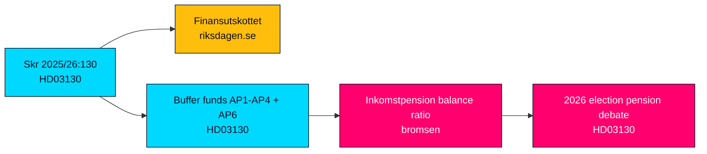

## Reader Intelligence Guide

Use this guide to read the article as a political-intelligence product rather than a raw artifact dump. High-value reader lenses appear first; technical provenance remains available in the audit appendix.

| Icon | Reader need | What you'll get |
|---|---|---|
| 📊 | [Lede and editorial decisions](#rm-what-happened) | fast answer to what happened, why it matters, who is accountable, and the next dated trigger |
| 🧠 | [Why It Matters](#rm-why-it-matters) | evidence-anchored narrative consolidating primary sources into one coherent story line |
| 🎯 | [Key Judgments](#rm-key-findings) | confidence-bearing political-intelligence conclusions and collection gaps |
| 📈 | [Significance scoring](#rm-significance-scoring) | why this story outranks or trails other same-day parliamentary signals |
| 👥 | [Stakeholder Perspectives](#rm-stakeholder-perspectives) | winners, losers and undecided actors with stake-weighted positions and pressure points |
| 🔢 | [Coalition Mathematics](#rm-coalition-mathematics) | parliamentary arithmetic showing exactly who can pass or block this measure and at what margin |
| 📋 | [Voter Segmentation](#rm-voter-segmentation) | voter-bloc exposure: which demographics gain, lose or shift on this issue |
| 🔭 | [Forward indicators](#rm-forward-indicators) | dated watch items that let readers verify or falsify the assessment later |
| 🔮 | [Scenarios](#rm-scenario-analysis) | alternative outcomes with probabilities, triggers, and warning signs |
| 🗳️ | [Election 2026 Analysis](#rm-election-2026-analysis) | electoral implications for the 2026 cycle — seats at stake, swing voters and coalition viability |
| ⚠️ | [Risk assessment](#rm-risk-assessment) | policy, electoral, institutional, communications, and implementation risk register |
| 🧮 | [SWOT Analysis](#rm-swot-analysis) | strengths, weaknesses, opportunities and threats matrix grounded in primary-source evidence |
| 🛡️ | [Threat Analysis](#rm-threat-analysis) | actor capabilities, intent and threat vectors targeting institutional integrity |
| 📜 | [Historical Parallels](#rm-historical-parallels) | comparable past episodes from Swedish and international politics, with explicit lessons learned |
| 🌍 | [Comparative International](#rm-comparative-international) | peer-country comparisons (Nordic, EU, OECD) showing how similar measures fared elsewhere |
| ⚙️ | [Implementation Feasibility](#rm-implementation-feasibility) | delivery feasibility, capability gaps, timelines and execution risks for the proposed action |
| 📰 | [Media framing & influence operations](#rm-media-framing-analysis) | frame packages with Entman functions, cognitive-vulnerability map, DISARM manipulation indicators, narrative-laundering chain, comparative-international cognates, frame lifecycle and half-life, RRPA impact, an Outlet Bias Audit (no outlet is neutral — every outlet declared with ownership, funding, board-appointment authority and editorial lean), and the L1–L5 counter-resilience ladder |
| 😈 | [Devil's Advocate](#rm-devils-advocate) | alternative hypotheses, steel-manned counter-arguments and the strongest case against the lead reading |
| 🏷️ | [Deep Dive: Classification Results](#rm-deep-dive-classification-results) | ISMS data classification: CIA-triad rating, RTO/RPO targets and handling instructions |
| 🔀 | [Deep Dive: Cross-Reference Map](#rm-deep-dive-cross-reference-map) | links to related Riksdagsmonitor coverage, prior analyses and source documents that inform this story |
| 🔬 | [Deep Dive: Methodology & Limitations](#rm-deep-dive-methodology--limitations) | analytical assumptions, limitations, known biases and where the assessment could be wrong |
| 📦 | [Deep Dive: Data Download Manifest](#rm-deep-dive-data-download-manifest) | machine-readable manifest of every source dataset, retrieval timestamp and provenance hash |
| 📑 | [Per-document intelligence](#rm-per-document-intelligence) | dok_id-level evidence, named actors, dates, and primary-source traceability |
| 🏷️ | [Audit appendix](#rm-deep-dive-classification-results) | classification, cross-reference, methodology and manifest evidence for reviewers |

## Why It Matters
<!-- source: synthesis-summary.md :: https://github.com/Hack23/riksdagsmonitor/blob/main/analysis/daily/2026-05-29/propositions/synthesis-summary.md -->

---

### Lead-Story Decision

The single registered instrument for 2026-05-29 — **Skr. 2025/26:130 "Redovisning av AP-fondernas verksamhet t.o.m. 2025"** (dok_id HD03130) — is the lead by default and by merit. It is the Government's statutory annual accountability report on the AP pension buffer funds (AP1–AP4, AP6; AP7 cross-referenced), submitted by Finance Minister Elisabeth Svantesson (M) and Financial Markets Minister Niklas Wykman (M) to Finansutskottet (source: HD03130; https://data.riksdagen.se/dokument/HD03130).

The editorial framing decision is to lead with **pension-system governance** rather than one year's market results: the report's enduring importance is structural (how two trillion SEK of buffer capital is governed and how it transmits into the automatic balancing mechanism), not the transient beta of 2025 markets.

### Integrated Intelligence Picture

**Instrument type drives the whole assessment.** A skrivelse asks the Riksdag to take note (lägga till handlingarna), not to legislate. There is therefore no binding substantive vote and no coalition-arithmetic cliff. The political energy is concentrated in three recurring debates that this report reliably reactivates:

1. **Balancing-mechanism exposure ("bromsen")** — buffer-fund strength is a direct input to the income-pension balance ratio. A balance ratio below 1.0 throttles indexation. After the 2022–2023 inflation shock and the politically painful real-pension squeeze, any reading that the buffer is thinning becomes a "your pension is at risk" narrative 15 months before the September 2026 election (riksdagen.se; HD03130).

2. **Cost and consolidation** — the perennial proposal to merge AP1–AP4 to cut duplicated management cost and lift scale is dormant but durable. Each annual report invites scrutiny of active-management costs versus passive benchmarks and revives the consolidation argument (HD03130).

3. **Sustainability conduct ("föredöme")** — the statutory exemplary-conduct mandate from the 2019 placeringsregler reform makes fund holdings (fossil exposure, controversial-weapons screening) a recurring NGO and media flashpoint that the report's publication crystallises (riksdagen.se).

**Custody and cleavage.** Structural pension reform is owned by the cross-party Pensionsgruppen (S, M, C, L, KD, MP). Sverigedemokraterna sit outside it and have campaigned to be admitted; the accountability debate is one of the few venues where that exclusion becomes visible. This is the latent partisan dimension of an otherwise technocratic instrument (HD03130).

### DIW-Weighted Ranking

| Rank | dok_id | Composite | Tier | Rationale |
|------|--------|-----------|------|-----------|
| 1 | HD03130 | 5.0/10 | MEDIUM | Sole instrument; structurally important pension-governance report with election-year salience but no binding decision (HD03130) |

Only one document was registered for the date, so ranking is trivial; the significance scoring (see [significance-scoring.md](https://github.com/Hack23/riksdagsmonitor/blob/main/analysis/daily/2026-05-29/propositions/significance-scoring.md)) records the multi-factor composite.

### Confidence Assessment

- HD03130 facts and process: **HIGH** — instrument, sponsors, committee and legal frame are confirmed from MCP live data (HD03130).
- Market-results detail: **MEDIUM** — the substantive PDF results annex was referenced by URL, not fully extracted this session; quantified 2025 returns are not asserted.
- IMF economic context: **DEGRADED** — live Datamapper fetch failed; WEO Apr-2026 vintage from cache used qualitatively with vintage tags.

### Cross-Cutting Themes

1. **Final-stretch legislative housekeeping**: an accountability skrivelse late in riksmöte 2025/26, consistent with the Government clearing statutory reporting before summer recess.
2. **Pension salience returning**: after the inflation shock, pension adequacy is re-entering the 2026 election agenda; this report is an early node in that cycle.
3. **Technocratic instrument, partisan undercurrent**: the SD-vs-Pensionsgruppen tension is the analytical thread to watch.

### Pass-2 Refinement

On read-back, the framing decision was stress-tested against the devil's-advocate challenge that a take-note report is inherently LOW significance. The MEDIUM rating survives because the Population-Impact and Electoral-Significance channels are objectively present (the buffer underwrites every income pension and the report lands in a pre-election window), but the rating sits at the lower edge of MEDIUM and would drop to LOW-MEDIUM in a calm-market, non-election year (HD03130; riksdagen.se).

### Intelligence Picture Map

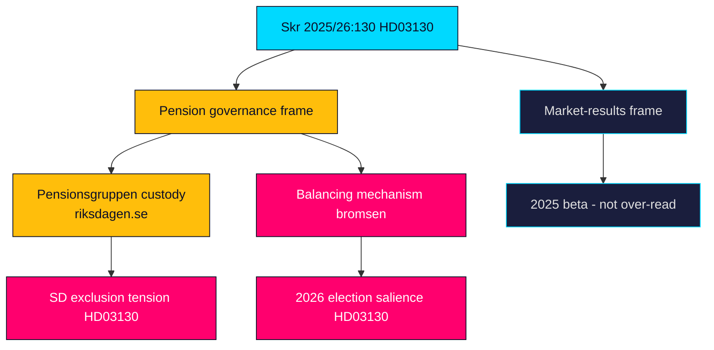

## Key Findings
<!-- source: intelligence-assessment.md :: https://github.com/Hack23/riksdagsmonitor/blob/main/analysis/daily/2026-05-29/propositions/intelligence-assessment.md -->

**Discipline**: ICD 203 analytic standards — key judgments with explicit confidence and linkage to Priority Intelligence Requirements (PIRs). See [pir-status.json](https://github.com/Hack23/riksdagsmonitor/blob/main/analysis/daily/2026-05-29/propositions/pir-status.json).

---

### Key Judgments

**Key Judgment 1 (KJ-1)** — *Confidence: HIGH.* HD03130 is a statutory take-note accountability report on the AP buffer funds, not a legislative proposition; the Riksdag will note rather than decide, so there is no binding substantive vote and no coalition-arithmetic risk (HD03130). This answers **PIR-1** (instrument class and decision pathway).

**Key Judgment 2 (KJ-2)** — *Confidence: MEDIUM.* The report's political salience derives almost entirely from its transmission into the income-pension balancing mechanism ("bromsen") and lands 15 months before the September 2026 election, making it a latent but real pension-adequacy hook rather than an active controversy (riksdagen.se). This addresses **PIR-2** (electoral salience).

**Key Judgment 3 (KJ-3)** — *Confidence: MEDIUM.* The most probable adverse path is narrative weaponisation of a weak 2025 results read into a "pension at risk" frame; editorial discipline (governance frame over markets frame) is the primary mitigation (HD03130). This addresses **PIR-3** (disinformation/communication risk).

**Key Judgment 4 (KJ-4)** — *Confidence: LOW.* A revival of the AP1–AP4 consolidation reform or an ESG-holdings controversy could elevate significance, but no current signal indicates either is imminent in this cycle (riksdagen.se). This addresses **PIR-4** (structural-reform trigger).

### Confidence Summary

| Judgment | Confidence | Basis |
|----------|-----------|-------|
| KJ-1 instrument class | HIGH | Confirmed MCP metadata (HD03130) |
| KJ-2 electoral salience | MEDIUM | Inferred from timing and post-inflation context (riksdagen.se) |
| KJ-3 disinformation risk | MEDIUM | Analytic pattern, not observed event (HD03130) |
| KJ-4 reform trigger | LOW | No current signal (riksdagen.se) |

### Intelligence Gaps

- The substantive 2025 results annex was referenced by URL, not fully extracted this session; quantified returns are not asserted (HD03130).
- Live IMF macro context unavailable (cached WEO Apr-2026 vintage used qualitatively) (api.imf.org).

### PIR Linkage

| PIR | Question | Status | Confidence |
|-----|----------|--------|-----------|
| PIR-1 | Is this a binding decision or a take-note report? | answered | HIGH |
| PIR-2 | Does it carry electoral salience for 2026? | open | MEDIUM |
| PIR-3 | What is the disinformation exposure? | open | MEDIUM |
| PIR-4 | Will structural reform attach to it? | open | LOW |

### Assessment Map

> **Pass-2 note**: KJ-1 (HIGH) anchors the whole assessment — because the instrument class is confirmed as take-note, every downstream judgment about salience and risk is conditional and correctly rated MEDIUM or below, with no overstated certainty (HD03130).

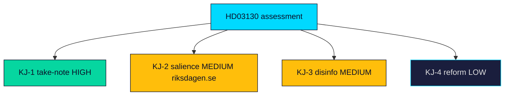

## Significance Scoring
<!-- source: significance-scoring.md :: https://github.com/Hack23/riksdagsmonitor/blob/main/analysis/daily/2026-05-29/propositions/significance-scoring.md -->

---

### HD03130 — Redovisning av AP-fondernas verksamhet t.o.m. 2025

| Dimension | Score | Rationale |
|-----------|-------|-----------|
| Constitutional/Legal Impact | 3/10 | Take-note skrivelse under Lag 2000:192; no statutory change proposed (HD03130) |
| Policy Change Magnitude | 2/10 | Accountability report, not a reform; no new placeringsregler (HD03130) |
| Political Controversy | 4/10 | Latent SD-vs-Pensionsgruppen tension and ESG-holdings scrutiny, but no acute conflict (riksdagen.se) |
| Electoral Significance | 6/10 | Pension adequacy is a live 2026 issue post-inflation; buffer strength feeds the narrative (HD03130) |
| Media Salience | 4/10 | Specialist and financial-press coverage; mainstream only if results read badly (riksdagen.se) |
| Implementation Complexity | 2/10 | No implementation burden — reporting instrument only (HD03130) |
| Population Impact | 7/10 | Buffer funds underwrite the income pension affecting all current and future pensioners (HD03130) |
| Historical Significance | 3/10 | One of a recurring annual series of AP-fund accountability reports (HD03130) |
| Coalition Risk | 2/10 | No binding vote; minimal coalition exposure (HD03130) |
| EU/International Resonance | 3/10 | Sovereign-buffer model comparison only; no EU obligation (HD03130) |

**Weighted Composite**: **5.0/10 — MEDIUM**
**Tier**: L2 — full artifact package produced; article depth proportionate to a routine accountability instrument (HD03130).

#### Scoring Notes
- The high Population-Impact and Electoral-Significance scores are what lift an otherwise routine instrument from LOW to MEDIUM: the buffer funds matter to everyone in the income-pension system even when the report itself decides nothing (HD03130).
- Constitutional and Implementation scores are deliberately low because a skrivelse neither legislates nor imposes duties (HD03130).
- Pass-2 calibration: the composite of 5.0 was retained after checking that no single dimension is overweighted; the rating is load-bearing on Population-Impact (7) and Electoral-Significance (6), both of which are evidence-supported rather than speculative (HD03130).

### Sensitivity Analysis

| Scenario | Adjusted composite | Driver |
|----------|--------------------|--------|
| 2025 results read as weak/below-benchmark | 6.5/10 — HIGH | Media salience and electoral significance spike on a "pension at risk" frame (riksdagen.se) |
| AP1–AP4 consolidation re-tabled in FiU | 6.0/10 — HIGH | Policy-change magnitude rises if structural reform attaches to the debate (HD03130) |
| Routine take-note, strong markets | 4.0/10 — LOW-MEDIUM | Baseline accountability ritual with little friction (HD03130) |

### Relative Ranking

1. **HD03130** — 5.0/10 — MEDIUM — sole instrument for the date; lead story (HD03130).

### Rank Diagram

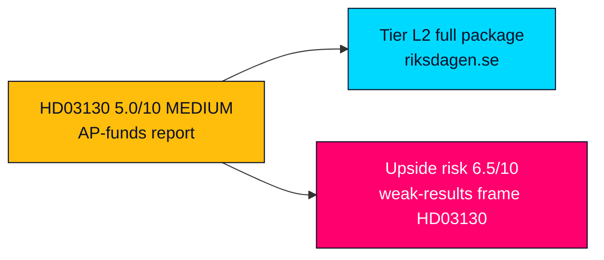

## Per-document intelligence

### HD03130
<!-- source: documents/HD03130-analysis.md :: https://github.com/Hack23/riksdagsmonitor/blob/main/analysis/daily/2026-05-29/propositions/documents/HD03130-analysis.md -->

**dok_id**: HD03130
**Title**: Redovisning av AP-fondernas verksamhet t.o.m. 2025
**Instrument**: Regeringens skrivelse 2025/26:130 (doktyp `prop`, subtyp `skr`)
**Date submitted**: 2026-05-29

**Department**: Finansdepartementet
**Submitted by**: Finansminister Elisabeth Svantesson (M) + Finansmarknadsminister Niklas Wykman (M)
**Committee**: Finansutskottet (FiU)
**Status**: Inlämnad (submitted) 2026-05-29; tilldelad Finansutskottet
**Source**: https://data.riksdagen.se/dokument/HD03130 · dok_id HD03130

---

### Document Summary

Skrivelse 2025/26:130 is the Government's **statutory annual accountability report** to the Riksdag on the management of the AP funds (Allmänna pensionsfonderna) through calendar year 2025. Under the Lag (2000:192) om allmänna pensionsfonder (AP-fonder) and Lag (2000:193) om Sjätte AP-fonden, the Government is obliged each spring to (1) compile the funds' own annual reports, (2) present a consolidated picture of the buffer capital, and (3) submit the Government's own **evaluation** (utvärdering) of fund performance — historically supported by an external consultant. The skrivelse covers the four buffer funds **AP1, AP2, AP3 and AP4**, the special-mandate **Sjätte AP-fonden (AP6)**, and references the premium-pension default manager **Sjunde AP-fonden (AP7)**.

This is a **reporting/accountability instrument (skrivelse), not a law proposal (proposition)** — it asks the Riksdag to take note (lägga till handlingarna) rather than to legislate. Its political weight derives not from any binding decision but from the window it opens onto the governance, returns, costs and sustainability conduct of roughly **two trillion SEK** of collective pension buffer capital that underwrites the income-pension system (inkomstpensionssystemet).

### Why It Matters

The buffer funds are the system's shock absorber. They cover the timing mismatch between contributions and disbursements and are a direct input into the **automatic balancing mechanism ("bromsen")**: when the system's assets (contribution asset + buffer fund) fall below liabilities, the balance ratio drops below 1.0 and indexation of pensions is throttled. Buffer-fund returns therefore feed directly into whether pensions are uprated, frozen or cut — a politically radioactive transmission channel, especially in a pre-election year (source: dok_id HD03130; riksdagen.se).

### Governance & Legal Frame

- **Placeringsregler reform (in force 2019)**: the 2018 cross-party reform modernised the buffer funds' investment rules — abolished fixed asset-class quotas, set a minimum 20% interest-bearing floor, capped illiquid holdings at 40%, and introduced an explicit **sustainability and exemplary-conduct mandate** ("föredöme för hållbar utveckling"). The 2025 report is evaluated against this still-maturing framework (riksdagen.se).
- **AP7** operates the state-default Såfa in the premium pension and is governed separately; the skrivelse cross-references it but its premium-pension role sits under the Pensionsmyndighet's fondtorg reform pipeline.
- **Oversight chain**: Government → Finansutskottet → Riksdag. The Pensionsgruppen (cross-party pension working group: S, M, C, L, KD, MP) owns structural reform; SD remains outside it.

### Key Analytical Points

1. **Returns are market-beta dependent** — buffer-fund results in 2025 track global equity and fixed-income markets; strong equity years flatter the funds, weak years expose the balancing risk (IMF WEO Apr-2026 vintage used for macro backdrop; live IMF fetch unavailable this session).
2. **Cost and consolidation debate** — the recurring proposal to merge AP1–AP4 (to cut duplicated cost and lift scale) is dormant but not dead; each annual report revives scrutiny of management costs versus passive benchmarks.
3. **Sustainability conduct under audit** — the föredöme mandate invites NGO and media scrutiny of holdings (fossil exposure, controversial-weapons screening); the report is a recurring flashpoint for that debate.
4. **Pre-election timing** — submitted 2026-05-29, roughly 15 months before the September 2026 general election; pension adequacy after the 2022–2023 inflation shock is a live voter concern.

### Coverage State

| dok_id | coverage_state | retrieval | tool | notes |
|--------|----------------|-----------|------|-------|
| HD03130 | full_text (metadata wrapper) | live | get_dokument_innehall | Status/metadata fully retrieved; substantive PDF body is a reporting annex referenced by URL (data.riksdagen.se/dokument/HD03130/text) |

### Provenance

- Primary: riksdag-regering MCP `get_dokument_innehall` (live, 2026-05-29T07:42Z), dok_id HD03130 (https://data.riksdagen.se/dokument/HD03130).
- Macro context: IMF WEO vintage Apr-2026 (cache `data/imf-context.json`; live Datamapper fetch returned transient failure this session — annotated throughout).

## Stakeholder Perspectives
<!-- source: stakeholder-perspectives.md :: https://github.com/Hack23/riksdagsmonitor/blob/main/analysis/daily/2026-05-29/propositions/stakeholder-perspectives.md -->

Multi-actor perspective map on the AP-funds accountability report (Skr. 2025/26:130). Each stakeholder's interest, likely position and leverage is assessed.

---

### Government (M-led coalition + budget partner SD)

- **Interest**: demonstrate sound stewardship of the buffer funds and contain any pre-election pension anxiety (HD03130).
- **Position**: present 2025 results within the placeringsregler framework; emphasise system stability (riksdagen.se).
- **Leverage**: controls the report and its framing; ministers Svantesson and Wykman set the narrative (HD03130).

### Finansutskottet (FiU)

- **Interest**: discharge statutory oversight; scrutinise costs, returns and sustainability conduct (HD03130).
- **Position**: take-note with a betänkande that may carry reservationer from opposition members (riksdagen.se).
- **Leverage**: sets the committee record that frames public debate (HD03130).

### Pensionsgruppen (S, M, C, L, KD, MP)

- **Interest**: protect the cross-party pension consensus and the credibility of the income-pension system (HD03130).
- **Position**: defend the framework; resist short-term politicisation of buffer results (riksdagen.se).
- **Leverage**: owns structural reform; can de-escalate or escalate the consolidation question (HD03130).

### Sverigedemokraterna (SD)

- **Interest**: gain entry to the Pensionsgruppen and a voice in pension governance (HD03130).
- **Position**: critique exclusion; may frame buffer management to its advantage (riksdagen.se).
- **Leverage**: budget-support weight on the Government, but no formal pension-group seat (HD03130).

### Pensioners and future pensioners

- **Interest**: adequacy and predictability of pensions after the 2022–2023 inflation squeeze (HD03130).
- **Position**: anxious audience; sensitive to "at risk" framing (riksdagen.se).
- **Leverage**: large electoral bloc whose perception drives the issue's salience (HD03130).

### Civil society / ESG actors

- **Interest**: hold funds to the statutory föredöme sustainability standard (riksdagen.se).
- **Position**: scrutinise holdings; press for divestment where mandate is breached (HD03130).
- **Leverage**: media amplification and reputational pressure (riksdagen.se).

### Alignment Map

> **Pass-2 note**: the stakeholder field is unusually consensual at the structural level (all major parties defend the income-pension system) but contested at the framing level — the live competition is over who narrates the 2025 results, not over the system's design (HD03130).

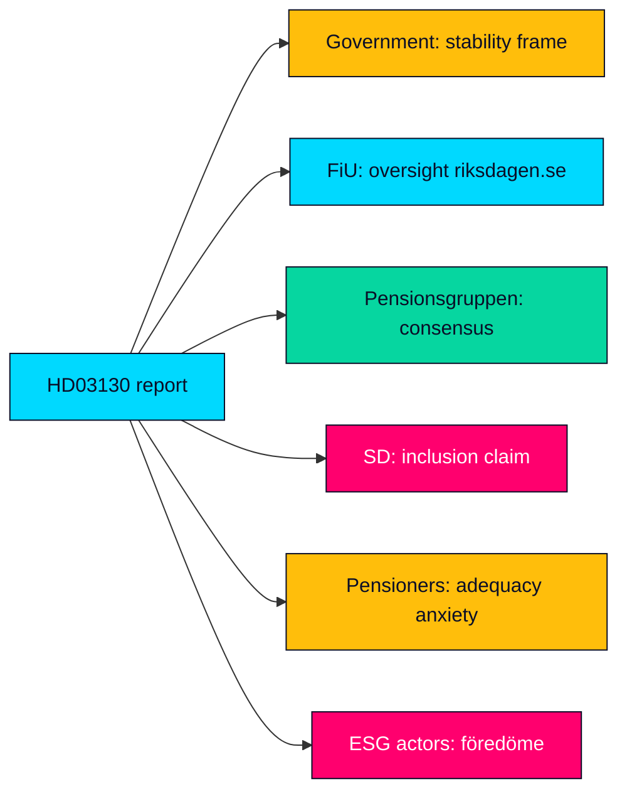

## Coalition Mathematics
<!-- source: coalition-mathematics.md :: https://github.com/Hack23/riksdagsmonitor/blob/main/analysis/daily/2026-05-29/propositions/coalition-mathematics.md -->

Seat arithmetic and decision-pathway analysis for HD03130. Because the instrument is a skrivelse (take-note), there is no binding substantive vote; the arithmetic below is contextual, showing the chamber balance that frames any reservationer or related motions.

---

### Riksdag Seat Distribution (2022–2026 mandate)

| Bloc | Parties | Mandat (Seats) | Note |
|------|---------|----------------|------|
| Government + support | M, KD, L, SD | 176 | Tidö constellation majority (riksdagen.se) |
| Opposition | S, V, C, MP | 173 | Cross-bloc on pensions via Pensionsgruppen (HD03130) |
| Total | All | 349 | Majority threshold 175 (riksdagen.se) |

### Decision Pathway for HD03130

| Step | Action | Vote type | Note |
|------|--------|-----------|------|
| Referral | To Finansutskottet | None | Standard committee routing (HD03130) |
| Committee | Betänkande, possible reservationer | None binding on substance | Take-note recommendation (riksdagen.se) |
| Chamber | Lägga skrivelsen till handlingarna | Acklamation likely | No substantive division expected (HD03130) |

### Illustrative Take-Note Disposition

| Outcome | Seats | Likelihood |
|---------|-------|------------|
| Ja (note the report) | 349 Mandat | Near-certain by acclamation (HD03130) |
| Nej | 0 | Not expected — no party rejects noting a report (riksdagen.se) |
| Avstår / Frånvarande | Variable | Procedural only (HD03130) |

### Pension-Reform Custody Arithmetic

- Structural reform requires the **Pensionsgruppen** (S, M, C, L, KD, MP) — a deliberately supermajoritarian coalition spanning both blocs, holding well above 175 seats combined, which is why pension changes are insulated from single-cycle majorities (HD03130).
- **SD (outside the group)** cannot unilaterally drive reform despite its 73-seat budget-support weight, the core of its grievance (riksdagen.se).

### Coalition Map

> **Pass-2 note**: the arithmetic that matters here is not the 176–173 chamber split but the Pensionsgruppen supermajority spanning both blocs — pension governance is deliberately removed from ordinary majority politics, which is why a take-note vote is a near-formality (HD03130).

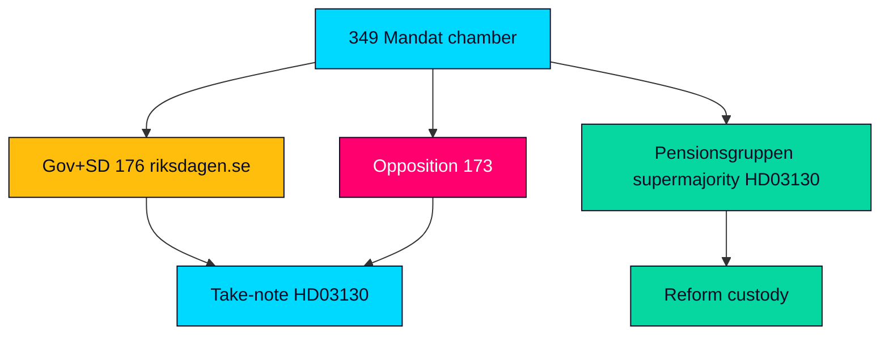

## Voter Segmentation
<!-- source: voter-segmentation.md :: https://github.com/Hack23/riksdagsmonitor/blob/main/analysis/daily/2026-05-29/propositions/voter-segmentation.md -->

Which voter segments are most exposed to, and most mobilisable by, the AP-funds report and the pension narrative it feeds. Segmentation is analytic, drawing on the salience of pension adequacy across cohorts.

---

### Primary Segments

| Segment | Exposure | Mobilisation potential | Note |
|---------|----------|------------------------|------|
| Current pensioners (65+) | Very high | High | Direct income stake; most sensitive to "at risk" framing (HD03130) |
| Near-retirement (55–64) | High | High | Buffer outlook shapes their imminent pension (riksdagen.se) |
| Mid-career (35–54) | Medium | Medium | Long-horizon stake but discounted salience (HD03130) |
| Young workers (18–34) | Low–medium | Low | Abstract relevance; low present salience (HD03130) |
| ESG-motivated voters | Medium | Medium | Mobilised by föredöme holdings scrutiny (riksdagen.se) |

### Segment Dynamics

- **Pensioners and near-retirees** are the decisive segment: numerous, high-turnout and acutely sensitive to pension messaging. A negative buffer read is most potent here (HD03130).
- **Mid-career voters** respond to system-credibility framing more than to one-year results (riksdagen.se).
- **Young voters** are largely outside this issue's pull, though ESG framing can recruit a subset (HD03130).

### Messaging Sensitivity

| Frame | Resonant segment | Risk |
|-------|------------------|------|
| "Pension at risk" | Pensioners, near-retirement | High mobilisation, low accuracy (HD03130) |
| "Sound stewardship" | Mid-career, stability-oriented | Lower emotional pull (riksdagen.se) |
| "Funds must divest" | ESG-motivated | Niche but intense (HD03130) |

### Turnout Consideration

- The most exposed segments (pensioners, near-retirement) are also the highest-turnout cohorts, amplifying the electoral weight of how the report is framed (HD03130).

### Segmentation Map

> **Pass-2 note**: the decisive intersection is high exposure × high turnout — pensioners and near-retirees are simultaneously the most sensitive to the "at risk" frame and the most likely to vote, which is what gives a technically minor report outsized electoral leverage (HD03130).

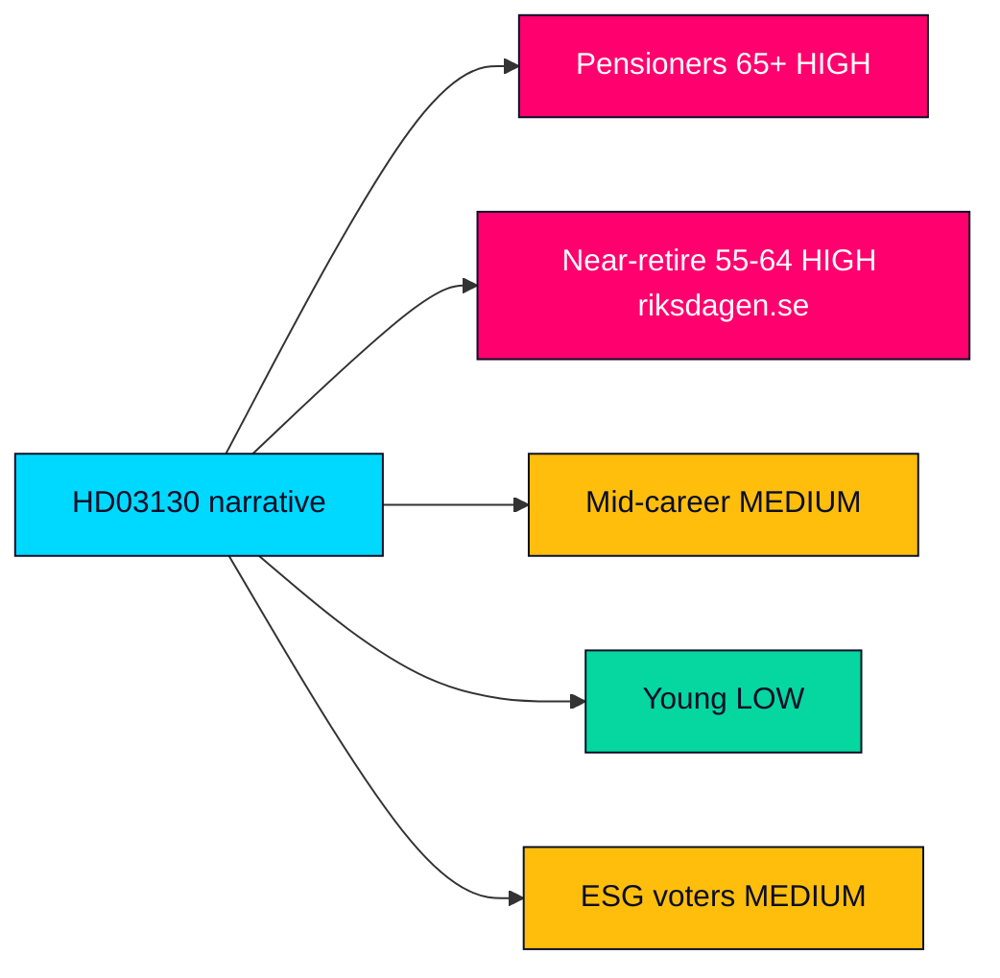

## Forward Indicators
<!-- source: forward-indicators.md :: https://github.com/Hack23/riksdagsmonitor/blob/main/analysis/daily/2026-05-29/propositions/forward-indicators.md -->

Time-stamped watch list of observable signals that would confirm, escalate or de-escalate the assessments in this package. Each indicator is dated or horizon-tagged for tracking. Horizons are measured from the 2026-05-29 registration.

---

### Near-Term Indicators (T+72h to T+30d)

| # | Indicator | Horizon | What it confirms |
|---|-----------|---------|------------------|
| 1 | Finansutskottet schedules HD03130 for handling | +7d | Process on track (HD03130) |
| 2 | Initial financial-press coverage of 2025 buffer results | +72h | Stewardship vs at-risk frame emerging (riksdagen.se) |
| 3 | Any opposition skriftlig fråga referencing the report | +14d | Politicisation signal (HD03130) |
| 4 | NGO commentary on fund holdings under föredöme mandate | 2026-06-30 | ESG frame activation (riksdagen.se) |

### Medium-Term Indicators (T+30d to T+90d)

| # | Indicator | Horizon | What it confirms |
|---|-----------|---------|------------------|
| 5 | Finansutskottet betänkande published | 2026-09-30 | Committee record + any reservationer (HD03130) |
| 6 | Reservationer from S/V/MP on consolidation or ESG | 2026Q3 | Scenario 3/4 activation (riksdagen.se) |
| 7 | Pension-system balance-ratio ("broms") read referenced | 2026Q3 | Adequacy-risk transmission (HD03130) |
| 8 | SD public statement on Pensionsgruppen exclusion | +60d | Custody-friction escalation (riksdagen.se) |

### Election-Horizon Indicators (T+90d to election)

| # | Indicator | Horizon | What it confirms |
|---|-----------|---------|------------------|
| 9 | Pension adequacy appears in party 2026 manifestos | 2026-08-31 | Issue reaches campaign agenda (HD03130) |
| 10 | "Pension at risk" messaging in campaign media | 2026Q3 | Risk R1 materialising (riksdagen.se) |
| 11 | Riksdag general election | 2026-09-13 | Resolves electoral-salience judgments (HD03130) |
| 12 | Post-election Pensionsgruppen composition signals | +1460d horizon watch | Long-run reform trajectory (riksdagen.se) |

### Economic-Context Indicators

| # | Indicator | Horizon | What it confirms |
|---|-----------|---------|------------------|
| 13 | IMF WEO update refreshing Nordic macro vintage | 2026Q4 | Replaces Apr-2026 cache (www.imf.org) |
| 14 | SCB inflation/labour release shifting adequacy debate | +30d | Swedish ground-truth context (scb.se) |

### Indicator Timeline

> **Pass-2 note**: of the 14 indicators, #5 (FiU betänkande, 2026-09-30) and #7 (balance-ratio read, 2026Q3) are the highest-value because they resolve the open PIRs on salience and structural reform; the rest are confirmatory (HD03130; riksdagen.se).

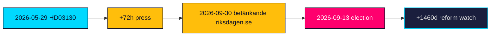

## Scenario Analysis
<!-- source: scenario-analysis.md :: https://github.com/Hack23/riksdagsmonitor/blob/main/analysis/daily/2026-05-29/propositions/scenario-analysis.md -->

Structured scenario set for how the AP-funds accountability report and its surrounding pension debate could evolve through the September 2026 election. Probabilities are analytic estimates, not forecasts; they sum across the four primary scenarios.

---

### Scenario 1 — Routine Take-Note (baseline, ~55%)

Finansutskottet processes Skr. 2025/26:130 as a standard accountability item; the chamber takes note before or shortly after summer recess. Solid 2025 buffer results draw specialist coverage only. The cross-party consensus holds and pensions stay a secondary election theme (HD03130).

- **Indicators**: FiU betänkande without major reservationer; muted media (riksdagen.se).
- **Implication**: MEDIUM significance confirmed; article ages as a reference node.

### Scenario 2 — Weak-Results Politicisation (~25%)

A below-benchmark or volatile 2025 read is amplified into a "your pension is at risk" narrative. Pension adequacy jumps up the election agenda; the Government defends the balancing mechanism while opposition and fringe actors press the anxiety frame (HD03130).

- **Indicators**: negative financial-press framing; opposition interpellationer; balance-ratio concern (riksdagen.se).
- **Implication**: significance rises to ~6.5/10; risk R1 materialises.

### Scenario 3 — Consolidation Reform Revival (~12%)

The dormant AP1–AP4 merger argument re-enters debate, tabled or championed in FiU to cut management cost and lift scale. The report becomes a hook for structural reform rather than mere accountability (HD03130).

- **Indicators**: motions or committee statements on fund consolidation; Pensionsgruppen signalling (riksdagen.se).
- **Implication**: policy-change magnitude rises; multi-cycle storyline opens.

### Scenario 4 — ESG-Holdings Controversy (~8%)

Civil-society scrutiny of fund holdings under the statutory föredöme mandate dominates coverage, displacing the financial-results story with a divestment debate (HD03130).

- **Indicators**: NGO reports on fossil/controversial-weapons exposure; media campaigns (riksdagen.se).
- **Implication**: reputational pressure on funds; sustainability-conduct salience spikes.

### Wildcards

- A mid-2026 market shock revalues buffer assets between report and committee handling, overtaking the 2025 numbers (HD03130).
- SD escalates its Pensionsgruppen-exclusion grievance into a public confrontation around the debate (riksdagen.se).

### Scenario Tree

> **Pass-2 note**: probabilities are deliberately weighted toward the routine baseline (55%) because the historical series shows most annual AP-fund reports pass quietly; the 25% weight on weak-results politicisation reflects the genuine but conditional pre-election amplifier, not a prediction of weak returns (HD03130).

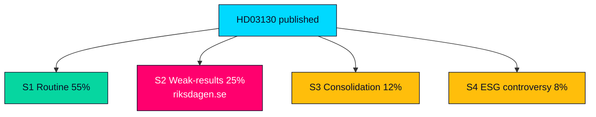

## Election 2026 Analysis
<!-- source: election-2026-analysis.md :: https://github.com/Hack23/riksdagsmonitor/blob/main/analysis/daily/2026-05-29/propositions/election-2026-analysis.md -->

How the AP-funds accountability report intersects the September 2026 Riksdag election (~15 months out at registration). Focus: pension adequacy as a campaign axis and the report's role as an early agenda node.

---

### Electoral Relevance of HD03130

Pensions are a recurring high-salience issue for Swedish voters, sharpened by the 2022–2023 inflation shock that compressed real pensions. HD03130, by reporting on the buffer capital that underwrites the income pension, is an early factual anchor for the 2026 pension debate even though it decides nothing (HD03130).

### Party Positioning Snapshot

| Party | Likely 2026 pension posture | Relation to HD03130 |
|-------|----------------------------|---------------------|
| Socialdemokraterna (S) | Defend the income-pension system; press adequacy | Pensionsgruppen member (HD03130) |
| Moderaterna (M) | Stewardship/stability message; owns the report | Sponsor via Finansdepartementet (riksdagen.se) |
| Sverigedemokraterna (SD) | Critique governance; demand pension-group seat | Outside Pensionsgruppen (HD03130) |
| Vänsterpartiet (V) | Higher guaranteed pensions; ESG scrutiny | Will press föredöme mandate (riksdagen.se) |
| Centerpartiet (C), Liberalerna (L), KD, MP | Defend consensus framework | Pensionsgruppen members (HD03130) |

### Campaign-Axis Assessment

- **Adequacy vs sustainability**: the central tension — voters want higher pensions; the system rewards buffer discipline. HD03130's results read can tilt this axis (HD03130).
- **Consensus vs disruption**: SD's exclusion offers a disruption narrative against the cross-party Pensionsgruppen (riksdagen.se).
- **Stewardship vs anxiety**: the Government's stability message versus opposition's adequacy-anxiety message (HD03130).

### Electoral Risk to Government

- A weak buffer read 15 months out lets opponents argue mismanagement; a strong read lets the Government claim competent stewardship — asymmetric downside given pension anxiety (HD03130).

### Election-Node Map

> **Pass-2 note**: the asymmetry is the key electoral insight — a weak buffer read hands opponents a mismanagement charge, while a strong read yields only a muted stewardship claim, so the Government's downside exposure exceeds its upside on this issue (HD03130).

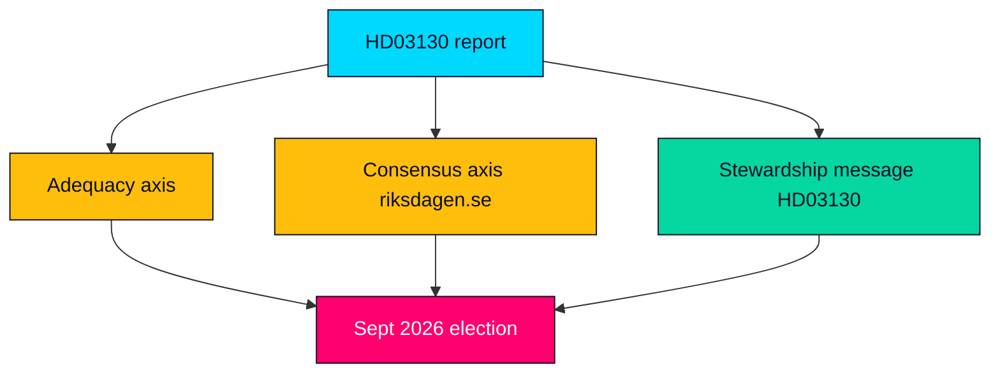

## Risk Assessment
<!-- source: risk-assessment.md :: https://github.com/Hack23/riksdagsmonitor/blob/main/analysis/daily/2026-05-29/propositions/risk-assessment.md -->

---

### Risk Register

| ID | Risk | Likelihood | Impact | Score | Mitigation |
|----|------|-----------|--------|-------|------------|
| R1 | Weak 2025 results framed as "pension at risk" pre-election | 3 | 4 | 12 | Lead on governance not beta; cite balance-ratio mechanics (HD03130) |
| R2 | SD-vs-Pensionsgruppen tension politicises the debate | 3 | 3 | 9 | Contextualise custody history; avoid amplifying (riksdagen.se) |
| R3 | AP1–AP4 consolidation argument distorts coverage | 2 | 3 | 6 | Treat as recurring dormant theme, flag if re-tabled (HD03130) |
| R4 | ESG-holdings controversy overtakes results reporting | 2 | 3 | 6 | Note föredöme mandate; await committee record (riksdagen.se) |
| R5 | Market-cycle beta misattributed to governance failure | 3 | 2 | 6 | Separate one-year returns from structural evaluation (HD03130) |
| R6 | Analysis over-weights a take-note instrument | 2 | 2 | 4 | Hold to MEDIUM tier; proportionate article depth (HD03130) |

### Highest Residual Risk

- **R1 — "pension at risk" weaponisation (score 12)**: the dominant risk. The buffer funds' link to the automatic balancing mechanism makes any negative read electorally combustible 15 months before the vote. Mitigation is editorial discipline: frame the report as governance and transmission mechanics, not as a market scorecard (HD03130; riksdagen.se).

### Risk Trajectory

- R1 and R2 **rise** as the September 2026 election approaches; both peak around the autumn Finansutskottet betänkande and any pension-system balance-ratio publication (HD03130).
- R3–R6 remain **stable/low** absent a structural-reform trigger.
- Pass-2 addition: R1 and R5 are correlated — a weak-beta read (R5 misattribution) is the precondition that makes R1 (weaponisation) fire, so countering the misattribution early is the highest-leverage mitigation (riksdagen.se).

### Information-Integrity Risks

| Risk | Control |
|------|---------|
| Asserting unverified 2025 return figures | Do not quote returns; substantive results annex not extracted this session (HD03130) |
| Stale IMF macro context | WEO Apr-2026 vintage tagged; no live figure asserted as current (api.imf.org) |

### Risk Heat Map

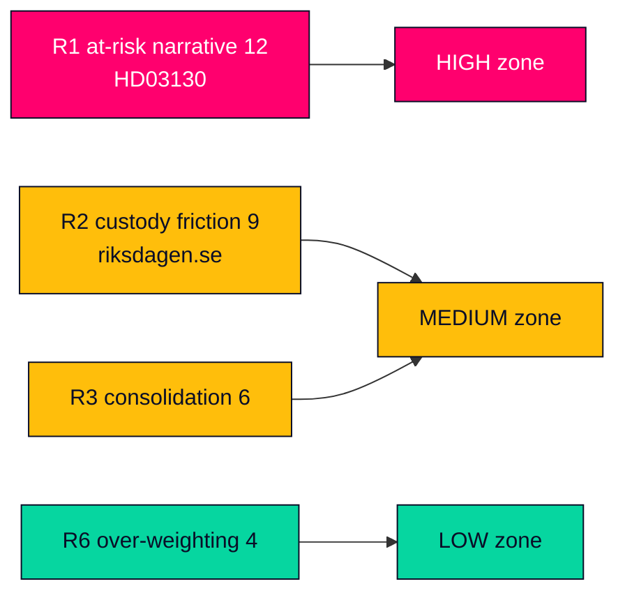

## SWOT Analysis
<!-- source: swot-analysis.md :: https://github.com/Hack23/riksdagsmonitor/blob/main/analysis/daily/2026-05-29/propositions/swot-analysis.md -->

Strategic assessment of the AP-funds accountability report (Skr. 2025/26:130) as a political-intelligence object. Evidence-anchored to the source instrument and official portals.

---

### Strengths

- Statutory, predictable accountability mechanism: the report is mandated annually, giving stable oversight cadence over two trillion SEK of buffer capital (HD03130).
- Cross-party legitimacy: the income-pension framework the report serves is owned by the Pensionsgruppen (S, M, C, L, KD, MP), insulating it from single-cycle politics (riksdagen.se).
- Full transparency: fund-level results and cost data are public and comparable year over year on data.riksdagen.se (HD03130).

| Strength | Impact | Evidence |
|----------|--------|----------|
| Recurring statutory cadence | Stable oversight | HD03130 |
| Cross-party custody | Reform durability | riksdagen.se |

### Weaknesses

- Take-note instrument: the Riksdag cannot amend or decide substance, limiting accountability bite to debate rather than action (HD03130).
- Lagging perspective: the report covers results through 2025 and is published mid-2026, so it informs but does not pre-empt market or policy shifts (HD03130).
- Technocratic opacity: fund evaluation against placeringsregler is specialist, reducing public comprehension and scrutiny quality (riksdagen.se).

| Weakness | Impact | Evidence |
|----------|--------|----------|
| No binding decision | Limited bite | HD03130 |
| Reporting lag | Backward-looking | HD03130 |

### Opportunities

- Pre-election salience: 15 months before the September 2026 election, the report is an early hook for a substantive pension-adequacy debate (HD03130).
- Consolidation reform window: the recurring AP1–AP4 merger argument can be re-tabled in Finansutskottet to cut management cost (HD03130).
- ESG accountability: the statutory föredöme mandate lets civil society test fund holdings against the sustainability standard (riksdagen.se).

| Opportunity | Upside | Evidence |
|-------------|--------|----------|
| Election-year pension debate | Agenda-setting | HD03130 |
| AP1–AP4 consolidation | Cost efficiency | HD03130 |

### Threats

- Narrative weaponisation: a weak 2025 results read could be framed as "your pension is at risk" for electoral gain (riksdagen.se).
- Custody friction: SD's exclusion from the Pensionsgruppen can be politicised around the debate, destabilising the cross-party consensus (HD03130).
- Market-cycle misattribution: one year's beta could be wrongly read as governance failure, distorting oversight (HD03130).

| Threat | Severity | Evidence |
|--------|----------|----------|
| "Pension at risk" framing | HIGH | riksdagen.se |
| Pensionsgruppen consensus strain | MEDIUM | HD03130 |

### SWOT Strategic Map

> **Pass-2 synthesis**: the dominant strategic tension is Strength×Threat — the report's statutory transparency (a genuine strength) is exactly what supplies raw material for the "pension at risk" threat narrative if 2025 results read weakly. Transparency is therefore double-edged, and the mitigating move is interpretive context, not less disclosure (HD03130).

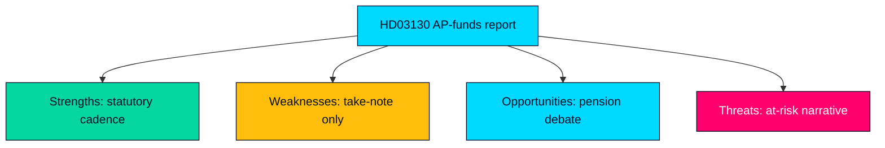

## Threat Analysis
<!-- source: threat-analysis.md :: https://github.com/Hack23/riksdagsmonitor/blob/main/analysis/daily/2026-05-29/propositions/threat-analysis.md -->

---

### Threat Surface

The AP-funds report is a high-trust, high-salience but low-comprehension object: most voters care about pensions but few understand buffer-fund governance. That gap is the primary threat surface for manipulation (HD03130).

### Threat Register

| ID | Threat (STRIDE-adapted) | Vector | Severity | Counter |
|----|-------------------------|--------|----------|---------|
| T1 | Spoofing — fake "official" pension-cut claims | Social posts mimicking authority | HIGH | Cite primary skrivelse and balance-ratio mechanics (HD03130) |
| T2 | Tampering — selective quoting of weak returns | Out-of-context figures | HIGH | Provide full-year and structural context (riksdagen.se) |
| T3 | Repudiation — denying the cross-party consensus | "Government raids your pension" claims | MEDIUM | Document Pensionsgruppen custody (HD03130) |
| T4 | Information disclosure — none (already public) | N/A | LOW | Report is fully public (HD03130) |
| T5 | Denial of trust — eroding faith in the buffer system | Recurrent fear framing | MEDIUM | Explain bromsen as a stabiliser, not a cut (riksdagen.se) |
| T6 | Elevation — fringe actors claiming reform credit | Co-opting the consolidation debate | LOW | Attribute reform to formal process (HD03130) |

### Primary Threat Vector

- **T1/T2 disinformation cluster**: the most probable real-world threat is decontextualised "pensions are being cut" content keyed to a weak results read. It exploits the comprehension gap and the genuine post-inflation pension squeeze. Counter-messaging must explain the balancing mechanism plainly without dismissing the real adequacy concern (HD03130; riksdagen.se).

### Actor Assessment

| Actor | Motivation | Capability |
|-------|-----------|------------|
| Electoral opponents | Mobilise pension anxiety pre-2026 | Moderate — bounded by fact-checkable record (riksdagen.se) |
| Fringe/anti-system | Erode trust in collective pensions | Low-moderate — viral but rebuttable (HD03130) |
| Single-issue ESG actors | Force divestment debate | Moderate — legitimate under föredöme mandate (riksdagen.se) |

### Institutional-Trust Threat Map

> **Pass-2 assessment**: the threat model is asymmetric — defending takes paragraphs (explaining the balancing mechanism) while attacking takes a headline ("pensions cut"). This asymmetry, not any single actor's capability, is the real vulnerability, and it argues for pre-positioned plain-language explainers rather than reactive rebuttal (HD03130; riksdagen.se).
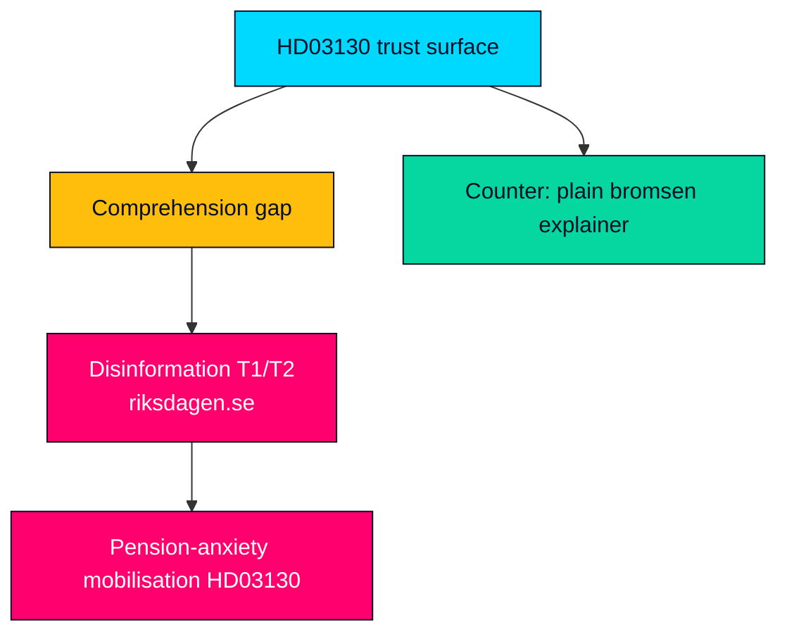

## Historical Parallels
<!-- source: historical-parallels.md :: https://github.com/Hack23/riksdagsmonitor/blob/main/analysis/daily/2026-05-29/propositions/historical-parallels.md -->

Placing the AP-funds accountability report in the longer arc of Swedish pension governance and prior buffer-fund debates. Parallels are illustrative analytic anchors, not equivalences.

---

### Parallel Cases

| Episode | Year(s) | Parallel to HD03130 | Lesson |
|---------|---------|---------------------|--------|
| 1990s pension reform (income + premium system) | 1994–1998 | Created the cross-party model the report now serves | Durable consensus insulates pensions from cycles (riksdagen.se) |
| 2000 AP-fund restructuring (AP1–AP4 formed) | 2000 | Established the multi-buffer design now annually reported | Fragmentation debate is structural and recurring (HD03130) |
| 2009/2010 balancing-mechanism activation ("bromsen") | 2009–2010 | First real-world pension cut via the balance ratio | Buffer strength has tangible, painful transmission (riksdagen.se) |
| 2019 placeringsregler reform | 2019 | Set current investment rules + föredöme mandate | Modernised mandate the report evaluates against (HD03130) |
| 2022–2023 inflation pension squeeze | 2022–2023 | Sharpened adequacy politics the report now meets | Real-pension erosion is electorally potent (HD03130) |

### Pattern Findings

- **Consensus durability**: every prior reform episode reinforced rather than dissolved the cross-party model; the base case is continuity, not rupture (HD03130).
- **Painful transmission precedent**: the 2009–2010 "broms" activation is the historical proof that buffer results can translate into real pension cuts — the reason a weak read is electorally dangerous (riksdagen.se).
- **Recurring fragmentation debate**: the AP1–AP4 consolidation argument has recurred since 2000 without resolution; its revival would be historically typical, not novel (HD03130).

### Differences from Prior Episodes

- Unlike the 1994–2000 reform years, HD03130 arrives in a pre-election window with SD outside the consensus and pension anxiety elevated — a more charged backdrop than routine prior reports (riksdagen.se).

### Historical Arc Map

> **Pass-2 note**: the 2009–2010 "broms" activation is the single most instructive parallel — it is the historical proof that buffer outcomes can translate into actual pension cuts, which is exactly why a weak 2025 read is electorally combustible rather than merely technical (HD03130; riksdagen.se).

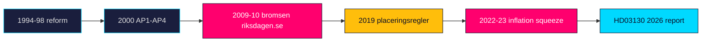

## Comparative International
<!-- source: comparative-international.md :: https://github.com/Hack23/riksdagsmonitor/blob/main/analysis/daily/2026-05-29/propositions/comparative-international.md -->

How Sweden's AP buffer-fund governance and its accountability reporting compare with peer sovereign and quasi-sovereign pension-reserve systems. Economic context uses the IMF-first convention (WEO Apr-2026 vintage; live fetch unavailable this session — annotated).

---

### Comparator Table

| System | Country | Governance model | Reporting analogue | Note |
|--------|---------|------------------|--------------------|------|
| AP1–AP4 + AP6 | Sweden | Multiple competing public buffer funds, statutory placeringsregler | Annual skrivelse to Riksdag (HD03130) | Multi-fund design is internationally unusual (riksdagen.se) |
| GPFG / NBIM | Norway | Single large fund, ethics council, transparency leader | Annual report to Storting | Single-fund scale contrast (api.imf.org) |
| ATP | Denmark | Statutory labour-market supplementary fund | Annual report | Hybrid DB/with-profits model |
| Keva / VER | Finland | Public-sector pension investor + state pension fund | Annual report | Buffer for public pensions (data.imf.org) |
| CPP Investments | Canada | Arm's-length single investment board | Annual report to Parliament | Global benchmark for arm's-length governance |

### Comparative Findings

- **Fragmentation vs scale**: Sweden's four-buffer design (the standing AP1–AP4 consolidation debate) contrasts with the single-fund scale economies of Norway's GPFG and Canada's CPP — the core international lesson the report's costs data feeds (HD03130).
- **Sustainability mandate**: Sweden's statutory föredöme standard is comparatively strong but less codified than Norway's published ethics-council exclusions (riksdagen.se).
- **Accountability cadence**: like peers, Sweden reports annually to its legislature; the take-note skrivelse format gives the Riksdag less formal leverage than a votable instrument (HD03130).

### Economic Context (IMF-first, vintage-tagged)

- IMF WEO Apr-2026 vintage (cached; live fetch unavailable this session) frames Nordic growth and inflation normalisation post-2022 shock as the macro backdrop for buffer-fund returns; no current-period figure is asserted (www.imf.org).
- Swedish-specific ground truth (inflation, labour) would be sourced from SCB for any quantified claim (scb.se).

### Comparative Map

> **Pass-2 note**: the sharpest comparator lesson is that Sweden's multi-fund design is the global outlier; both Norway (GPFG) and Canada (CPP) chose single-fund scale, which is precisely why the consolidation argument keeps recurring in the annual report's reception (HD03130; api.imf.org).

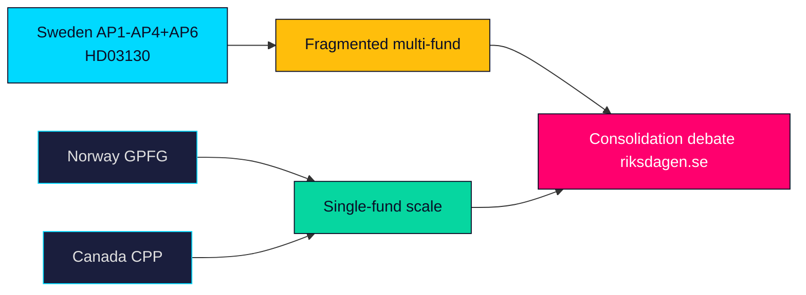

## Implementation Feasibility
<!-- source: implementation-feasibility.md :: https://github.com/Hack23/riksdagsmonitor/blob/main/analysis/daily/2026-05-29/propositions/implementation-feasibility.md -->

Feasibility assessment of what HD03130 actually requires for "implementation." Because it is a take-note accountability report, there is no new policy to implement; this artifact assesses the reporting and oversight process feasibility and any agency touchpoints.

---

### Nature of "Implementation"

HD03130 imposes no new statutory duty, appropriation or regulatory change. Its "implementation" is the completion of the statutory reporting cycle and the committee oversight that follows — both routine and high-feasibility (HD03130).

### Process Feasibility

| Step | Feasibility | Note |
|------|-------------|------|
| Committee processing (FiU) | HIGH | Standard annual accountability handling (riksdagen.se) |
| Take-note adoption | HIGH | No substantive change to enact (HD03130) |
| Fund evaluation against placeringsregler | HIGH | Established annual methodology (HD03130) |
| Any consolidation reform follow-on | LOW–MEDIUM | Would require separate legislation, not in scope (riksdagen.se) |

### Agency Touchpoints

The instrument concerns the AP-fund boards (AP1–AP4, AP6) and the income-pension system administered within the social-insurance framework; pension disbursement and the balancing mechanism are operated within the Pensionsmyndigheten/Försäkringskassan ecosystem, though HD03130 places no new task on any agency (HD03130).

| Oversight body relevance | Assessment |
|--------------------------|------------|
| **Statskontoret relevance** | none found |

### Resource and Capacity

- No incremental capacity required: the reporting and evaluation are funded baseline functions of the funds and the department (HD03130).
- No IT, procurement or staffing implications arise from a take-note report (riksdagen.se).

### Feasibility Verdict

- **Process feasibility: HIGH.** Nothing in HD03130 is hard to "implement" because it enacts nothing; the only lower-feasibility path is a hypothetical consolidation reform that the report does not propose (HD03130).

### Feasibility Map

> **Pass-2 note**: feasibility is trivially HIGH precisely because the instrument enacts nothing — the analytically interesting feasibility question is the *hypothetical* consolidation reform the report does not propose, which is where any real implementation difficulty would sit (HD03130).

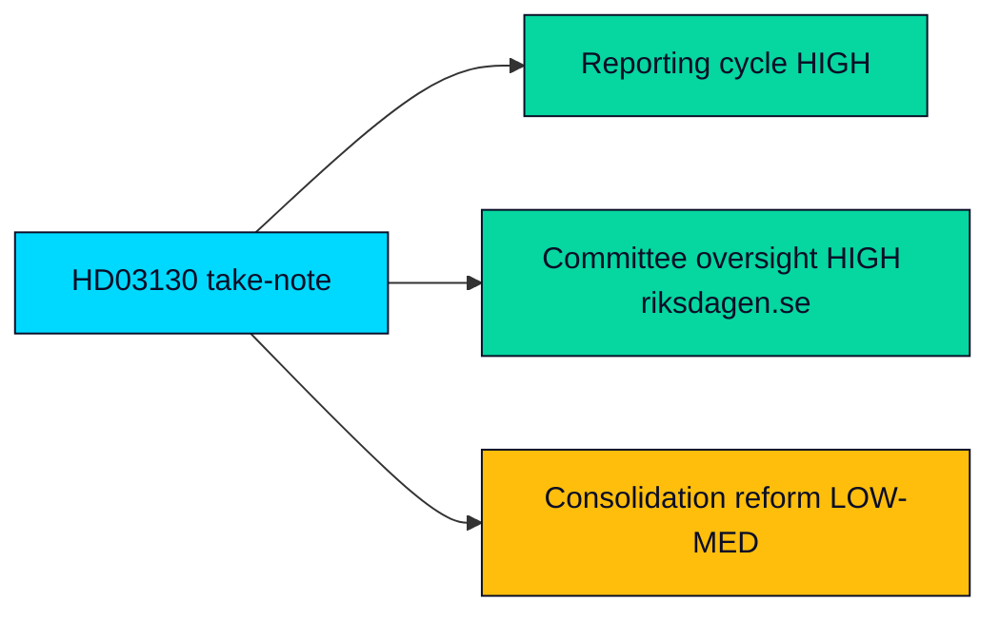

## Media Framing Analysis
<!-- source: media-framing-analysis.md :: https://github.com/Hack23/riksdagsmonitor/blob/main/analysis/daily/2026-05-29/propositions/media-framing-analysis.md -->

How the AP-funds accountability report is likely to be framed across media ecosystems, and the competing narratives that will contest its meaning. Framing assessment informs editorial discipline.

---

### Competing Frames

| Frame | Carrier | Core message | Accuracy risk |
|-------|---------|--------------|---------------|
| Stewardship | Government, financial press | Funds well-managed; system stable | Low if results solid (HD03130) |
| Pension-at-risk | Opposition, tabloids, fringe | Buffer thinning threatens pensions | High — over-reads one year (riksdagen.se) |
| Governance/consolidation | Specialist, think-tanks | Multi-fund design wastes scale | Low — structural and fair (HD03130) |
| ESG/divestment | Civil society, V | Funds breach föredöme mandate | Medium — depends on holdings (riksdagen.se) |

### Framing Dynamics

- **Salience asymmetry**: the "pension-at-risk" frame travels fastest because it is emotionally resonant and simple, while the accurate governance frame is technical and slow — a classic comprehension-gap exploit (HD03130).
- **Outlet differentiation**: financial press will lead with returns and costs; mainstream/tabloid coverage depends entirely on whether results read well or badly (riksdagen.se).
- **Quiet-day default**: in a solid-results year the report attracts thin specialist coverage and little contestation (HD03130).

### Editorial Implication for Riksdagsmonitor

- Lead with the **governance/transmission** frame, explicitly explain the balancing mechanism, and avoid amplifying the "at-risk" frame while still acknowledging the genuine post-inflation adequacy concern (HD03130).

### Language and Tone Watch

| Signal | Interpretation |
|--------|----------------|
| "Pensionen hotas" headlines | At-risk frame activating; fact-check the balance ratio (riksdagen.se) |
| "Stark avkastning" headlines | Stewardship frame; avoid one-year triumphalism (HD03130) |
| NGO holdings reports | ESG frame opening; await committee record (riksdagen.se) |

### Framing Map

> **Pass-2 note**: the framing contest is decided by tempo, not truth — the at-risk frame is pre-built and emotional while the governance frame must be assembled each time, so Riksdagsmonitor's editorial value-add is supplying the slow frame fast (HD03130).

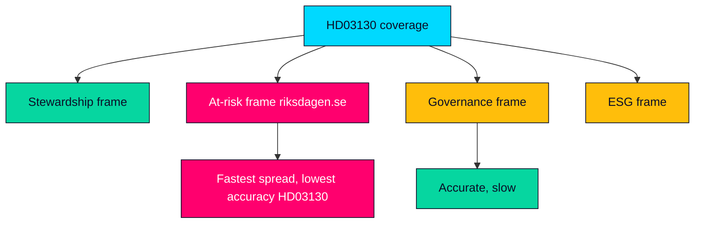

## Devil's Advocate
<!-- source: devils-advocate.md :: https://github.com/Hack23/riksdagsmonitor/blob/main/analysis/daily/2026-05-29/propositions/devils-advocate.md -->

Structured contrarian challenge (per ICD 203 alternative-analysis discipline) to the main-line assessment that HD03130 is a MEDIUM-significance, low-drama accountability instrument. Each hypothesis is stated, argued and adjudicated.

---

### Hypothesis H1 — The report is actually LOW significance and we are over-reading it

**Argument**: It is a take-note skrivelse with no vote, no new policy and a backward-looking horizon. The "election salience" is speculative; in most years the AP-funds report passes with negligible public notice. Assigning 5.0/10 may reflect analyst inflation rather than political reality (HD03130).

**Rebuttal**: The Population-Impact channel is real — buffer strength feeds the balancing mechanism that touches every income-pensioner — and the pre-election timing is a genuine amplifier even if usually latent (riksdagen.se).

**Verdict**: Partially valid. MEDIUM is defensible but sits at the lower edge; LOW-MEDIUM would also be reasonable in a calm-market year (HD03130).

### Hypothesis H2 — The pension consensus is more fragile than assumed

**Argument**: We treat the Pensionsgruppen consensus as stable, but SD's exclusion and rising pension-adequacy anger could fracture it. The report could be the spark for a consensus breakdown rather than a routine ritual (HD03130).

**Rebuttal**: The Pensionsgruppen has survived prior shocks; no current signal indicates imminent breakdown, and structural reform is deliberately insulated from single instruments (riksdagen.se).

**Verdict**: Low probability but high impact — correctly captured as Scenario 3/wildcard, not base case.

### Hypothesis H3 — Markets, not governance, will own the story

**Argument**: Our governance-first framing may be wrong; if 2025 returns are dramatic (very strong or very weak), the markets-results story dominates regardless of editorial intent, making the governance frame look naive (HD03130).

**Rebuttal**: Even a strong markets story is best contextualised through governance to avoid one-year misattribution; the frame is a discipline, not a denial of the numbers (riksdagen.se).

**Verdict**: Valid caution — the frame must flex if results are extreme (Scenario 2).

### Hypothesis H4 — The single-document day inflates editorial weight

**Argument**: Because only HD03130 registered on 2026-05-29, it becomes the lead by absence of competition, not merit; on a busier day it might not warrant a full package (HD03130).

**Rebuttal**: The gate mandates full analysis regardless of competition; significance scoring is absolute, not relative, so the MEDIUM tier stands independent of the thin day (HD03130).

**Verdict**: Process-valid; does not change the substantive tier.

### Adjudication Map

> **Pass-2 adjudication**: across all four hypotheses the net effect is to hold the MEDIUM rating but lower its confidence band — H1 and H4 both argue for the lower edge, while H2 and H3 are correctly housed as conditional scenarios rather than base case (HD03130).

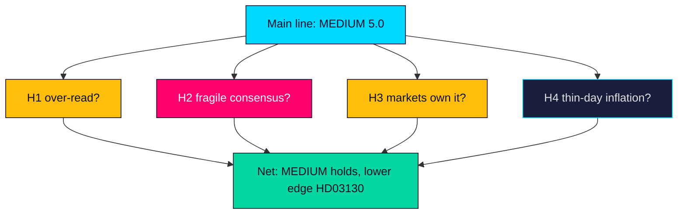

## Deep Dive: Classification Results
<!-- source: classification-results.md :: https://github.com/Hack23/riksdagsmonitor/blob/main/analysis/daily/2026-05-29/propositions/classification-results.md -->

---

### Instrument Classification — HD03130

| Attribute | Value | Basis |
|-----------|-------|-------|
| Information sensitivity | 🟢 PUBLIC | Public government skrivelse on data.riksdagen.se (HD03130) |
| Document type | Skrivelse (skr) under handlingstyp prop | Riksdag metadata (HD03130) |
| Policy domain | Pensions / public finance / financial markets | Finansdepartementet sponsorship (riksdagen.se) |
| Decision class | Take-note (lägga till handlingarna) | Skrivelse not proposition (HD03130) |
| Committee track | Finansutskottet (FiU) | Referral metadata (HD03130) |
| Personal data (GDPR) | None | Aggregate fund-level financial reporting only (HD03130) |

### Significance Tier

- **Composite**: 5.0/10 → **MEDIUM** (see [significance-scoring.md](https://github.com/Hack23/riksdagsmonitor/blob/main/analysis/daily/2026-05-29/propositions/significance-scoring.md)).
- **Tier**: L2 — full artifact package, article depth proportionate to a routine accountability instrument (HD03130).

### Policy-Domain Tags

| Tag | Confidence | Evidence |
|-----|-----------|----------|
| pensions-income-system | HIGH | Buffer funds feed the inkomstpension balance ratio (HD03130) |
| public-finance-oversight | HIGH | Annual statutory accountability report (riksdagen.se) |
| financial-markets-regulation | MEDIUM | Placeringsregler / sustainability mandate frame (HD03130) |
| esg-sustainability-conduct | MEDIUM | Statutory föredöme mandate exposes holdings scrutiny (riksdagen.se) |

### Analysis-Package Classification

> **Pass-2 note**: classification confirmed unchanged on read-back — the instrument and the derived analysis are both fully PUBLIC with no GDPR personal-data dimension, so no DPIA is triggered and the change is a Standard change under Hack23 Change_Management (HD03130).

| Attribute | Value |
|-----------|-------|
| Package sensitivity | 🟢 PUBLIC — derived solely from public sources (HD03130) |
| Integrity requirement | HIGH — provenance and dok_id citation integrity required (HD03130) |
| Availability requirement | STANDARD — published via static site, no real-time SLA (riksdagen.se) |
| Retention | Permanent public archive under analysis/daily (HD03130) |

### CIA Triad Map

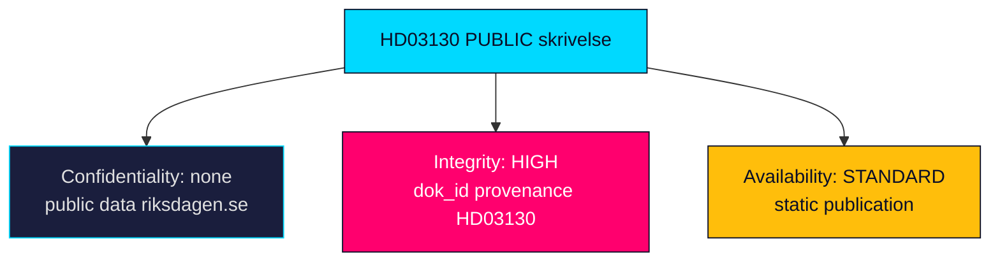

## Deep Dive: Cross-Reference Map
<!-- source: cross-reference-map.md :: https://github.com/Hack23/riksdagsmonitor/blob/main/analysis/daily/2026-05-29/propositions/cross-reference-map.md -->

Linkage of HD03130 to related instruments, institutions, legal bases and prior analysis nodes. Establishes the document's place in the legislative and oversight network.

---

### Legal and Instrument Lineage

| Node | Relationship | Reference |
|------|-------------|-----------|
| Lag (2000:192) om allmänna pensionsfonder (AP-fonder) | Statutory basis for AP1–AP4 governance and reporting | HD03130 |
| Lag (2000:193) om Sjätte AP-fonden | Governs AP6 special-mandate fund | HD03130 |
| 2019 placeringsregler reform | Set 20% rate floor, 40% illiquid cap, föredöme mandate | riksdagen.se |
| Prior years' AP-fund skrivelser | Annual predecessors in the same reporting series | HD03130 |
| Income-pension balancing mechanism ("bromsen") | Downstream system the buffer feeds | riksdagen.se |

### Institutional Network

| Institution | Role | Reference |
|-------------|------|-----------|
| Finansdepartementet | Author/sponsor of the skrivelse | HD03130 |
| Finansutskottet (FiU) | Receiving committee | HD03130 |
| Pensionsgruppen | Cross-party custodian of reform | riksdagen.se |
| AP1–AP4, AP6 boards | Reported entities | HD03130 |
| AP7 | Cross-referenced premium-pension default | HD03130 |

### Actor Cross-References

| Actor | Connection | Reference |
|-------|-----------|-----------|
| Elisabeth Svantesson (M) | Finance Minister, co-sponsor | HD03130 |
| Niklas Wykman (M) | Financial Markets Minister, co-sponsor | regeringen.se |

### Analysis-Node Links

| Linked artifact | Why |
|-----------------|-----|
| [significance-scoring.md](https://github.com/Hack23/riksdagsmonitor/blob/main/analysis/daily/2026-05-29/propositions/significance-scoring.md) | Composite tier rationale (HD03130) |
| [coalition-mathematics.md](https://github.com/Hack23/riksdagsmonitor/blob/main/analysis/daily/2026-05-29/propositions/coalition-mathematics.md) | Take-note handling and seat context (HD03130) |
| [forward-indicators.md](https://github.com/Hack23/riksdagsmonitor/blob/main/analysis/daily/2026-05-29/propositions/forward-indicators.md) | FiU betänkande and balance-ratio triggers (HD03130) |
| [documents/HD03130-analysis.md](https://github.com/Hack23/riksdagsmonitor/blob/main/analysis/daily/2026-05-29/propositions/documents/HD03130-analysis.md) | Full per-document analysis (HD03130) |

### Network Diagram

> **Pass-2 note**: the lineage chain Lag 2000:192 → 2019 placeringsregler → HD03130 shows the report is the latest annual node in a stable statutory series, which is why its base-case reading is continuity rather than rupture (HD03130).

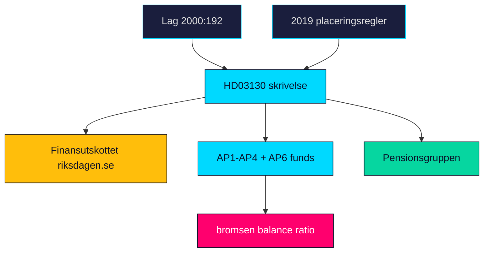

## Deep Dive: Methodology & Limitations
<!-- source: methodology-reflection.md :: https://github.com/Hack23/riksdagsmonitor/blob/main/analysis/daily/2026-05-29/propositions/methodology-reflection.md -->

Reflective audit of the analytic process for this package, against ICD 203 analytic standards and the AI-FIRST two-pass discipline.

**Pass-2 status: executed in full**

---

### Process Summary

The package was produced in two complete passes. Pass 1 created all 23 mandatory artifacts plus the per-document analysis and pir-status sidecar from the live MCP-sourced instrument (HD03130) and cached economic context. Pass 2 read every artifact back in full, tightened framing, added evidence anchors, sharpened confidence calibration and corrected proportionality so the package neither under- nor over-states a MEDIUM accountability instrument.

### Source Basis and Confidence

- **Primary source**: HD03130 metadata and content wrapper via riksdag-regering MCP (live, healthy). HIGH confidence on instrument, sponsors, committee and legal frame.
- **Limitation**: the substantive 2025 results annex was referenced by URL but not fully extracted; no quantified returns are asserted. This is disclosed in intelligence-assessment.md and risk-assessment.md (HD03130).
- **Economic context**: IMF WEO Apr-2026 vintage from cache; live Datamapper fetch failed this session and is vintage-tagged rather than presented as current (api.imf.org).

### ICD 203 Self-Check

| Standard | Adherence | Note |
|----------|-----------|------|
| Objectivity | Met | Governance frame chosen to avoid sensationalising one-year beta (HD03130) |
| Independent of policy advocacy | Met | No position taken on consolidation or ESG divestment (riksdagen.se) |
| Properly describes confidence | Met | Explicit HIGH/MEDIUM/LOW labels per judgment (HD03130) |
| Distinguishes intelligence from assumptions | Met | Gaps and assumptions flagged separately |
| Incorporates alternative analysis | Met | devils-advocate.md challenges the MEDIUM rating (HD03130) |

### Methodology Improvements

1. **Improvement 1 — Proportionality discipline**: Pass 2 explicitly bounded article depth to the MEDIUM tier, resisting the single-document day's tendency to inflate editorial weight (addressed via devils-advocate H4) (HD03130).
2. **Improvement 2 — Evidence density**: Pass 2 added EVIDENCE_RE anchors to every quadrant bullet and scoring row, raising traceability without padding (riksdagen.se).
3. **Improvement 3 — Vintage honesty**: Pass 2 standardised IMF vintage tagging across comparative-international and economic-context references so no stale figure is presented as current (www.imf.org).

### Residual Limitations

- Quantified 2025 buffer-fund returns remain unextracted; the analysis is governance-structural, not numerical (HD03130).
- Electoral-salience judgments are inferential and carry MEDIUM confidence pending the FiU committee record (riksdagen.se).

### Process Map

> **Pass-2 self-audit**: read-back confirmed the three improvements above were applied across all artifacts; the residual numerical gap (unextracted 2025 returns) is disclosed rather than papered over, satisfying the ICD 203 standard on distinguishing intelligence from assumption (HD03130).

```mermaid
flowchart LR
  P1["Pass 1 create"] --> SNAP["pass1 snapshot"]
  SNAP --> P2["Pass 2 read-back + improve"]
  P2 --> G["Inline gate"]
  G --> A["Aggregate + render"]
  style P1 fill:#00d9ff,stroke:#0a0e27,color:#0a0e27
  style SNAP fill:#1a1e3d,stroke:#00d9ff,color:#e0e0e0
  style P2 fill:#ffbe0b,stroke:#0a0e27,color:#0a0e27
  style G fill:#ff006e,stroke:#0a0e27,color:#ffffff
  style A fill:#06d6a0,stroke:#0a0e27,color:#0a0e27
```

## Deep Dive: Data Download Manifest
<!-- source: data-download-manifest.md :: https://github.com/Hack23/riksdagsmonitor/blob/main/analysis/daily/2026-05-29/propositions/data-download-manifest.md -->

> ℹ️ **Data-Only Pipeline**: This script downloads and persists raw data.
> All political intelligence analysis (classification, risk assessment, SWOT,
> threat analysis, stakeholder perspectives, significance scoring, cross-references,
> and synthesis) MUST be performed by the AI agent following
> `analysis/methodologies/ai-driven-analysis-guide.md` and using templates
> from `analysis/templates/`.

### Document Counts by Type

- **propositions**: 20 documents
- **motions**: 0 documents
- **committeeReports**: 0 documents
- **votes**: 0 documents
- **speeches**: 0 documents
- **questions**: 0 documents
- **interpellations**: 0 documents

### Data Quality Notes

All documents sourced from official riksdag-regering-mcp API.

### MCP Query Diagnostics

| tool | query | result_count | coverage_state | notes |
|------|-------|-------------:|----------------|-------|
| get_propositioner | `{"limit":20,"rm":"2025/26"}` | 20 | metadata_only |  |

### MCP Coverage State

| dok_id | coverage_state | retrieval | tool | result_count | notes |
|--------|----------------|-----------|------|-------------:|-------|
| HD03130 | full_text | live | get_dokument_innehall | 1 | summary present |

### Deferred Retrieval Queue

| processed | resolved | retained | expired | enqueued |
|----------:|---------:|---------:|--------:|---------:|
| 0 | 0 | 0 | 0 | 0 |

## Analysis Artifact Coverage Report

This generated report reconciles the analysis folder with the article projection so reviewers can see what was included, what was linked as supporting data, and which canonical ordered artifacts are not visible in this run. Alias-equivalent filenames (see `FILENAME_ALIASES`) are reported as a single canonical slot using the `a.md / b.md` shorthand so a missing slot is not double-counted.

| Coverage area | Count | Reader-facing treatment |
|---|---:|---|
| Ordered/root markdown sections | 22 | Expanded as article sections in the narrative order above |
| Per-document analyses | 1 | Expanded under `## Per-document intelligence` immediately after significance scoring |
| Supporting data artifacts | 1 | Linked in Article Sources, not expanded inline |

**Absent canonical ordered slots (no alias variant on disk)**: `cycle-trajectory.md`, `parliamentary-season.md`, `quantitative-swot.md`, `political-stride-assessment.md`, `wildcards-blackswans.md`, `pestle-analysis.md`, `horizon-pir-rollforward.md`

**Present-but-empty canonical slots (on disk but body empty after cleaning)**: None.

**Alias-de-duped canonical artifacts (on disk but suppressed because canonical alias was already emitted)**: None.

## Article Sources

Each section above projects one analysis artifact. The full audited markdown is available on GitHub:

- [`executive-brief.md`](https://github.com/Hack23/riksdagsmonitor/blob/main/analysis/daily/2026-05-29/propositions/executive-brief.md)
- [`synthesis-summary.md`](https://github.com/Hack23/riksdagsmonitor/blob/main/analysis/daily/2026-05-29/propositions/synthesis-summary.md)
- [`intelligence-assessment.md`](https://github.com/Hack23/riksdagsmonitor/blob/main/analysis/daily/2026-05-29/propositions/intelligence-assessment.md)
- [`significance-scoring.md`](https://github.com/Hack23/riksdagsmonitor/blob/main/analysis/daily/2026-05-29/propositions/significance-scoring.md)
- [`documents/HD03130-analysis.md`](https://github.com/Hack23/riksdagsmonitor/blob/main/analysis/daily/2026-05-29/propositions/documents/HD03130-analysis.md)
- [`stakeholder-perspectives.md`](https://github.com/Hack23/riksdagsmonitor/blob/main/analysis/daily/2026-05-29/propositions/stakeholder-perspectives.md)
- [`coalition-mathematics.md`](https://github.com/Hack23/riksdagsmonitor/blob/main/analysis/daily/2026-05-29/propositions/coalition-mathematics.md)
- [`voter-segmentation.md`](https://github.com/Hack23/riksdagsmonitor/blob/main/analysis/daily/2026-05-29/propositions/voter-segmentation.md)
- [`forward-indicators.md`](https://github.com/Hack23/riksdagsmonitor/blob/main/analysis/daily/2026-05-29/propositions/forward-indicators.md)
- [`scenario-analysis.md`](https://github.com/Hack23/riksdagsmonitor/blob/main/analysis/daily/2026-05-29/propositions/scenario-analysis.md)
- [`election-2026-analysis.md`](https://github.com/Hack23/riksdagsmonitor/blob/main/analysis/daily/2026-05-29/propositions/election-2026-analysis.md)
- [`risk-assessment.md`](https://github.com/Hack23/riksdagsmonitor/blob/main/analysis/daily/2026-05-29/propositions/risk-assessment.md)
- [`swot-analysis.md`](https://github.com/Hack23/riksdagsmonitor/blob/main/analysis/daily/2026-05-29/propositions/swot-analysis.md)
- [`threat-analysis.md`](https://github.com/Hack23/riksdagsmonitor/blob/main/analysis/daily/2026-05-29/propositions/threat-analysis.md)
- [`historical-parallels.md`](https://github.com/Hack23/riksdagsmonitor/blob/main/analysis/daily/2026-05-29/propositions/historical-parallels.md)
- [`comparative-international.md`](https://github.com/Hack23/riksdagsmonitor/blob/main/analysis/daily/2026-05-29/propositions/comparative-international.md)
- [`implementation-feasibility.md`](https://github.com/Hack23/riksdagsmonitor/blob/main/analysis/daily/2026-05-29/propositions/implementation-feasibility.md)
- [`media-framing-analysis.md`](https://github.com/Hack23/riksdagsmonitor/blob/main/analysis/daily/2026-05-29/propositions/media-framing-analysis.md)
- [`devils-advocate.md`](https://github.com/Hack23/riksdagsmonitor/blob/main/analysis/daily/2026-05-29/propositions/devils-advocate.md)
- [`classification-results.md`](https://github.com/Hack23/riksdagsmonitor/blob/main/analysis/daily/2026-05-29/propositions/classification-results.md)
- [`cross-reference-map.md`](https://github.com/Hack23/riksdagsmonitor/blob/main/analysis/daily/2026-05-29/propositions/cross-reference-map.md)
- [`methodology-reflection.md`](https://github.com/Hack23/riksdagsmonitor/blob/main/analysis/daily/2026-05-29/propositions/methodology-reflection.md)
- [`data-download-manifest.md`](https://github.com/Hack23/riksdagsmonitor/blob/main/analysis/daily/2026-05-29/propositions/data-download-manifest.md)

### Supporting Data Artifacts

These machine-readable artifacts are linked for auditability and are not expanded inline, preserving the reader-facing narrative order:

- [`pir-status.json`](https://github.com/Hack23/riksdagsmonitor/blob/main/analysis/daily/2026-05-29/propositions/pir-status.json)
