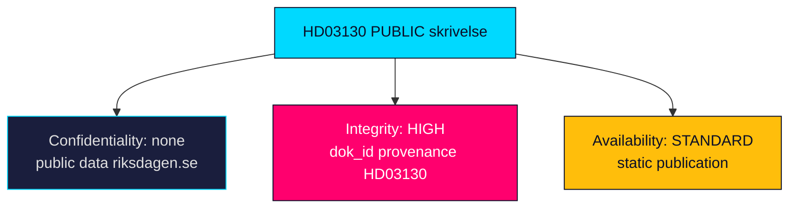

# Classification Results — Propositions 2026-05-29

**Framework**: Hack23 CLASSIFICATION.md (CIA triad + RTO/RPO) applied to the analysed instrument and to this analysis package.

---

## Instrument Classification — HD03130

| Attribute | Value | Basis |
|-----------|-------|-------|
| Information sensitivity | 🟢 PUBLIC | Public government skrivelse on data.riksdagen.se (HD03130) |
| Document type | Skrivelse (skr) under handlingstyp prop | Riksdag metadata (HD03130) |
| Policy domain | Pensions / public finance / financial markets | Finansdepartementet sponsorship (riksdagen.se) |
| Decision class | Take-note (lägga till handlingarna) | Skrivelse not proposition (HD03130) |
| Committee track | Finansutskottet (FiU) | Referral metadata (HD03130) |
| Personal data (GDPR) | None | Aggregate fund-level financial reporting only (HD03130) |

## Significance Tier

- **Composite**: 5.0/10 → **MEDIUM** (see [significance-scoring.md](significance-scoring.md)).
- **Tier**: L2 — full artifact package, article depth proportionate to a routine accountability instrument (HD03130).

## Policy-Domain Tags

| Tag | Confidence | Evidence |
|-----|-----------|----------|
| pensions-income-system | HIGH | Buffer funds feed the inkomstpension balance ratio (HD03130) |
| public-finance-oversight | HIGH | Annual statutory accountability report (riksdagen.se) |
| financial-markets-regulation | MEDIUM | Placeringsregler / sustainability mandate frame (HD03130) |
| esg-sustainability-conduct | MEDIUM | Statutory föredöme mandate exposes holdings scrutiny (riksdagen.se) |

## Analysis-Package Classification

> **Pass-2 note**: classification confirmed unchanged on read-back — the instrument and the derived analysis are both fully PUBLIC with no GDPR personal-data dimension, so no DPIA is triggered and the change is a Standard change under Hack23 Change_Management (HD03130).

| Attribute | Value |
|-----------|-------|
| Package sensitivity | 🟢 PUBLIC — derived solely from public sources (HD03130) |
| Integrity requirement | HIGH — provenance and dok_id citation integrity required (HD03130) |
| Availability requirement | STANDARD — published via static site, no real-time SLA (riksdagen.se) |
| Retention | Permanent public archive under analysis/daily (HD03130) |

## CIA Triad Map

