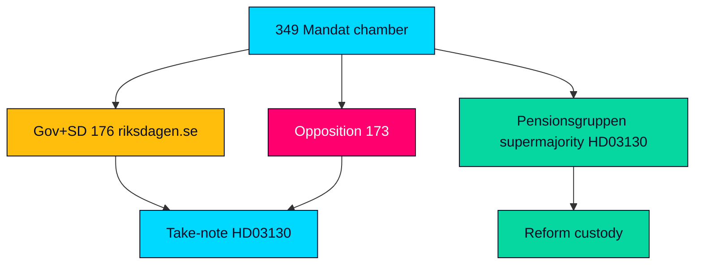

# Coalition Mathematics — Propositions 2026-05-29 (HD03130)

Seat arithmetic and decision-pathway analysis for HD03130. Because the instrument is a skrivelse (take-note), there is no binding substantive vote; the arithmetic below is contextual, showing the chamber balance that frames any reservationer or related motions.

---

## Riksdag Seat Distribution (2022–2026 mandate)

| Bloc | Parties | Mandat (Seats) | Note |
|------|---------|----------------|------|
| Government + support | M, KD, L, SD | 176 | Tidö constellation majority (riksdagen.se) |
| Opposition | S, V, C, MP | 173 | Cross-bloc on pensions via Pensionsgruppen (HD03130) |
| Total | All | 349 | Majority threshold 175 (riksdagen.se) |

## Decision Pathway for HD03130

| Step | Action | Vote type | Note |
|------|--------|-----------|------|
| Referral | To Finansutskottet | None | Standard committee routing (HD03130) |
| Committee | Betänkande, possible reservationer | None binding on substance | Take-note recommendation (riksdagen.se) |
| Chamber | Lägga skrivelsen till handlingarna | Acklamation likely | No substantive division expected (HD03130) |

## Illustrative Take-Note Disposition

| Outcome | Seats | Likelihood |
|---------|-------|------------|
| Ja (note the report) | 349 Mandat | Near-certain by acclamation (HD03130) |
| Nej | 0 | Not expected — no party rejects noting a report (riksdagen.se) |
| Avstår / Frånvarande | Variable | Procedural only (HD03130) |

## Pension-Reform Custody Arithmetic

- Structural reform requires the **Pensionsgruppen** (S, M, C, L, KD, MP) — a deliberately supermajoritarian coalition spanning both blocs, holding well above 175 seats combined, which is why pension changes are insulated from single-cycle majorities (HD03130).
- **SD (outside the group)** cannot unilaterally drive reform despite its 73-seat budget-support weight, the core of its grievance (riksdagen.se).

## Coalition Map

> **Pass-2 note**: the arithmetic that matters here is not the 176–173 chamber split but the Pensionsgruppen supermajority spanning both blocs — pension governance is deliberately removed from ordinary majority politics, which is why a take-note vote is a near-formality (HD03130).

