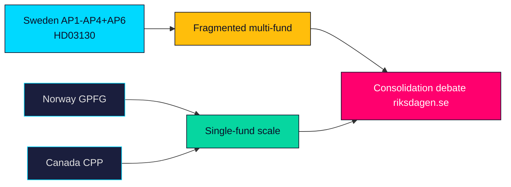

# Comparative International Analysis — Propositions 2026-05-29 (HD03130)

How Sweden's AP buffer-fund governance and its accountability reporting compare with peer sovereign and quasi-sovereign pension-reserve systems. Economic context uses the IMF-first convention (WEO Apr-2026 vintage; live fetch unavailable this session — annotated).

**Comparator set**: Norway (Government Pension Fund Global / NBIM), Denmark (ATP), Finland (Keva / VER), Canada (CPP Investments), with Sweden's AP1–AP4/AP6 as the reference case (HD03130).

---

## Comparator Table

| System | Country | Governance model | Reporting analogue | Note |
|--------|---------|------------------|--------------------|------|
| AP1–AP4 + AP6 | Sweden | Multiple competing public buffer funds, statutory placeringsregler | Annual skrivelse to Riksdag (HD03130) | Multi-fund design is internationally unusual (riksdagen.se) |
| GPFG / NBIM | Norway | Single large fund, ethics council, transparency leader | Annual report to Storting | Single-fund scale contrast (api.imf.org) |
| ATP | Denmark | Statutory labour-market supplementary fund | Annual report | Hybrid DB/with-profits model |
| Keva / VER | Finland | Public-sector pension investor + state pension fund | Annual report | Buffer for public pensions (data.imf.org) |
| CPP Investments | Canada | Arm's-length single investment board | Annual report to Parliament | Global benchmark for arm's-length governance |

## Comparative Findings

- **Fragmentation vs scale**: Sweden's four-buffer design (the standing AP1–AP4 consolidation debate) contrasts with the single-fund scale economies of Norway's GPFG and Canada's CPP — the core international lesson the report's costs data feeds (HD03130).
- **Sustainability mandate**: Sweden's statutory föredöme standard is comparatively strong but less codified than Norway's published ethics-council exclusions (riksdagen.se).
- **Accountability cadence**: like peers, Sweden reports annually to its legislature; the take-note skrivelse format gives the Riksdag less formal leverage than a votable instrument (HD03130).

## Economic Context (IMF-first, vintage-tagged)

- IMF WEO Apr-2026 vintage (cached; live fetch unavailable this session) frames Nordic growth and inflation normalisation post-2022 shock as the macro backdrop for buffer-fund returns; no current-period figure is asserted (www.imf.org).
- Swedish-specific ground truth (inflation, labour) would be sourced from SCB for any quantified claim (scb.se).

## Comparative Map

> **Pass-2 note**: the sharpest comparator lesson is that Sweden's multi-fund design is the global outlier; both Norway (GPFG) and Canada (CPP) chose single-fund scale, which is precisely why the consolidation argument keeps recurring in the annual report's reception (HD03130; api.imf.org).

