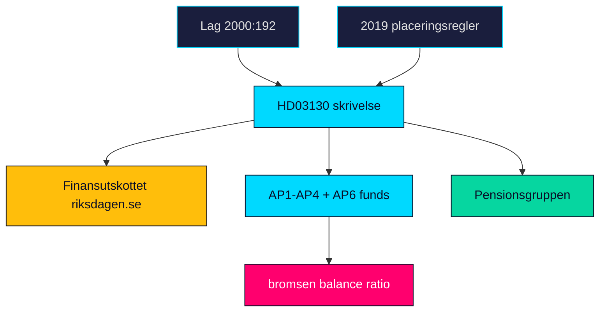

# Cross-Reference Map — Propositions 2026-05-29 (HD03130)

Linkage of HD03130 to related instruments, institutions, legal bases and prior analysis nodes. Establishes the document's place in the legislative and oversight network.

---

## Legal and Instrument Lineage

| Node | Relationship | Reference |
|------|-------------|-----------|
| Lag (2000:192) om allmänna pensionsfonder (AP-fonder) | Statutory basis for AP1–AP4 governance and reporting | HD03130 |
| Lag (2000:193) om Sjätte AP-fonden | Governs AP6 special-mandate fund | HD03130 |
| 2019 placeringsregler reform | Set 20% rate floor, 40% illiquid cap, föredöme mandate | riksdagen.se |
| Prior years' AP-fund skrivelser | Annual predecessors in the same reporting series | HD03130 |
| Income-pension balancing mechanism ("bromsen") | Downstream system the buffer feeds | riksdagen.se |

## Institutional Network

| Institution | Role | Reference |
|-------------|------|-----------|
| Finansdepartementet | Author/sponsor of the skrivelse | HD03130 |
| Finansutskottet (FiU) | Receiving committee | HD03130 |
| Pensionsgruppen | Cross-party custodian of reform | riksdagen.se |
| AP1–AP4, AP6 boards | Reported entities | HD03130 |
| AP7 | Cross-referenced premium-pension default | HD03130 |

## Actor Cross-References

| Actor | Connection | Reference |
|-------|-----------|-----------|
| Elisabeth Svantesson (M) | Finance Minister, co-sponsor | HD03130 |
| Niklas Wykman (M) | Financial Markets Minister, co-sponsor | regeringen.se |

## Analysis-Node Links

| Linked artifact | Why |
|-----------------|-----|
| [significance-scoring.md](significance-scoring.md) | Composite tier rationale (HD03130) |
| [coalition-mathematics.md](coalition-mathematics.md) | Take-note handling and seat context (HD03130) |
| [forward-indicators.md](forward-indicators.md) | FiU betänkande and balance-ratio triggers (HD03130) |
| [documents/HD03130-analysis.md](documents/HD03130-analysis.md) | Full per-document analysis (HD03130) |

## Network Diagram

> **Pass-2 note**: the lineage chain Lag 2000:192 → 2019 placeringsregler → HD03130 shows the report is the latest annual node in a stable statutory series, which is why its base-case reading is continuity rather than rupture (HD03130).

