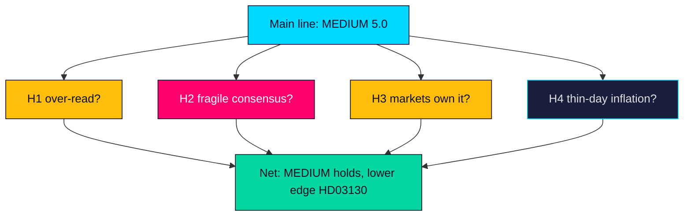

# Devil's Advocate — Propositions 2026-05-29 (HD03130)

Structured contrarian challenge (per ICD 203 alternative-analysis discipline) to the main-line assessment that HD03130 is a MEDIUM-significance, low-drama accountability instrument. Each hypothesis is stated, argued and adjudicated.

---

## Hypothesis H1 — The report is actually LOW significance and we are over-reading it

**Argument**: It is a take-note skrivelse with no vote, no new policy and a backward-looking horizon. The "election salience" is speculative; in most years the AP-funds report passes with negligible public notice. Assigning 5.0/10 may reflect analyst inflation rather than political reality (HD03130).

**Rebuttal**: The Population-Impact channel is real — buffer strength feeds the balancing mechanism that touches every income-pensioner — and the pre-election timing is a genuine amplifier even if usually latent (riksdagen.se).

**Verdict**: Partially valid. MEDIUM is defensible but sits at the lower edge; LOW-MEDIUM would also be reasonable in a calm-market year (HD03130).

## Hypothesis H2 — The pension consensus is more fragile than assumed

**Argument**: We treat the Pensionsgruppen consensus as stable, but SD's exclusion and rising pension-adequacy anger could fracture it. The report could be the spark for a consensus breakdown rather than a routine ritual (HD03130).

**Rebuttal**: The Pensionsgruppen has survived prior shocks; no current signal indicates imminent breakdown, and structural reform is deliberately insulated from single instruments (riksdagen.se).

**Verdict**: Low probability but high impact — correctly captured as Scenario 3/wildcard, not base case.

## Hypothesis H3 — Markets, not governance, will own the story

**Argument**: Our governance-first framing may be wrong; if 2025 returns are dramatic (very strong or very weak), the markets-results story dominates regardless of editorial intent, making the governance frame look naive (HD03130).

**Rebuttal**: Even a strong markets story is best contextualised through governance to avoid one-year misattribution; the frame is a discipline, not a denial of the numbers (riksdagen.se).

**Verdict**: Valid caution — the frame must flex if results are extreme (Scenario 2).

## Hypothesis H4 — The single-document day inflates editorial weight

**Argument**: Because only HD03130 registered on 2026-05-29, it becomes the lead by absence of competition, not merit; on a busier day it might not warrant a full package (HD03130).

**Rebuttal**: The gate mandates full analysis regardless of competition; significance scoring is absolute, not relative, so the MEDIUM tier stands independent of the thin day (HD03130).

**Verdict**: Process-valid; does not change the substantive tier.

## Adjudication Map

> **Pass-2 adjudication**: across all four hypotheses the net effect is to hold the MEDIUM rating but lower its confidence band — H1 and H4 both argue for the lower edge, while H2 and H3 are correctly housed as conditional scenarios rather than base case (HD03130).

