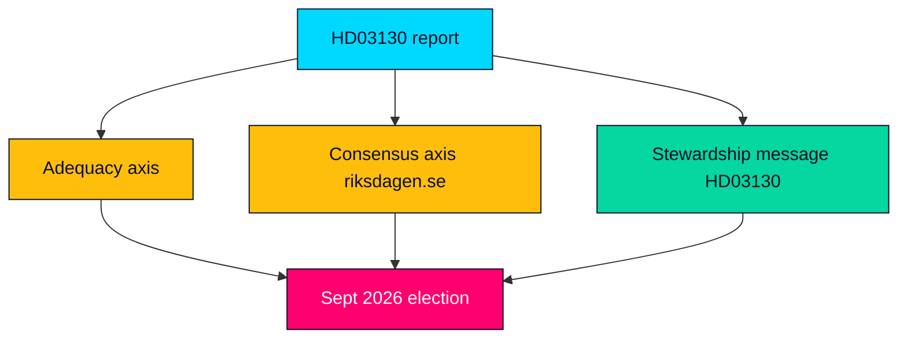

# Election 2026 Analysis — Propositions 2026-05-29 (HD03130)

How the AP-funds accountability report intersects the September 2026 Riksdag election (~15 months out at registration). Focus: pension adequacy as a campaign axis and the report's role as an early agenda node.

---

## Electoral Relevance of HD03130

Pensions are a recurring high-salience issue for Swedish voters, sharpened by the 2022–2023 inflation shock that compressed real pensions. HD03130, by reporting on the buffer capital that underwrites the income pension, is an early factual anchor for the 2026 pension debate even though it decides nothing (HD03130).

## Party Positioning Snapshot

| Party | Likely 2026 pension posture | Relation to HD03130 |
|-------|----------------------------|---------------------|
| Socialdemokraterna (S) | Defend the income-pension system; press adequacy | Pensionsgruppen member (HD03130) |
| Moderaterna (M) | Stewardship/stability message; owns the report | Sponsor via Finansdepartementet (riksdagen.se) |
| Sverigedemokraterna (SD) | Critique governance; demand pension-group seat | Outside Pensionsgruppen (HD03130) |
| Vänsterpartiet (V) | Higher guaranteed pensions; ESG scrutiny | Will press föredöme mandate (riksdagen.se) |
| Centerpartiet (C), Liberalerna (L), KD, MP | Defend consensus framework | Pensionsgruppen members (HD03130) |

## Campaign-Axis Assessment

- **Adequacy vs sustainability**: the central tension — voters want higher pensions; the system rewards buffer discipline. HD03130's results read can tilt this axis (HD03130).
- **Consensus vs disruption**: SD's exclusion offers a disruption narrative against the cross-party Pensionsgruppen (riksdagen.se).
- **Stewardship vs anxiety**: the Government's stability message versus opposition's adequacy-anxiety message (HD03130).

## Electoral Risk to Government

- A weak buffer read 15 months out lets opponents argue mismanagement; a strong read lets the Government claim competent stewardship — asymmetric downside given pension anxiety (HD03130).

## Election-Node Map

> **Pass-2 note**: the asymmetry is the key electoral insight — a weak buffer read hands opponents a mismanagement charge, while a strong read yields only a muted stewardship claim, so the Government's downside exposure exceeds its upside on this issue (HD03130).

