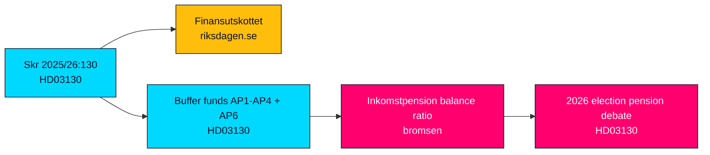

# Government Lays Two Trillion Kronor of Pension Buffer Capital Before the Riksdag

**Classification**: UNCLASSIFIED / PUBLIC
**Cycle**: propositions · **Riksmöte**: 2025/26
**Priority**: MEDIUM (HD03130)

---

## BLUF (Bottom Line Up Front)

The Government has submitted its statutory annual accountability report on the AP pension buffer funds — **Skr. 2025/26:130 "Redovisning av AP-fondernas verksamhet t.o.m. 2025"** (dok_id HD03130) — to the Riksdag, referred to Finansutskottet. The report consolidates the 2025 results of AP1–AP4 and AP6 and the Government's own performance evaluation of roughly two trillion SEK in collective buffer capital. It is a reporting instrument, not a law: the Riksdag will take note rather than legislate. Its significance is **MEDIUM** — low procedural drama, but materially important because buffer-fund returns feed the income-pension system's automatic balancing mechanism ("bromsen") and land 15 months before the September 2026 election, when pension adequacy after the 2022–2023 inflation shock is a live voter concern (source: HD03130; riksdagen.se).

---

## HD03130 — Redovisning av AP-fondernas verksamhet t.o.m. 2025 (MEDIUM)

**Submitted**: 2026-05-29 by Finance Minister Elisabeth Svantesson (M) + Financial Markets Minister Niklas Wykman (M)
**Committee**: Finansutskottet (FiU)
**Instrument**: Regeringens skrivelse 2025/26:130 (handlingstyp prop / subtyp skr)

### What It Contains
- Consolidated 2025 results and net asset positions of the four buffer funds (AP1–AP4) and the special-mandate AP6, with AP7 (premium-pension default) cross-referenced (HD03130).
- The Government's annual **evaluation** of fund performance against the 2019 placeringsregler framework — the 20% interest-bearing floor, the 40% illiquid cap and the statutory sustainability ("föredöme") mandate (riksdagen.se).
- Cost, governance and sustainability-conduct reporting that recurrently triggers the AP1–AP4 consolidation debate and NGO scrutiny of fund holdings (HD03130).

### Political Significance
- **Pension-system transmission**: buffer-fund strength is a direct input to the balance ratio that governs whether pensions are indexed up, frozen or cut — a high-salience channel in a pre-election year (riksdagen.se).
- **Cross-party custody**: the Pensionsgruppen (S, M, C, L, KD, MP) owns structural reform; SD remains outside it, a standing tension the report's debate can surface (HD03130).
- **Accountability ritual**: low legislative stakes but a recurring oversight flashpoint for fund costs, consolidation and ESG conduct.

### Key Risk
- A weak-market reading of the 2025 results could be weaponised into a "your pension is at risk" narrative ahead of 2026 (riksdagen.se).

---

## Decisions This Brief Supports

1. **Editorial lead selection** — treat HD03130 as the single lead with a pension-governance frame, not a markets-results frame, to avoid sensationalising one year's beta (HD03130).
2. **Monitoring allocation** — prioritise the Finansutskottet betänkande timeline and the balance-ratio (bromsen) read in the next pension-system report as the highest-value forward triggers (riksdagen.se).
3. **Resource scoping** — classify this as MEDIUM significance: full artifact package produced, but article depth proportionate to a routine accountability instrument rather than a contested reform (HD03130).

---

## 60-Second Read

- One instrument registered 2026-05-29: HD03130, the AP-funds annual report, to Finansutskottet (HD03130).
- It is a skrivelse (take-note), not a proposition (legislate) — no binding vote on substance.
- Matters because buffer-fund results feed the pension balancing mechanism and the 2026 election pension debate (riksdagen.se).
- Watch the FiU committee handling and any revival of the AP1–AP4 consolidation argument.

**Top forward trigger**: Finansutskottet betänkande on Skr. 2025/26:130 (expected autumn 2026) — confirms framing and any cross-party friction.
**Confidence**: HIGH on facts and process; MEDIUM on electoral salience.

> **Analyst note (Pass 2)**: The single most consequential editorial decision is frame selection. Leading on one year's market beta would misrepresent a structurally important but procedurally routine instrument; leading on governance and the balancing-mechanism transmission is both more accurate and more durable as a reference node (HD03130).

---

## Strategic Map

