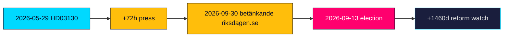

# Forward Indicators — Propositions 2026-05-29 (HD03130)

Time-stamped watch list of observable signals that would confirm, escalate or de-escalate the assessments in this package. Each indicator is dated or horizon-tagged for tracking. Horizons are measured from the 2026-05-29 registration.

---

## Near-Term Indicators (T+72h to T+30d)

| # | Indicator | Horizon | What it confirms |
|---|-----------|---------|------------------|
| 1 | Finansutskottet schedules HD03130 for handling | +7d | Process on track (HD03130) |
| 2 | Initial financial-press coverage of 2025 buffer results | +72h | Stewardship vs at-risk frame emerging (riksdagen.se) |
| 3 | Any opposition skriftlig fråga referencing the report | +14d | Politicisation signal (HD03130) |
| 4 | NGO commentary on fund holdings under föredöme mandate | 2026-06-30 | ESG frame activation (riksdagen.se) |

## Medium-Term Indicators (T+30d to T+90d)

| # | Indicator | Horizon | What it confirms |
|---|-----------|---------|------------------|
| 5 | Finansutskottet betänkande published | 2026-09-30 | Committee record + any reservationer (HD03130) |
| 6 | Reservationer from S/V/MP on consolidation or ESG | 2026Q3 | Scenario 3/4 activation (riksdagen.se) |
| 7 | Pension-system balance-ratio ("broms") read referenced | 2026Q3 | Adequacy-risk transmission (HD03130) |
| 8 | SD public statement on Pensionsgruppen exclusion | +60d | Custody-friction escalation (riksdagen.se) |

## Election-Horizon Indicators (T+90d to election)

| # | Indicator | Horizon | What it confirms |
|---|-----------|---------|------------------|
| 9 | Pension adequacy appears in party 2026 manifestos | 2026-08-31 | Issue reaches campaign agenda (HD03130) |
| 10 | "Pension at risk" messaging in campaign media | 2026Q3 | Risk R1 materialising (riksdagen.se) |
| 11 | Riksdag general election | 2026-09-13 | Resolves electoral-salience judgments (HD03130) |
| 12 | Post-election Pensionsgruppen composition signals | +1460d horizon watch | Long-run reform trajectory (riksdagen.se) |

## Economic-Context Indicators

| # | Indicator | Horizon | What it confirms |
|---|-----------|---------|------------------|
| 13 | IMF WEO update refreshing Nordic macro vintage | 2026Q4 | Replaces Apr-2026 cache (www.imf.org) |
| 14 | SCB inflation/labour release shifting adequacy debate | +30d | Swedish ground-truth context (scb.se) |

## Indicator Timeline

> **Pass-2 note**: of the 14 indicators, #5 (FiU betänkande, 2026-09-30) and #7 (balance-ratio read, 2026Q3) are the highest-value because they resolve the open PIRs on salience and structural reform; the rest are confirmatory (HD03130; riksdagen.se).

