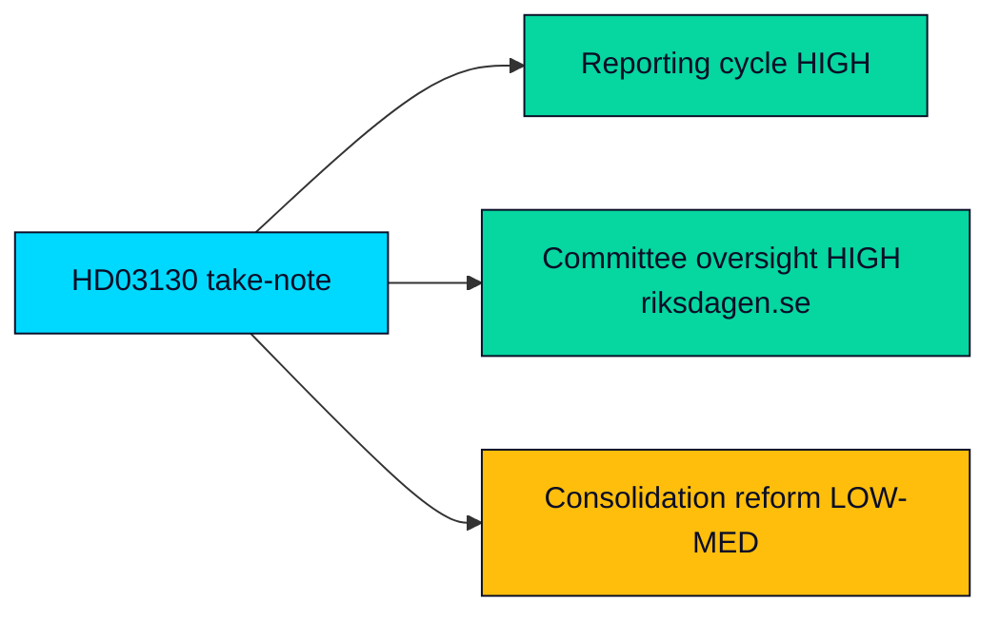

# Implementation Feasibility — Propositions 2026-05-29 (HD03130)

Feasibility assessment of what HD03130 actually requires for "implementation." Because it is a take-note accountability report, there is no new policy to implement; this artifact assesses the reporting and oversight process feasibility and any agency touchpoints.

---

## Nature of "Implementation"

HD03130 imposes no new statutory duty, appropriation or regulatory change. Its "implementation" is the completion of the statutory reporting cycle and the committee oversight that follows — both routine and high-feasibility (HD03130).

## Process Feasibility

| Step | Feasibility | Note |
|------|-------------|------|
| Committee processing (FiU) | HIGH | Standard annual accountability handling (riksdagen.se) |
| Take-note adoption | HIGH | No substantive change to enact (HD03130) |
| Fund evaluation against placeringsregler | HIGH | Established annual methodology (HD03130) |
| Any consolidation reform follow-on | LOW–MEDIUM | Would require separate legislation, not in scope (riksdagen.se) |

## Agency Touchpoints

The instrument concerns the AP-fund boards (AP1–AP4, AP6) and the income-pension system administered within the social-insurance framework; pension disbursement and the balancing mechanism are operated within the Pensionsmyndigheten/Försäkringskassan ecosystem, though HD03130 places no new task on any agency (HD03130).

| Oversight body relevance | Assessment |
|--------------------------|------------|
| **Statskontoret relevance** | none found |

## Resource and Capacity

- No incremental capacity required: the reporting and evaluation are funded baseline functions of the funds and the department (HD03130).
- No IT, procurement or staffing implications arise from a take-note report (riksdagen.se).

## Feasibility Verdict

- **Process feasibility: HIGH.** Nothing in HD03130 is hard to "implement" because it enacts nothing; the only lower-feasibility path is a hypothetical consolidation reform that the report does not propose (HD03130).

## Feasibility Map

> **Pass-2 note**: feasibility is trivially HIGH precisely because the instrument enacts nothing — the analytically interesting feasibility question is the *hypothetical* consolidation reform the report does not propose, which is where any real implementation difficulty would sit (HD03130).

