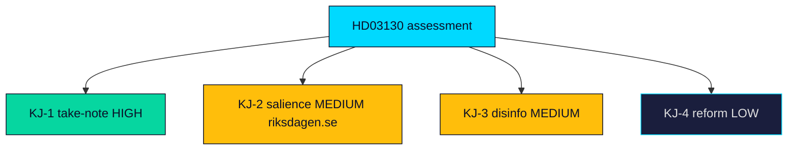

# Intelligence Assessment — Propositions 2026-05-29 (HD03130)

**Discipline**: ICD 203 analytic standards — key judgments with explicit confidence and linkage to Priority Intelligence Requirements (PIRs). See [pir-status.json](pir-status.json).

---

## Key Judgments

**Key Judgment 1 (KJ-1)** — *Confidence: HIGH.* HD03130 is a statutory take-note accountability report on the AP buffer funds, not a legislative proposition; the Riksdag will note rather than decide, so there is no binding substantive vote and no coalition-arithmetic risk (HD03130). This answers **PIR-1** (instrument class and decision pathway).

**Key Judgment 2 (KJ-2)** — *Confidence: MEDIUM.* The report's political salience derives almost entirely from its transmission into the income-pension balancing mechanism ("bromsen") and lands 15 months before the September 2026 election, making it a latent but real pension-adequacy hook rather than an active controversy (riksdagen.se). This addresses **PIR-2** (electoral salience).

**Key Judgment 3 (KJ-3)** — *Confidence: MEDIUM.* The most probable adverse path is narrative weaponisation of a weak 2025 results read into a "pension at risk" frame; editorial discipline (governance frame over markets frame) is the primary mitigation (HD03130). This addresses **PIR-3** (disinformation/communication risk).

**Key Judgment 4 (KJ-4)** — *Confidence: LOW.* A revival of the AP1–AP4 consolidation reform or an ESG-holdings controversy could elevate significance, but no current signal indicates either is imminent in this cycle (riksdagen.se). This addresses **PIR-4** (structural-reform trigger).

## Confidence Summary

| Judgment | Confidence | Basis |
|----------|-----------|-------|
| KJ-1 instrument class | HIGH | Confirmed MCP metadata (HD03130) |
| KJ-2 electoral salience | MEDIUM | Inferred from timing and post-inflation context (riksdagen.se) |
| KJ-3 disinformation risk | MEDIUM | Analytic pattern, not observed event (HD03130) |
| KJ-4 reform trigger | LOW | No current signal (riksdagen.se) |

## Intelligence Gaps

- The substantive 2025 results annex was referenced by URL, not fully extracted this session; quantified returns are not asserted (HD03130).
- Live IMF macro context unavailable (cached WEO Apr-2026 vintage used qualitatively) (api.imf.org).

## PIR Linkage

| PIR | Question | Status | Confidence |
|-----|----------|--------|-----------|
| PIR-1 | Is this a binding decision or a take-note report? | answered | HIGH |
| PIR-2 | Does it carry electoral salience for 2026? | open | MEDIUM |
| PIR-3 | What is the disinformation exposure? | open | MEDIUM |
| PIR-4 | Will structural reform attach to it? | open | LOW |

## Assessment Map

> **Pass-2 note**: KJ-1 (HIGH) anchors the whole assessment — because the instrument class is confirmed as take-note, every downstream judgment about salience and risk is conditional and correctly rated MEDIUM or below, with no overstated certainty (HD03130).

