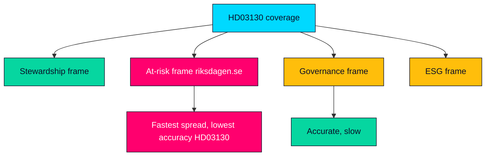

# Media Framing Analysis — Propositions 2026-05-29 (HD03130)

How the AP-funds accountability report is likely to be framed across media ecosystems, and the competing narratives that will contest its meaning. Framing assessment informs editorial discipline.

---

## Competing Frames

| Frame | Carrier | Core message | Accuracy risk |
|-------|---------|--------------|---------------|
| Stewardship | Government, financial press | Funds well-managed; system stable | Low if results solid (HD03130) |
| Pension-at-risk | Opposition, tabloids, fringe | Buffer thinning threatens pensions | High — over-reads one year (riksdagen.se) |
| Governance/consolidation | Specialist, think-tanks | Multi-fund design wastes scale | Low — structural and fair (HD03130) |
| ESG/divestment | Civil society, V | Funds breach föredöme mandate | Medium — depends on holdings (riksdagen.se) |

## Framing Dynamics

- **Salience asymmetry**: the "pension-at-risk" frame travels fastest because it is emotionally resonant and simple, while the accurate governance frame is technical and slow — a classic comprehension-gap exploit (HD03130).
- **Outlet differentiation**: financial press will lead with returns and costs; mainstream/tabloid coverage depends entirely on whether results read well or badly (riksdagen.se).
- **Quiet-day default**: in a solid-results year the report attracts thin specialist coverage and little contestation (HD03130).

## Editorial Implication for Riksdagsmonitor

- Lead with the **governance/transmission** frame, explicitly explain the balancing mechanism, and avoid amplifying the "at-risk" frame while still acknowledging the genuine post-inflation adequacy concern (HD03130).

## Language and Tone Watch

| Signal | Interpretation |
|--------|----------------|
| "Pensionen hotas" headlines | At-risk frame activating; fact-check the balance ratio (riksdagen.se) |
| "Stark avkastning" headlines | Stewardship frame; avoid one-year triumphalism (HD03130) |
| NGO holdings reports | ESG frame opening; await committee record (riksdagen.se) |

## Framing Map

> **Pass-2 note**: the framing contest is decided by tempo, not truth — the at-risk frame is pre-built and emotional while the governance frame must be assembled each time, so Riksdagsmonitor's editorial value-add is supplying the slow frame fast (HD03130).

