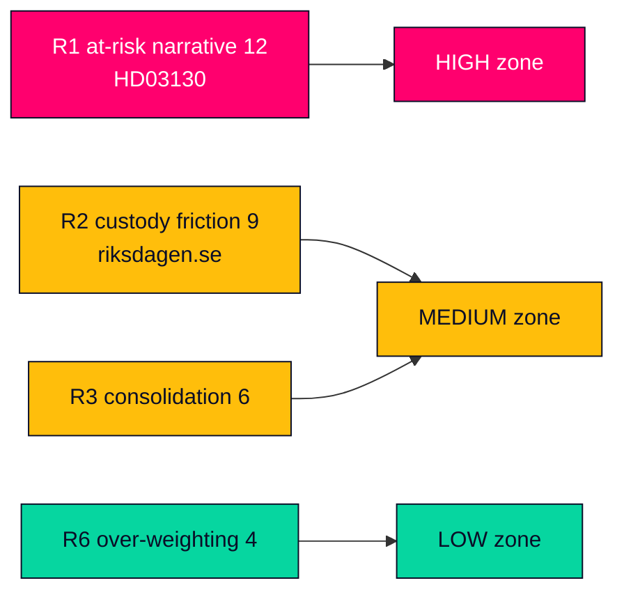

# Risk Assessment — Propositions 2026-05-29 (HD03130)

**Method**: Likelihood × Impact (1–5 each) → risk score; mitigations and ownership noted. Scope: political, institutional and communication risks attached to the AP-funds accountability report.

---

## Risk Register

| ID | Risk | Likelihood | Impact | Score | Mitigation |
|----|------|-----------|--------|-------|------------|
| R1 | Weak 2025 results framed as "pension at risk" pre-election | 3 | 4 | 12 | Lead on governance not beta; cite balance-ratio mechanics (HD03130) |
| R2 | SD-vs-Pensionsgruppen tension politicises the debate | 3 | 3 | 9 | Contextualise custody history; avoid amplifying (riksdagen.se) |
| R3 | AP1–AP4 consolidation argument distorts coverage | 2 | 3 | 6 | Treat as recurring dormant theme, flag if re-tabled (HD03130) |
| R4 | ESG-holdings controversy overtakes results reporting | 2 | 3 | 6 | Note föredöme mandate; await committee record (riksdagen.se) |
| R5 | Market-cycle beta misattributed to governance failure | 3 | 2 | 6 | Separate one-year returns from structural evaluation (HD03130) |
| R6 | Analysis over-weights a take-note instrument | 2 | 2 | 4 | Hold to MEDIUM tier; proportionate article depth (HD03130) |

## Highest Residual Risk

- **R1 — "pension at risk" weaponisation (score 12)**: the dominant risk. The buffer funds' link to the automatic balancing mechanism makes any negative read electorally combustible 15 months before the vote. Mitigation is editorial discipline: frame the report as governance and transmission mechanics, not as a market scorecard (HD03130; riksdagen.se).

## Risk Trajectory

- R1 and R2 **rise** as the September 2026 election approaches; both peak around the autumn Finansutskottet betänkande and any pension-system balance-ratio publication (HD03130).
- R3–R6 remain **stable/low** absent a structural-reform trigger.
- Pass-2 addition: R1 and R5 are correlated — a weak-beta read (R5 misattribution) is the precondition that makes R1 (weaponisation) fire, so countering the misattribution early is the highest-leverage mitigation (riksdagen.se).

## Information-Integrity Risks

| Risk | Control |
|------|---------|
| Asserting unverified 2025 return figures | Do not quote returns; substantive results annex not extracted this session (HD03130) |
| Stale IMF macro context | WEO Apr-2026 vintage tagged; no live figure asserted as current (api.imf.org) |

## Risk Heat Map

