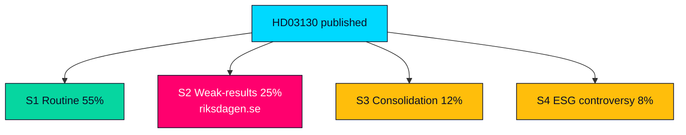

# Scenario Analysis — Propositions 2026-05-29 (HD03130)

Structured scenario set for how the AP-funds accountability report and its surrounding pension debate could evolve through the September 2026 election. Probabilities are analytic estimates, not forecasts; they sum across the four primary scenarios.

---

## Scenario 1 — Routine Take-Note (baseline, ~55%)

Finansutskottet processes Skr. 2025/26:130 as a standard accountability item; the chamber takes note before or shortly after summer recess. Solid 2025 buffer results draw specialist coverage only. The cross-party consensus holds and pensions stay a secondary election theme (HD03130).

- **Indicators**: FiU betänkande without major reservationer; muted media (riksdagen.se).
- **Implication**: MEDIUM significance confirmed; article ages as a reference node.

## Scenario 2 — Weak-Results Politicisation (~25%)

A below-benchmark or volatile 2025 read is amplified into a "your pension is at risk" narrative. Pension adequacy jumps up the election agenda; the Government defends the balancing mechanism while opposition and fringe actors press the anxiety frame (HD03130).

- **Indicators**: negative financial-press framing; opposition interpellationer; balance-ratio concern (riksdagen.se).
- **Implication**: significance rises to ~6.5/10; risk R1 materialises.

## Scenario 3 — Consolidation Reform Revival (~12%)

The dormant AP1–AP4 merger argument re-enters debate, tabled or championed in FiU to cut management cost and lift scale. The report becomes a hook for structural reform rather than mere accountability (HD03130).

- **Indicators**: motions or committee statements on fund consolidation; Pensionsgruppen signalling (riksdagen.se).
- **Implication**: policy-change magnitude rises; multi-cycle storyline opens.

## Scenario 4 — ESG-Holdings Controversy (~8%)

Civil-society scrutiny of fund holdings under the statutory föredöme mandate dominates coverage, displacing the financial-results story with a divestment debate (HD03130).

- **Indicators**: NGO reports on fossil/controversial-weapons exposure; media campaigns (riksdagen.se).
- **Implication**: reputational pressure on funds; sustainability-conduct salience spikes.

## Wildcards

- A mid-2026 market shock revalues buffer assets between report and committee handling, overtaking the 2025 numbers (HD03130).
- SD escalates its Pensionsgruppen-exclusion grievance into a public confrontation around the debate (riksdagen.se).

## Scenario Tree

> **Pass-2 note**: probabilities are deliberately weighted toward the routine baseline (55%) because the historical series shows most annual AP-fund reports pass quietly; the 25% weight on weak-results politicisation reflects the genuine but conditional pre-election amplifier, not a prediction of weak returns (HD03130).

