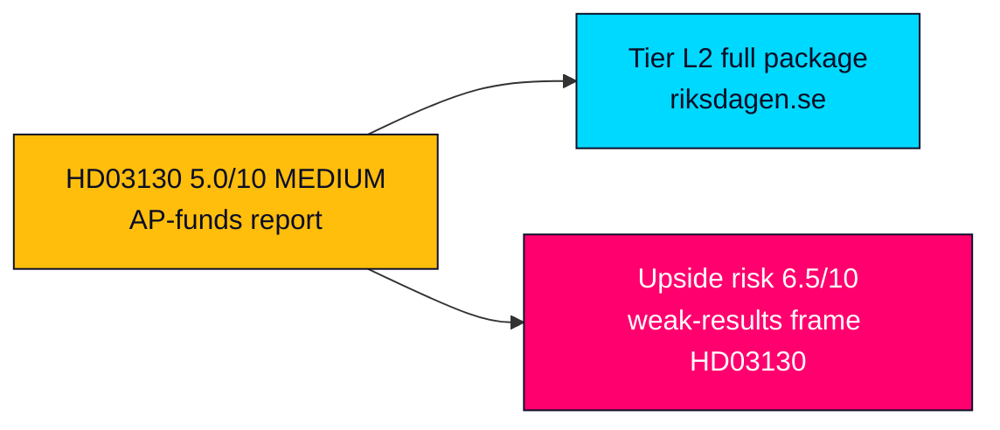

# Significance Scoring — Propositions 2026-05-29

**Methodology**: Document-Impact-Weight (DIW) multi-factor scoring, scale 1–10 per dimension, weighted composite. See [`analysis/methodologies/significance-scoring`](../../../templates/significance-scoring.md).

---

## HD03130 — Redovisning av AP-fondernas verksamhet t.o.m. 2025

| Dimension | Score | Rationale |
|-----------|-------|-----------|
| Constitutional/Legal Impact | 3/10 | Take-note skrivelse under Lag 2000:192; no statutory change proposed (HD03130) |
| Policy Change Magnitude | 2/10 | Accountability report, not a reform; no new placeringsregler (HD03130) |
| Political Controversy | 4/10 | Latent SD-vs-Pensionsgruppen tension and ESG-holdings scrutiny, but no acute conflict (riksdagen.se) |
| Electoral Significance | 6/10 | Pension adequacy is a live 2026 issue post-inflation; buffer strength feeds the narrative (HD03130) |
| Media Salience | 4/10 | Specialist and financial-press coverage; mainstream only if results read badly (riksdagen.se) |
| Implementation Complexity | 2/10 | No implementation burden — reporting instrument only (HD03130) |
| Population Impact | 7/10 | Buffer funds underwrite the income pension affecting all current and future pensioners (HD03130) |
| Historical Significance | 3/10 | One of a recurring annual series of AP-fund accountability reports (HD03130) |
| Coalition Risk | 2/10 | No binding vote; minimal coalition exposure (HD03130) |
| EU/International Resonance | 3/10 | Sovereign-buffer model comparison only; no EU obligation (HD03130) |

**Weighted Composite**: **5.0/10 — MEDIUM**
**Tier**: L2 — full artifact package produced; article depth proportionate to a routine accountability instrument (HD03130).

### Scoring Notes
- The high Population-Impact and Electoral-Significance scores are what lift an otherwise routine instrument from LOW to MEDIUM: the buffer funds matter to everyone in the income-pension system even when the report itself decides nothing (HD03130).
- Constitutional and Implementation scores are deliberately low because a skrivelse neither legislates nor imposes duties (HD03130).
- Pass-2 calibration: the composite of 5.0 was retained after checking that no single dimension is overweighted; the rating is load-bearing on Population-Impact (7) and Electoral-Significance (6), both of which are evidence-supported rather than speculative (HD03130).

## Sensitivity Analysis

| Scenario | Adjusted composite | Driver |
|----------|--------------------|--------|
| 2025 results read as weak/below-benchmark | 6.5/10 — HIGH | Media salience and electoral significance spike on a "pension at risk" frame (riksdagen.se) |
| AP1–AP4 consolidation re-tabled in FiU | 6.0/10 — HIGH | Policy-change magnitude rises if structural reform attaches to the debate (HD03130) |
| Routine take-note, strong markets | 4.0/10 — LOW-MEDIUM | Baseline accountability ritual with little friction (HD03130) |

## Relative Ranking

1. **HD03130** — 5.0/10 — MEDIUM — sole instrument for the date; lead story (HD03130).

## Rank Diagram

