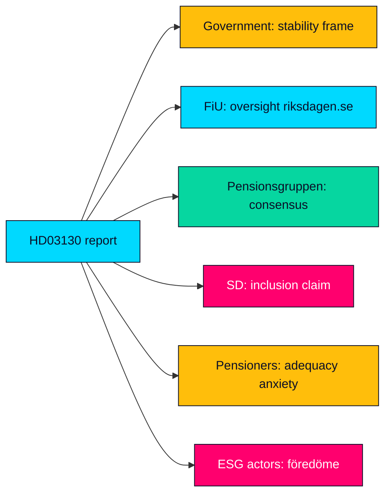

# Stakeholder Perspectives — Propositions 2026-05-29 (HD03130)

Multi-actor perspective map on the AP-funds accountability report (Skr. 2025/26:130). Each stakeholder's interest, likely position and leverage is assessed.

---

## Government (M-led coalition + budget partner SD)

- **Interest**: demonstrate sound stewardship of the buffer funds and contain any pre-election pension anxiety (HD03130).
- **Position**: present 2025 results within the placeringsregler framework; emphasise system stability (riksdagen.se).
- **Leverage**: controls the report and its framing; ministers Svantesson and Wykman set the narrative (HD03130).

## Finansutskottet (FiU)

- **Interest**: discharge statutory oversight; scrutinise costs, returns and sustainability conduct (HD03130).
- **Position**: take-note with a betänkande that may carry reservationer from opposition members (riksdagen.se).
- **Leverage**: sets the committee record that frames public debate (HD03130).

## Pensionsgruppen (S, M, C, L, KD, MP)

- **Interest**: protect the cross-party pension consensus and the credibility of the income-pension system (HD03130).
- **Position**: defend the framework; resist short-term politicisation of buffer results (riksdagen.se).
- **Leverage**: owns structural reform; can de-escalate or escalate the consolidation question (HD03130).

## Sverigedemokraterna (SD)

- **Interest**: gain entry to the Pensionsgruppen and a voice in pension governance (HD03130).
- **Position**: critique exclusion; may frame buffer management to its advantage (riksdagen.se).
- **Leverage**: budget-support weight on the Government, but no formal pension-group seat (HD03130).

## Pensioners and future pensioners

- **Interest**: adequacy and predictability of pensions after the 2022–2023 inflation squeeze (HD03130).
- **Position**: anxious audience; sensitive to "at risk" framing (riksdagen.se).
- **Leverage**: large electoral bloc whose perception drives the issue's salience (HD03130).

## Civil society / ESG actors

- **Interest**: hold funds to the statutory föredöme sustainability standard (riksdagen.se).
- **Position**: scrutinise holdings; press for divestment where mandate is breached (HD03130).
- **Leverage**: media amplification and reputational pressure (riksdagen.se).

## Alignment Map

> **Pass-2 note**: the stakeholder field is unusually consensual at the structural level (all major parties defend the income-pension system) but contested at the framing level — the live competition is over who narrates the 2025 results, not over the system's design (HD03130).

