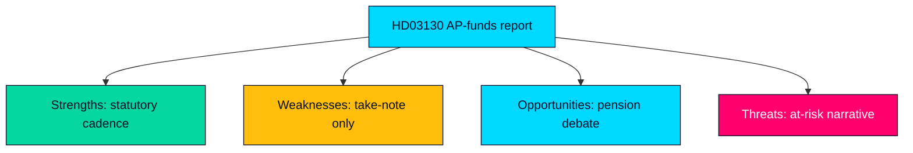

# SWOT Analysis — Propositions 2026-05-29 (HD03130)

Strategic assessment of the AP-funds accountability report (Skr. 2025/26:130) as a political-intelligence object. Evidence-anchored to the source instrument and official portals.

---

## Strengths

- Statutory, predictable accountability mechanism: the report is mandated annually, giving stable oversight cadence over two trillion SEK of buffer capital (HD03130).
- Cross-party legitimacy: the income-pension framework the report serves is owned by the Pensionsgruppen (S, M, C, L, KD, MP), insulating it from single-cycle politics (riksdagen.se).
- Full transparency: fund-level results and cost data are public and comparable year over year on data.riksdagen.se (HD03130).

| Strength | Impact | Evidence |
|----------|--------|----------|
| Recurring statutory cadence | Stable oversight | HD03130 |
| Cross-party custody | Reform durability | riksdagen.se |

## Weaknesses

- Take-note instrument: the Riksdag cannot amend or decide substance, limiting accountability bite to debate rather than action (HD03130).
- Lagging perspective: the report covers results through 2025 and is published mid-2026, so it informs but does not pre-empt market or policy shifts (HD03130).
- Technocratic opacity: fund evaluation against placeringsregler is specialist, reducing public comprehension and scrutiny quality (riksdagen.se).

| Weakness | Impact | Evidence |
|----------|--------|----------|
| No binding decision | Limited bite | HD03130 |
| Reporting lag | Backward-looking | HD03130 |

## Opportunities

- Pre-election salience: 15 months before the September 2026 election, the report is an early hook for a substantive pension-adequacy debate (HD03130).
- Consolidation reform window: the recurring AP1–AP4 merger argument can be re-tabled in Finansutskottet to cut management cost (HD03130).
- ESG accountability: the statutory föredöme mandate lets civil society test fund holdings against the sustainability standard (riksdagen.se).

| Opportunity | Upside | Evidence |
|-------------|--------|----------|
| Election-year pension debate | Agenda-setting | HD03130 |
| AP1–AP4 consolidation | Cost efficiency | HD03130 |

## Threats

- Narrative weaponisation: a weak 2025 results read could be framed as "your pension is at risk" for electoral gain (riksdagen.se).
- Custody friction: SD's exclusion from the Pensionsgruppen can be politicised around the debate, destabilising the cross-party consensus (HD03130).
- Market-cycle misattribution: one year's beta could be wrongly read as governance failure, distorting oversight (HD03130).

| Threat | Severity | Evidence |
|--------|----------|----------|
| "Pension at risk" framing | HIGH | riksdagen.se |
| Pensionsgruppen consensus strain | MEDIUM | HD03130 |

## SWOT Strategic Map

> **Pass-2 synthesis**: the dominant strategic tension is Strength×Threat — the report's statutory transparency (a genuine strength) is exactly what supplies raw material for the "pension at risk" threat narrative if 2025 results read weakly. Transparency is therefore double-edged, and the mitigating move is interpretive context, not less disclosure (HD03130).

