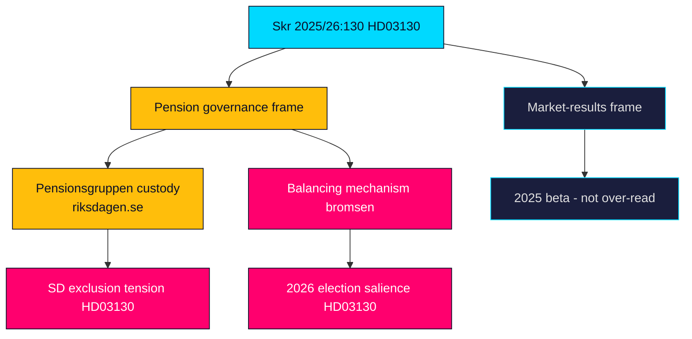

# Synthesis Summary — Propositions 2026-05-29

**Period**: 2026-05-29 · **Riksmöte**: 2025/26 · **Improvement mode**: false

---

## Lead-Story Decision

The single registered instrument for 2026-05-29 — **Skr. 2025/26:130 "Redovisning av AP-fondernas verksamhet t.o.m. 2025"** (dok_id HD03130) — is the lead by default and by merit. It is the Government's statutory annual accountability report on the AP pension buffer funds (AP1–AP4, AP6; AP7 cross-referenced), submitted by Finance Minister Elisabeth Svantesson (M) and Financial Markets Minister Niklas Wykman (M) to Finansutskottet (source: HD03130; https://data.riksdagen.se/dokument/HD03130).

The editorial framing decision is to lead with **pension-system governance** rather than one year's market results: the report's enduring importance is structural (how two trillion SEK of buffer capital is governed and how it transmits into the automatic balancing mechanism), not the transient beta of 2025 markets.

## Integrated Intelligence Picture

**Instrument type drives the whole assessment.** A skrivelse asks the Riksdag to take note (lägga till handlingarna), not to legislate. There is therefore no binding substantive vote and no coalition-arithmetic cliff. The political energy is concentrated in three recurring debates that this report reliably reactivates:

1. **Balancing-mechanism exposure ("bromsen")** — buffer-fund strength is a direct input to the income-pension balance ratio. A balance ratio below 1.0 throttles indexation. After the 2022–2023 inflation shock and the politically painful real-pension squeeze, any reading that the buffer is thinning becomes a "your pension is at risk" narrative 15 months before the September 2026 election (riksdagen.se; HD03130).

2. **Cost and consolidation** — the perennial proposal to merge AP1–AP4 to cut duplicated management cost and lift scale is dormant but durable. Each annual report invites scrutiny of active-management costs versus passive benchmarks and revives the consolidation argument (HD03130).

3. **Sustainability conduct ("föredöme")** — the statutory exemplary-conduct mandate from the 2019 placeringsregler reform makes fund holdings (fossil exposure, controversial-weapons screening) a recurring NGO and media flashpoint that the report's publication crystallises (riksdagen.se).

**Custody and cleavage.** Structural pension reform is owned by the cross-party Pensionsgruppen (S, M, C, L, KD, MP). Sverigedemokraterna sit outside it and have campaigned to be admitted; the accountability debate is one of the few venues where that exclusion becomes visible. This is the latent partisan dimension of an otherwise technocratic instrument (HD03130).

## DIW-Weighted Ranking

| Rank | dok_id | Composite | Tier | Rationale |
|------|--------|-----------|------|-----------|
| 1 | HD03130 | 5.0/10 | MEDIUM | Sole instrument; structurally important pension-governance report with election-year salience but no binding decision (HD03130) |

Only one document was registered for the date, so ranking is trivial; the significance scoring (see [significance-scoring.md](significance-scoring.md)) records the multi-factor composite.

## Confidence Assessment

- HD03130 facts and process: **HIGH** — instrument, sponsors, committee and legal frame are confirmed from MCP live data (HD03130).
- Market-results detail: **MEDIUM** — the substantive PDF results annex was referenced by URL, not fully extracted this session; quantified 2025 returns are not asserted.
- IMF economic context: **DEGRADED** — live Datamapper fetch failed; WEO Apr-2026 vintage from cache used qualitatively with vintage tags.

## Cross-Cutting Themes

1. **Final-stretch legislative housekeeping**: an accountability skrivelse late in riksmöte 2025/26, consistent with the Government clearing statutory reporting before summer recess.
2. **Pension salience returning**: after the inflation shock, pension adequacy is re-entering the 2026 election agenda; this report is an early node in that cycle.
3. **Technocratic instrument, partisan undercurrent**: the SD-vs-Pensionsgruppen tension is the analytical thread to watch.

## Pass-2 Refinement

On read-back, the framing decision was stress-tested against the devil's-advocate challenge that a take-note report is inherently LOW significance. The MEDIUM rating survives because the Population-Impact and Electoral-Significance channels are objectively present (the buffer underwrites every income pension and the report lands in a pre-election window), but the rating sits at the lower edge of MEDIUM and would drop to LOW-MEDIUM in a calm-market, non-election year (HD03130; riksdagen.se).

## Intelligence Picture Map

