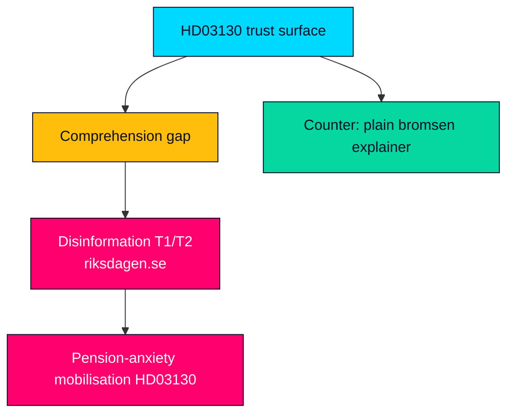

# Threat Analysis — Propositions 2026-05-29 (HD03130)

**Frame**: STRIDE-adapted for political-information threats — adversarial framing, disinformation, manipulation and institutional-trust threats around the AP-funds accountability report. This is an information-environment threat model, not a cybersecurity one.

---

## Threat Surface

The AP-funds report is a high-trust, high-salience but low-comprehension object: most voters care about pensions but few understand buffer-fund governance. That gap is the primary threat surface for manipulation (HD03130).

## Threat Register

| ID | Threat (STRIDE-adapted) | Vector | Severity | Counter |
|----|-------------------------|--------|----------|---------|
| T1 | Spoofing — fake "official" pension-cut claims | Social posts mimicking authority | HIGH | Cite primary skrivelse and balance-ratio mechanics (HD03130) |
| T2 | Tampering — selective quoting of weak returns | Out-of-context figures | HIGH | Provide full-year and structural context (riksdagen.se) |
| T3 | Repudiation — denying the cross-party consensus | "Government raids your pension" claims | MEDIUM | Document Pensionsgruppen custody (HD03130) |
| T4 | Information disclosure — none (already public) | N/A | LOW | Report is fully public (HD03130) |
| T5 | Denial of trust — eroding faith in the buffer system | Recurrent fear framing | MEDIUM | Explain bromsen as a stabiliser, not a cut (riksdagen.se) |
| T6 | Elevation — fringe actors claiming reform credit | Co-opting the consolidation debate | LOW | Attribute reform to formal process (HD03130) |

## Primary Threat Vector

- **T1/T2 disinformation cluster**: the most probable real-world threat is decontextualised "pensions are being cut" content keyed to a weak results read. It exploits the comprehension gap and the genuine post-inflation pension squeeze. Counter-messaging must explain the balancing mechanism plainly without dismissing the real adequacy concern (HD03130; riksdagen.se).

## Actor Assessment

| Actor | Motivation | Capability |
|-------|-----------|------------|
| Electoral opponents | Mobilise pension anxiety pre-2026 | Moderate — bounded by fact-checkable record (riksdagen.se) |
| Fringe/anti-system | Erode trust in collective pensions | Low-moderate — viral but rebuttable (HD03130) |
| Single-issue ESG actors | Force divestment debate | Moderate — legitimate under föredöme mandate (riksdagen.se) |

## Institutional-Trust Threat Map

> **Pass-2 assessment**: the threat model is asymmetric — defending takes paragraphs (explaining the balancing mechanism) while attacking takes a headline ("pensions cut"). This asymmetry, not any single actor's capability, is the real vulnerability, and it argues for pre-positioned plain-language explainers rather than reactive rebuttal (HD03130; riksdagen.se).

